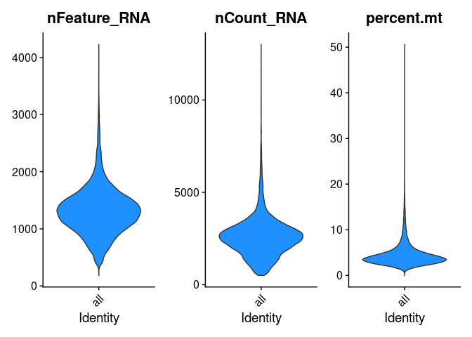
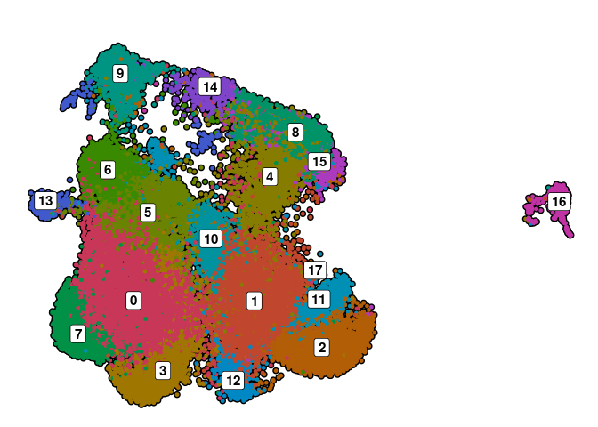
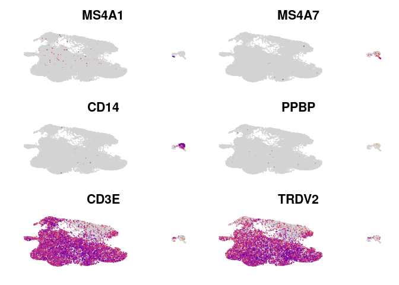
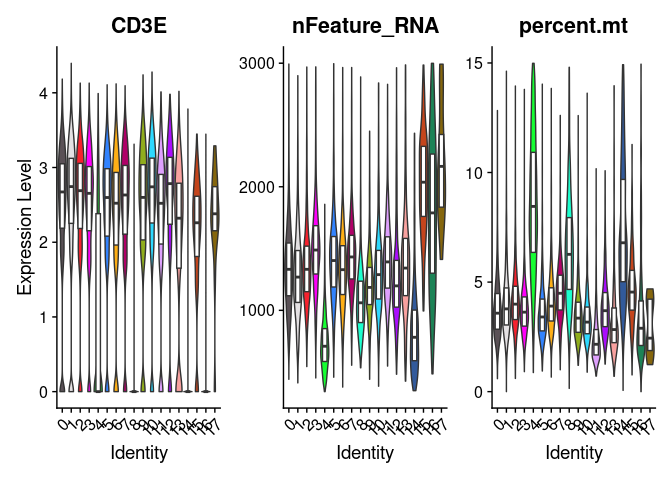
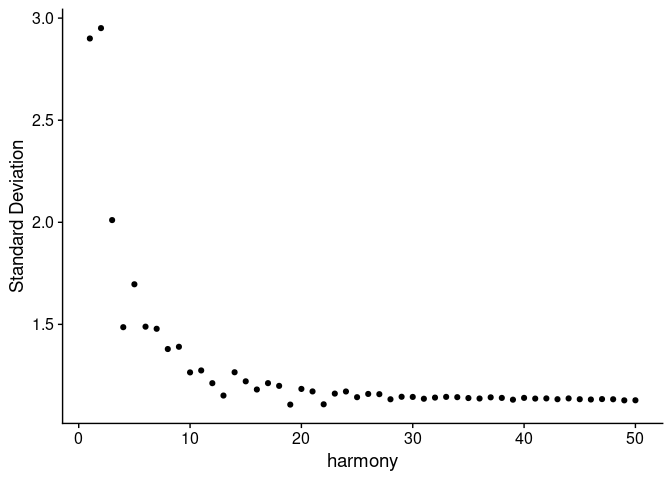
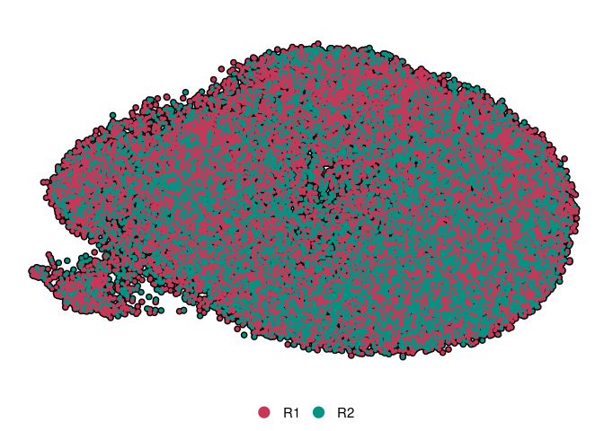
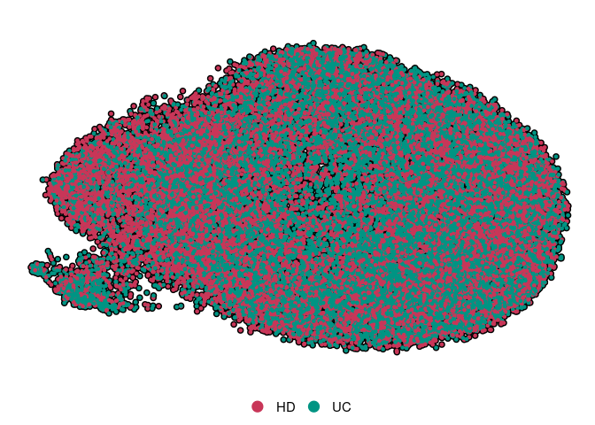
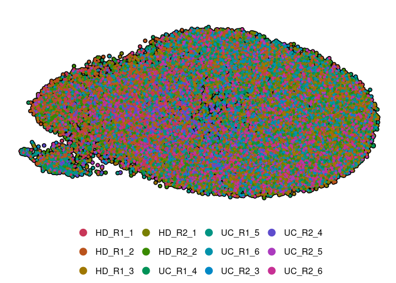
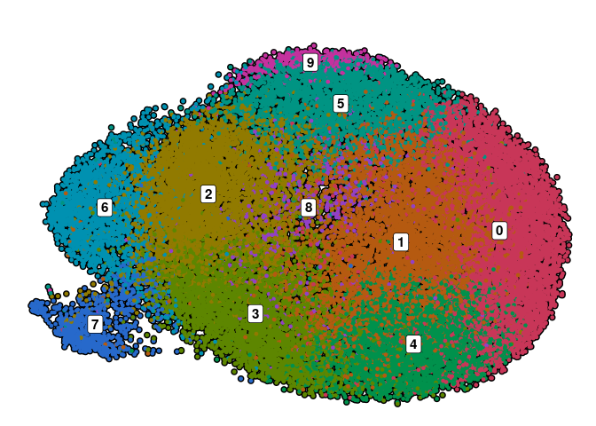
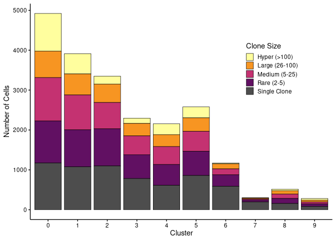

FLASH-seq of gd T Cells: Processing
================

``` r
library(Seurat)
library(harmony)
library(SCpubr)
library(scCustomize)
library(tidyverse)
library(future.apply)
library(scRepertoire)
```

# Data Processing

## Reading in Data

``` r
sample_dir <- list.dirs("../../data_raw/10X", recursive=T)
sample_dir <- sample_dir[grepl("VD", sample_dir)]

process_sample <- function(sample_dir) {
  
  batch <- str_extract(sample_dir, "R[1-2]")
  sample_name <- str_extract(sample_dir, "VD[^/]+")
  sample_data <- Read10X(data.dir=sample_dir)
  
  rownames(sample_data$'Antibody Capture') <- sub(
    "^Hu\\.Hashtag_", "hash", rownames(sample_data$'Antibody Capture'))
  
  seurat_obj <- CreateSeuratObject(sample_data$'Gene Expression', project=sample_name)
  
  seurat_obj[["HTO"]] <- CreateAssayObject(sample_data$
    'Antibody Capture'[rownames(sample_data$'Antibody Capture') %in% paste0("hash",1:6), ])
  
  seurat_obj$batch <- batch
  
  seurat_obj <- RenameCells(seurat_obj, add.cell.id=paste0(batch, "_",sample_name))
  
  return(seurat_obj)
}

# workers = number of cores available
plan(multisession, workers=8)
all <- future_lapply(sample_dir, process_sample)
plan(sequential)


rm(sample_dir, process_sample)
```

## Demultiplexing (based on Hashing)

``` r
demux <- function(seurat_obj){
  DefaultAssay(seurat_obj) <- "HTO"
  seurat_obj <- seurat_obj%>%NormalizeData(normalization.method="CLR")%>%
    HTODemux(positive.quantile=.99)
  
  print(summary(as.factor(seurat_obj@meta.data$HTO_classification.global)))
  
  seurat_obj <- subset(seurat_obj, subset=HTO_classification.global=="Singlet")
  
   DefaultAssay(seurat_obj) <- "RNA"
  
  return(seurat_obj)
}

# workers = number of cores available
plan(multisession, workers=8)
all <- future_lapply(all, demux, future.seed=1337)
```

    ##  Doublet Negative  Singlet 
    ##     3624      136    12417

    ## Normalizing across features

    ## As of Seurat v5, we recommend using AggregateExpression to perform pseudo-bulk analysis.
    ## First group.by variable `ident` starts with a number, appending `g` to ensure valid variable names
    ## Cutoff for hash1 : 38 reads
    ## 
    ## Cutoff for hash2 : 141 reads
    ## 
    ## Cutoff for hash3 : 28 reads
    ## 
    ## Cutoff for hash4 : 105 reads
    ## 
    ## Cutoff for hash5 : 21 reads
    ## 
    ## Cutoff for hash6 : 136 reads
    ## 
    ## This message is displayed once per session.

    ##  Doublet Negative  Singlet 
    ##      235      222     1215

    ## Normalizing across features
    ## As of Seurat v5, we recommend using AggregateExpression to perform pseudo-bulk analysis.First group.by variable `ident` starts with a number, appending `g` to ensure valid variable namesCutoff for hash1 : 99 reads
    ## Cutoff for hash2 : 283 reads
    ## Cutoff for hash3 : 21 reads
    ## Cutoff for hash4 : 60 reads
    ## Cutoff for hash5 : 269 reads
    ## Cutoff for hash6 : 74 reads

    ##  Doublet Negative  Singlet 
    ##     8686      717    18985

    ## Normalizing across features
    ## As of Seurat v5, we recommend using AggregateExpression to perform pseudo-bulk analysis.First group.by variable `ident` starts with a number, appending `g` to ensure valid variable namesCutoff for hash1 : 52 reads
    ## Cutoff for hash2 : 147 reads
    ## Cutoff for hash3 : 39 reads
    ## Cutoff for hash4 : 23 reads
    ## Cutoff for hash5 : 28 reads
    ## Cutoff for hash6 : 75 reads

    ##  Doublet Negative  Singlet 
    ##     6024     1648    15273

    ## Normalizing across features
    ## As of Seurat v5, we recommend using AggregateExpression to perform pseudo-bulk analysis.First group.by variable `ident` starts with a number, appending `g` to ensure valid variable namesCutoff for hash1 : 151 reads
    ## Cutoff for hash2 : 1227 reads
    ## Cutoff for hash3 : 51 reads
    ## Cutoff for hash4 : 66 reads
    ## Cutoff for hash5 : 189 reads
    ## Cutoff for hash6 : 65 reads

    ##  Doublet Negative  Singlet 
    ##      798      156     3405

    ## Normalizing across features
    ## As of Seurat v5, we recommend using AggregateExpression to perform pseudo-bulk analysis.First group.by variable `ident` starts with a number, appending `g` to ensure valid variable namesCutoff for hash1 : 40 reads
    ## Cutoff for hash2 : 1701 reads
    ## Cutoff for hash3 : 32 reads
    ## Cutoff for hash4 : 51 reads
    ## Cutoff for hash5 : 18 reads
    ## Cutoff for hash6 : 33 reads

    ##  Doublet Negative  Singlet 
    ##     8361     1512    19021

    ## Normalizing across features
    ## As of Seurat v5, we recommend using AggregateExpression to perform pseudo-bulk analysis.First group.by variable `ident` starts with a number, appending `g` to ensure valid variable namesCutoff for hash1 : 115 reads
    ## Cutoff for hash2 : 800 reads
    ## Cutoff for hash3 : 68 reads
    ## Cutoff for hash4 : 34 reads
    ## Cutoff for hash5 : 63 reads
    ## Cutoff for hash6 : 124 reads

``` r
plan(sequential)

rm(demux)
```

## Adding Meta Data/Removing Unwanted genes

``` r
meta_function <- function(seurat_obj) {
  seurat_obj@meta.data <- seurat_obj@meta.data%>%
    mutate(
      disease=case_when(
        (batch=="R1" & hash.ID %in% c("hash1", "hash2", "hash3")) |
        (batch=="R2" & hash.ID %in% c("hash1", "hash2")) ~ "HD",
        .default="UC"
      )
    )%>%
      unite("diseaseID", disease, batch, hash.ID, sep="_", remove=FALSE)%>%
    mutate(diseaseID=str_replace(diseaseID, pattern="hash", replacement=""))

  seurat_obj$percent.mt <- PercentageFeatureSet(seurat_obj, pattern="^MT-")
  
  # Remove mitochondrial/ribosomal/un-annoted genes from dataset
  genes_to_remove <- grep(rownames(seurat_obj), pattern="^MT-|^RP[SL]|^ENSG[0-9]", value=T)
  seurat_obj <- subset(seurat_obj, features=setdiff(rownames(seurat_obj), genes_to_remove))
  Idents(seurat_obj) <- "all"

  return(seurat_obj)
}

all <- lapply(all, meta_function)

for (i in seq_along(all)){
  Idents(all[[i]]) <- "all"
}
```

## Merging objects (split by gd T subsets)

``` r
vd1 <- merge(all[[1]], all[[4]])%>%JoinLayers()
vd2 <- merge(all[[3]], all[[6]])%>%JoinLayers()
vd12 <- merge(all[[2]], all[[5]])%>%JoinLayers()

rm(i, meta_function, all)
```

# Vd1

## QC

``` r
VlnPlot_scCustom(vd1, features=c("nFeature_RNA", "nCount_RNA", "percent.mt"), pt.size=0)
```


``` r
vd1 <- subset(vd1, subset=nFeature_RNA>500 & nFeature_RNA<3000 &
              nCount_RNA<10000 & percent.mt<10)
```

## Processing & Clustering

``` r
vd1 <- vd1%>%NormalizeData()%>%FindVariableFeatures()%>%ScaleData()%>%RunPCA()%>%
  RunUMAP(dims=1:30)%>%FindNeighbors(dims=1:30)%>%FindClusters()
```

    ## Modularity Optimizer version 1.3.0 by Ludo Waltman and Nees Jan van Eck
    ## 
    ## Number of nodes: 26098
    ## Number of edges: 976059
    ## 
    ## Running Louvain algorithm...
    ## Maximum modularity in 10 random starts: 0.9013
    ## Number of communities: 25
    ## Elapsed time: 2 seconds

``` r
do_DimPlot(vd1, group.by="batch")
```


``` r
do_DimPlot(vd1, group.by="seurat_clusters", label=T)&NoLegend()
```


``` r
FeaturePlot_scCustom(vd1, features=c("MS4A1", "MS4A7", "CD14", "PPBP", "TRDV1","CD3E"), order=F)&
  NoAxes()&NoLegend()
```


``` r
VlnPlot_scCustom(vd1, features=c("nFeature_RNA", "percent.mt"), pt.size=0)
```


``` r
vd1 <- subset(vd1, subset=seurat_clusters %in% c("11", "21", "22", "24", "23", 
                                                 "13", "7", "17"), invert=T)
```

## Batch Correction (Batch + DonorID)

``` r
vd1 <- vd1%>%FindVariableFeatures()%>%ScaleData()%>%RunPCA()%>%
  RunHarmony(c("batch", "diseaseID"))
```

``` r
ElbowPlot(vd1, reduction="harmony", 50)
```


``` r
vd1 <- vd1%>%RunUMAP(reduction="harmony", dims=1:20)%>%
  FindNeighbors(reduction="harmony", dims=1:20)%>%FindClusters(resolution=.4)
```

    ## Modularity Optimizer version 1.3.0 by Ludo Waltman and Nees Jan van Eck
    ## 
    ## Number of nodes: 22274
    ## Number of edges: 608724
    ## 
    ## Running Louvain algorithm...
    ## Maximum modularity in 10 random starts: 0.8452
    ## Number of communities: 9
    ## Elapsed time: 2 seconds

``` r
do_DimPlot(vd1, group.by="batch")
```


``` r
do_DimPlot(vd1, group.by="disease")
```


``` r
do_DimPlot(vd1, group.by="diseaseID")
```


``` r
do_DimPlot(vd1, group.by="seurat_clusters", label=T)&NoLegend()
```


\## TCR

``` r
contig <- list("R1"=read_tsv( "../../data_raw/10X/R1/VD1/clones.tsv"),
               "R2"=read_tsv("../../data_raw/10X/R2/VD1/clones.tsv"))
contig <- loadContigs(contig, format = "MiXCR")

# Remove allele variant calls + scoring (*00(###))
contig <- lapply(contig, function(df) {
    df %>%
    mutate_at(paste0(c("v", "d", "j", "c"), "_gene"), ~str_replace(., "\\*.*", ""))
})

combined <- combineTCR(contig,  removeNA=T, filterMulti=T)
names(combined) <- names(contig)

for (i in seq_along(combined)) {
  combined[[i]]$barcode <- paste0(names(combined[i]), "_VD1_", combined[[i]]$barcode, "-1")
}

combined <- list(bind_rows(combined))

vd1 <- combineExpression(combined, vd1, proportion=F,cloneSize=c(
  Single=1, Small=5, Medium=25, Large=100, Hyper=100
))

rm(i, combined, contig)
```

``` r
# clonalOccupy(vd1, x.axis="seurat_clusters", label=F)&
#   scale_fill_manual(values=c(
#       "#fffe9e","#f79522", "#c43271", "#611062", "gray30"),
#                     labels=c("Hyper (>100)", "Large (26-100)",
#                     "Medium (5-25)", "Rare (2-5)","Single Clone"),
#                     name="Clone Size")&
#   labs(y="Number of Cells", x="Cluster")&
#   theme(axis.text=element_text(color="black"), axis.ticks=element_line(color="black"),
#         legend.position=c(.8, .7), axis.title.x=element_text(),
#         legend.key.size=unit(4, "mm"), legend.key.spacing.y=unit(.5, "mm"))
# 
# ggsave("VD1_CloneSize_byCluster.pdf", width=4, height=3)
```

``` r
# chord.df <- getCirclize(vd1, "strict", group.by = "seurat_clusters",
#                         proportion=F)%>%
#   arrange(from)
```

``` r
# library(circlize)
# 
# pdf("VD1_ClonalOverlap_Clusters.pdf")
# 
# par(cex = 1.5, mar = c(0, 0 , 2, 0))
# chordDiagram(chord.df, annotationTrack = c("name", "grid"),
#              self.link=1)
# title("Clonal Overlap")
# 
# dev.off()
```

## Analysis

``` r
# FeaturePlot(vd1, features=c("ZEB2", "IL7R", "LEF1", "SOX4"))&NoLegend()&NoAxes()
```

``` r
# pal_dis <- c("HD"="#008B8B","UC"="#8B0000")
# names_dis <- c("UC"="UC (A)")
```

``` r
# library(patchwork)
# 
# genes <- c("ITGAE","ITGA1","CD160","GZMA","ID3","KIT","IRF8","TCF7", "IL7R", "LEF1","SOX4",
#            "PDCD1", "GZMK","CD5","CD27","CCR7","ZNF683","TNF","IFNG", "EOMES",
#            "S1PR1","SELL","FCGR3A", "GNLY", "NKG7","GZMB", "PRF1","TBX21",
#            "ZEB2","KLRG1", "ITGB2")
# 
# p <- DotPlot(vd1, group.by="seurat_clusters", features=genes, cluster.idents=T)+
#   scale_color_gradient2(low="navy", mid="beige", high="darkred", midpoint=0)+
#   guides(color=guide_colorbar(frame.colour="black", frame.linewidth=.5,
#           ticks.colour="black", ticks.linewidth=.5, title="Avg.\nScal.\nExpr."),
#          size=guide_legend(override.aes=list(fill="white", shape=21),title="% Expr.")
#         )+
#   geom_point(aes(size=pct.exp), shape=21, colour="black", stroke=.5)+
#   theme(axis.title=element_blank(),axis.ticks.length.x=unit(1.5, "mm"),
#         panel.grid.major=element_line(color="gray95"), legend.justification="top")+
#   coord_flip()+RotatedAxis()
# 
# help("RotatedAxis")
# 
# p_1 <- vd1@meta.data%>%mutate(seurat_clusters=factor(seurat_clusters, levels=levels(p$data$id)))
# 
# p_1 <- ggplot(p_1, aes(x=seurat_clusters, fill=disease))+
#   geom_bar(position="fill")+
#   scale_fill_manual(values=pal_dis, labels=names_dis)+
#   theme_void()+
#   theme(text=element_text(size=18),legend.title=element_blank(),
#         legend.position=c(-.6, .5), legend.key.size=unit(4, "mm"), 
#         legend.spacing.y=unit(0.5, "mm"), legend.margin=margin(t=-8)
#         )+
#   guides(fill=guide_legend(ncol=1, byrow=T))+
#   geom_hline(yintercept=.5, linetype="dashed", linewidth=.75)
# 
# p/p_1+plot_layout(heights = c(1, 0.05))
# 
# rm(p, p_1, genes)
```

# Vd2

## QC

``` r
VlnPlot_scCustom(vd2, features=c("nFeature_RNA", "nCount_RNA", "percent.mt"), pt.size=0)
```



``` r
vd2 <- subset(vd2, subset=nFeature_RNA>200 & nFeature_RNA<3000 & percent.mt<15)
```

## Processing & Clustering

``` r
vd2 <- vd2%>%NormalizeData()%>%FindVariableFeatures()%>%ScaleData()%>%RunPCA()%>%
  RunUMAP(dims=1:30)%>%FindNeighbors(dims=1:30)%>%FindClusters()
```

    ## Modularity Optimizer version 1.3.0 by Ludo Waltman and Nees Jan van Eck
    ## 
    ## Number of nodes: 37568
    ## Number of edges: 1029298
    ## 
    ## Running Louvain algorithm...
    ## Maximum modularity in 10 random starts: 0.8500
    ## Number of communities: 18
    ## Elapsed time: 4 seconds

``` r
# do_DimPlot(vd2, group.by="batch")
# do_DimPlot(vd2, group.by="disease")
# do_DimPlot(vd2, group.by="diseaseID")
# do_DimPlot(vd2, group.by="seurat_clusters", label=T)&NoLegend()
```

``` r
do_DimPlot(vd2, group.by="seurat_clusters", label=T)&NoLegend()
```



``` r
FeaturePlot_scCustom(vd2, features=c("MS4A1", "MS4A7", "CD14", "PPBP", "CD3E", "TRDV2"), order=F)&
  NoLegend()&NoAxes()
```



``` r
VlnPlot_scCustom(vd2, features=c("nFeature_RNA", "percent.mt", "CD3E"), pt.size=0)&
  geom_boxplot(fill="white", width=.5, coef=0, outlier.shape=NA)
```



``` r
# Remove Contaminating Cells/low quality Cells
vd2 <- subset(vd2, subset=seurat_clusters %in% c("4", "8", "14", "16"), invert=T)
```

## Batch Correction (Batch + DonorID)

``` r
vd2 <- vd2%>%FindVariableFeatures()%>%ScaleData()%>%RunPCA()%>%
  RunHarmony(c("batch", "diseaseID"))
```

``` r
ElbowPlot(vd2, reduction="harmony", 50)
```



``` r
vd2 <- vd2%>%RunUMAP(reduction="harmony", dims=1:20)%>%
  FindNeighbors(reduction="harmony", dims=1:20)%>%FindClusters()
```

    ## Modularity Optimizer version 1.3.0 by Ludo Waltman and Nees Jan van Eck
    ## 
    ## Number of nodes: 32199
    ## Number of edges: 626892
    ## 
    ## Running Louvain algorithm...
    ## Maximum modularity in 10 random starts: 0.7271
    ## Number of communities: 12
    ## Elapsed time: 4 seconds

``` r
do_DimPlot(vd2, group.by="batch")
```



``` r
do_DimPlot(vd2, group.by="disease")
```



``` r
do_DimPlot(vd2, group.by="diseaseID")
```



``` r
do_DimPlot(vd2, group.by="seurat_clusters", label=T)&NoLegend()
```



## TCR

``` r
contig <- list("R1"=read_tsv( "../../data_raw/10X/R1/VD2/clones.tsv"),
               "R2"=read_tsv("../../data_raw/10X/R2/VD2/clones.tsv"))
contig <- loadContigs(contig, format = "MiXCR")

# Remove allele variant calls + scoring (*00(###))
contig <- lapply(contig, function(df) {
    df %>%
    mutate_at(paste0(c("v", "d", "j", "c"), "_gene"), ~str_replace(., "\\*.*", ""))
})

combined <- combineTCR(contig,  removeNA=T, filterMulti=T)
names(combined) <- names(contig)

for (i in seq_along(combined)) {
  combined[[i]]$barcode <- paste0(names(combined[i]), "_VD2_", combined[[i]]$barcode, "-1")
}

combined <- list(bind_rows(combined))

vd2 <- combineExpression(combined, vd2, proportion=F,cloneSize=c(
  Single=1, Small=5, Medium=25, Large=100, Hyper=100
))

rm(i, combined, contig)
```

``` r
clonalOccupy(vd2, x.axis="seurat_clusters", label=F)&
  scale_fill_manual(values=c(
      "#fffe9e","#f79522", "#c43271", "#611062", "gray30"),
                    labels=c("Hyper (>100)", "Large (26-100)",
                    "Medium (5-25)", "Rare (2-5)","Single Clone"),
                    name="Clone Size")&
  labs(y="Number of Cells", x="Cluster")&
  theme(axis.text=element_text(color="black"), axis.ticks=element_line(color="black"),
        legend.position=c(.8, .7), axis.title.x=element_text(),
        legend.key.size=unit(4, "mm"), legend.key.spacing.y=unit(.5, "mm"))
```



``` r
ggsave("VD2_CloneSize_byCluster.pdf", width=4.5, height=3)
```

``` r
# chord.df <- getCirclize(vd2, "strict", group.by="seurat_clusters",
#                         proportion=F)%>%
#   arrange(from)
```

``` r
# library(circlize)
# 
# pdf("VD2_ClonalOverlap_Clusters.pdf")
# 
# par(cex = 1.5, mar = c(0, 0 , 2, 0))
# chordDiagram(chord.df, annotationTrack = c("name", "grid"),
#              self.link=1)
# title("Clonal Overlap")
# 
# dev.off()
```

``` r
# do_DimPlot(vd2, group.by="cloneSize")
```

## Analysis

``` r
# library(patchwork)
# 
# genes <- c("ITGAE","ITGA1","CD160","GZMA","ID3","KIT","IRF8","TCF7", "IL7R", "LEF1","SOX4",
#            "PDCD1", "GZMK","CD5","CD27","CCR7","ZNF683","TNF","IFNG", "EOMES",
#            "S1PR1","SELL","FCGR3A", "GNLY", "NKG7","GZMB", "PRF1","TBX21",
#            "ZEB2","KLRG1", "ITGB2")
# 
# p <- DotPlot(vd2, group.by="seurat_clusters", features=genes, cluster.idents=T)+
#   scale_color_gradient2(low="navy", mid="beige", high="darkred", midpoint=0)+
#   guides(color=guide_colorbar(frame.colour="black", frame.linewidth=.5,
#           ticks.colour="black", ticks.linewidth=.5, title="Avg.\nScal.\nExpr."),
#          size=guide_legend(override.aes=list(fill="white", shape=21),title="% Expr.")
#         )+
#   geom_point(aes(size=pct.exp), shape=21, colour="black", stroke=.5)+
#   theme(axis.title=element_blank(),axis.ticks.length.x=unit(1.5, "mm"),
#         panel.grid.major=element_line(color="gray95"), legend.justification="top")+
#   coord_flip()+RotatedAxis()
# 
# help("RotatedAxis")
# 
# p_1 <- vd2@meta.data%>%mutate(seurat_clusters=factor(seurat_clusters, levels=levels(p$data$id)))
# 
# p_1 <- ggplot(p_1, aes(x=seurat_clusters, fill=disease))+
#   geom_bar(position="fill")+
#   scale_fill_manual(values=pal_dis, labels=names_dis)+
#   theme_void()+
#   theme(text=element_text(size=18),legend.title=element_blank(),
#         legend.position=c(-.6, .5), legend.key.size=unit(4, "mm"), 
#         legend.spacing.y=unit(0.5, "mm"), legend.margin=margin(t=-8)
#         )+
#   guides(fill=guide_legend(ncol=1, byrow=T))+
#   geom_hline(yintercept=.5, linetype="dashed", linewidth=.75)
# 
# p/p_1+plot_layout(heights = c(1, 0.05))
# 
# rm(p, p_1, genes)
```

``` r
# FeaturePlot_scCustom(vd2, features=c("RORC", "CCR6", "IL23R", "DPP4"), order=F)&NoAxes()&NoLegend()
```

# Vd1/2 neg

## QC

``` r
# VlnPlot_scCustom(vd12, features=c("nFeature_RNA", "nCount_RNA", "percent.mt"), pt.size=0)
```

``` r
# vd12 <- subset(vd12, subset=nFeature_RNA>500 & nFeature_RNA<4000 &
#              nCount_RNA<12500 & percent.mt<20)
```

## Processing&Clustering

``` r
# vd12 <- vd12%>%NormalizeData()%>%FindVariableFeatures()%>%ScaleData()%>%RunPCA()%>%
  # RunUMAP(dims=1:30)%>%FindNeighbors(dims=1:30)%>%FindClusters()
```

``` r
# do_DimPlot(vd12, group.by="batch")
# do_DimPlot(vd12, group.by="seurat_clusters", label=T)&NoLegend()
```

``` r
# do_DimPlot(vd12, group.by="seurat_clusters", label=T)&NoLegend()
# FeaturePlot_scCustom(vd12, features=c("MS4A1", "MS4A7", "CD14", "PPBP", "TRDV1","CD3E"), 
#                      order=F)&
#   NoAxes()&NoLegend()
```

``` r
# VlnPlot_scCustom(vd12, features=c("nFeature_RNA", "percent.mt", "CD3E"), pt.size=0)&
#   geom_boxplot(fill="white", outlier.shape=NA, coef=0)
```

``` r
# vd12 <- subset(vd12, subset=seurat_clusters %in% c("1", "4", "5", "6", "8", "11",
#                                                    "12", "13", "15", "16"), invert=T)
```

## Batch Correction (Batch + DonorID)

``` r
# vd12 <- vd12%>%FindVariableFeatures()%>%ScaleData()%>%RunPCA()%>%
#   RunHarmony(c("batch", "diseaseID"))
```

``` r
# ElbowPlot(vd12, reduction="harmony", 50)
```

``` r
# vd12 <- vd12%>%RunUMAP(reduction="harmony", dims=1:20)%>%
#   FindNeighbors(reduction="harmony", dims=1:20)%>%FindClusters(resolution=.4)
```

``` r
# do_DimPlot(vd12, group.by="batch")
# do_DimPlot(vd12, group.by="disease")
# do_DimPlot(vd12, group.by="diseaseID")
# do_DimPlot(vd12, group.by="seurat_clusters", label=T)&NoLegend()
```

``` r
# FeaturePlot(vd12, features=c("ZEB2", "IL7R", "LEF1", "SOX4"))&NoLegend()&NoAxes()
```

# Saving Objects

``` r
saveRDS(vd1, "../../data_processed/10X/Vd1.Rds")
saveRDS(vd2, "../../data_processed/10X/Vd2.Rds")
```

# Gina

## Merge HDs

``` r
# hd <- merge(x=subset(vd1, subset=disease=="HD"), y=c(
#   subset(vd2, subset=disease=="HD"), 
#   subset(vd12, subset=disease=="HD"))
#   )%>%
#   JoinLayers()
```

``` r
# table(hd$orig.ident)
```

``` r
# do_DimPlot(hd, group.by="batch")
```

``` r
# hd[["RNA"]] <- split(hd[["RNA"]], f=hd$batch)

# hd <- hd%>%RunHarmony(c("batch", "diseaseID"))
```

``` r
# ElbowPlot(hd, reduction="harmony", 50)
```

``` r
# hd <- hd%>%RunUMAP(dims=1:25, reduction="harmony")%>%
#   FindNeighbors(dims=1:25, reduction="harmony")%>%FindClusters()
```

``` r
# hd$CellType <- factor(hd$orig.ident, levels=c("VD1", "VD2", "VD12_neg"))
# 
# celltype_names <- c("VD1"=expression("V"*delta*"1"),
#                                "VD2"=expression("V"*delta*"2"),
#                                "VD12_neg"=expression("V"*delta*"1"^"-"*"/V"*delta*"2"^"-")
#                                )
```

``` r
# do_DimPlot(hd, group.by="batch")
# 
# do_DimPlot(hd, group.by="CellType", pt.size=0.05)+
#   scale_color_discrete(labels=celltype_names)+
#   theme(legend.position=c(0.75, 0.85))
# ggsave("UMAP_byCellType_gd.png", dpi=600, width=5, height=4, bg="white")
# 
# do_DimPlot(hd, group.by="diseaseID")
# 
# do_DimPlot(hd, label=T, repel=T, pt.size=0.05)+
#   theme(legend.position=c(0.75, 0.8))+
#   guides(color=guide_legend(ncol=3, override.aes=list(size=2)))
# ggsave("UMAP_byCluster_gd.png", dpi=600, width=5, height=4, bg="white")
```

``` r
# library(patchwork)

# # Add and enable the DejaVu Sans font
# font_add("dejavu", "/usr/share/fonts/truetype/dejavu/DejaVuSans.ttf")
# showtext_auto()
# 
# # Set DejaVu Sans as the default font family
# theme_set(theme_minimal(base_family = "dejavu"))
# theme_set(theme_grey())


# genes <- c("FCGR3A", "FCGR3B", "FCGR2A", "FCGR2B", "FCGR2C", "FCGR1A",
#            "FCGRT","FCAR", "FCER2", "FCER1G", "FCER1A", "FCRL3", "FCMR", "FCRLA",
#            "FCRLB", "FCRL4", "FCRL1", "FCRL6", "FCAMR", "FCRL2", "FCGBP", "KLRC2",
#            "TRDV1", "TRDV2", "TRDV3")
# 
# new_names <- c("FCGR3A"="FCGR3A (CD16a)",
# "FCGR3B"="FCGR3B (CD16b)",
# "FCGR2A"="FCGR2A (CD32a)",
# "FCGR2B"="FCGR2B (CD32b)",
# "FCGR2C"="FCGR2C (CD32c)",
# "FCGR1A"="FCGR1A (CD64a)",
# "FCGRT"="FCGRT (FcRn)",
# "FCAR"="FCAR (CD89)",
# "FCER2"="FCER2 (CD23)",
# "KLRC2"="KLRC2 (NKG2C)"
# )
# 
# p <- DotPlot(hd, group.by="seurat_clusters", features=rev(genes), cluster.idents=T)+
#   scale_color_gradient2(low="navy", mid="beige", high="darkred", midpoint=0)+
#   scale_x_discrete(labels=new_names)+
#   guides(color=guide_colorbar(frame.colour="black", frame.linewidth=.5,
#           ticks.colour="black", ticks.linewidth=.5, title="Avg.\nScal.\nExpr."),
#          size=guide_legend(override.aes=list(fill="white", shape=21),title="% Expr.")
#         )+
#   geom_point(aes(size=pct.exp), shape=21, colour="black", stroke=.5)+
#   theme(axis.title=element_blank(),axis.ticks.length.x=unit(1.5, "mm"),
#         panel.grid.major=element_line(color="gray95"), legend.justification="top")+
#   coord_flip()+RotatedAxis()
# 
# 
# p_1 <- hd@meta.data%>%mutate(seurat_clusters=factor(seurat_clusters, levels=levels(p$data$id)))
# 
# p_1 <- ggplot(p_1, aes(x=seurat_clusters, fill=CellType))+
#   geom_bar(position="fill")+
#   # scale_fill_discrete(labels=names_dis)+
#   theme_void()+
#   theme(text=element_text(size=18),legend.title=element_blank(),
#         legend.key.size=unit(4, "mm"), 
#         legend.spacing.y=unit(0.5, "mm"), legend.margin=margin(t=-8)
#         )+
#   guides(fill=guide_legend(ncol=1, byrow=T))+
#   geom_hline(yintercept=.5, linetype="dashed", linewidth=.75)+
#   scale_fill_discrete(labels=celltype_names)
# 
# p/p_1+plot_layout(heights = c(1, 0.1))
# 
# ggsave("Dotplot_FcR_gd.png", width=5.5, height=5.5, bg="white")
# 
# rm(p, p_1)
```

``` r
# hd@meta.data%>%
#   ggplot(aes(x=CellType, fill=seurat_clusters))+
#   geom_bar(position="fill")
```

``` r
# p <- DotPlot_scCustom(hd, group.by="CellType", features=rev(genes), cluster.idents=T,
#         scale=F, colors_use=viridis_plasma_light_high)+
#   scale_x_discrete(labels=new_names)+
#   scale_y_discrete(labels=celltype_names)+
#   guides(color=guide_colorbar(frame.colour="black", frame.linewidth=.5,
#           ticks.colour="black", ticks.linewidth=.5, title="Avg.\nExpr."),
#          size=guide_legend(override.aes=list(fill="white", shape=21),title="% Expr.")
#         )+
#   geom_point(aes(size=pct.exp), shape=21, colour="black", stroke=.5)+
#   theme(axis.title=element_blank(),axis.ticks.length.x=unit(1.5, "mm"),
#         panel.grid.major=element_line(color="gray95"), legend.justification="top")+
#   coord_flip()+RotatedAxis()
# 
# p$data$id <- factor(p$data$id, levels=c("VD1", "VD2", "VD12_neg"))
# p
# 
# ggsave("DotPlot_byCellType_gd.png", dpi=600, width=3.5, height=5.5,  bg="white")
```

``` r
# FeaturePlot_scCustom(hd, features=c("FCGR3A", "KLRC2"), order=F,
#                      colors_use=viridis_plasma_light_high)&
#   NoLegend()&NoAxes()
```

``` r
# FeatureScatter(hd, feature1="CD3E", feature2="FCGR3A", group.by="CellType",
#                jitter=F)
```
