10X 5P scRNA-seq of gd T Cells (PBMC): Processing
================

``` r
library(Seurat)
library(harmony)
library(SCpubr)
library(scCustomize)
library(tidyverse)
library(future.apply)
library(scRepertoire)
```

# Data Processing

## Reading in Data

``` r
sample_dir <- list.dirs("../../data_raw/10X", recursive=T)
sample_dir <- sample_dir[grepl("VD", sample_dir)]

process_sample <- function(sample_dir) {
  
  batch <- str_extract(sample_dir, "R[1-2]")
  sample_name <- str_extract(sample_dir, "VD[^/]+")
  sample_data <- Read10X(data.dir=sample_dir)
  
  rownames(sample_data$'Antibody Capture') <- sub(
    "^Hu\\.Hashtag_", "hash", rownames(sample_data$'Antibody Capture'))
  
  seurat_obj <- CreateSeuratObject(sample_data$'Gene Expression', project=sample_name)
  
  seurat_obj[["HTO"]] <- CreateAssayObject(sample_data$
    'Antibody Capture'[rownames(sample_data$'Antibody Capture') %in% paste0("hash",1:6), ])
  
  seurat_obj$batch <- batch
  
  seurat_obj <- RenameCells(seurat_obj, add.cell.id=paste0(batch, "_",sample_name))
  
  return(seurat_obj)
}

# workers = number of cores available
plan(multisession, workers=8)
all <- future_lapply(sample_dir, process_sample)
plan(sequential)

rm(sample_dir, process_sample)
```

## Demultiplexing (based on Hashing)

``` r
demux <- function(seurat_obj){
  DefaultAssay(seurat_obj) <- "HTO"
  seurat_obj <- seurat_obj%>%NormalizeData(normalization.method="CLR")%>%
    HTODemux(positive.quantile=.99)
  
  print(summary(as.factor(seurat_obj@meta.data$HTO_classification.global)))
  
  seurat_obj <- subset(seurat_obj, subset=HTO_classification.global=="Singlet")
  
   DefaultAssay(seurat_obj) <- "RNA"
  
  return(seurat_obj)
}

# workers = number of cores available
plan(multisession, workers=8)
all <- future_lapply(all, demux, future.seed=1337)
plan(sequential)

rm(demux)
```

## Adding Meta Data/Removing Unwanted genes

``` r
meta_function <- function(seurat_obj) {
  seurat_obj@meta.data <- seurat_obj@meta.data%>%
    mutate(
      disease=case_when(
        (batch=="R1" & hash.ID %in% c("hash1", "hash2", "hash3")) |
        (batch=="R2" & hash.ID %in% c("hash1", "hash2")) ~ "HD",
        .default="UC"
      )
    )%>%
    mutate(diseaseID=case_when(
      batch=="R1" & disease=="HD" ~ paste0(disease, str_remove(hash.ID, "hash")),
      batch=="R2" & disease=="HD" ~ paste0(disease, as.numeric(str_remove(hash.ID, "hash"))+3),
      batch=="R1" & disease=="UC" ~ paste0(disease, as.numeric(str_remove(hash.ID, "hash"))-3),
      batch=="R2" & disease=="UC" ~ paste0(disease, as.numeric(str_remove(hash.ID, "hash"))+1)
    ))

  seurat_obj$percent.mt <- PercentageFeatureSet(seurat_obj, pattern="^MT-")
  
  # Remove mitochondrial/ribosomal/un-annoted genes from dataset
  genes_to_remove <- grep(rownames(seurat_obj), pattern="^MT-|^RP[SL]|^ENSG[0-9]", value=T)
  seurat_obj <- subset(seurat_obj, features=setdiff(rownames(seurat_obj), genes_to_remove))
  Idents(seurat_obj) <- "all"

  return(seurat_obj)
}

all <- lapply(all, meta_function)

for (i in seq_along(all)){
  Idents(all[[i]]) <- "all"
}
```

## Merging objects (split by gd T subsets)

``` r
vd1 <- merge(all[[1]], all[[4]])%>%JoinLayers()
vd2 <- merge(all[[3]], all[[6]])%>%JoinLayers()

rm(i, meta_function, all)
```

# Vd1

## QC

``` r
p <- VlnPlot_scCustom(vd1, add.noise=F, pt.size=0,
                      features=c("nFeature_RNA", "nCount_RNA", "percent.mt"))&
  theme(axis.title=element_blank(),
        plot.margin=margin(5, 1, 0, 1)
        )

p[[1]] <- p[[1]]+geom_hline(yintercept=c(500, 3000), linetype="dashed", color="red")+
  ggtitle("No. of\nGenes")
p[[2]] <- p[[2]]+geom_hline(yintercept=c(10000), linetype="dashed", color="red")+
  ggtitle("UMI\ncounts")
p[[3]] <- p[[3]]+geom_hline(yintercept=c(10), linetype="dashed", color="red")+
  ggtitle("% Mito.\nGenes")
p
```

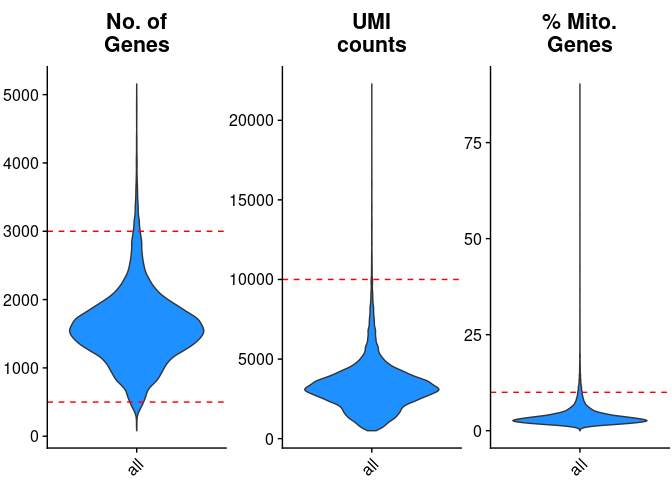

``` r
# Save QC Plots 
ggsave("../../2_figures_code/figures/10X_Vd1_VlnPlots_QC.pdf", width=6.5, height=3.5)
ggsave("../../2_figures_code/figures/10X_Vd1_VlnPlots_QC.png", dpi=600, width=6.5, height=3.5)

saveRDS(p, "../../data_processed/10X/Vd1_QC_plots.Rds")

rm(p)
```

``` r
vd1 <- subset(vd1, subset=nFeature_RNA>500 & nFeature_RNA<3000 &
              nCount_RNA<10000 & percent.mt<10)
```

## Processing & Clustering

``` r
vd1 <- vd1%>%NormalizeData()%>%FindVariableFeatures()%>%ScaleData()%>%RunPCA()%>%
  RunUMAP(dims=1:30)%>%FindNeighbors(dims=1:30)%>%FindClusters()
```

``` r
do_DimPlot(vd1, group.by="batch")
```

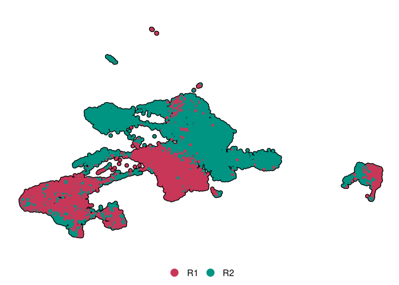

``` r
do_DimPlot(vd1, group.by="seurat_clusters", label=T)&NoLegend()
```

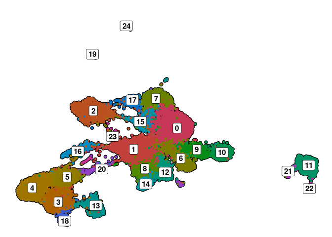

``` r
FeaturePlot_scCustom(vd1, features=c("MS4A1", "MS4A7", "CD14", "PPBP", "TRDV1","CD3E"), order=F)&
  NoAxes()&NoLegend()
```

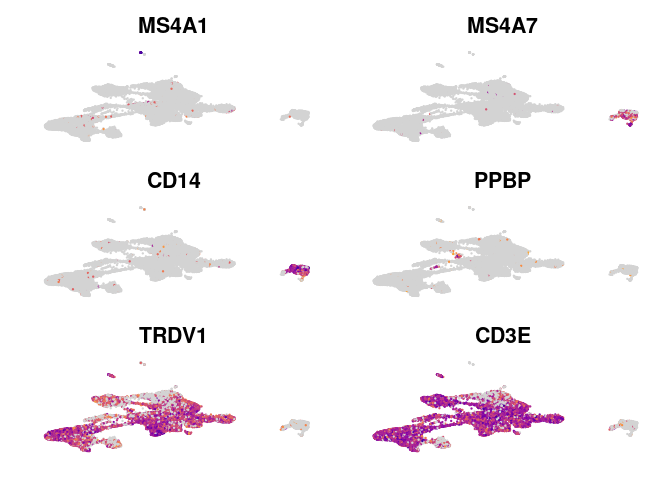

``` r
VlnPlot_scCustom(vd1, features=c("nFeature_RNA", "percent.mt"), pt.size=0)
```

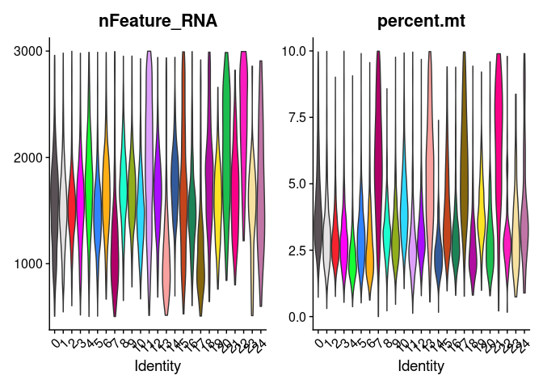

``` r
vd1 <- subset(vd1, subset=seurat_clusters %in% c("11", "21", "22", "24", "23", 
                                                 "13", "7", "17"), invert=T)
```

## Batch Correction (Batch + DonorID)

``` r
vd1 <- vd1%>%FindVariableFeatures()%>%ScaleData()%>%RunPCA()%>%
  RunHarmony(c("batch", "diseaseID"))
```

``` r
ElbowPlot(vd1, reduction="harmony", 50)
```

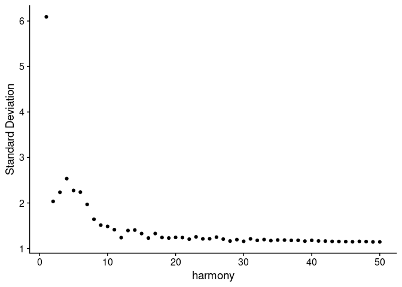

``` r
vd1 <- vd1%>%RunUMAP(reduction="harmony", dims=1:20)%>%
  FindNeighbors(reduction="harmony", dims=1:20)%>%FindClusters(resolution=.4)
```

``` r
do_DimPlot(vd1, group.by="batch")
```

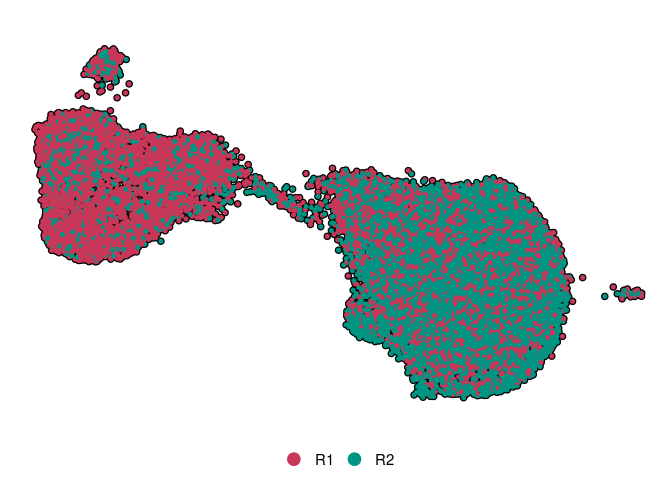

``` r
do_DimPlot(vd1, group.by="disease")
```

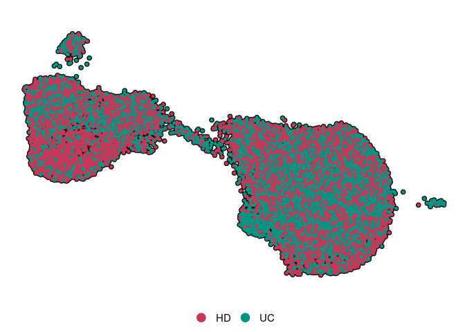

``` r
do_DimPlot(vd1, group.by="diseaseID")
```

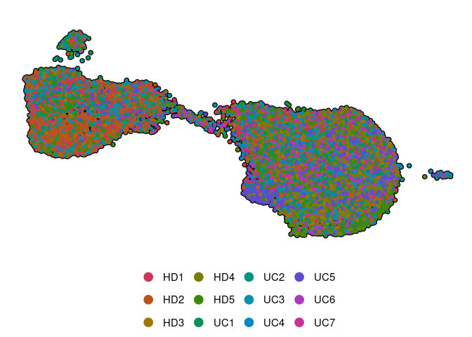

``` r
do_DimPlot(vd1, group.by="seurat_clusters", label=T)&NoLegend()
```

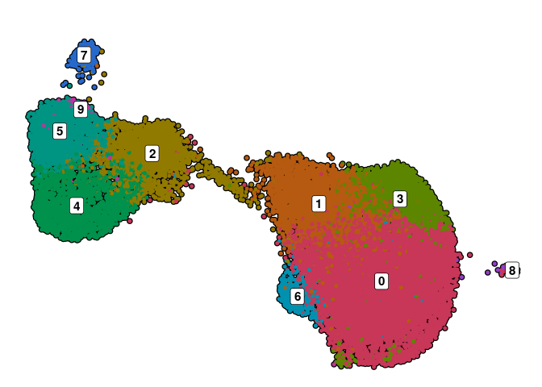
\## TCR

``` r
contig <- list("R1"=read_tsv( "../../data_raw/10X/R1/VD1/clones.tsv"),
               "R2"=read_tsv("../../data_raw/10X/R2/VD1/clones.tsv"))
contig <- loadContigs(contig, format = "MiXCR")
```

``` r
# Remove allele variant calls + scoring (*00(###))
contig <- lapply(contig, function(df) {
    df %>%
    mutate_at(paste0(c("v", "d", "j", "c"), "_gene"), ~str_replace(., "\\*.*", ""))
})
```

``` r
combined <- combineTCR(contig,  removeNA=T, filterMulti=T)
names(combined) <- names(contig)

for (i in seq_along(combined)) {
  combined[[i]]$barcode <- paste0(names(combined[i]), "_VD1_", combined[[i]]$barcode, "-1")
}
```

``` r
combined <- list(bind_rows(combined))

vd1 <- combineExpression(combined, vd1, proportion=F,cloneSize=c(
  Single=1, Small=5, Medium=25, Large=100, Hyper=100
))
```

``` r
trgv <- combineTCR(contig,  removeNA=F, filterMulti=T)

names(trgv) <- names(contig)

for (i in seq_along(trgv)) {
  trgv[[i]]$barcode <- paste0(names(trgv[i]), "_VD1_", trgv[[i]]$barcode, "-1")
}

trgv <- bind_rows(trgv)%>%
  separate(TCR1, into=c("TRGV", "TRGJ", "TRGC"), sep="\\.")%>%
  mutate(TRGV=factor(TRGV, levels=c(
    paste0("TRGV", 2:5), "TRGV5P", paste0("TRGV", 7:11)
  )))%>%
  select(barcode, TRGV)
```

``` r
vd1@meta.data <- vd1@meta.data%>%
  rownames_to_column("barcode")%>%
  left_join(trgv, by="barcode")%>%
  column_to_rownames("barcode")
```

``` r
rm(i, combined, contig, trgv)
```

# Vd2

## QC

``` r
p <- VlnPlot_scCustom(vd2, add.noise=F, pt.size=0,
                      features=c("nFeature_RNA", "nCount_RNA", "percent.mt"))&
  theme(axis.title=element_blank(),
        plot.margin=margin(5, 1, 0, 1)
        )

p[[1]] <- p[[1]]+geom_hline(yintercept=c(200, 3000), linetype="dashed", color="red")+
  ggtitle("No. of\nGenes")
p[[2]] <- p[[2]]+geom_hline(yintercept=c(10000), linetype="dashed", color="red")+
  ggtitle("UMI\ncounts")
p[[3]] <- p[[3]]+geom_hline(yintercept=c(15), linetype="dashed", color="red")+
  ggtitle("% Mito.\nGenes")
p
```

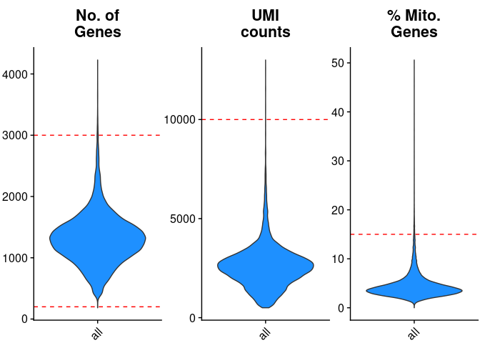

``` r
# Save QC Plots 
ggsave("../../2_figures_code/figures/10X_Vd2_VlnPlots_QC.pdf", width=6.5, height=3.5)
ggsave("../../2_figures_code/figures/10X_Vd2_VlnPlots_QC.png", dpi=600, width=6.5, height=3.5)

saveRDS(p, "../../data_processed/10X/Vd2_QC_plots.Rds")
rm(p)
```

``` r
vd2 <- subset(vd2, subset=nFeature_RNA>200 & nFeature_RNA<3000 & percent.mt<15)
```

## Processing & Clustering

``` r
vd2 <- vd2%>%NormalizeData()%>%FindVariableFeatures()%>%ScaleData()%>%RunPCA()%>%
  RunUMAP(dims=1:30)%>%FindNeighbors(dims=1:30)%>%FindClusters()
```

``` r
do_DimPlot(vd2, group.by="seurat_clusters", label=T)&NoLegend()
```

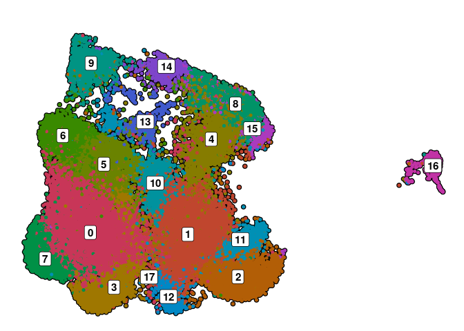

``` r
FeaturePlot_scCustom(vd2, features=c("MS4A1", "MS4A7", "CD14", "PPBP", "CD3E", "TRDV2"), order=F)&
  NoLegend()&NoAxes()
```

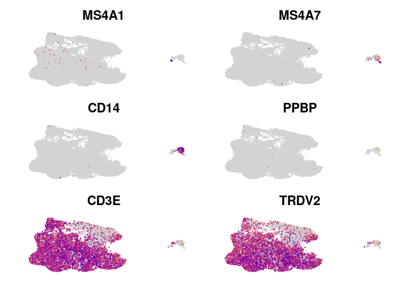

``` r
VlnPlot_scCustom(vd2, features=c("nFeature_RNA", "percent.mt", "CD3E"), pt.size=0)&
  geom_boxplot(fill="white", width=.5, coef=0, outlier.shape=NA)
```

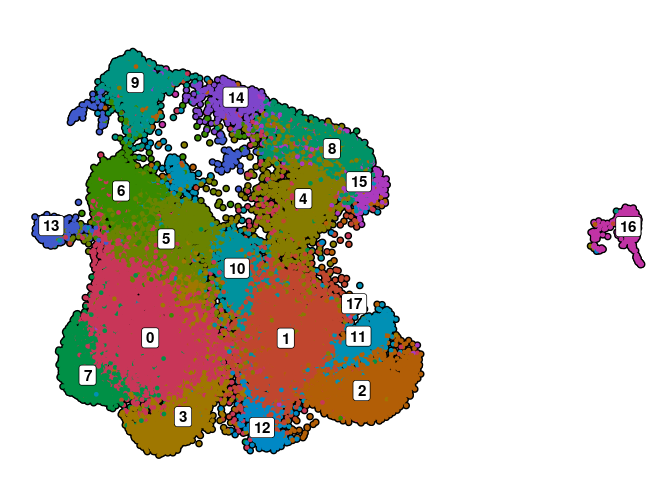

``` r
# Remove Contaminating Cells/low quality Cells
vd2 <- subset(vd2, subset=seurat_clusters %in% c("4", "8", "14", "16"), invert=T)
```

## Batch Correction (Batch + DonorID)

``` r
vd2 <- vd2%>%FindVariableFeatures()%>%ScaleData()%>%RunPCA()%>%
  RunHarmony(c("batch", "diseaseID"))
```

``` r
ElbowPlot(vd2, reduction="harmony", 50)
```

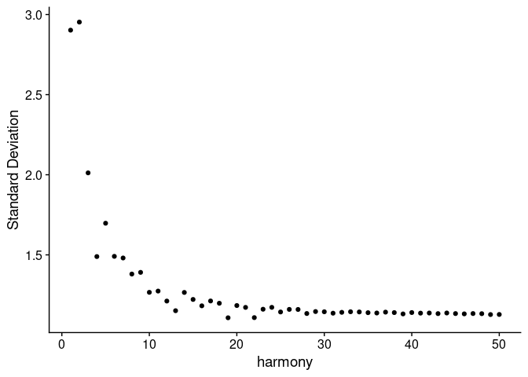

``` r
vd2 <- vd2%>%RunUMAP(reduction="harmony", dims=1:20)%>%
  FindNeighbors(reduction="harmony", dims=1:20)%>%FindClusters()
```

``` r
do_DimPlot(vd2, group.by="batch")
```

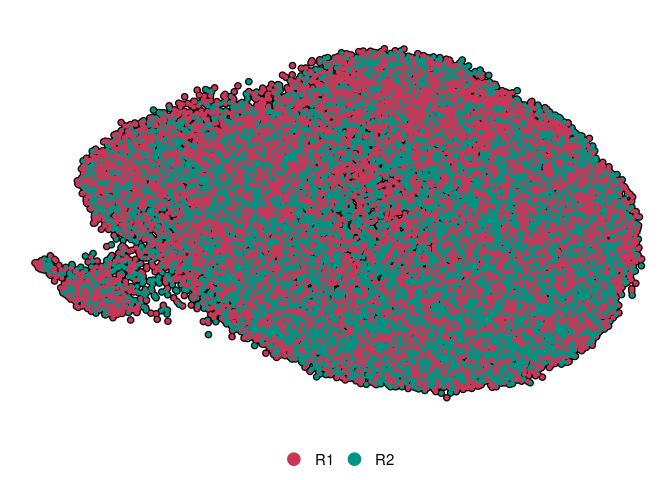

``` r
do_DimPlot(vd2, group.by="disease")
```

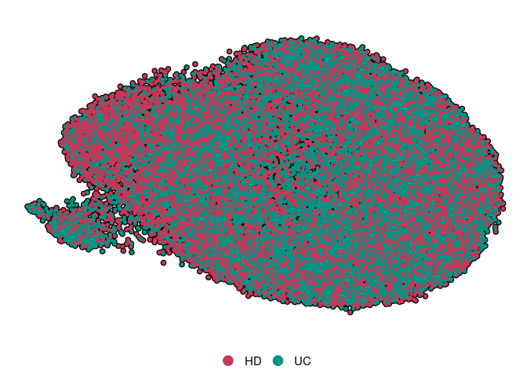

``` r
do_DimPlot(vd2, group.by="seurat_clusters", label=T)&NoLegend()
```

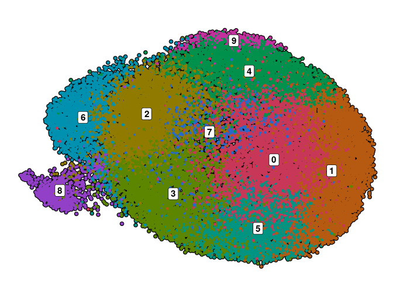

## TCR

``` r
contig <- list("R1"=read_tsv( "../../data_raw/10X/R1/VD2/clones.tsv"),
               "R2"=read_tsv("../../data_raw/10X/R2/VD2/clones.tsv"))
contig <- loadContigs(contig, format = "MiXCR")
```

``` r
# Remove allele variant calls + scoring (*00(###))
contig <- lapply(contig, function(df) {
    df %>%
    mutate_at(paste0(c("v", "d", "j", "c"), "_gene"), ~str_replace(., "\\*.*", ""))
})
```

``` r
combined <- combineTCR(contig,  removeNA=T, filterMulti=T)
names(combined) <- names(contig)

for (i in seq_along(combined)) {
  combined[[i]]$barcode <- paste0(names(combined[i]), "_VD2_", combined[[i]]$barcode, "-1")
}

combined <- list(bind_rows(combined))
```

``` r
vd2 <- combineExpression(combined, vd2, proportion=F,cloneSize=c(
  Single=1, Small=5, Medium=25, Large=100, Hyper=100
))
```

``` r
trgv <- combineTCR(contig,  removeNA=F, filterMulti=T)

names(trgv) <- names(contig)

for (i in seq_along(trgv)) {
  trgv[[i]]$barcode <- paste0(names(trgv[i]), "_VD2_", trgv[[i]]$barcode, "-1")
}

trgv <- bind_rows(trgv)%>%
  separate(TCR1, into=c("TRGV", "TRGJ", "TRGC"), sep="\\.")%>%
  mutate(TRGV=factor(TRGV, levels=c(
    paste0("TRGV", 2:5), "TRGV5P", paste0("TRGV", 7:11)
  )))%>%
  select(barcode, TRGV)
```

``` r
vd2@meta.data <- vd2@meta.data%>%
  rownames_to_column("barcode")%>%
  left_join(trgv, by="barcode")%>%
  column_to_rownames("barcode")
```

``` r
rm(i, combined, contig, trgv)
```

# Saving Objects

``` r
# vd1$cluster <- paste0("C", vd1$seurat_clusters)
# vd2$cluster <- paste0("C", vd2$seurat_clusters)
# 
# saveRDS(vd1, "../../data_processed/10X/Vd1.Rds")
# saveRDS(vd2, "../../data_processed/10X/Vd2.Rds")
```

# Session Info

``` r
sessionInfo()
```

    ## R version 4.4.3 (2025-02-28)
    ## Platform: x86_64-pc-linux-gnu
    ## Running under: Ubuntu 22.04.5 LTS
    ## 
    ## Matrix products: default
    ## BLAS:   /usr/lib/x86_64-linux-gnu/openblas-pthread/libblas.so.3 
    ## LAPACK: /usr/lib/x86_64-linux-gnu/openblas-pthread/libopenblasp-r0.3.20.so;  LAPACK version 3.10.0
    ## 
    ## locale:
    ##  [1] LC_CTYPE=en_US.UTF-8       LC_NUMERIC=C              
    ##  [3] LC_TIME=de_DE.UTF-8        LC_COLLATE=en_US.UTF-8    
    ##  [5] LC_MONETARY=de_DE.UTF-8    LC_MESSAGES=en_US.UTF-8   
    ##  [7] LC_PAPER=de_DE.UTF-8       LC_NAME=C                 
    ##  [9] LC_ADDRESS=C               LC_TELEPHONE=C            
    ## [11] LC_MEASUREMENT=de_DE.UTF-8 LC_IDENTIFICATION=C       
    ## 
    ## time zone: Europe/Berlin
    ## tzcode source: system (glibc)
    ## 
    ## attached base packages:
    ## [1] stats     graphics  grDevices utils     datasets  methods   base     
    ## 
    ## other attached packages:
    ##  [1] scRepertoire_2.2.1  future.apply_1.11.3 future_1.33.2      
    ##  [4] lubridate_1.9.3     forcats_1.0.0       stringr_1.5.1      
    ##  [7] dplyr_1.1.4         purrr_1.0.2         readr_2.1.5        
    ## [10] tidyr_1.3.1         tibble_3.3.0        ggplot2_3.5.1      
    ## [13] tidyverse_2.0.0     scCustomize_2.1.2   SCpubr_2.0.2       
    ## [16] harmony_1.2.0       Rcpp_1.1.0          Seurat_5.2.1       
    ## [19] SeuratObject_5.0.2  sp_2.1-4           
    ## 
    ## loaded via a namespace (and not attached):
    ##   [1] fs_1.6.4                    matrixStats_1.5.0          
    ##   [3] spatstat.sparse_3.0-3       httr_1.4.7                 
    ##   [5] RColorBrewer_1.1-3          tools_4.4.3                
    ##   [7] sctransform_0.4.1           R6_2.6.1                   
    ##   [9] lazyeval_0.2.2              uwot_0.2.2                 
    ##  [11] withr_3.0.0                 gridExtra_2.3              
    ##  [13] progressr_0.14.0            quantreg_5.97              
    ##  [15] cli_3.6.5                   Biobase_2.64.0             
    ##  [17] textshaping_0.3.7           spatstat.explore_3.2-7     
    ##  [19] fastDummies_1.7.3           iNEXT_3.0.1                
    ##  [21] labeling_0.4.3              prismatic_1.1.2            
    ##  [23] spatstat.data_3.0-4         ggridges_0.5.6             
    ##  [25] pbapply_1.7-2               systemfonts_1.1.0          
    ##  [27] yulab.utils_0.2.1           stringdist_0.9.12          
    ##  [29] parallelly_1.37.1           VGAM_1.1-11                
    ##  [31] rstudioapi_0.16.0           generics_0.1.3             
    ##  [33] gridGraphics_0.5-1          shape_1.4.6.1              
    ##  [35] ica_1.0-3                   spatstat.random_3.2-3      
    ##  [37] vroom_1.6.5                 Matrix_1.7-3               
    ##  [39] ggbeeswarm_0.7.2            S4Vectors_0.42.0           
    ##  [41] abind_1.4-8                 lifecycle_1.0.4            
    ##  [43] yaml_2.3.8                  snakecase_0.11.1           
    ##  [45] SummarizedExperiment_1.34.0 SparseArray_1.4.5          
    ##  [47] Rtsne_0.17                  paletteer_1.6.0            
    ##  [49] grid_4.4.3                  promises_1.3.0             
    ##  [51] crayon_1.5.3                miniUI_0.1.1.1             
    ##  [53] lattice_0.22-6              cowplot_1.1.3              
    ##  [55] pillar_1.11.0               knitr_1.46                 
    ##  [57] GenomicRanges_1.56.0        rjson_0.2.21               
    ##  [59] codetools_0.2-20            glue_1.8.0                 
    ##  [61] data.table_1.15.4           vctrs_0.6.5                
    ##  [63] png_0.1-8                   spam_2.10-0                
    ##  [65] gtable_0.3.5                assertthat_0.2.1           
    ##  [67] rematch2_2.1.2              cachem_1.1.0               
    ##  [69] xfun_0.44                   S4Arrays_1.4.1             
    ##  [71] mime_0.13                   tidygraph_1.3.1            
    ##  [73] survival_3.8-3              SingleCellExperiment_1.26.0
    ##  [75] fitdistrplus_1.1-11         ROCR_1.0-11                
    ##  [77] nlme_3.1-167                bit64_4.0.5                
    ##  [79] RcppAnnoy_0.0.22            evd_2.3-7                  
    ##  [81] GenomeInfoDb_1.40.0         irlba_2.3.5.1              
    ##  [83] vipor_0.4.7                 KernSmooth_2.23-26         
    ##  [85] colorspace_2.1-0            BiocGenerics_0.50.0        
    ##  [87] ggrastr_1.0.2               tidyselect_1.2.1           
    ##  [89] bit_4.0.5                   compiler_4.4.3             
    ##  [91] SparseM_1.81                ggdendro_0.2.0             
    ##  [93] DelayedArray_0.30.1         plotly_4.10.4              
    ##  [95] scales_1.3.0                lmtest_0.9-40              
    ##  [97] rappdirs_0.3.3              digest_0.6.35              
    ##  [99] goftest_1.2-3               spatstat.utils_3.0-4       
    ## [101] rmarkdown_2.27              XVector_0.44.0             
    ## [103] RhpcBLASctl_0.23-42         htmltools_0.5.8.1          
    ## [105] pkgconfig_2.0.3             MatrixGenerics_1.16.0      
    ## [107] highr_0.10                  fastmap_1.2.0              
    ## [109] rlang_1.1.6                 GlobalOptions_0.1.2        
    ## [111] htmlwidgets_1.6.4           UCSC.utils_1.0.0           
    ## [113] shiny_1.8.1.1               farver_2.1.2               
    ## [115] zoo_1.8-12                  jsonlite_2.0.0             
    ## [117] magrittr_2.0.3              GenomeInfoDbData_1.2.12    
    ## [119] ggplotify_0.1.2             dotCall64_1.1-1            
    ## [121] patchwork_1.3.0             munsell_0.5.1              
    ## [123] evmix_2.12                  viridis_0.6.5              
    ## [125] reticulate_1.37.0           truncdist_1.0-2            
    ## [127] stringi_1.8.7               ggalluvial_0.12.5          
    ## [129] ggraph_2.2.1                zlibbioc_1.50.0            
    ## [131] MASS_7.3-64                 plyr_1.8.9                 
    ## [133] parallel_4.4.3              listenv_0.9.1              
    ## [135] ggrepel_0.9.5               deldir_2.0-4               
    ## [137] graphlayouts_1.1.1          splines_4.4.3              
    ## [139] tensor_1.5                  hash_2.2.6.3               
    ## [141] hms_1.1.3                   circlize_0.4.16            
    ## [143] igraph_2.0.3                spatstat.geom_3.2-9        
    ## [145] cubature_2.1.0              RcppHNSW_0.6.0             
    ## [147] reshape2_1.4.4              stats4_4.4.3               
    ## [149] evaluate_0.23               ggprism_1.0.5              
    ## [151] tzdb_0.4.0                  tweenr_2.0.3               
    ## [153] httpuv_1.6.15               MatrixModels_0.5-3         
    ## [155] RANN_2.6.1                  polyclip_1.10-6            
    ## [157] scattermore_1.2             ggforce_0.4.2              
    ## [159] janitor_2.2.0               xtable_1.8-4               
    ## [161] RSpectra_0.16-1             later_1.3.2                
    ## [163] viridisLite_0.4.2           ragg_1.4.0                 
    ## [165] gsl_2.1-8                   memoise_2.0.1              
    ## [167] beeswarm_0.4.0              IRanges_2.38.0             
    ## [169] cluster_2.1.8               timechange_0.3.0           
    ## [171] globals_0.16.3
