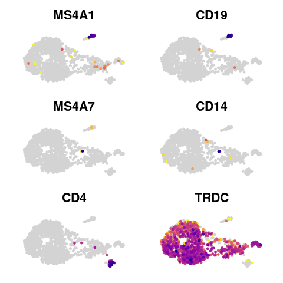
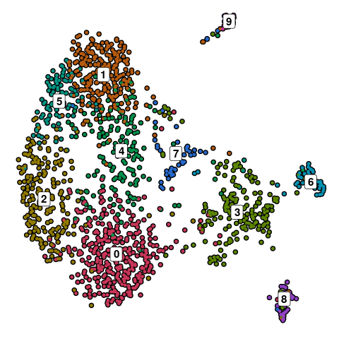
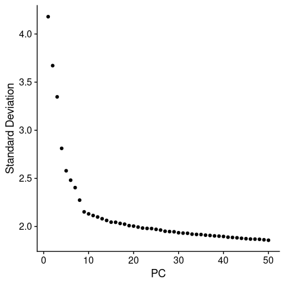
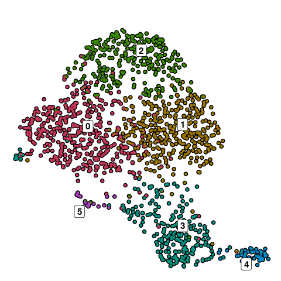
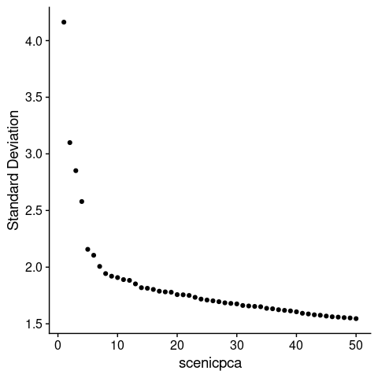

FLASH-seq of gd T Cells: Processing
================

``` r
library(tidyverse)
library(data.table)
library(Matrix)
library(Seurat)
library(scCustomize)
library(SCpubr)
library(ggpubr)
library(biomaRt)
library(readxl)
library(SCENIC)
library(AUCell)
library(future.apply)
```

# Processing Data

## Reading Count Matrix

``` r
mtx <- readMM("../../data_raw/FLASHseq/R1/counts.mtx")
cells <- read_tsv("../../data_raw/FLASHseq/R1/cells.tsv", col_names=F)$X1
genes <- read_tsv("../../data_raw/FLASHseq/R1/genes.tsv", col_names=F)$X1

colnames(mtx) <- cells
rownames(mtx) <- genes
```

``` r
R1 <- CreateSeuratObject(mtx)
```

``` r
mtx <- readMM("../../data_raw/FLASHseq/R2/counts.mtx")
cells <- read_tsv("../../data_raw/FLASHseq/R2/cells.tsv", col_names=F)$X1
genes <- read_tsv("../../data_raw/FLASHseq/R2/genes.tsv", col_names=F)$X1

colnames(mtx) <- cells
rownames(mtx) <- genes
```

``` r
R2 <- CreateSeuratObject(mtx)
```

``` r
gd_raw <- merge(R1, R2)%>%
  JoinLayers()

rm(mtx, R1, R2, genes, cells)
```

## Creating Lookup Table for Patient Data

``` r
# Function to print complete rows (letters A-P=1-16)
rws <- function(numb) {
  sequence <- paste0(rep(LETTERS[numb], each=24), 1:24)
  return(sequence)
}

lookup_table <- data.frame(
  plate=rep(c("E64","E65", "E66", "E67", "E70",
              "E103", "E105"),
            each=16*24),
  well=rep(paste0(rep(LETTERS[1:16], each=24), rep(1:24, times=16)), times=7)
            )%>%
  mutate(ID=case_when(
    plate == "E66" & well %in% c(rws(1:3), paste0("D", 17:24)) ~ "UC1",
    plate == "E66" & well %in% c(rws(5:16), paste0("D", 1:16)) ~ "UC2",
    plate == "E64" & well %in% c(rws(1:7), paste0("H", 22:24)) ~ "UC3",
    plate == "E64" & well %in% c(rws(9:16), paste0("H", 1:21)) ~ "HD1",
    plate == "E65" ~ "HD2",
    plate == "E67" & well %in% c(rws(1:5), paste0("F", 14:24)) ~ "HD1",
    plate == "E67" & well %in% c(rws(7:16), paste0("F", 1:13)) ~ "HD2",
    plate == "E70" & well %in% c(rws(1:7), paste0("H", 15:24)) ~ "UC4",
    plate == "E70" & well %in% c(rws(9:16), paste0("H", 1:14)) ~ "UC5",
    
    plate == "E103" ~ "HD3",
    plate == "E105" & well %in% c(rws(1:6), paste0("G", 1:15)) ~ "HD4",
    plate == "E105" & well %in% c(rws(8:10), paste0("G", 16:24), paste0("K", 1:14)) ~ "UC6",
        ))%>%
  unite("PlateWell", plate:well)%>%
  mutate(disease=str_remove(ID, "[0-9]"))
```

## Adding Patient Meta Data

``` r
gd_raw@meta.data <- gd_raw@meta.data%>%
  rownames_to_column("PlateWell")%>%
  left_join(lookup_table, by="PlateWell")%>%
  column_to_rownames("PlateWell")

rm(rws, lookup_table)
```

``` r
summary(as.factor(gd_raw$ID))
```

    ## HD1 HD2 HD3 HD4 UC1 UC2 UC3 UC4 UC5 UC6 
    ## 344 637 384 159  80 304 171 178 206  95

## QC

``` r
gd_raw <- SetIdent(gd_raw, value="all")
gd_raw[["percent.mt"]] <- PercentageFeatureSet(gd_raw, pattern="^MT-")

p <- VlnPlot_scCustom(gd_raw, add.noise=F, pt.size=0,
                      features=c("nFeature_RNA", "nCount_RNA", "percent.mt"))&
  theme(axis.title=element_blank())

p[[1]] <- p[[1]]+geom_hline(yintercept=c(500, 4000), linetype="dashed", color="red")+
  ggtitle("Number of Genes")
# p[[2]] <- p[[2]]+geom_hline(yintercept=c(50000), linetype="dashed", color="red")+
#   ggtitle("UMI counts")
p[[3]] <- p[[3]]+geom_hline(yintercept=c(75), linetype="dashed", color="red")+
  ggtitle("% Mitochondrial\nGenes")
p
```


``` r
# Save QC Plots 
ggsave("../../2_figures_code/figures/FLASHseq_VlnPlots_QC.pdf", width=6.5, height=3.5)
ggsave("../../2_figures_code/figures/FLASHseq_VlnPlots_QC.png", dpi=600, width=6.5, height=3.5)

rm(p)
```

## Subsetting High Quality Cells

``` r
gd <- subset(gd_raw, subset=percent.mt < 75 & nFeature_RNA > 500 &
             nFeature_RNA < 4000)

# Removing ribosomal and mitochondrial genes
non.R_M.genes <- rownames(gd[["RNA"]]$counts[grep("^(RPL\\d|RPS\\d|MT-)",
                          rownames(gd[["RNA"]]$counts), invert=T),])
gd <- subset(gd, features=non.R_M.genes)

rm(gd_raw, non.R_M.genes)
```

## Processing

``` r
gd <- gd%>%
  NormalizeData()%>%
  FindVariableFeatures()%>%
  ScaleData()%>%
  RunPCA()%>%
  RunUMAP(dims=1:30)%>%
  FindNeighbors(dims=1:30)%>%
  FindClusters(resolution=1.5)
```

``` r
FeaturePlot_scCustom(gd, features=c("MS4A1", "CD19", "MS4A7", "CD14", "CD4",
                                      "TRDC"))&NoAxes()&NoLegend()
```



``` r
do_DimPlot(gd, label=T)&NoAxes()&NoLegend()
```



## Remove non gd Cells; Recluster

``` r
gd <- subset(gd, idents=c("8", "9"), invert=T)
```

``` r
gd <- gd%>%
  FindVariableFeatures()%>%
  ScaleData(vars.to.regress=c("percent.mt", "nCount_RNA"))%>%
  RunPCA()
```

``` r
ElbowPlot(gd, 50)
```



``` r
gd <- gd%>%
  RunUMAP(dims=1:10)%>%
  FindNeighbors(dims=1:10)%>%
  FindClusters()
```

``` r
do_DimPlot(gd, label=T, group.by="seurat_clusters", repel=T)&NoAxes()&NoLegend()
```



``` r
# for celltype annotations see Dotplots etc. in the main figures
gd@meta.data <- gd@meta.data%>%
  mutate(cluster=paste0("C", seurat_clusters),
         celltype=case_when(
           seurat_clusters=="4" ~ "Cytotoxic",
           seurat_clusters=="3" ~ "Memory-Like",
           seurat_clusters=="5" ~ "Cycling",
           .default="IEL"
         ),
         celltype=factor(celltype, levels=c(
           "IEL", "Memory-Like", "Cytotoxic", "Cycling")
         ))
```

# Gene Set Enrichment (GSEA)

``` r
library(clusterProfiler)
library(ReactomePA)
library(enrichplot)

Idents(gd) <- "disease"

diffexpgenes <- FindMarkers(gd, ident.1="UC", ident.2="HD", min.pct=0, logfc.threshold=0)

eg <- bitr(rownames(diffexpgenes), fromType="SYMBOL", toType="ENTREZID", OrgDb="org.Hs.eg.db")
eg <- subset(eg,!duplicated(eg$SYMBOL))
row.names(eg) <- eg$SYMBOL
eg$SYMBOL <- NULL
diffexpgenes$SYMBOL <- rownames(diffexpgenes)
diffexpgenes <- subset(diffexpgenes,!duplicated(diffexpgenes$SYMBOL))
row.names(diffexpgenes) <- diffexpgenes$SYMBOL
diffexpgenes <- merge(diffexpgenes,eg, by="row.names")
fc <- diffexpgenes$avg_log2FC
names(fc) <- diffexpgenes$ENTREZID
fc <- sort(fc, decreasing=T)
y <- gsePathway(fc, verbose=T, organism="human", seed=1337, pvalueCutoff=.05)
```

``` r
saveRDS(y, "../../data_processed/FLASHseq/GSEA_res.Rds")

rm(fc, eg, y, diffexpgenes)
```

# TCR Data

``` r
library(scRepertoire)

# Load Contig
contig <- read_tsv("../../data_raw/FLASHseq/R1/clones.tsv")
contig <- contig%>%
  unite(tagValueCELL, tagValueCELL0ROW, tagValueCELL0COL, sep="_")
contig <- list(contig)

contig <- loadContigs(input=contig, format="MiXCR")

# Remove allele variant calls + scoring (*00(###))
contig <- lapply(contig, function(df) {
  df%>%
    mutate_at(paste0(c("v", "d", "j", "c"), "_gene"), ~str_replace(., "\\*.*", ""))
})

contig[[1]] <- contig[[1]]%>%
  filter(chain %in% c("TRG", "TRD"))
```

``` r
# Load Contig
contig_2 <- read_tsv("../../data_raw/FLASHseq/R2/clones.tsv")
contig_2 <- contig_2%>%
  mutate(tagValueCELL=tagValueCELL0ROW)
contig_2 <- list(contig_2)

contig_2 <- loadContigs(input=contig_2, format="MiXCR")

# Remove allele variant calls + scoring (*00(###))
contig_2 <- lapply(contig_2, function(df) {
  df%>%
    mutate_at(paste0(c("v", "d", "j", "c"), "_gene"), ~str_replace(., "\\*.*", ""))
})

contig[[2]] <- contig_2[[1]]%>%
  filter(chain %in% c("TRG", "TRD"))

rm(contig_2)
```

``` r
combined <- combineTCR(contig, filterMulti=T, removeNA=F)
combined[[1]]$all <- "all"
combined[[2]]$all <- "all"
```

``` r
# Combine with SeuratObject (obj)
gd <- combineExpression(combined, gd, group.by="all", prop=F,
                        cloneSize=c(
   Single=1, Rare=5, Medium=10, Large=25, Hyper=25))
```

``` r
# Remove CTstrict w/ NA values
gd@meta.data <- gd@meta.data%>%
  separate(CTstrict, into=c("trg_strict", "trd_strict"), remove=F,
           sep="_")%>%
   mutate(CTstrict=case_when(
     str_detect(CTstrict, "NA") ~ NA_character_,
     .default=CTstrict),
     trg_strict=case_when(
      str_detect(trg_strict, "NA") ~ NA_character_,
      .default=trg_strict),
     trd_strict=case_when(
       str_detect(trd_strict, "NA") ~ NA_character_,
       .default=trd_strict
     ))
```

``` r
gd@meta.data <- gd@meta.data%>%
  rownames_to_column("PlateWell")%>%
  
  mutate(clone_id=row_number())%>%  # Unique identifier for each row
  
  # Step 1: Identify distinct TRD-TRG pairs
  group_by(trd_strict, trg_strict)%>%
  mutate(shared_clone=dplyr::first(CTstrict[!is.na(CTstrict)]))%>%  # Ensure first() is applied correctly
  ungroup()%>%

  # Step 2: Fill missing TRG chains only if there is a unique TRD match
  group_by(trd_strict)%>%
  mutate(
    trg_filled=ifelse(
      is.na(trg_strict) & n_distinct(na.omit(trg_strict)) == 1, 
      dplyr::first(na.omit(trg_strict)), 
      trg_strict
    )
  )%>%
  ungroup()%>%

  # Step 3: Fill missing TRD chains only if there is a unique TRG match
  group_by(trg_strict)%>%
  mutate(
    trd_filled=ifelse(
      is.na(trd_strict) & n_distinct(na.omit(trd_strict)) == 1, 
      dplyr::first(na.omit(trd_strict)), 
      trd_strict
    )
  )%>%
  ungroup()%>%

  # Step 4: Create the final filled clonotype
  mutate(CTstrict_filled=paste(trd_filled, trg_filled, sep="_"),
         CTstrict_filled=case_when(
           str_detect(CTstrict_filled, "NA_NA") ~ NA_character_,
           .default=CTstrict_filled
         ))%>%
    
    column_to_rownames("PlateWell")
```

``` r
# Add TRDV-TRGV subsets
tcr_meta <- gd@meta.data%>%
  rownames_to_column("barcode")%>%
  separate(trg_filled, into=c("TRGV", "TRGJ", "TRGC", "CDR3"), sep="\\.", remove=F)%>%
  separate(trd_filled, into=c("TRDV", "TRDD", "TRDJ", "TRDC", "CDR3"), sep="\\.", remove=F)%>%
  dplyr::select(barcode, TRGV, TRDV)%>%
  mutate(
    TRGV=factor(TRGV, levels=c(paste0("TRGV", 2:5), "TRGV5P",paste0("TRGV", 7:11))),
    TRDV=factor(TRDV, levels=c("TRDV1", "TRDV2", "TRDV3", "TRAV29/DV5", 
                               "TRAV36/DV7", "TRAV38-2/DV8"))
        )

gd@meta.data <- gd@meta.data%>%
  rownames_to_column("barcode")%>%
  left_join(tcr_meta, by="barcode")%>%
  column_to_rownames("barcode")%>%
  mutate(TRGV_TRDV=case_when(
    (!is.na(TRGV) & !is.na(TRDV)) ~ paste(TRGV, TRDV, sep="_"),
    .default=NA_character_
  ))
```

``` r
rm(contig, combined, tcr_meta)
```

# Module Scores

## Cytokine/Cytotoxicity/IFN-response Module Scores

``` r
# Tissue resident memory T cells
TRM_genes <- scan("../../genesets/TRM.txt", character(), quote="")
gd <- AddModuleScore(gd, features=list(TRM_genes), name="TRM_signature")

# Cytokine/Cytotoxic scoring
cytokine_genes <- scan("../../genesets/cytokine.txt", character(), quote="")
cytotoxic_genes <- scan("../../genesets/cytotoxic.txt", character(), quote="")
cytokine_cytotoxic_genes <- c(cytokine_genes, cytotoxic_genes)
cytokine_cytotoxic_genes <- base::unique(cytokine_cytotoxic_genes)
gd <- AddModuleScore(gd, features=list(cytokine_cytotoxic_genes), 
        name="cytokine_cytotoxic_signature")

# IFN response
IFN_genes <- scan("../../genesets/IFN_response.txt", character(), quote="")
gd <- AddModuleScore(gd, features=list(IFN_genes), name="IFN_signature")

rm(TRM_genes, cytokine_genes, cytotoxic_genes, cytokine_cytotoxic_genes, IFN_genes)
```

## Stem-Like Signature Genesets

``` r
# Li 2024: Stem-like T cells are associated with the pathogenesis of ulcerative 
# colitis in humans
li_stem <- read_csv("../../genesets/li24_stem_marker.csv")%>%
  pull(gene)%>%UpdateSymbolList()

# Function for converting mouse to human gene symbols
human <- useMart("ensembl", dataset="hsapiens_gene_ensembl", 
                  host="https://dec2021.archive.ensembl.org/")
mouse <- useMart("ensembl", dataset="mmusculus_gene_ensembl",
                  host="https://dec2021.archive.ensembl.org/")

mouse_to_human <- function(genes){
  human_genes=getLDS(attributes=c("mgi_symbol"), filters="mgi_symbol", 
                   values=genes, mart=mouse, attributesL=c("hgnc_symbol"), 
                   martL=human, uniqueRows=T)
  human_genes <- unique(human_genes[, 2])
  
  return(human_genes)
}

# Siddiqui 2019: Intratumoral Tcf1+PD-1+CD8+ T Cells with Stem-like Properties 
# Promote Tumor HD in Response to Vaccination and Checkpoint Blockade Immunotherapy
siddiqui19 <- read_xlsx("../../genesets/siddiqui19_stem_vs_effector.xlsx")

siddiqui19_stem <- siddiqui19%>%filter(log2_FC >= 1)%>%pull(gene)%>%
  mouse_to_human()

# siddiqui19_effector <- siddiqui19%>%filter(log2_FC <= -1)%>%pull(gene)%>%
#   mouse_to_human()

# Im 2016: Defining CD8+ T cells that provide the proliferative burst after PD-1 therapy
im16 <- read_tsv("../../genesets/im16_stem_vs_effector.tsv")%>%
  filter(adj.P.Val < 0.05)

im16_stem <- im16%>%filter(logFC >= 1)%>%pull(Gene.symbol)%>%
  mouse_to_human()

# im16_effector <- im16%>%filter(logFC <= -1)%>%pull(Gene.symbol)%>%
#   mouse_to_human()

# Wu 2016: The TCF1-Bcl6 axis counteracts type I interferon to repress
# exhaustion and maintain T cell stemness
wu16 <- read_tsv("../../genesets/wu16_stem_vs_effector.tsv")%>%
  filter(adj.P.Val < 0.05)%>%
  mutate(gene=str_extract(gene_assignment, "(?<=//\\s)[^/]+(?=\\s//)"))

wu16_stem <- wu16%>%filter(logFC >= 1)%>%pull(gene)%>%
  mouse_to_human()

# wu16_effector <- wu16%>%filter(logFC <= -1)%>%pull(gene)%>%
#   mouse_to_human()

# Utzschneider 2016: T Cell Factor 1-Expressing Memory-like CD8+ T Cells
# Sustain the Immune Response to Chronic Viral Infections
utz16 <- read_xlsx("../../genesets/utzschneider16_stem_vs_effector.xlsx")

utz16_stem <- utz16%>%filter(logFC >= 1)%>%pull(Gene_Symbol)%>%
  mouse_to_human()

# utz16_effector <- utz16%>%filter(logFC <= -1)%>%pull(Gene_Symbol)%>%
#   mouse_to_human()
```

``` r
# Module Score Function
scoring <- function(object, genes, name){
  object <- AddModuleScore(object, features=list(genes), name=name)
  
  return(object)
}

scoring_list <- list(
  siddiqui19_stem=siddiqui19_stem, 
  #siddiqui19_effector=siddiqui19_effector,
  im16_stem=im16_stem, 
  #im16_effector=im16_effector,
  wu16_stem=wu16_stem, 
  #wu16_effector=wu16_effector,
  utz16_stem=utz16_stem, 
  #utz16_effector=utz16_effector,
  li_stem=li_stem
)

for (score in names(scoring_list)){
  gd <- scoring(gd, scoring_list[[score]], score)
}

rm(list=setdiff(ls(), c("gd")))
```

## Genesets for Fig 5d+e

``` r
Idents(gd) <- "TRGV_TRDV"

TRGV4_TRDV1_markers <- FindMarkers(gd, ident.1="TRGV4_TRDV1", only.pos=T,
  min.pct=.1, logfc.threshold=0.5)%>%
  filter(p_val_adj<0.05)%>%
  rownames_to_column("gene")
write.csv(TRGV4_TRDV1_markers, "../../genesets/Vg4Vd1_genes.csv")

TRGV9_TRDV2_markers <- FindMarkers(gd, ident.1="TRGV9_TRDV2", only.pos=T,
  min.pct=.1, logfc.threshold=.5)%>%
  filter(p_val_adj < 0.05)%>%rownames_to_column("gene")
write.csv(TRGV9_TRDV2_markers, "Vg9Vd2_genes.csv")

rm(TRGV4_TRDV1_markers, TRGV9_TRDV2_markers)
```

# SCENIC

``` r
library(arrow)

feather_genes <- read_feather(
  "~/reference_human/pySCENIC/feather/hg38_10kbp_up_10kbp_down_full_tx_v10_clust.genes_vs_motifs.rankings.feather")
feather_genes <- colnames(feather_genes)
```

``` r
# Export Count Matrix for pySCENIC (run through CLI, see bash script)

mtx <- subset(gd, features=rownames(gd)[rownames(gd) %in% feather_genes])%>%
  GetAssayData(assay="RNA", layer="counts")

Matrix::writeMM(mtx, "../../data_processed/FLASHseq/gex.mtx")
```

    ## NULL

``` r
write_tsv(data.frame(cells=colnames(mtx)), col_names=F, "../../data_processed/FLASHseq/cells.tsv")
write_tsv(data.frame(cells=rownames(mtx)), col_names=F, "../../data_processed/FLASHseq/genes.tsv")

rm(mtx, feather_genes)
```

``` r
# Run mtx_to_loom.sh and pyscenic.sh to get pyscenic.csv file (AUCell Scores)
```

``` r
scenic <- read_csv("../../data_processed/FLASHseq/mtx23k_AUC_001_NES_2/auc.csv")
scenic <- as.matrix(scenic)
rownames(scenic) <- scenic[,1]
scenic <- scenic[, -1]
scenic <- t(scenic)
rownames(scenic) <- gsub(rownames(scenic), pattern="\\(\\+\\)", replacement="")

gd[["scenic"]] <- CreateAssayObject(scenic)

rm(scenic)
```

``` r
DefaultAssay(gd) <- "scenic"

gd <- gd%>%
  ScaleData(vars.to.regress=c("percent.mt", "nCount_RNA"))%>%
  RunPCA(reduction.name="scenic_pca", features=rownames(gd))
```

``` r
ElbowPlot(gd, 50, reduction="scenic_pca")
```



``` r
gd <- gd%>%RunUMAP(reduction="scenic_pca", reduction.name="scenic_umap",
                   dims=1:12)
```

``` r
DefaultAssay(gd) <- "RNA"
```

# Saving Object

``` r
saveRDS(gd, "../../data_processed/FLASHseq/gd.Rds")
```

# Session Info

``` r
sessionInfo()
```

    ## R version 4.4.0 (2024-04-24)
    ## Platform: x86_64-pc-linux-gnu
    ## Running under: Ubuntu 22.04.4 LTS
    ## 
    ## Matrix products: default
    ## BLAS:   /usr/lib/x86_64-linux-gnu/blas/libblas.so.3.10.0 
    ## LAPACK: /usr/lib/x86_64-linux-gnu/lapack/liblapack.so.3.10.0
    ## 
    ## locale:
    ##  [1] LC_CTYPE=en_US.UTF-8       LC_NUMERIC=C              
    ##  [3] LC_TIME=de_DE.UTF-8        LC_COLLATE=en_US.UTF-8    
    ##  [5] LC_MONETARY=de_DE.UTF-8    LC_MESSAGES=en_US.UTF-8   
    ##  [7] LC_PAPER=de_DE.UTF-8       LC_NAME=C                 
    ##  [9] LC_ADDRESS=C               LC_TELEPHONE=C            
    ## [11] LC_MEASUREMENT=de_DE.UTF-8 LC_IDENTIFICATION=C       
    ## 
    ## time zone: Europe/Berlin
    ## tzcode source: system (glibc)
    ## 
    ## attached base packages:
    ## [1] stats4    stats     graphics  grDevices utils     datasets  methods  
    ## [8] base     
    ## 
    ## other attached packages:
    ##  [1] arrow_18.1.0.1         future.apply_1.11.2    future_1.33.2         
    ##  [4] scRepertoire_2.0.8     org.Hs.eg.db_3.19.1    AnnotationDbi_1.66.0  
    ##  [7] IRanges_2.38.0         S4Vectors_0.42.0       Biobase_2.64.0        
    ## [10] BiocGenerics_0.50.0    enrichplot_1.24.0      ReactomePA_1.48.0     
    ## [13] clusterProfiler_4.12.0 AUCell_1.26.0          SCENIC_1.3.1          
    ## [16] readxl_1.4.3           biomaRt_2.60.0         ggpubr_0.6.0          
    ## [19] SCpubr_2.0.2           scCustomize_2.1.2      Seurat_5.1.0          
    ## [22] SeuratObject_5.0.2     sp_2.1-4               Matrix_1.6-5          
    ## [25] data.table_1.15.4      lubridate_1.9.3        forcats_1.0.0         
    ## [28] stringr_1.5.1          dplyr_1.1.4            purrr_1.0.2           
    ## [31] readr_2.1.5            tidyr_1.3.1            tibble_3.2.1          
    ## [34] ggplot2_3.5.1          tidyverse_2.0.0       
    ## 
    ## loaded via a namespace (and not attached):
    ##   [1] R.methodsS3_1.8.2           vroom_1.6.5                
    ##   [3] GSEABase_1.66.0             progress_1.2.3             
    ##   [5] goftest_1.2-3               Biostrings_2.72.0          
    ##   [7] vctrs_0.6.5                 spatstat.random_3.2-3      
    ##   [9] digest_0.6.35               png_0.1-8                  
    ##  [11] shape_1.4.6.1               ggrepel_0.9.5              
    ##  [13] deldir_2.0-4                parallelly_1.37.1          
    ##  [15] MASS_7.3-60                 reshape2_1.4.4             
    ##  [17] httpuv_1.6.15               qvalue_2.36.0              
    ##  [19] withr_3.0.0                 ggrastr_1.0.2              
    ##  [21] xfun_0.44                   ggfun_0.1.4                
    ##  [23] survival_3.7-0              memoise_2.0.1              
    ##  [25] ggbeeswarm_0.7.2            MatrixModels_0.5-3         
    ##  [27] janitor_2.2.0               gson_0.1.0                 
    ##  [29] tidytree_0.4.6              zoo_1.8-12                 
    ##  [31] GlobalOptions_0.1.2         pbapply_1.7-2              
    ##  [33] R.oo_1.26.0                 prettyunits_1.2.0          
    ##  [35] rematch2_2.1.2              KEGGREST_1.44.0            
    ##  [37] promises_1.3.0              evmix_2.12                 
    ##  [39] httr_1.4.7                  rstatix_0.7.2              
    ##  [41] hash_2.2.6.3                globals_0.16.3             
    ##  [43] fitdistrplus_1.1-11         rstudioapi_0.16.0          
    ##  [45] UCSC.utils_1.0.0            miniUI_0.1.1.1             
    ##  [47] generics_0.1.3              DOSE_3.30.1                
    ##  [49] reactome.db_1.88.0          ggalluvial_0.12.5          
    ##  [51] curl_5.2.1                  zlibbioc_1.50.0            
    ##  [53] ggraph_2.2.1                polyclip_1.10-6            
    ##  [55] GenomeInfoDbData_1.2.12     SparseArray_1.4.5          
    ##  [57] xtable_1.8-4                evaluate_0.23              
    ##  [59] S4Arrays_1.4.1              BiocFileCache_2.12.0       
    ##  [61] hms_1.1.3                   GenomicRanges_1.56.0       
    ##  [63] irlba_2.3.5.1               colorspace_2.1-0           
    ##  [65] filelock_1.0.3              ROCR_1.0-11                
    ##  [67] reticulate_1.37.0           spatstat.data_3.0-4        
    ##  [69] magrittr_2.0.3              lmtest_0.9-40              
    ##  [71] snakecase_0.11.1            later_1.3.2                
    ##  [73] viridis_0.6.5               ggtree_3.12.0              
    ##  [75] lattice_0.22-5              spatstat.geom_3.2-9        
    ##  [77] SparseM_1.81                scattermore_1.2            
    ##  [79] XML_3.99-0.16.1             shadowtext_0.1.3           
    ##  [81] cowplot_1.1.3               matrixStats_1.3.0          
    ##  [83] RcppAnnoy_0.0.22            pillar_1.9.0               
    ##  [85] nlme_3.1-165                compiler_4.4.0             
    ##  [87] RSpectra_0.16-1             stringi_1.8.4              
    ##  [89] tensor_1.5                  SummarizedExperiment_1.34.0
    ##  [91] plyr_1.8.9                  crayon_1.5.2               
    ##  [93] abind_1.4-5                 ggdendro_0.2.0             
    ##  [95] gridGraphics_0.5-1          graphlayouts_1.1.1         
    ##  [97] bit_4.0.5                   fastmatch_1.1-4            
    ##  [99] codetools_0.2-19            paletteer_1.6.0            
    ## [101] plotly_4.10.4               mime_0.12                  
    ## [103] splines_4.4.0               circlize_0.4.16            
    ## [105] Rcpp_1.0.12                 fastDummies_1.7.3          
    ## [107] quantreg_5.97               dbplyr_2.5.0               
    ## [109] sparseMatrixStats_1.16.0    HDO.db_0.99.1              
    ## [111] cellranger_1.1.0            knitr_1.46                 
    ## [113] blob_1.2.4                  utf8_1.2.4                 
    ## [115] fs_1.6.4                    evd_2.3-7                  
    ## [117] listenv_0.9.1               DelayedMatrixStats_1.26.0  
    ## [119] gsl_2.1-8                   ggsignif_0.6.4             
    ## [121] ggplotify_0.1.2             statmod_1.5.0              
    ## [123] tzdb_0.4.0                  tweenr_2.0.3               
    ## [125] pkgconfig_2.0.3             tools_4.4.0                
    ## [127] cachem_1.1.0                RSQLite_2.3.6              
    ## [129] viridisLite_0.4.2           DBI_1.2.2                  
    ## [131] graphite_1.50.0             fastmap_1.2.0              
    ## [133] rmarkdown_2.27              scales_1.3.0               
    ## [135] grid_4.4.0                  ica_1.0-3                  
    ## [137] broom_1.0.6                 patchwork_1.2.0            
    ## [139] ggprism_1.0.5               dotCall64_1.1-1            
    ## [141] graph_1.82.0                carData_3.0-5              
    ## [143] RANN_2.6.1                  farver_2.1.2               
    ## [145] tidygraph_1.3.1             scatterpie_0.2.2           
    ## [147] yaml_2.3.8                  VGAM_1.1-11                
    ## [149] MatrixGenerics_1.16.0       cli_3.6.2                  
    ## [151] leiden_0.4.3.1              lifecycle_1.0.4            
    ## [153] uwot_0.2.2                  presto_1.0.0               
    ## [155] backports_1.4.1             BiocParallel_1.38.0        
    ## [157] annotate_1.82.0             rjson_0.2.21               
    ## [159] timechange_0.3.0            gtable_0.3.5               
    ## [161] ggridges_0.5.6              progressr_0.14.0           
    ## [163] limma_3.60.2                cubature_2.1.0             
    ## [165] parallel_4.4.0              ape_5.8                    
    ## [167] jsonlite_1.8.8              RcppHNSW_0.6.0             
    ## [169] bit64_4.0.5                 assertthat_0.2.1           
    ## [171] Rtsne_0.17                  yulab.utils_0.1.4          
    ## [173] spatstat.utils_3.0-4        highr_0.10                 
    ## [175] GOSemSim_2.30.0             R.utils_2.12.3             
    ## [177] truncdist_1.0-2             lazyeval_0.2.2             
    ## [179] shiny_1.8.1.1               htmltools_0.5.8.1          
    ## [181] GO.db_3.19.1                iNEXT_3.0.1                
    ## [183] sctransform_0.4.1           rappdirs_0.3.3             
    ## [185] glue_1.7.0                  spam_2.10-0                
    ## [187] httr2_1.0.1                 XVector_0.44.0             
    ## [189] treeio_1.28.0               gridExtra_2.3              
    ## [191] igraph_2.0.3                R6_2.5.1                   
    ## [193] SingleCellExperiment_1.26.0 labeling_0.4.3             
    ## [195] cluster_2.1.6               stringdist_0.9.12          
    ## [197] aplot_0.2.2                 GenomeInfoDb_1.40.0        
    ## [199] DelayedArray_0.30.1         tidyselect_1.2.1           
    ## [201] vipor_0.4.7                 ggforce_0.4.2              
    ## [203] xml2_1.3.6                  car_3.1-2                  
    ## [205] munsell_0.5.1               KernSmooth_2.23-24         
    ## [207] htmlwidgets_1.6.4           fgsea_1.30.0               
    ## [209] RColorBrewer_1.1-3          rlang_1.1.3                
    ## [211] spatstat.sparse_3.0-3       spatstat.explore_3.2-7     
    ## [213] fansi_1.0.6                 beeswarm_0.4.0
