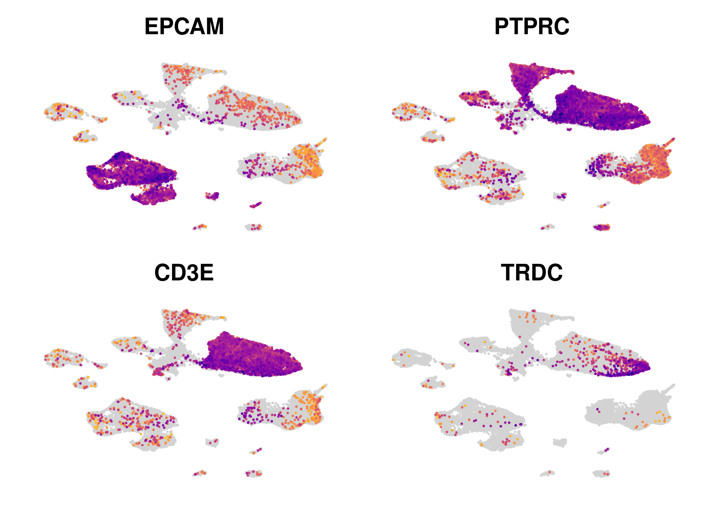

Integrated Datasets (Li 2021, Smillie 2019)
================

``` r
library(Seurat)
library(SCpubr)
library(scCustomize)
library(harmony)
library(Matrix)
library(tidyverse)
library(data.table)
library(readxl)
library(biomaRt)
library(clusterProfiler)
library(ReactomePA)
```

# Li 2021

Reading in Data

``` r
HD_1 <- Read10X("../../data_raw/Li2021/id6C/")
HD_2 <- Read10X("../../data_raw/Li2021/id7C/")
HD_3 <- Read10X("../../data_raw/Li2021/id8C/")
HD_4 <- Read10X("../../data_raw/Li2021/id9C/")

UC_1 <- Read10X("../../data_raw/Li2021/id1T/")
UC_2 <- Read10X("../../data_raw/Li2021/id2T/")
UC_3 <- Read10X("../../data_raw/Li2021/id3T/")
UC_4 <- Read10X("../../data_raw/Li2021/id4T/")
UC_5 <- Read10X("../../data_raw/Li2021/id5T/")

HD_1 <- CreateSeuratObject(HD_1, project = "HD_1")
HD_2 <- CreateSeuratObject(HD_2, project = "HD_2")
HD_3 <- CreateSeuratObject(HD_3, project = "HD_3")
HD_4 <- CreateSeuratObject(HD_4, project = "HD_4")

UC_1 <- CreateSeuratObject(UC_1, project = "UC_1")
UC_2 <- CreateSeuratObject(UC_3, project = "UC_2")
UC_3 <- CreateSeuratObject(UC_4, project = "UC_3")
UC_4 <- CreateSeuratObject(UC_5, project = "UC_4")
UC_5 <- CreateSeuratObject(UC_5, project = "UC_5")

data_li_raw <- merge(
  HD_1, y = mget(c(paste0("HD_", 2:4), paste0("UC_", 1:5))),
  add.cell.ids = c(paste0("HD_", 1:4), paste0("UC_", 1:5))
  )

rm(list=c(paste0("HD_", 1:4), paste0("UC_", 1:5)))
```

``` r
data_li_raw <- JoinLayers(data_li_raw)
data_li_raw <- SetIdent(data_li_raw, value="all")
```

## Meta Data

``` r
data_li_raw@meta.data <- data_li_raw@meta.data %>%
  separate(orig.ident, into = c("disease", "ID"), sep = "_") %>%
  unite(diseaseID ,disease, ID, sep = "", remove = F)
```

## QC

``` r
data_li_raw[["percent.mt"]] <- PercentageFeatureSet(data_li_raw, pattern = "^MT-")

VlnPlot(data_li_raw, pt.size=0, ncol = 3,
        features = c("nFeature_RNA", "nCount_RNA", "percent.mt"))&NoLegend()
```

<!-- -->

## Subset high quality cells

``` r
data_li <- subset(data_li_raw, subset = nFeature_RNA > 200 & nFeature_RNA < 4000 & 
                nCount_RNA < 30000 & percent.mt < 50)
```

## Remove Genes for Clustering

``` r
non.mt.genes <- rownames(data_li[["RNA"]]$counts[grep("^(MT-)",
                    rownames(data_li[["RNA"]]$counts), invert = T),])

non.ribo.genes <- rownames(data_li[["RNA"]]$counts[grep("^(RPL\\d|RPS\\d|RP\\d|IGH|IGL|IGK)", rownames(data_li[["RNA"]]$counts), invert = T),])

data_li <- subset(data_li, features = non.mt.genes)
data_li <- subset(data_li, features = non.ribo.genes)

rm(list=c("non.mt.genes", "non.ribo.genes"))
```

## Clustering

``` r
data_li <- data_li%>%NormalizeData()%>%FindVariableFeatures()%>%ScaleData()%>%RunPCA()%>%
  FindNeighbors(dims=1:30)%>%FindClusters()%>%RunUMAP(dims=1:30)
```

    ## Modularity Optimizer version 1.3.0 by Ludo Waltman and Nees Jan van Eck
    ## 
    ## Number of nodes: 44940
    ## Number of edges: 1787352
    ## 
    ## Running Louvain algorithm...
    ## Maximum modularity in 10 random starts: 0.9227
    ## Number of communities: 28
    ## Elapsed time: 5 seconds

    ## Warning: The default method for RunUMAP has changed from calling Python UMAP via reticulate to the R-native UWOT using the cosine metric
    ## To use Python UMAP via reticulate, set umap.method to 'umap-learn' and metric to 'correlation'
    ## This message will be shown once per session

``` r
do_DimPlot(data_li, group.by = "seurat_clusters", label=T)&NoLegend()
```

<!-- -->

``` r
FeaturePlot_scCustom(data_li, features = c("EPCAM", "PTPRC", "CD3E", "TRDC"))&
  NoLegend()&NoAxes()
```

<!-- -->

## Subsetting EPCAM+ & gd Tcells

``` r
ep_li <- subset(data_li, subset=seurat_clusters %in% c(
  "0", "10", "15", "17", "18", "22", "26")
  )

gd_li <- subset(data_li, subset=TRDC>1 & seurat_clusters %in% c(
  "3", "5", "7", "8", "9", "12", "14")
  )
```

``` r
rm(list=c("data_li_raw", "data_li"))
```

# Smillie 2019

## Reading in Data

``` r
# Meta df
meta <- fread("../../data_raw/Smillie2019/meta.data.txt")
meta <- meta[-1]

# Immune Cells
imm <- readMM("../../data_raw/Smillie2019/gene_sorted-Imm.matrix.mtx")
rownames(imm) <- readLines("../../data_raw/Smillie2019/Imm.genes.tsv")
colnames(imm) <- readLines("../../data_raw/Smillie2019/Imm.barcodes2.tsv")

imm <- CreateSeuratObject(imm)
```

    ## Warning: Feature names cannot have underscores ('_'), replacing with dashes
    ## ('-')

    ## Warning: Data is of class dgTMatrix. Coercing to dgCMatrix.

``` r
imm@meta.data <- imm@meta.data%>%
  rownames_to_column("NAME")%>%
  left_join(meta, by="NAME")%>%
  column_to_rownames("NAME")

# Epithelial Cells
ep_sm <- readMM("../../data_raw/Smillie2019/gene_sorted-Epi.matrix.mtx")
rownames(ep_sm) <- readLines("../../data_raw/Smillie2019/Epi.genes.tsv")
colnames(ep_sm) <- readLines("../../data_raw/Smillie2019/Epi.barcodes2.tsv")

ep_sm <- CreateSeuratObject(ep_sm)
```

    ## Warning: Feature names cannot have underscores ('_'), replacing with dashes
    ## ('-')
    ## Warning: Data is of class dgTMatrix. Coercing to dgCMatrix.

``` r
ep_sm@meta.data <- ep_sm@meta.data%>%
  rownames_to_column("NAME")%>%
  left_join(meta, by="NAME")%>%
  column_to_rownames("NAME")

rm("meta")
```

## QC & Processing

``` r
#Epithelial Cells
ep_sm[["percent.mt"]] <- PercentageFeatureSet(ep_sm, pattern = "^MT-")

VlnPlot(ep_sm, features = c("nFeature_RNA", "nCount_RNA", "percent.mt"),
              ncol = 3, pt.size = 0)&NoLegend()
```

    ## Rasterizing points since number of points exceeds 100,000.
    ## To disable this behavior set `raster=FALSE`
    ## Rasterizing points since number of points exceeds 100,000.
    ## To disable this behavior set `raster=FALSE`
    ## Rasterizing points since number of points exceeds 100,000.
    ## To disable this behavior set `raster=FALSE`

<!-- -->

``` r
ep_sm <- subset(ep_sm, subset = nFeature_RNA > 200 & nFeature_RNA < 5000 & 
               nCount_RNA < 30000 & percent.mt < 50)
```

``` r
# Immune Cells
imm[["percent.mt"]] <- PercentageFeatureSet(imm, pattern = "^MT-")

VlnPlot(imm, features = c("nFeature_RNA", "nCount_RNA", "percent.mt"),
              ncol = 3, pt.size = 0)&NoLegend()
```

    ## Rasterizing points since number of points exceeds 100,000.
    ## To disable this behavior set `raster=FALSE`
    ## Rasterizing points since number of points exceeds 100,000.
    ## To disable this behavior set `raster=FALSE`
    ## Rasterizing points since number of points exceeds 100,000.
    ## To disable this behavior set `raster=FALSE`

<!-- -->

``` r
imm <- subset(imm, subset = nFeature_RNA > 200 & nFeature_RNA < 3000 & 
               nCount_RNA < 25000 & percent.mt < 15)
```

``` r
imm <- imm%>%NormalizeData()%>%FindVariableFeatures()%>%ScaleData()%>%RunPCA()%>%
  FindNeighbors(dims=1:30)%>%FindClusters(resolution =1.5)%>%RunUMAP(dims=1:30)
```

    ## Modularity Optimizer version 1.3.0 by Ludo Waltman and Nees Jan van Eck
    ## 
    ## Number of nodes: 204918
    ## Number of edges: 6691248
    ## 
    ## Running Louvain algorithm...
    ## Maximum modularity in 10 random starts: 0.9077
    ## Number of communities: 55
    ## Elapsed time: 56 seconds

``` r
do_DimPlot(imm, group.by="seurat_clusters", label=T, pt.size=.1)&NoLegend()
```

<!-- -->

``` r
FeaturePlot_scCustom(imm, features=c("CD3E", "TRDC"))&NoAxes()&NoLegend()
```

<!-- -->

``` r
gd_sm <- subset(imm, subset=TRDC>1 & seurat_clusters %in% c(
  "2", "18", "37", "44", "23", "36", "0", "46", "16", "5", "6", "7", "30", "29"
))
```

``` r
rm("imm")
```

# Combining and Integrating Datasets

## gd T cells

``` r
# changing meta data column names to match between both datasets

gd_li@meta.data <- gd_li@meta.data%>%
  mutate(cohort="Li2021")

gd_sm@meta.data <- gd_sm@meta.data%>%
  rename(disease=Health, ID=Subject)%>%
  mutate(disease=case_when(
    disease=="Healthy" ~ "HD",
    disease=="Inflamed" ~ "UC",
    disease=="Non-inflamed" ~ "SC"
    ),
    cohort="Smillie2019")%>%
  unite(diseaseID, disease, ID, sep="", remove=F)

gd_sm <- subset(gd_sm, subset=disease!="SC")
```

### Integtration

``` r
# Downsampling
gd_sm <- SetIdent(gd_sm, value="all")
gd_sm <- subset(gd_sm, downsample=844)

gd_li@assays$SCT <- NULL
DefaultAssay(gd_li) <- "RNA"
gd_sm@assays$SCT <- NULL
DefaultAssay(gd_sm) <- "RNA"


# Only use genes that appear in both datasets
genes <- intersect(rownames(gd_li), rownames(gd_sm))

# Merge
gd <- merge(gd_li[genes,], gd_sm[genes,])%>%JoinLayers()

# rm(list=c("genes", "gd_li", "gd_sm"))
```

``` r
gd <- gd%>%NormalizeData()%>%FindVariableFeatures()%>%ScaleData()%>%
  RunPCA()%>%FindNeighbors(dims=1:30)%>%FindClusters()%>%RunUMAP(dims=1:30)
```

    ## Warning: Different features in new layer data than already exists for
    ## scale.data

    ## Modularity Optimizer version 1.3.0 by Ludo Waltman and Nees Jan van Eck
    ## 
    ## Number of nodes: 1688
    ## Number of edges: 71762
    ## 
    ## Running Louvain algorithm...
    ## Maximum modularity in 10 random starts: 0.8110
    ## Number of communities: 10
    ## Elapsed time: 0 seconds

``` r
do_DimPlot(gd, group.by = "cohort")
```

<!-- -->

``` r
# Integration
gd <- RunHarmony(gd, "cohort")
```

``` r
ElbowPlot(gd, 50, reduction = "harmony")
```

<!-- -->

``` r
gd <- gd%>%FindNeighbors(reduction="harmony", dims=1:20)%>%
  FindClusters(resolution=.25)%>%RunUMAP(reduction="harmony", dims=1:20)
```

    ## Modularity Optimizer version 1.3.0 by Ludo Waltman and Nees Jan van Eck
    ## 
    ## Number of nodes: 1688
    ## Number of edges: 63232
    ## 
    ## Running Louvain algorithm...
    ## Maximum modularity in 10 random starts: 0.8810
    ## Number of communities: 6
    ## Elapsed time: 0 seconds

``` r
gd@meta.data <- gd@meta.data%>%
  mutate(cluster=paste0("C", seurat_clusters))
```

``` r
do_DimPlot(gd, group.by="cohort")
```

<!-- -->

### Module Scores

``` r
# Tissue Residency
TRM_genes <- scan("genesets/TRM.txt", character(), quote="")
gd <- AddModuleScore(gd, features=list(TRM_genes), name="TRM")
```

    ## Warning: The following features are not present in the object: SNAP91, LILRP2,
    ## WASH5P, GSG2, KRT85, LOC100507039, GPR25, DBH, C18orf1, LOC100128420, PPP1R2P9,
    ## LOC100507525, LOC401431, C5orf62, RPPH1, C17orf46, RNU4-2, AIM1L, RNU2-2,
    ## EFCAB4A, RN7SK, SOAT2, RN7SL2, MIR663, AMICA1, RN7SL1, ADC, LOC619207,
    ## LOC100506860, KIAA0284, LOC100506985, LOC100128242, C13orf15, FAM134B,
    ## LOC646329, GLT25D2, SLC7A5P1, not searching for symbol synonyms

``` r
# Cytokine/Cytotoxic
cytokine_genes <- scan("genesets/cytokine.txt", character(), quote="")
cytotoxic_genes <- scan("genesets/cytotoxic.txt", character(), quote="")

cytokine_cytotoxic_genes <- c(cytokine_genes, cytotoxic_genes)
cytokine_cytotoxic_genes <- unique(cytokine_cytotoxic_genes)

gd <- AddModuleScore(gd, features=list(cytokine_cytotoxic_genes), name="cyto")
```

    ## Warning: The following features are not present in the object: CCL3L3, IL9,
    ## PLA2G16, ADGRG1, not searching for symbol synonyms

``` r
# FLASHseq gd T Subsets
Vg4Vd1 <- read.csv("genesets/Vg4Vd1_genes.csv")%>%
  filter(!gene %in% c("TRGV4", "TRDV1"))%>%pull(gene)

gd <- AddModuleScore(gd, features = list(Vg4Vd1),name="Vg4Vd1_")
```

    ## Warning: The following features are not present in the object: TRGJ1, TRDJ1,
    ## TMSB4XP8, ADGRG1, ENSG00000227240, PLPP1, ENSG00000230831, FTLP3, ATP5MC2,
    ## SEPTIN7, YBX1P1, TRAJ45, SMIM27, TPI1P1, SETP14, PCBP2P2, LILRP2, WASHC3,
    ## FAM3C2P, STN1, GPX1, TRDJ2, TRAJ49, YBX1P2, PDIA3P1, ENSG00000286330, HACD4,
    ## ATP5F1A, HNRNPCP2, RTF2, TOX-DT, not searching for symbol synonyms

``` r
Vg9Vd2 <- read.csv("genesets/Vg9Vd2_genes.csv")%>%
  filter(!gene %in% c("TRGV9", "TRDV2"))%>%pull(gene)

gd <- AddModuleScore(gd, features = list(Vg9Vd2), name="Vg9Vd2_")
```

    ## Warning: The following features are not present in the object: TRBV27,
    ## LINC02084, EEF1A1P5, ENSG00000283041, ENSG00000227615, ENSG00000293050, TRDJ3,
    ## RPLP0P6, HLA-U, EEF1B2P3, TRDJ4, HLA-W, EEF1A1P19, RLIG1, RACK1,
    ## ENSG00000244313, VSIR, HLA-H, ENSG00000240376, ENSG00000218426, SMIM14-DT,
    ## ENSG00000232176, SATB1-AS1, EEF1A1P13, ENSG00000269242, C20orf204, not
    ## searching for symbol synonyms

``` r
rm(list=c("cytokine_genes", "cytotoxic_genes","cytokine_cytotoxic_genes",
          "TRM_genes", "Vg9Vd2", "Vg4Vd1", "stem_like_genes")
   )
```

    ## Warning in rm(list = c("cytokine_genes", "cytotoxic_genes",
    ## "cytokine_cytotoxic_genes", : object 'stem_like_genes' not found

Stem-Like/Effector Signatures

``` r
# Li 2024: Stem-like T cells are associated with the pathogenesis of ulcerative 
# colitis in humans
li_stem <- read_csv("../../genesets/li24_stem_marker.csv")%>%
  pull(gene)%>%UpdateSymbolList()

# Function for converting mouse to human gene symbols
human <- useMart("ensembl", dataset="hsapiens_gene_ensembl", 
                  host="https://dec2021.archive.ensembl.org/")
mouse <- useMart("ensembl", dataset = "mmusculus_gene_ensembl",
                  host="https://dec2021.archive.ensembl.org/")

mouse_to_human <- function(genes){
  human_genes = getLDS(attributes = c("mgi_symbol"), filters = "mgi_symbol", 
                   values = genes, mart = mouse, attributesL = c("hgnc_symbol"), 
                   martL = human, uniqueRows=T)
  human_genes <- unique(human_genes[, 2])
  
  return(human_genes)
}

# Siddiqui 2019: Intratumoral Tcf1+PD-1+CD8+ T Cells with Stem-like Properties 
# Promote Tumor Control in Response to Vaccination and Checkpoint Blockade Immunotherapy
siddiqui19 <- read_xlsx("../../genesets/siddiqui19_stem_vs_effector.xlsx")

siddiqui19_stem <- siddiqui19%>%filter(log2_FC >= 1)%>%pull(gene)%>%
  mouse_to_human()

siddiqui19_effector <- siddiqui19%>%filter(log2_FC <= -1)%>%pull(gene)%>%
  mouse_to_human()

# Im 2016: Defining CD8+ T cells that provide the proliferative burst after PD-1 therapy
im16 <- read_tsv("../../genesets/im16_stem_vs_effector.tsv")%>%
  filter(adj.P.Val < 0.05)

im16_stem <- im16%>%filter(logFC >= 1)%>%pull(Gene.symbol)%>%
  mouse_to_human()

im16_effector <- im16%>%filter(logFC <= -1)%>%pull(Gene.symbol)%>%
  mouse_to_human()

# Wu 2016: The TCF1-Bcl6 axis counteracts type I interferon to repress
# exhaustion and maintain T cell stemness
wu16 <- read_tsv("../../genesets/wu16_stem_vs_effector.tsv")%>%
  filter(adj.P.Val < 0.05)%>%
  mutate(gene=str_extract(gene_assignment, "(?<=//\\s)[^/]+(?=\\s//)"))

wu16_stem <- wu16%>%filter(logFC >= 1)%>%pull(gene)%>%
  mouse_to_human()

wu16_effector <- wu16%>%filter(logFC <= -1)%>%pull(gene)%>%
  mouse_to_human()

# Utzschneider 2016: T Cell Factor 1-Expressing Memory-like CD8+ T Cells
# Sustain the Immune Response to Chronic Viral Infections
utz16 <- read_xlsx("../../genesets/utzschneider16_stem_vs_effector.xlsx")

utz16_stem <- utz16%>%filter(logFC >= 1)%>%pull(Gene_Symbol)%>%
  mouse_to_human()

utz16_effector <- utz16%>%filter(logFC <= -1)%>%pull(Gene_Symbol)%>%
  mouse_to_human()
```

``` r
# Module Score Function
scoring <- function(object, genes, name){
  object <- AddModuleScore(object, features=list(genes), name=name)
  
  return(object)
}

scoring_list <- list(
  siddiqui19_stem = siddiqui19_stem, siddiqui19_effector = siddiqui19_effector,
  im16_stem = im16_stem, im16_effector = im16_effector,
  wu16_stem = wu16_stem, wu16_effector = wu16_effector,
  utz16_stem = utz16_stem, utz16_effector = utz16_effector,
  li_stem = li_stem
)

for (score in names(scoring_list)){
  gd <- scoring(gd, scoring_list[[score]], score)
}
```

    ## Warning: The following features are not present in the object: ADH1C, TUBA8,
    ## SLC6A19, TNP2, ZSCAN10, KCNC1, GABRR2, IGHM, ADH4, KCNH7, TRPM1, MS4A4E, TNNI1,
    ## ADH7, MYO1H, not searching for symbol synonyms

    ## Warning: The following features are not present in the object: GGTLC1, GGT2,
    ## GGTLC3, CCL3L3, CCL15-CCL14, OIT3, GGTLC2, H1-0, BCO1, SV2C, ADGRG5, PXYLP1,
    ## FAM71B, MRGPRE, DKKL1, RGS8, SMIM35, GBP6, OTOS, ADGRG1, ADGRG3, not searching
    ## for symbol synonyms

    ## Warning: The following features are not present in the object: SLC5A3, DSCAM,
    ## IGHV1OR21-1, RPS6KA5, CD24, USP41, IGHV1-24, IGHV1-18, IGHV1OR15-9, TUBA8,
    ## MTMR7, PPP2R2C, CFAP418, GABRR2, KCNC1, RPL22, IGHV1-45, IGHV1-46, IGHV1-58,
    ## IGHV1-3, IGHV1-69, IGHV1-69-2, IGHV1-69D, ATP2B2, IFIT1B, HACD1, WHRN,
    ## SERPINA12, KCNIP3, FHIP1A, RPGRIP1, ASB5, B4GAT1, RALYL, PENK, GRAMD2B, CAPSL,
    ## PLPP1, IGHM, SH3GL3, TRPM1, PECAM1, MS4A4E, EEF1AKMT4-ECE2, P3H2, ZNF878,
    ## APOBEC2, AKR7L, ACOT6, CYP1A1, SNORD104, CBARP, not searching for symbol
    ## synonyms

    ## Warning: The following features are not present in the object: SPO11, LRRN4,
    ## SIK1B, GGTLC1, GGT2, GGTLC3, LRRC9, CCL15-CCL14, PCYT1B, KLRC4-KLRK1, CCL3L3,
    ## GLP1R, LRRC75A, BUB1B-PAK6, NOL4L, MRGPRE, WSCD2, DMRTA2, SLC35D3, MORC1,
    ## CLDN34, GGTLC2, BCO1, RASGEF1C, RPS6KA1, NTF4, CFAP126, C19orf71, ADGRG1,
    ## CD200R1L, PCDHGC4, ACTN2, not searching for symbol synonyms

    ## Warning: The following features are not present in the object: PENK, MS4A4E,
    ## not searching for symbol synonyms

    ## Warning: The following features are not present in the object: BUB1B-PAK6,
    ## CCL3L3, not searching for symbol synonyms

    ## Warning: The following features are not present in the object: MAGEE2, SLC5A3,
    ## DSCAM, SPO11, GSTT2B, GSTT2, TUBA8, AFP, USP41, WNT3, BTBD16, RPL35, FBXW10,
    ## CDRT1, C6orf118, WHRN, IFIT1B, SNORD22, RPGRIP1, FHIP1A, KCNIP3, DRC1, ZSCAN10,
    ## TRBV15, CAPSL, TSBP1, WFIKKN2, SPACA1, PENK, RALYL, SH3GL3, ATP6V1G2-DDX39B,
    ## IGHM, GABRR2, CFAP418, TNP2, CHURC1-FNTB, ZAN, ADGRD1, PLSCR3, IRGC, LMNTD2,
    ## SMIM10L2B, SMIM10L2A, ATP2B2, FFAR1, ICE2, OTX1, FAM187B, PCDHGB4, FCMR,
    ## C8orf44-SGK3, ADH4, GPR62, SHANK1, ACOT6, NAPRT, CBARP, TRIM67, HEXD, KDF1,
    ## COL2A1, MYO1H, GBP6, NPHP3-ACAD11, IZUMO1R, TRPM1, PRSS41, ATP6V1G3, P3H2,
    ## SBK2, NOXRED1, GRIK5, PECAM1, FAM163A, EEF1AKMT4-ECE2, MS4A4E, SNORA80B, not
    ## searching for symbol synonyms

    ## Warning: The following features are not present in the object: GGTLC1, GGT2,
    ## GGTLC3, B3GLCT, INSL6, LRRN4, RIMBP3, ARHGAP19-SLIT1, KLRC4-KLRK1, CCL15-CCL14,
    ## RIMBP3B, CCL3L3, PCYT1B, C1QTNF9B, TCP11, GLP1R, BUB1B-PAK6, P3H4, LRRC75B,
    ## ITGAD, CLDN34, UPK1A, PXYLP1, TNS2, H1-0, DDIAS, STBD1, MRGPRE, ADGRG5, KCNA4,
    ## GGTLC2, MSH5-SAPCD1, BCO1, ANXA8, ANXA8L1, MORC1, DKKL1, SOAT2, RPS6KA1, XIRP1,
    ## CCL27, MAP3K15, ADGRE5, FAM71B, CLEC2L, TMEM151A, GPR87, CD200R1L, KLK13,
    ## NUDT4B, NMNAT2, LMO1, SNORD118, ADGRG3, ACTN2, DHFR2, PIDD1, PMF1-BGLAP,
    ## MS4A4E, ADGRB2, ADGRG1, P2RY12, OTOS, AS3MT, HEATR9, CDC14C, PCDHGC3, OTOP3,
    ## PCDHGA8, CFAP126, FCGR2C, SH2D5, not searching for symbol synonyms

    ## Warning: The following features are not present in the object: RP5-1028K7.2,
    ## BEX3, BMERB1, RP11-279F6.3, RP11-555F9.2, RP11-1399P15.1, AC068196.1, ARMH1,
    ## FCMR, EPYC, RP11-222K16.2, AC074289.1, IRAG2, FNDC9, KB-1507C5.2, LHFPL6,
    ## BICDL1, LINC01550, RP11-242J7.1, NPBWR1, RP4-728D4.2, AC097713.4,
    ## RP11-265P11.2, RP11-620J15.3, RP11-539I5.1, AP001055.6, RP11-655C2.3, PLPP2,
    ## AD000671.6, DIRAS2, WHRN, AC011893.3, AF131217.1, CTD-2020K17.1, RP11-455F5.5,
    ## CARMIL3, SHISAL1, RP11-145M9.4, AC069363.1, DGCR5, CIBAR1, RP11-61O1.2,
    ## SHISAL2A, EPOP, RP1-15D23.2, ELAPOR1, CUTALP, GRK3, LINC01619, RP11-73M14.1,
    ## RP11-371A19.2, RP11-796G6.2, RTL6, TCEAL9, RP11-431M7.3, RIPOR2, ADGRG7,
    ## CTA-293F17.1, TASL, STAC, KB-173C10.2, H1-0, RP11-18H21.1, PRORP, ABTB3,
    ## RP11-215G15.5, AP000476.1, RP11-223C24.1, RTP5, TCAF1, MIR9-3HG, AC093609.1,
    ## LRATD2, LCN10, AC006460.2, AKAP2, RP3-400N23.6, AC010226.4, RP11-348F1.3,
    ## KB-173C10.1, MIR146A, AC074366.3, RP11-91I20.4, TCAF2, PLGLB2, FIRRM, MRTFB,
    ## GABPAP, TTTY15, RP11-426C22.5, RP11-11N9.4, RP11-117D22.2, RP11-493L12.5,
    ## RP11-284N8.3, CTC-228N24.3, RP11-486L19.2, RP11-229C3.2, RP11-275I4.2,
    ## IL10RB-DT, CYP4F35P, CTD-2336O2.1, PIP4P2, NSD2, JCHAIN, RP6-109B7.3,
    ## AC009784.3, RP11-218M22.1, PCNX2, RP11-732M18.3, KDM7A, RP11-15A1.3, INTS6L,
    ## AOPEP, AC006129.1, RP5-1043L13.1, ST20, RP5-1007M22.2, CTD-3096M3.1, not
    ## searching for symbol synonyms

``` r
rm(list=c(grep(ls(), pattern="^im16|^li|^sidd|^utz16|^wu16", value=T), "genes", "score",
          "scoring_list" ,"mouse", "human", "mouse_to_human"
          ))
```

## EPCAM+ Cells

``` r
# Change meta data column names to match between datasets
ep_li@meta.data <- ep_li@meta.data%>%
  mutate(cohort="Li 2021")

ep_sm@meta.data <- ep_sm@meta.data%>%
  rename(disease=Health, ID=Subject)%>%
  mutate(disease=case_when(
    disease=="Healthy" ~ "HD",
    disease=="Inflamed" ~ "UC",
    disease=="Non-inflamed" ~ "SC"
    ),
    cohort="Smillie 2019")%>%
  unite(diseaseID, disease, ID, sep="", remove=F)

ep_sm <- subset(ep_sm, subset=disease!="SC")
```

### Integration

``` r
# Only use genes that appear in both datasets
genes <- intersect(rownames(ep_li), rownames(ep_sm))

ep <- merge(ep_li[genes,], ep_sm[genes,])%>%JoinLayers()

rm(genes, ep_li, ep_sm)
```

``` r
ep <- ep%>%NormalizeData()%>%FindVariableFeatures()%>%ScaleData()%>%
  RunPCA()%>%FindNeighbors(dims=1:30)%>%FindClusters()%>%RunUMAP(dims=1:30)
```

    ## Warning: Different cells in new layer data than already exists for data

    ## Warning: Different features in new layer data than already exists for
    ## scale.data

    ## Warning: Different cells in new layer data than already exists for scale.data

    ## Modularity Optimizer version 1.3.0 by Ludo Waltman and Nees Jan van Eck
    ## 
    ## Number of nodes: 73853
    ## Number of edges: 2502695
    ## 
    ## Running Louvain algorithm...
    ## Maximum modularity in 10 random starts: 0.9019
    ## Number of communities: 32
    ## Elapsed time: 11 seconds

``` r
do_DimPlot(ep, group.by="cohort", pt.size=.2)
```

<!-- -->

``` r
# Integration
ep <- RunHarmony(ep, "cohort")
```

    ## Warning: Quick-TRANSfer stage steps exceeded maximum (= 3692650)

``` r
ElbowPlot(ep, reduction = "harmony", 50)
```

<!-- -->

``` r
ep <- ep%>%FindNeighbors(reduction="harmony", dims=1:40)%>%
  FindClusters()%>%RunUMAP(reduction="harmony", dims=1:40)
```

    ## Modularity Optimizer version 1.3.0 by Ludo Waltman and Nees Jan van Eck
    ## 
    ## Number of nodes: 73853
    ## Number of edges: 2599707
    ## 
    ## Running Louvain algorithm...
    ## Maximum modularity in 10 random starts: 0.8953
    ## Number of communities: 31
    ## Elapsed time: 13 seconds

``` r
do_DimPlot(ep, group.by="cohort", pt.size=.2)
```

<!-- -->

``` r
# Cell Numbers of CellTypes Per Cluster (annotation derived from
# Smillie datasets) to perform label transfer (enterocytes)

ep@meta.data <- ep@meta.data%>%
  mutate(enterocytes=case_when(
    Cluster %in% c("Best4+ Enterocytes", "Enterocyte Progenitors", "Enterocytes",
                   "Immature Enterocytes 1", "Immature Enterocytes 2") ~ "enterocytes",
    is.na(Cluster) ~ "Li21",
    .default = "other"
  ))

ep@meta.data%>%ggplot(aes(x=seurat_clusters, fill=enterocytes))+
  geom_bar(position = "fill")+
  theme_classic()
```

<!-- -->

``` r
# Subsetting Enterocytes based on Clusters and downsampling
entero <- subset(ep, subset = seurat_clusters %in% c(
  "0", "1", "7", "11", "16", "17", "21", "25"
))
```

``` r
summary(as.factor(entero@meta.data$diseaseID))
```

    ##    HD1    HD2    HD3    HD4  HDN10  HDN11  HDN13  HDN15  HDN16  HDN17  HDN18 
    ##    361    556    824    809   2039   2686    433   3012   1110   1150   1138 
    ##  HDN20  HDN21  HDN46  HDN51   HDN8    UC1    UC2    UC3    UC4    UC5 UCN106 
    ##    847   2516    881    865    406    155     71    211    214    214     39 
    ## UCN110 UCN111  UCN12  UCN14  UCN19  UCN23  UCN24  UCN26  UCN44  UCN49  UCN50 
    ##    766    187    207    294    324    186   1009    476    428     17      7 
    ##  UCN52 UCN539  UCN58   UCN7   UCN9 
    ##     28     59    242     52    450

``` r
# Downsampling
entero <- SetIdent(entero, value="diseaseID")
entero <- subset(entero, downsample=500)
```

``` r
entero <- entero%>%FindVariableFeatures()%>%ScaleData()%>%RunPCA()%>%
  RunHarmony("cohort")
```

    ## Finding variable features for layer counts

    ## Centering and scaling data matrix

    ## Warning: Different features in new layer data than already exists for
    ## scale.data

    ## PC_ 1 
    ## Positive:  GUCA2A, AQP8, GUCA2B, CA4, SLC26A3, LYPD8, PRAP1, CEACAM7, PLAC8, MS4A12 
    ##     CLCA4, IL32, ANPEP, CEACAM1, HIST1H1C, CA1, TMIGD1, TRIM31, TMEM37, ISG15 
    ##     CDKN2B-AS1, CLDN23, HPGD, HSD17B2, NLN, C11orf86, ABCB1, ABCG2, CDA, PRSS23 
    ## Negative:  OLFM4, LDHB, IDH2, MLEC, AGR2, NME1, CENPW, LEFTY1, GPX2, PRDX4 
    ##     RANBP1, RPSA, NPM1, NHP2, MTDH, C1QBP, SDF2L1, TUBB, LYZ, S100A11 
    ##     RAN, ASRGL1, UBE2C, HSPD1, GSTP1, PTTG1, STMN1, H2AFZ, RPLP0, PPIB 
    ## PC_ 2 
    ## Positive:  RPLP0, EEF1A1, RPLP1, MT1G, HMGCS2, RPSA, MT1E, SELENBP1, YBX1, FABP5 
    ##     EEF1B2, HNRNPA1, MT1X, NPM1, C1QBP, CYC1, PYCARD, PHB, GAS5, PRDX2 
    ##     HSPE1, MT2A, PTMA, EIF3L, CA1, NBEAL1, MT1F, APRT, HSPD1, MT1M 
    ## Negative:  DUOX2, CEACAM6, DUOXA2, CEACAM5, PI3, MUC13, NOS2, TNIP3, SAA1, CXCL1 
    ##     TGM2, CD55, TFF1, SLC6A14, PLAUR, SLC40A1, MUC1, CLCA4, HK2, MUC12 
    ##     TMPRSS2, LCN2, TM4SF1, ISG20, MXD1, CEACAM1, XDH, ADM, GSN, PDZK1IP1 
    ## PC_ 3 
    ## Positive:  DUOXA2, SAA1, TNIP3, LCN2, CXCL1, DUOX2, SAA2, NOS2, S100A11, ANXA1 
    ##     SLC6A14, TGM2, IFITM3, GPX2, SPINK1, IDO1, CXCL3, PI3, DEFB4A, MUC1 
    ##     EEF1A1, CD74, RPLP0, CD55, C4BPB, PDZK1IP1, TIMP1, HLA-DRA, MMP7, MUC4 
    ## Negative:  AQP8, GUCA2A, LYPD8, GUCA2B, PRAP1, CA4, MS4A12, SLC26A3, HSD17B2, IL32 
    ##     ANPEP, TMIGD1, PRDX6, NDRG1, SLC26A2, HIST1H1C, CEACAM7, TMEM37, PLAC8, SLC20A1 
    ##     CLDN23, HPGD, APOBEC3B, CDKN2B-AS1, EFNA1, CEACAM5, ABCG2, NLN, SLC51A, PRSS23 
    ## PC_ 4 
    ## Positive:  MGST3, AKR1B10, ANXA2, S100A14, KRT19, NQO1, AKR1C3, HSD17B2, PRDX6, GDPD3 
    ##     PDE4C, S100A16, PDCD6, MS4A12, REG4, AKR7A3, PSME2, CBR1, SLC26A3, PLAC8 
    ##     HSPB1, SLC51A, SLC26A2, SERPINB1, PSMB6, ADIRF, ETNK1, HPGD, HMGCS2, HIGD1A 
    ## Negative:  MKI67, TOP2A, PRC1, CENPF, UBE2C, NUSAP1, ASPM, TPX2, CENPE, HMMR 
    ##     ANLN, CEP55, CENPA, BIRC5, DEPDC1, CDK1, KIF20B, GTSE1, KIF4A, CCNA2 
    ##     ARHGAP11A, KIF23, RRM2, AURKB, CKAP2, CDKN3, SMC2, RACGAP1, SAPCD2, PLK1 
    ## PC_ 5 
    ## Positive:  CA7, SPIB, BEST4, OTOP2, MT1G, AGR3, MT1H, HEPACAM2, MT1E, MT1X 
    ##     MT2A, MT1F, MT1M, HES4, FOSB, WFDC2, MSLN, NOTCH2, MARCKS, NBPF10 
    ##     SULT1B1, NR4A1, CKB, GOLIM4, XIST, CRIP1, STARD10, CTSE, PPP1CB, EGR1 
    ## Negative:  AQP8, TESC, APOBEC3B, IL32, CLDN2, HLA-DRB5, NLN, HLA-DPA1, ANPEP, PRAP1 
    ##     REG1A, HLA-DPB1, CLCA4, SERPINA1, SAA1, PPP1R14A, MIA, PTTG1, UBE2C, TMEM37 
    ##     CDC20, TRIM31, MTRNR2L1, HLA-DRA, FAIM2, HLA-DMB, RRM2, CENPW, PRSS23, TGFBI

    ## Transposing data matrix

    ## Initializing state using k-means centroids initialization

    ## Harmony 1/10

    ## Harmony 2/10

    ## Harmony 3/10

    ## Harmony converged after 3 iterations

``` r
ElbowPlot(entero, reduction="harmony", 50)
```

<!-- -->

``` r
entero <- entero%>%FindNeighbors(reduction="harmony",dims=1:20)%>%FindClusters()%>%
  RunUMAP(reduction="harmony", dims=1:20)
```

    ## Computing nearest neighbor graph

    ## Computing SNN

    ## Modularity Optimizer version 1.3.0 by Ludo Waltman and Nees Jan van Eck
    ## 
    ## Number of nodes: 12561
    ## Number of edges: 450717
    ## 
    ## Running Louvain algorithm...
    ## Maximum modularity in 10 random starts: 0.8655
    ## Number of communities: 18
    ## Elapsed time: 0 seconds

    ## 10:31:34 UMAP embedding parameters a = 0.9922 b = 1.112

    ## 10:31:34 Read 12561 rows and found 20 numeric columns

    ## 10:31:34 Using Annoy for neighbor search, n_neighbors = 30

    ## 10:31:34 Building Annoy index with metric = cosine, n_trees = 50

    ## 0%   10   20   30   40   50   60   70   80   90   100%

    ## [----|----|----|----|----|----|----|----|----|----|

    ## **************************************************|
    ## 10:31:35 Writing NN index file to temp file /tmp/RtmppbtRLx/file3abf8561b7a41
    ## 10:31:35 Searching Annoy index using 1 thread, search_k = 3000
    ## 10:31:37 Annoy recall = 100%
    ## 10:31:37 Commencing smooth kNN distance calibration using 1 thread with target n_neighbors = 30
    ## 10:31:38 Initializing from normalized Laplacian + noise (using RSpectra)
    ## 10:31:38 Commencing optimization for 200 epochs, with 533614 positive edges
    ## 10:31:42 Optimization finished

``` r
do_DimPlot(entero, group.by="disease")
```

<!-- -->

``` r
do_DimPlot(entero, group.by="cohort")
```

<!-- --> \##
Module Scores

``` r
# Cholesterol
chol_genes <- read_tsv("../../genesets/cholesterol.tsv", col_names=F)%>%
  filter(X1=="GENE_SYMBOLS")%>%pull(X2)%>%strsplit(",")

entero <- AddModuleScore(entero, features=chol_genes, name="chol")

# Mevalonate
meva_genes <- read_tsv("../../genesets/mevalonate.tsv", col_names=F)%>%
  filter(X1=="GENE_SYMBOLS")%>%pull(X2)%>%strsplit(",")
entero <- AddModuleScore(entero, features=meva_genes, name="meva")

rm(chol_genes, meva_genes)
```

## Gene Set Enrichment (GSEA)

``` r
Idents(entero) <- "disease"

diffexpgenes <- FindMarkers(entero, ident.1="UC", ident.2="HD", min.pct=0, logfc.threshold=0)

eg <- bitr(rownames(diffexpgenes), fromType="SYMBOL", toType="ENTREZID", OrgDb="org.Hs.eg.db")
```

    ## 

    ## 'select()' returned 1:many mapping between keys and columns

    ## Warning in bitr(rownames(diffexpgenes), fromType = "SYMBOL", toType =
    ## "ENTREZID", : 3.77% of input gene IDs are fail to map...

``` r
eg <- subset(eg,!duplicated(eg$SYMBOL))
row.names(eg) <- eg$SYMBOL
eg$SYMBOL <- NULL
diffexpgenes$SYMBOL <- rownames(diffexpgenes)
diffexpgenes <- subset(diffexpgenes,!duplicated(diffexpgenes$SYMBOL))
row.names(diffexpgenes) <- diffexpgenes$SYMBOL
diffexpgenes <- merge(diffexpgenes,eg, by="row.names")
fc <- diffexpgenes$avg_log2FC
names(fc) <- diffexpgenes$ENTREZID
fc <- sort(fc, decreasing=T)
y <- gsePathway(fc, verbose=F, organism="human", seed=1337, pvalueCutoff=1)
```

    ## Loading required package: org.Hs.eg.db

    ## Loading required package: AnnotationDbi

    ## Loading required package: stats4

    ## Loading required package: BiocGenerics

    ## 
    ## Attaching package: 'BiocGenerics'

    ## The following objects are masked from 'package:lubridate':
    ## 
    ##     intersect, setdiff, union

    ## The following objects are masked from 'package:dplyr':
    ## 
    ##     combine, intersect, setdiff, union

    ## The following object is masked from 'package:SeuratObject':
    ## 
    ##     intersect

    ## The following objects are masked from 'package:stats':
    ## 
    ##     IQR, mad, sd, var, xtabs

    ## The following objects are masked from 'package:base':
    ## 
    ##     anyDuplicated, aperm, append, as.data.frame, basename, cbind,
    ##     colnames, dirname, do.call, duplicated, eval, evalq, Filter, Find,
    ##     get, grep, grepl, intersect, is.unsorted, lapply, Map, mapply,
    ##     match, mget, order, paste, pmax, pmax.int, pmin, pmin.int,
    ##     Position, rank, rbind, Reduce, rownames, sapply, setdiff, table,
    ##     tapply, union, unique, unsplit, which.max, which.min

    ## Loading required package: Biobase

    ## Welcome to Bioconductor
    ## 
    ##     Vignettes contain introductory material; view with
    ##     'browseVignettes()'. To cite Bioconductor, see
    ##     'citation("Biobase")', and for packages 'citation("pkgname")'.

    ## Loading required package: IRanges

    ## Loading required package: S4Vectors

    ## 
    ## Attaching package: 'S4Vectors'

    ## The following object is masked from 'package:clusterProfiler':
    ## 
    ##     rename

    ## The following objects are masked from 'package:data.table':
    ## 
    ##     first, second

    ## The following objects are masked from 'package:lubridate':
    ## 
    ##     second, second<-

    ## The following objects are masked from 'package:dplyr':
    ## 
    ##     first, rename

    ## The following object is masked from 'package:tidyr':
    ## 
    ##     expand

    ## The following objects are masked from 'package:Matrix':
    ## 
    ##     expand, unname

    ## The following object is masked from 'package:utils':
    ## 
    ##     findMatches

    ## The following objects are masked from 'package:base':
    ## 
    ##     expand.grid, I, unname

    ## 
    ## Attaching package: 'IRanges'

    ## The following object is masked from 'package:clusterProfiler':
    ## 
    ##     slice

    ## The following object is masked from 'package:data.table':
    ## 
    ##     shift

    ## The following object is masked from 'package:lubridate':
    ## 
    ##     %within%

    ## The following objects are masked from 'package:dplyr':
    ## 
    ##     collapse, desc, slice

    ## The following object is masked from 'package:purrr':
    ## 
    ##     reduce

    ## The following object is masked from 'package:sp':
    ## 
    ##     %over%

    ## 
    ## Attaching package: 'AnnotationDbi'

    ## The following object is masked from 'package:clusterProfiler':
    ## 
    ##     select

    ## The following object is masked from 'package:dplyr':
    ## 
    ##     select

    ## Warning in preparePathwaysAndStats(pathways, stats, minSize, maxSize, gseaParam, : There are ties in the preranked stats (2.85% of the list).
    ## The order of those tied genes will be arbitrary, which may produce unexpected results.

    ## Warning in fgseaMultilevel(pathways = pathways, stats = stats, minSize =
    ## minSize, : There were 9 pathways for which P-values were not calculated
    ## properly due to unbalanced (positive and negative) gene-level statistic values.
    ## For such pathways pval, padj, NES, log2err are set to NA. You can try to
    ## increase the value of the argument nPermSimple (for example set it nPermSimple
    ## = 10000)

    ## Warning in fgseaMultilevel(pathways = pathways, stats = stats, minSize =
    ## minSize, : For some of the pathways the P-values were likely overestimated. For
    ## such pathways log2err is set to NA.

    ## Warning in fgseaMultilevel(pathways = pathways, stats = stats, minSize =
    ## minSize, : For some pathways, in reality P-values are less than 1e-10. You can
    ## set the `eps` argument to zero for better estimation.

``` r
res <- as.data.frame(y)
```

``` r
write_csv(res, "../../data_processed/Li21_Smillie19_Integrated/GSEA.csv")
saveRDS(y, "../../data_processed/Li21_Smillie19_Integrated/GSEA.Rds")

diffexpgenes%>%
  dplyr::filter(p_val_adj<0.05)%>%
  write.csv("Li21Sm19_Entero_UCvHD_Marker_onlySignificant.csv")

rm(fc, eg, res, y, diffexpgenes)
```

# Save Seurat Object as Rds files

``` r
saveRDS(gd, "../../data_processed/Li21_Smillie19_Integrated/gdTcells.Rds")
saveRDS(entero, "../../data_processed/Li21_Smillie19_Integrated/enterocytes.Rds")
saveRDS(ep,  "../../data_processed/Li21_Smillie19_Integrated/EPCAM.Rds")
```

# Session Info

``` r
sessionInfo()
```

    ## R version 4.4.3 (2025-02-28)
    ## Platform: x86_64-pc-linux-gnu
    ## Running under: Ubuntu 22.04.5 LTS
    ## 
    ## Matrix products: default
    ## BLAS:   /usr/lib/x86_64-linux-gnu/blas/libblas.so.3.10.0 
    ## LAPACK: /usr/lib/x86_64-linux-gnu/lapack/liblapack.so.3.10.0
    ## 
    ## locale:
    ##  [1] LC_CTYPE=en_US.UTF-8       LC_NUMERIC=C              
    ##  [3] LC_TIME=de_DE.UTF-8        LC_COLLATE=en_US.UTF-8    
    ##  [5] LC_MONETARY=de_DE.UTF-8    LC_MESSAGES=en_US.UTF-8   
    ##  [7] LC_PAPER=de_DE.UTF-8       LC_NAME=C                 
    ##  [9] LC_ADDRESS=C               LC_TELEPHONE=C            
    ## [11] LC_MEASUREMENT=de_DE.UTF-8 LC_IDENTIFICATION=C       
    ## 
    ## time zone: Europe/Berlin
    ## tzcode source: system (glibc)
    ## 
    ## attached base packages:
    ## [1] stats4    stats     graphics  grDevices utils     datasets  methods  
    ## [8] base     
    ## 
    ## other attached packages:
    ##  [1] org.Hs.eg.db_3.19.1    AnnotationDbi_1.66.0   IRanges_2.38.0        
    ##  [4] S4Vectors_0.42.0       Biobase_2.64.0         BiocGenerics_0.50.0   
    ##  [7] ReactomePA_1.48.0      clusterProfiler_4.12.0 biomaRt_2.60.0        
    ## [10] readxl_1.4.3           data.table_1.15.4      lubridate_1.9.3       
    ## [13] forcats_1.0.0          stringr_1.5.1          dplyr_1.1.4           
    ## [16] purrr_1.0.2            readr_2.1.5            tidyr_1.3.1           
    ## [19] tibble_3.2.1           ggplot2_3.5.1          tidyverse_2.0.0       
    ## [22] Matrix_1.7-3           harmony_1.2.0          Rcpp_1.0.12           
    ## [25] scCustomize_2.1.2      SCpubr_2.0.2           Seurat_5.2.1          
    ## [28] SeuratObject_5.0.2     sp_2.1-4              
    ## 
    ## loaded via a namespace (and not attached):
    ##   [1] fs_1.6.4                matrixStats_1.3.0       spatstat.sparse_3.0-3  
    ##   [4] enrichplot_1.24.0       HDO.db_0.99.1           httr_1.4.7             
    ##   [7] RColorBrewer_1.1-3      tools_4.4.3             sctransform_0.4.1      
    ##  [10] utf8_1.2.4              R6_2.5.1                lazyeval_0.2.2         
    ##  [13] uwot_0.2.2              withr_3.0.0             graphite_1.50.0        
    ##  [16] prettyunits_1.2.0       gridExtra_2.3           progressr_0.14.0       
    ##  [19] cli_3.6.2               spatstat.explore_3.2-7  fastDummies_1.7.3      
    ##  [22] scatterpie_0.2.2        labeling_0.4.3          spatstat.data_3.0-4    
    ##  [25] ggridges_0.5.6          pbapply_1.7-2           yulab.utils_0.1.4      
    ##  [28] gson_0.1.0              R.utils_2.12.3          DOSE_3.30.1            
    ##  [31] parallelly_1.37.1       limma_3.60.2            rstudioapi_0.16.0      
    ##  [34] RSQLite_2.3.6           generics_0.1.3          gridGraphics_0.5-1     
    ##  [37] shape_1.4.6.1           vroom_1.6.5             ica_1.0-3              
    ##  [40] spatstat.random_3.2-3   GO.db_3.19.1            ggbeeswarm_0.7.2       
    ##  [43] fansi_1.0.6             abind_1.4-5             R.methodsS3_1.8.2      
    ##  [46] lifecycle_1.0.4         yaml_2.3.8              snakecase_0.11.1       
    ##  [49] qvalue_2.36.0           BiocFileCache_2.12.0    Rtsne_0.17             
    ##  [52] paletteer_1.6.0         grid_4.4.3              blob_1.2.4             
    ##  [55] promises_1.3.0          crayon_1.5.2            miniUI_0.1.1.1         
    ##  [58] lattice_0.22-5          cowplot_1.1.3           KEGGREST_1.44.0        
    ##  [61] pillar_1.9.0            knitr_1.46              fgsea_1.30.0           
    ##  [64] future.apply_1.11.3     codetools_0.2-19        fastmatch_1.1-4        
    ##  [67] glue_1.7.0              ggfun_0.1.4             treeio_1.28.0          
    ##  [70] vctrs_0.6.5             png_0.1-8               spam_2.10-0            
    ##  [73] cellranger_1.1.0        gtable_0.3.5            assertthat_0.2.1       
    ##  [76] rematch2_2.1.2          cachem_1.1.0            xfun_0.44              
    ##  [79] mime_0.12               tidygraph_1.3.1         survival_3.8-3         
    ##  [82] statmod_1.5.0           fitdistrplus_1.1-11     ROCR_1.0-11            
    ##  [85] nlme_3.1-167            ggtree_3.12.0           bit64_4.0.5            
    ##  [88] progress_1.2.3          filelock_1.0.3          RcppAnnoy_0.0.22       
    ##  [91] GenomeInfoDb_1.40.0     irlba_2.3.5.1           vipor_0.4.7            
    ##  [94] KernSmooth_2.23-26      colorspace_2.1-0        DBI_1.2.2              
    ##  [97] ggrastr_1.0.2           tidyselect_1.2.1        bit_4.0.5              
    ## [100] compiler_4.4.3          curl_5.2.1              graph_1.82.0           
    ## [103] httr2_1.0.1             xml2_1.3.6              plotly_4.10.4          
    ## [106] shadowtext_0.1.3        scales_1.3.0            lmtest_0.9-40          
    ## [109] rappdirs_0.3.3          digest_0.6.35           goftest_1.2-3          
    ## [112] presto_1.0.0            spatstat.utils_3.0-4    rmarkdown_2.27         
    ## [115] RhpcBLASctl_0.23-42     XVector_0.44.0          htmltools_0.5.8.1      
    ## [118] pkgconfig_2.0.3         highr_0.10              dbplyr_2.5.0           
    ## [121] fastmap_1.2.0           rlang_1.1.3             GlobalOptions_0.1.2    
    ## [124] htmlwidgets_1.6.4       UCSC.utils_1.0.0        shiny_1.8.1.1          
    ## [127] farver_2.1.2            zoo_1.8-12              jsonlite_1.8.8         
    ## [130] BiocParallel_1.38.0     R.oo_1.26.0             GOSemSim_2.30.0        
    ## [133] magrittr_2.0.3          GenomeInfoDbData_1.2.12 ggplotify_0.1.2        
    ## [136] dotCall64_1.1-1         patchwork_1.3.0         munsell_0.5.1          
    ## [139] ape_5.8                 viridis_0.6.5           reticulate_1.37.0      
    ## [142] stringi_1.8.4           ggraph_2.2.1            zlibbioc_1.50.0        
    ## [145] MASS_7.3-65             plyr_1.8.9              parallel_4.4.3         
    ## [148] listenv_0.9.1           ggrepel_0.9.5           deldir_2.0-4           
    ## [151] Biostrings_2.72.0       graphlayouts_1.1.1      splines_4.4.3          
    ## [154] tensor_1.5              hms_1.1.3               circlize_0.4.16        
    ## [157] igraph_2.0.3            spatstat.geom_3.2-9     RcppHNSW_0.6.0         
    ## [160] reshape2_1.4.4          evaluate_0.23           ggprism_1.0.5          
    ## [163] tzdb_0.4.0              tweenr_2.0.3            httpuv_1.6.15          
    ## [166] RANN_2.6.1              polyclip_1.10-6         future_1.33.2          
    ## [169] scattermore_1.2         ggforce_0.4.2           janitor_2.2.0          
    ## [172] xtable_1.8-4            reactome.db_1.88.0      tidytree_0.4.6         
    ## [175] RSpectra_0.16-1         later_1.3.2             viridisLite_0.4.2      
    ## [178] aplot_0.2.2             memoise_2.0.1           beeswarm_0.4.0         
    ## [181] cluster_2.1.8           timechange_0.3.0        globals_0.16.3
