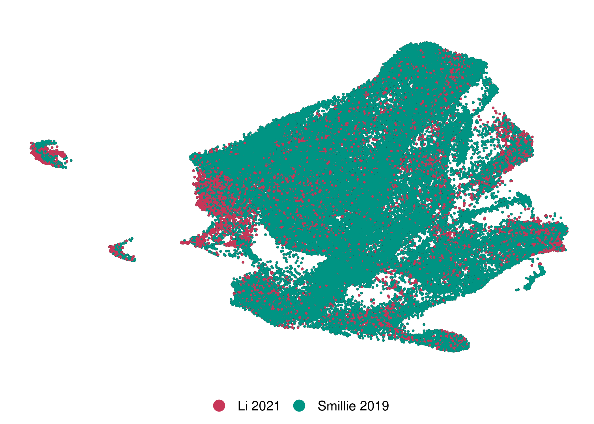

Integrated Datasets (Li 2021, Smillie 2019)
================

``` r
library(Seurat)
library(SCpubr)
library(scCustomize)
library(harmony)
library(Matrix)
library(tidyverse)
library(data.table)
```

# Li 2021

Reading in Data

``` r
HD_1 <- Read10X("../../data_raw/Li2021/id6C/")
HD_2 <- Read10X("../../data_raw/Li2021/id7C/")
HD_3 <- Read10X("../../data_raw/Li2021/id8C/")
HD_4 <- Read10X("../../data_raw/Li2021/id9C/")

UC_1 <- Read10X("../../data_raw/Li2021/id1T/")
UC_2 <- Read10X("../../data_raw/Li2021/id2T/")
UC_3 <- Read10X("../../data_raw/Li2021/id3T/")
UC_4 <- Read10X("../../data_raw/Li2021/id4T/")
UC_5 <- Read10X("../../data_raw/Li2021/id5T/")

HD_1 <- CreateSeuratObject(HD_1, project = "HD_1")
HD_2 <- CreateSeuratObject(HD_2, project = "HD_2")
HD_3 <- CreateSeuratObject(HD_3, project = "HD_3")
HD_4 <- CreateSeuratObject(HD_4, project = "HD_4")

UC_1 <- CreateSeuratObject(UC_1, project = "UC_1")
UC_2 <- CreateSeuratObject(UC_3, project = "UC_2")
UC_3 <- CreateSeuratObject(UC_4, project = "UC_3")
UC_4 <- CreateSeuratObject(UC_5, project = "UC_4")
UC_5 <- CreateSeuratObject(UC_5, project = "UC_5")

data_li_raw <- merge(
  HD_1, y = mget(c(paste0("HD_", 2:4), paste0("UC_", 1:5))),
  add.cell.ids = c(paste0("HD_", 1:4), paste0("UC_", 1:5))
  )

rm(list=c(paste0("HD_", 1:4), paste0("UC_", 1:5)))
```

``` r
data_li_raw <- JoinLayers(data_li_raw)
data_li_raw <- SetIdent(data_li_raw, value="all")
```

## Meta Data

``` r
data_li_raw@meta.data <- data_li_raw@meta.data %>%
  separate(orig.ident, into = c("disease", "ID"), sep = "_") %>%
  unite(diseaseID ,disease, ID, sep = "", remove = F)
```

## QC

``` r
data_li_raw[["percent.mt"]] <- PercentageFeatureSet(data_li_raw, pattern = "^MT-")

VlnPlot(data_li_raw, pt.size=0, ncol = 3,
        features = c("nFeature_RNA", "nCount_RNA", "percent.mt"))&NoLegend()
```

<!-- -->

## Subset high quality cells

``` r
data_li <- subset(data_li_raw, subset = nFeature_RNA > 200 & nFeature_RNA < 4000 & 
                nCount_RNA < 30000 & percent.mt < 50)
```

## Remove Genes for Clustering

``` r
non.mt.genes <- rownames(data_li[["RNA"]]$counts[grep("^(MT-)",
                    rownames(data_li[["RNA"]]$counts), invert = T),])

non.ribo.genes <- rownames(data_li[["RNA"]]$counts[grep("^(RPL\\d|RPS\\d|RP\\d|IGH|IGL|IGK)", rownames(data_li[["RNA"]]$counts), invert = T),])

data_li <- subset(data_li, features = non.mt.genes)
data_li <- subset(data_li, features = non.ribo.genes)

rm(list=c("non.mt.genes", "non.ribo.genes"))
```

## Clustering

``` r
data_li <- data_li%>%SCTransform()%>%RunPCA()%>%
  FindNeighbors(dims=1:30)%>%FindClusters()%>%RunUMAP(dims=1:30)
```

    ## Modularity Optimizer version 1.3.0 by Ludo Waltman and Nees Jan van Eck
    ## 
    ## Number of nodes: 44940
    ## Number of edges: 1594030
    ## 
    ## Running Louvain algorithm...
    ## Maximum modularity in 10 random starts: 0.9290
    ## Number of communities: 30
    ## Elapsed time: 4 seconds

    ## Warning: The default method for RunUMAP has changed from calling Python UMAP via reticulate to the R-native UWOT using the cosine metric
    ## To use Python UMAP via reticulate, set umap.method to 'umap-learn' and metric to 'correlation'
    ## This message will be shown once per session

``` r
do_DimPlot(data_li, group.by = "seurat_clusters", label=T)&NoLegend()
```

<!-- -->

``` r
FeaturePlot_scCustom(data_li, features = c("EPCAM", "PTPRC", "CD3E", "TRDC"))&
  NoLegend()&NoAxes()
```

<!-- -->

## Subsetting EPCAM+ & gd Tcells

``` r
ep_li <- subset(data_li, subset=seurat_clusters %in% c(
  "3", "6", "11", "12", "14", "22", "29")
  )

gd_li <- subset(data_li, subset=TRDC>0 & seurat_clusters %in% c(
  "1", "2", "4", "7", "17", "19", "21")
  )
```

``` r
rm(list=c("data_li_raw", "data_li"))
```

# Smillie 2019

## Reading in Data

``` r
# Meta df
meta <- fread("../../data_raw/Smillie2019/meta.data.txt")
meta <- meta[-1]

# Immune Cells
imm <- readMM("../../data_raw/Smillie2019/gene_sorted-Imm.matrix.mtx")
rownames(imm) <- readLines("../../data_raw/Smillie2019/Imm.genes.tsv")
colnames(imm) <- readLines("../../data_raw/Smillie2019/Imm.barcodes2.tsv")

imm <- CreateSeuratObject(imm)
```

    ## Warning: Feature names cannot have underscores ('_'), replacing with dashes
    ## ('-')

    ## Warning: Data is of class dgTMatrix. Coercing to dgCMatrix.

``` r
imm@meta.data <- imm@meta.data%>%
  rownames_to_column("NAME")%>%
  left_join(meta, by="NAME")%>%
  column_to_rownames("NAME")

# Epithelial Cells
ep_sm <- readMM("../../data_raw/Smillie2019/gene_sorted-Epi.matrix.mtx")
rownames(ep_sm) <- readLines("../../data_raw/Smillie2019/Epi.genes.tsv")
colnames(ep_sm) <- readLines("../../data_raw/Smillie2019/Epi.barcodes2.tsv")

ep_sm <- CreateSeuratObject(ep_sm)
```

    ## Warning: Feature names cannot have underscores ('_'), replacing with dashes
    ## ('-')
    ## Warning: Data is of class dgTMatrix. Coercing to dgCMatrix.

``` r
ep_sm@meta.data <- ep_sm@meta.data%>%
  rownames_to_column("NAME")%>%
  left_join(meta, by="NAME")%>%
  column_to_rownames("NAME")

rm("meta")
```

## QC & Processing

``` r
#Epithelial Cells
ep_sm[["percent.mt"]] <- PercentageFeatureSet(ep_sm, pattern = "^MT-")

VlnPlot(ep_sm, features = c("nFeature_RNA", "nCount_RNA", "percent.mt"),
              ncol = 3, pt.size = 0)&NoLegend()
```

    ## Rasterizing points since number of points exceeds 100,000.
    ## To disable this behavior set `raster=FALSE`
    ## Rasterizing points since number of points exceeds 100,000.
    ## To disable this behavior set `raster=FALSE`
    ## Rasterizing points since number of points exceeds 100,000.
    ## To disable this behavior set `raster=FALSE`

<!-- -->

``` r
ep_sm <- subset(ep_sm, subset = nFeature_RNA > 200 & nFeature_RNA < 5000 & 
               nCount_RNA < 30000 & percent.mt < 50)
```

``` r
# Immune Cells
imm[["percent.mt"]] <- PercentageFeatureSet(imm, pattern = "^MT-")

VlnPlot(imm, features = c("nFeature_RNA", "nCount_RNA", "percent.mt"),
              ncol = 3, pt.size = 0)&NoLegend()
```

    ## Rasterizing points since number of points exceeds 100,000.
    ## To disable this behavior set `raster=FALSE`
    ## Rasterizing points since number of points exceeds 100,000.
    ## To disable this behavior set `raster=FALSE`
    ## Rasterizing points since number of points exceeds 100,000.
    ## To disable this behavior set `raster=FALSE`

<!-- -->

``` r
imm <- subset(imm, subset = nFeature_RNA > 200 & nFeature_RNA < 3000 & 
               nCount_RNA < 25000 & percent.mt < 15)
```

``` r
imm <- imm%>%SCTransform(conserve.memory=T)%>%RunPCA()%>%
  FindNeighbors(dims=1:30)%>%FindClusters(resolution =1.5)%>%RunUMAP(dims=1:30)
```

    ##   |                                                                              |                                                                      |   0%  |                                                                              |======                                                                |   8%  |                                                                              |============                                                          |  17%  |                                                                              |==================                                                    |  25%  |                                                                              |=======================                                               |  33%  |                                                                              |=============================                                         |  42%  |                                                                              |===================================                                   |  50%  |                                                                              |=========================================                             |  58%  |                                                                              |===============================================                       |  67%  |                                                                              |====================================================                  |  75%  |                                                                              |==========================================================            |  83%  |                                                                              |================================================================      |  92%  |                                                                              |======================================================================| 100%
    ## Modularity Optimizer version 1.3.0 by Ludo Waltman and Nees Jan van Eck
    ## 
    ## Number of nodes: 204918
    ## Number of edges: 6768474
    ## 
    ## Running Louvain algorithm...
    ## Maximum modularity in 10 random starts: 0.9222
    ## Number of communities: 77
    ## Elapsed time: 67 seconds

``` r
do_DimPlot(imm, group.by="seurat_clusters", label=T, pt.size=.1)&NoLegend()
```

<!-- -->

``` r
FeaturePlot_scCustom(imm, features=c("CD3E", "TRDC"))&NoAxes()&NoLegend()
```

<!-- -->

``` r
gd_sm <- subset(imm, subset=TRDC>0 & seurat_clusters %in% c(
 "0", "1", "3", "4", "6", "9", "16", "24","25", "28", "30", "34", "38", "41", "53"
))
```

``` r
rm("imm")
```

# Combining and Integrating Datasets

## gd T cells

``` r
# changing meta data column names to match between both datasets

gd_li@meta.data <- gd_li@meta.data%>%
  mutate(cohort="Li2021")

gd_sm@meta.data <- gd_sm@meta.data%>%
  rename(disease=Health, ID=Subject)%>%
  mutate(disease=case_when(
    disease=="Healthy" ~ "HD",
    disease=="Inflamed" ~ "UC",
    disease=="Non-inflamed" ~ "SC"
    ),
    cohort="Smillie2019")%>%
  unite(diseaseID, disease, ID, sep="", remove=F)

gd_sm <- subset(gd_sm, subset=disease!="SC")
```

### Integtration

``` r
gd_li@assays$SCT <- NULL
DefaultAssay(gd_li) <- "RNA"
gd_sm@assays$SCT <- NULL
DefaultAssay(gd_sm) <- "RNA"


# Only use genes that appear in both datasets
genes <- intersect(rownames(gd_li), rownames(gd_sm))

# Merge
gd <- merge(gd_li[genes,], gd_sm[genes,])%>%JoinLayers()

rm(list=c("genes", "gd_li", "gd_sm"))
```

``` r
# Downsample to max. 100 cells/donor
gd <- SetIdent(gd, value="diseaseID")
gd <- subset(gd, downsample=100)
```

``` r
gd <- gd%>%SCTransform()%>%RunPCA()%>%RunUMAP(dims=1:30)
```

``` r
do_DimPlot(gd, group.by = "cohort")
```

<!-- -->

``` r
# Integration
gd <- RunHarmony(gd, "cohort")
```

``` r
ElbowPlot(gd, 50, reduction = "harmony")
```

<!-- -->

``` r
gd <- gd%>%FindNeighbors(reduction="harmony", dims=1:30)%>%
  FindClusters()%>%
  RunUMAP(reduction = "harmony", dims=1:30)
```

    ## Modularity Optimizer version 1.3.0 by Ludo Waltman and Nees Jan van Eck
    ## 
    ## Number of nodes: 2576
    ## Number of edges: 108498
    ## 
    ## Running Louvain algorithm...
    ## Maximum modularity in 10 random starts: 0.7783
    ## Number of communities: 12
    ## Elapsed time: 0 seconds

``` r
gd@meta.data <- gd@meta.data%>%
  mutate(cluster=paste0("C", seurat_clusters))
```

``` r
do_DimPlot(gd, group.by="cohort")
```

<!-- -->

### Module Scores

``` r
TRM_genes <- scan("genesets/TRM.txt", character(), quote = "")

gd <- AddModuleScore(gd, features = list(TRM_genes),
                     name = "TRM")
```

    ## Warning: The following features are not present in the object: CTTNBP2, SNAP91,
    ## LILRP2, WASH5P, GSG2, KRT85, NR5A2, LOC100507039, L1CAM, DBH-AS1, GPR25, IL21,
    ## DBH, C18orf1, RMRP, LOC100128420, PPP1R2P9, LOC100507525, LOC401431, C5orf62,
    ## TDRD9, ETV1, DAB2IP, VSTM2L, RPPH1, C17orf46, RNU4-2, LZTS1, AIM1L, RNU2-2,
    ## CALY, KCNQ3, DDIT4L, EFCAB4A, ILDR2, RN7SK, TPPP, SOAT2, RN7SL2, CCDC89, HLF,
    ## MIR663, AMICA1, RN7SL1, ADC, OTOF, LOC619207, LOC100506860, GLI1, NCS1, PTPN13,
    ## MAMLD1, MEGF6, KIAA0284, LOC100506985, FBXO10, BUB1B, CH25H, LOC100128242,
    ## C13orf15, FAM134B, GPSM1, LOC646329, GLT25D2, SLC7A5P1, not searching for
    ## symbol synonyms

``` r
cytokine_genes <- scan("genesets/cytokine.txt", character(),quote = "")
cytotoxic_genes <- scan("genesets/cytotoxic.txt", character(),quote = "")

cytokine_cytotoxic_genes <- c(cytokine_genes, cytotoxic_genes)
cytokine_cytotoxic_genes <- unique(cytokine_cytotoxic_genes)

gd <- AddModuleScore(gd, features=list(cytokine_cytotoxic_genes), name="cyto")
```

    ## Warning: The following features are not present in the object: CCL3L3, TIMD4,
    ## NCS1, RCAN2, IL9, PLA2G16, ADGRG1, not searching for symbol synonyms

``` r
Vg4Vd1 <- read.csv("genesets/Vg4Vd1_vs_all.csv")%>%
  filter(!gene %in% c("TRGV4", "TRDV1"))
Vg4Vd1 <- Vg4Vd1$gene

gd <- AddModuleScore(gd, features = list(Vg4Vd1),
                     name="Vg4Vd1_")
```

    ## Warning: The following features are not present in the object: TRDJ1, TRGJ1,
    ## FTLP3, YBX1P1, ENSG00000267364, YBX1P2, YBX1P10, PRR13P5, TENT5C, not searching
    ## for symbol synonyms

``` r
Vg9Vd2 <- read.csv("genesets/Vg9Vd2_vs_all.csv")%>%
  filter(!gene %in% c("TRGV9", "TRDV2"))
Vg9Vd2 <- Vg9Vd2$gene

gd <- AddModuleScore(gd, features = list(Vg9Vd2),
                     name="Vg9Vd2_")
```

    ## Warning: The following features are not present in the object: HLA-U,
    ## ENSG00000283041, ENSG00000289474, EEF1A1P5, VSIR, ENSG00000293050, LINC02084,
    ## EEF1B2P3, HLA-W, TRDJ3, RPLP0P6, ENSG00000227615, RLIG1, ZZZ3, TRDJ4, RPSA2,
    ## TRAJ39, HNRNPA1P7, HLA-J, not searching for symbol synonyms

``` r
stem_like_genes <- fread("genesets/CD8_StemLike_Markers.csv")%>%
  pull(gene)

gd <- AddModuleScore(gd, features = list(stem_like_genes),name="StemLike")
```

    ## Warning: The following features are not present in the object: RP5-1028K7.2,
    ## TMEM155, NGFRAP1, ASCL1, TIMD4, ATP9A, BTNL9, PMCH, C16orf45, RP11-279F6.3,
    ## PTK7, RP11-555F9.2, PTPN3, RP11-1399P15.1, CHGB, FAAH2, AC068196.1, PACSIN1,
    ## C1orf228, FAIM3, TACSTD2, FXYD6, RGS4, TSHR, EPYC, RP11-222K16.2, MOXD1,
    ## AC074289.1, FNDC9, ZNF704, AGAP1, GDF10, KB-1507C5.2, ATP8A2, F5, ETV1, NOD2,
    ## LHFP, CCDC64, LPL, PRSS1, C14orf64, SELP, RP11-242J7.1, GTSF1L, NPBWR1, NBPF15,
    ## RP4-728D4.2, NUDT10, BCAT1, ELOVL4, AC097713.4, ANKS1B, FLT1, ADORA2B, PTPN13,
    ## RP11-265P11.2, RP11-620J15.3, DIRAS3, LIMS2, PLEKHA7, MT3, ENOX1, RP11-539I5.1,
    ## AP001055.6, CLIP3, RP11-655C2.3, PPAP2C, KCNK1, AD000671.6, DIRAS2, DFNB31,
    ## AC011893.3, AC011841.1, FAM201A, AF131217.1, CDK14, APBB2, CTD-2020K17.1,
    ## BARX2, NR5A2, MYH10, RP11-455F5.5, HSF5, LRRC16B, EVI5, KIAA1644, DAB1,
    ## RP11-145M9.4, TTC24, AC069363.1, MDS2, FAM110B, EBI3, DGCR5, FAM92A1,
    ## RP11-61O1.2, FAM159A, C17orf96, GLDC, CAPN3, RP1-15D23.2, PON3, PSMD5-AS1,
    ## CTHRC1, SSTR3, ADRBK2, NLGN4Y, C12orf79, RP11-73M14.1, AKR1C1, FAM78B,
    ## RP11-371A19.2, MERTK, PHEX, JAM2, RP11-796G6.2, LDOC1L, WBP5, RP11-431M7.3,
    ## CD80, FAM65B, PHKA1, ZACN, SHC4, GPR128, OGN, CTA-293F17.1, STAC, KB-173C10.2,
    ## DOK5, FBXO27, SLC28A3, RP11-18H21.1, KIAA0391, BTBD11, CYP7B1, RP11-215G15.5,
    ## FAM153A, AP000476.1, RP11-223C24.1, LIPC, ESPL1, MCTP1, MAPT, SCIMP, LMCD1,
    ## RBM11, CXXC11, FAM115A, LINC00925, ZNF415, THNSL2, UBXN10-AS1, AC093609.1,
    ## TMEM178B, FAIM2, ANKRD18A, FAM84B, NIPAL4, LCN10, AC006460.2, ESR1, RGS6,
    ## AKAP2, RP3-400N23.6, AC010226.4, TNS4, STXBP1, RP11-348F1.3, KB-173C10.1,
    ## FLVCR2, ZNF69, MIR146A, IL21-AS1, AC074366.3, TLN2, LINC00158, NCAPG, L1CAM,
    ## RP11-91I20.4, FAM115C, PLGLB2, MKL2, IKZF4, TBC1D8, TTTY15, RP11-426C22.5,
    ## PNPLA7, RP11-11N9.4, RP11-117D22.2, LAMP3, RP11-493L12.5, KCNH3, MTMR8,
    ## RP11-284N8.3, CTC-228N24.3, TMCC2, RP11-486L19.2, RP11-229C3.2, RP11-275I4.2,
    ## IL10RB-AS1, ST6GALNAC3, CYP4F35P, DBNDD1, CTD-2336O2.1, NEIL3, TMEM55A, WHSC1,
    ## IGJ, RP6-109B7.3, AC009784.3, PLS3, C3orf52, RP11-218M22.1, FBXO10, PCNXL2,
    ## RP11-732M18.3, OR2A1-AS1, KDM7A, ADAMTS4, RP11-15A1.3, ANKRD22, DDX26B, C9orf3,
    ## TIGD4, AC006129.1, CRYBG3, TMEM232, RP5-1043L13.1, LGR6, ST20, TUBB4A, LGALS9C,
    ## E2F2, RP5-1007M22.2, CTD-3096M3.1, not searching for symbol synonyms

``` r
rm(list=c("cytokine_genes", "cytotoxic_genes","cytokine_cytotoxic_genes",
          "TRM_genes", "Vg9Vd2", "Vg4Vd1", "stem_like_genes")
   )
```

## EPCAM+ Cells

``` r
# Change meta data column names to match between datasets
ep_li@meta.data <- ep_li@meta.data%>%
  mutate(cohort="Li 2021")

ep_sm@meta.data <- ep_sm@meta.data%>%
  rename(disease=Health, ID=Subject)%>%
  mutate(disease=case_when(
    disease=="Healthy" ~ "HD",
    disease=="Inflamed" ~ "UC",
    disease=="Non-inflamed" ~ "SC"
    ),
    cohort="Smillie 2019")%>%
  unite(diseaseID, disease, ID, sep="", remove=F)

ep_sm <- subset(ep_sm, subset=disease!="SC")
```

### Integration

``` r
ep_li@assays$SCT <- NULL
DefaultAssay(ep_li) <- "RNA"

# Only use genes that appear in both datasets
genes <- intersect(rownames(ep_li), rownames(ep_sm))

ep <- merge(ep_li[genes,], ep_sm[genes,])%>%JoinLayers()

rm(list=c("genes", "ep_li", "ep_sm"))
```

``` r
ep <- ep%>%SCTransform()%>%RunPCA()%>%RunUMAP(dims=1:30)
```

``` r
do_DimPlot(ep, group.by="cohort", pt.size=.2)
```

<!-- -->

``` r
# Integration
ep <- RunHarmony(ep, "cohort")
```

``` r
ElbowPlot(ep, reduction = "harmony", 50)
```

<!-- -->

``` r
ep <- ep%>%FindNeighbors(reduction="harmony", dims=1:40)%>%
  FindClusters()%>%RunUMAP(reduction="harmony", dims=1:40)
```

    ## Modularity Optimizer version 1.3.0 by Ludo Waltman and Nees Jan van Eck
    ## 
    ## Number of nodes: 73701
    ## Number of edges: 2561159
    ## 
    ## Running Louvain algorithm...
    ## Maximum modularity in 10 random starts: 0.9077
    ## Number of communities: 33
    ## Elapsed time: 11 seconds

``` r
do_DimPlot(ep, group.by="cohort", pt.size=.2)
```

<!-- -->

``` r
do_DimPlot(ep, group.by="disease", pt.size=.2)
```

<!-- -->

``` r
# Cell Numbers of CellTypes Per Cluster (annotation derived from
# Smillie datasets) to perform label transfer (enterocytes)

ep@meta.data <- ep@meta.data%>%
  mutate(enterocytes=case_when(
    Cluster %in% c("Best4+ Enterocytes", "Enterocyte Progenitors", "Enterocytes",
                   "Immature Enterocytes 1", "Immature Enterocytes 2") ~ "enterocytes",
    is.na(Cluster) ~ "Li21",
    .default = "other"
  ))

ep@meta.data%>%ggplot(aes(x=seurat_clusters, fill=enterocytes))+
  geom_bar(position = "fill")+
  theme_classic()
```

<!-- -->

``` r
# Subsetting Enterocytes based on Clusters and downsampling
entero <- subset(ep, subset = seurat_clusters %in% c(
  "0", "6", "9", "10", "13", "16", "18"))
```

``` r
summary(as.factor(entero@meta.data$diseaseID))
```

    ##    HD1    HD2    HD3    HD4  HDN10  HDN11  HDN13  HDN15  HDN16  HDN17  HDN18 
    ##    335    452    805    814   1709   2049    280   1864   1027   1063    905 
    ##  HDN20  HDN21  HDN46  HDN51   HDN8    UC1    UC2    UC3    UC4    UC5 UCN106 
    ##    557   2364    376   1952    289    112     60    174    186    186     60 
    ## UCN110 UCN111  UCN14  UCN19  UCN23  UCN24  UCN26  UCN44  UCN49  UCN50  UCN52 
    ##    119    222    238    334    582    608    955    125     22      3     19 
    ## UCN539  UCN58   UCN7   UCN9 
    ##     28    276     59    193

``` r
entero <- SetIdent(entero, value="diseaseID")
entero <- subset(entero, downsample=500)
```

``` r
entero <- entero%>%SCTransform()%>%RunPCA()%>%RunHarmony("cohort")
```

    ## Warning: Different cells and/or features from existing assay SCT

``` r
ElbowPlot(entero, reduction="harmony", 50)
```

<!-- -->

``` r
entero <- entero%>%FindNeighbors(reduction="harmony",dims=1:30)%>%
  FindClusters()%>%RunUMAP(reduction="harmony", dims=1:30)
```

    ## Modularity Optimizer version 1.3.0 by Ludo Waltman and Nees Jan van Eck
    ## 
    ## Number of nodes: 11148
    ## Number of edges: 399732
    ## 
    ## Running Louvain algorithm...
    ## Maximum modularity in 10 random starts: 0.8576
    ## Number of communities: 17
    ## Elapsed time: 0 seconds

``` r
do_DimPlot(entero, group.by="disease")
```

<!-- -->

``` r
do_DimPlot(entero, group.by="cohort")
```

<!-- -->

# Save Seurat Object as Rds files

``` r
# # remove uninteresting meta data columns
# entero@meta.data <- entero@meta.data%>%select(
#   -RNA_snn_res.0.8, -orig.ident, -Cluster, -nGene, -nUMI, -Location, -Sample)
# 
# gd@meta.data <- gd@meta.data%>%select(
#   -RNA_snn_res.0.8, -RNA_snn_res.0.25, -RNA_snn_res.1.5, -orig.ident, -Cluster,
#   -nGene, -nUMI, -Location, -Sample)%>%
#   head()
```

``` r
saveRDS(gd, "../../data_processed/Li21_Smillie19_integrated_gdTcells.Rds")
saveRDS(entero, "../../data_processed/Li21_Smillie19_integrated_enterocytes.Rds")
```

# Session Info

``` r
# utils:::print.sessionInfo(sessionInfo()[-10]) 
sessionInfo()
```

    ## R version 4.4.0 (2024-04-24)
    ## Platform: x86_64-pc-linux-gnu
    ## Running under: Ubuntu 22.04.4 LTS
    ## 
    ## Matrix products: default
    ## BLAS:   /usr/lib/x86_64-linux-gnu/blas/libblas.so.3.10.0 
    ## LAPACK: /usr/lib/x86_64-linux-gnu/lapack/liblapack.so.3.10.0
    ## 
    ## locale:
    ##  [1] LC_CTYPE=en_US.UTF-8       LC_NUMERIC=C              
    ##  [3] LC_TIME=de_DE.UTF-8        LC_COLLATE=en_US.UTF-8    
    ##  [5] LC_MONETARY=de_DE.UTF-8    LC_MESSAGES=en_US.UTF-8   
    ##  [7] LC_PAPER=de_DE.UTF-8       LC_NAME=C                 
    ##  [9] LC_ADDRESS=C               LC_TELEPHONE=C            
    ## [11] LC_MEASUREMENT=de_DE.UTF-8 LC_IDENTIFICATION=C       
    ## 
    ## time zone: Europe/Berlin
    ## tzcode source: system (glibc)
    ## 
    ## attached base packages:
    ## [1] stats     graphics  grDevices utils     datasets  methods   base     
    ## 
    ## other attached packages:
    ##  [1] data.table_1.15.4  lubridate_1.9.3    forcats_1.0.0      stringr_1.5.1     
    ##  [5] dplyr_1.1.4        purrr_1.0.2        readr_2.1.5        tidyr_1.3.1       
    ##  [9] tibble_3.2.1       ggplot2_3.5.1      tidyverse_2.0.0    Matrix_1.6-5      
    ## [13] harmony_1.2.0      Rcpp_1.0.12        scCustomize_2.1.2  SCpubr_2.0.2      
    ## [17] Seurat_5.1.0       SeuratObject_5.0.2 sp_2.1-4          
    ## 
    ## loaded via a namespace (and not attached):
    ##   [1] RColorBrewer_1.1-3     rstudioapi_0.16.0      jsonlite_1.8.8        
    ##   [4] shape_1.4.6.1          magrittr_2.0.3         spatstat.utils_3.0-4  
    ##   [7] ggbeeswarm_0.7.2       rmarkdown_2.27         GlobalOptions_0.1.2   
    ##  [10] vctrs_0.6.5            ROCR_1.0-11            spatstat.explore_3.2-7
    ##  [13] paletteer_1.6.0        janitor_2.2.0          htmltools_0.5.8.1     
    ##  [16] sctransform_0.4.1      parallelly_1.37.1      KernSmooth_2.23-24    
    ##  [19] htmlwidgets_1.6.4      ica_1.0-3              plyr_1.8.9            
    ##  [22] plotly_4.10.4          zoo_1.8-12             igraph_2.0.3          
    ##  [25] mime_0.12              lifecycle_1.0.4        pkgconfig_2.0.3       
    ##  [28] R6_2.5.1               fastmap_1.2.0          snakecase_0.11.1      
    ##  [31] fitdistrplus_1.1-11    future_1.33.2          shiny_1.8.1.1         
    ##  [34] digest_0.6.35          colorspace_2.1-0       rematch2_2.1.2        
    ##  [37] patchwork_1.2.0        tensor_1.5             RSpectra_0.16-1       
    ##  [40] irlba_2.3.5.1          progressr_0.14.0       timechange_0.3.0      
    ##  [43] fansi_1.0.6            spatstat.sparse_3.0-3  httr_1.4.7            
    ##  [46] polyclip_1.10-6        abind_1.4-5            compiler_4.4.0        
    ##  [49] withr_3.0.0            fastDummies_1.7.3      MASS_7.3-60           
    ##  [52] tools_4.4.0            vipor_0.4.7            lmtest_0.9-40         
    ##  [55] beeswarm_0.4.0         httpuv_1.6.15          future.apply_1.11.2   
    ##  [58] goftest_1.2-3          glue_1.7.0             nlme_3.1-165          
    ##  [61] promises_1.3.0         grid_4.4.0             Rtsne_0.17            
    ##  [64] cluster_2.1.6          reshape2_1.4.4         generics_0.1.3        
    ##  [67] gtable_0.3.5           spatstat.data_3.0-4    tzdb_0.4.0            
    ##  [70] hms_1.1.3              utf8_1.2.4             spatstat.geom_3.2-9   
    ##  [73] RcppAnnoy_0.0.22       ggrepel_0.9.5          RANN_2.6.1            
    ##  [76] pillar_1.9.0           spam_2.10-0            RcppHNSW_0.6.0        
    ##  [79] ggprism_1.0.5          later_1.3.2            circlize_0.4.16       
    ##  [82] splines_4.4.0          lattice_0.22-5         survival_3.7-0        
    ##  [85] deldir_2.0-4           tidyselect_1.2.1       miniUI_0.1.1.1        
    ##  [88] pbapply_1.7-2          knitr_1.46             gridExtra_2.3         
    ##  [91] scattermore_1.2        xfun_0.44              matrixStats_1.3.0     
    ##  [94] stringi_1.8.4          lazyeval_0.2.2         yaml_2.3.8            
    ##  [97] evaluate_0.23          codetools_0.2-19       cli_3.6.2             
    ## [100] uwot_0.2.2             xtable_1.8-4           reticulate_1.37.0     
    ## [103] munsell_0.5.1          globals_0.16.3         spatstat.random_3.2-3 
    ## [106] png_0.1-8              ggrastr_1.0.2          parallel_4.4.0        
    ## [109] dotCall64_1.1-1        listenv_0.9.1          viridisLite_0.4.2     
    ## [112] scales_1.3.0           ggridges_0.5.6         leiden_0.4.3.1        
    ## [115] rlang_1.1.3            cowplot_1.1.3
