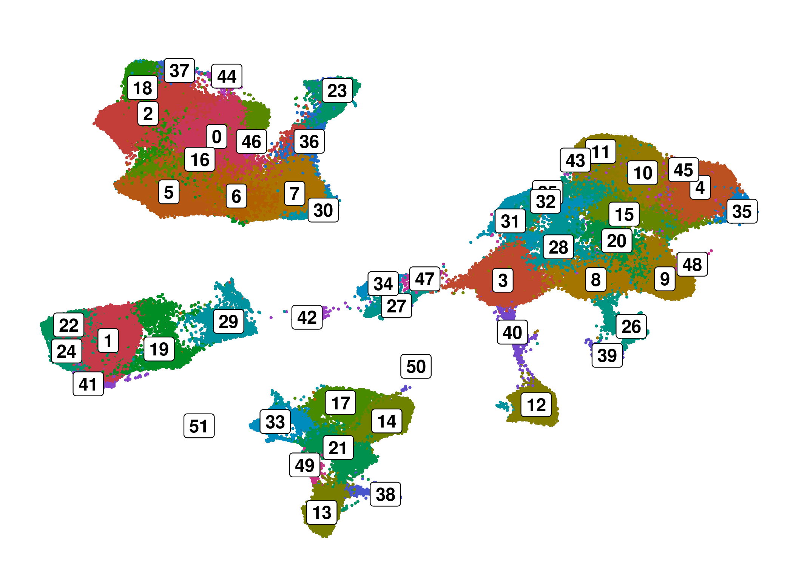

Integrated Datasets (Li 2021, Smillie 2019)
================

# Li 2021

Reading in Data

``` r
HD_1 <- Read10X("../../data_raw/Li2021/id6C/")
HD_2 <- Read10X("../../data_raw/Li2021/id7C/")
HD_3 <- Read10X("../../data_raw/Li2021/id8C/")
HD_4 <- Read10X("../../data_raw/Li2021/id9C/")

UC_1 <- Read10X("../../data_raw/Li2021/id1T/")
UC_2 <- Read10X("../../data_raw/Li2021/id2T/")
UC_3 <- Read10X("../../data_raw/Li2021/id3T/")
UC_4 <- Read10X("../../data_raw/Li2021/id4T/")
UC_5 <- Read10X("../../data_raw/Li2021/id5T/")

HD_1 <- CreateSeuratObject(HD_1, project = "HD_1")
HD_2 <- CreateSeuratObject(HD_2, project = "HD_2")
HD_3 <- CreateSeuratObject(HD_3, project = "HD_3")
HD_4 <- CreateSeuratObject(HD_4, project = "HD_4")

UC_1 <- CreateSeuratObject(UC_1, project = "UC_1")
UC_2 <- CreateSeuratObject(UC_3, project = "UC_2")
UC_3 <- CreateSeuratObject(UC_4, project = "UC_3")
UC_4 <- CreateSeuratObject(UC_5, project = "UC_4")
UC_5 <- CreateSeuratObject(UC_5, project = "UC_5")

data_li_raw <- merge(
  HD_1, y = mget(c(paste0("HD_", 2:4), paste0("UC_", 1:5))),
  add.cell.ids = c(paste0("HD_", 1:4), paste0("UC_", 1:5))
  )

rm(list=c(paste0("HD_", 1:4), paste0("UC_", 1:5)))
```

``` r
data_li_raw <- JoinLayers(data_li_raw)
data_li_raw <- SetIdent(data_li_raw, value="all")
```

## Meta Data

``` r
data_li_raw@meta.data <- data_li_raw@meta.data %>%
  separate(orig.ident, into = c("disease", "ID"), sep = "_") %>%
  unite(diseaseID ,disease, ID, sep = "", remove = F)
```

## QC

``` r
data_li_raw[["percent.mt"]] <- PercentageFeatureSet(data_li_raw, pattern = "^MT-")

VlnPlot(data_li_raw, pt.size=0, ncol = 3,
        features = c("nFeature_RNA", "nCount_RNA", "percent.mt"))&NoLegend()
```

<!-- -->

## Subset high quality cells

``` r
data_li <- subset(data_li_raw, subset = nFeature_RNA > 200 & nFeature_RNA < 4000 & 
                nCount_RNA < 30000 & percent.mt < 50)
```

## Remove Genes for Clustering

``` r
non.mt.genes <- rownames(data_li[["RNA"]]$counts[grep("^(MT-)",
                    rownames(data_li[["RNA"]]$counts), invert = T),])

non.ribo.genes <- rownames(data_li[["RNA"]]$counts[grep("^(RPL\\d|RPS\\d|RP\\d|IGH|IGL|IGK)", rownames(data_li[["RNA"]]$counts), invert = T),])

data_li <- subset(data_li, features = non.mt.genes)
data_li <- subset(data_li, features = non.ribo.genes)

rm(list=c("non.mt.genes", "non.ribo.genes"))
```

## Clustering

``` r
do_DimPlot(data_li, group.by = "seurat_clusters", label=T)&NoLegend()
```

<!-- -->

``` r
FeaturePlot_scCustom(data_li, features = c("EPCAM", "PTPRC", "CD3E", "TRDC"))&
  NoLegend()&NoAxes()
```

<!-- -->

## Subsetting EPCAM+ & gd Tcells

``` r
ep_li <- subset(data_li, subset=seurat_clusters %in% c(
  "0", "10", "15", "17", "18", "22", "26"
))

gd_li <- subset(data_li, subset=TRDC>1 & seurat_clusters %in% c(
  "3", "5", "7", "8", "9", "12", "14"
))
```

``` r
rm(list=c("data_li_raw", "data_li"))
```

# Smillie 2019

## Reading in Data

``` r
# Meta df
meta <- fread("../../data_raw/Smillie2019/meta.data.txt")
meta <- meta[-1]

# Immune Cells
imm <- readMM("../../data_raw/Smillie2019/gene_sorted-Imm.matrix.mtx")
rownames(imm) <- readLines("../../data_raw/Smillie2019/Imm.genes.tsv")
colnames(imm) <- readLines("../../data_raw/Smillie2019/Imm.barcodes2.tsv")

imm <- CreateSeuratObject(imm)
```

    ## Warning: Feature names cannot have underscores ('_'), replacing with dashes
    ## ('-')

    ## Warning: Data is of class dgTMatrix. Coercing to dgCMatrix.

``` r
imm@meta.data <- imm@meta.data%>%
  rownames_to_column("NAME")%>%
  left_join(meta, by="NAME")%>%
  column_to_rownames("NAME")

# Epithelial Cells
ep_sm <- readMM("../../data_raw/Smillie2019/gene_sorted-Epi.matrix.mtx")
rownames(ep_sm) <- readLines("../../data_raw/Smillie2019/Epi.genes.tsv")
colnames(ep_sm) <- readLines("../../data_raw/Smillie2019/Epi.barcodes2.tsv")

ep_sm <- CreateSeuratObject(ep_sm)
```

    ## Warning: Feature names cannot have underscores ('_'), replacing with dashes
    ## ('-')
    ## Warning: Data is of class dgTMatrix. Coercing to dgCMatrix.

``` r
ep_sm@meta.data <- ep_sm@meta.data%>%
  rownames_to_column("NAME")%>%
  left_join(meta, by="NAME")%>%
  column_to_rownames("NAME")

rm("meta")
```

## QC & Processing

``` r
#Epithelial Cells
ep_sm[["percent.mt"]] <- PercentageFeatureSet(ep_sm, pattern = "^MT-")

VlnPlot(ep_sm, features = c("nFeature_RNA", "nCount_RNA", "percent.mt"),
              ncol = 3, pt.size = 0)&NoLegend()
```

    ## Rasterizing points since number of points exceeds 100,000.
    ## To disable this behavior set `raster=FALSE`
    ## Rasterizing points since number of points exceeds 100,000.
    ## To disable this behavior set `raster=FALSE`
    ## Rasterizing points since number of points exceeds 100,000.
    ## To disable this behavior set `raster=FALSE`

<!-- -->

``` r
ep_sm <- subset(ep_sm, subset = nFeature_RNA > 200 & nFeature_RNA < 5000 & 
               nCount_RNA < 30000 & percent.mt < 50)
```

``` r
# Immune Cells
imm[["percent.mt"]] <- PercentageFeatureSet(imm, pattern = "^MT-")

VlnPlot(imm, features = c("nFeature_RNA", "nCount_RNA", "percent.mt"),
              ncol = 3, pt.size = 0)&NoLegend()
```

    ## Rasterizing points since number of points exceeds 100,000.
    ## To disable this behavior set `raster=FALSE`
    ## Rasterizing points since number of points exceeds 100,000.
    ## To disable this behavior set `raster=FALSE`
    ## Rasterizing points since number of points exceeds 100,000.
    ## To disable this behavior set `raster=FALSE`

<!-- -->

``` r
imm <- subset(imm, subset = nFeature_RNA > 200 & nFeature_RNA < 3000 & 
               nCount_RNA < 25000 & percent.mt < 15)
```

``` r
do_DimPlot(imm, group.by="seurat_clusters", label=T, pt.size=.1)&NoLegend()
```

<!-- -->

``` r
FeaturePlot_scCustom(imm, features=c("CD3E", "TRDC"))&NoAxes()&NoLegend()
```

<!-- -->

``` r
gd_sm <- subset(imm, subset=TRDC>1 & seurat_clusters %in% c(
  "2", "18", "37", "44", "23", "36", "0", "46", "16", "5", "6", "7", "30", "29"
))
```

``` r
rm("imm")
```

# Combining and Integrating Datasets

## gd T cells

``` r
# changing meta data column names to match between both datasets

gd_li@meta.data <- gd_li@meta.data%>%
  mutate(cohort="Li2021")

gd_sm@meta.data <- gd_sm@meta.data%>%
  rename(disease=Health, ID=Subject)%>%
  mutate(disease=case_when(
    disease=="Healthy" ~ "HD",
    disease=="Inflamed" ~ "UC",
    disease=="Non-inflamed" ~ "SC"
    ),
    cohort="Smillie2019")%>%
  unite(diseaseID, disease, ID, sep="", remove=F)

gd_sm <- subset(gd_sm, subset=disease!="SC")
```

``` r
# Downsample
gd_sm <- SetIdent(gd_sm, value="all")
gd_sm <- subset(gd_sm, downsample=844)
```

### Integtration

``` r
# Only use genes that appear in both datasets
genes <- intersect(rownames(gd_li), rownames(gd_sm))

# Merge
gd <- merge(gd_li[genes,], gd_sm[genes,])%>%JoinLayers()

rm(list=c("genes", "gd_li", "gd_sm"))
```

``` r
do_DimPlot(gd, group.by = "cohort")
```

<!-- -->

``` r
ElbowPlot(gd, 50, reduction = "harmony")
```

<!-- -->

``` r
gd@meta.data <- gd@meta.data%>%
  mutate(cluster=paste0("C", seurat_clusters))
```

``` r
do_DimPlot(gd, group.by = "cohort")
```

<!-- -->

### Module Scores

``` r
TRM_genes <- scan("genesets/TRM.txt", character(), quote = "")

gd <- AddModuleScore(gd, features = list(TRM_genes),
                     name = "TRM_signature")
```

    ## Warning: The following features are not present in the object: SNAP91, LILRP2,
    ## WASH5P, GSG2, KRT85, LOC100507039, GPR25, DBH, C18orf1, LOC100128420, PPP1R2P9,
    ## LOC100507525, LOC401431, C5orf62, RPPH1, C17orf46, RNU4-2, AIM1L, RNU2-2,
    ## EFCAB4A, RN7SK, SOAT2, RN7SL2, MIR663, AMICA1, RN7SL1, ADC, LOC619207,
    ## LOC100506860, KIAA0284, LOC100506985, LOC100128242, C13orf15, FAM134B,
    ## LOC646329, GLT25D2, SLC7A5P1, not searching for symbol synonyms

``` r
cytokine_genes <- scan("genesets/cytokine.txt", character(),
                       quote = "")
cytotoxic_genes <- scan("genesets/cytotoxic.txt", character(),
                        quote = "")

cytokine_cytotoxic_genes <- c(cytokine_genes, cytotoxic_genes)
cytokine_cytotoxic_genes <- base::unique(cytokine_cytotoxic_genes)

gd <- AddModuleScore(gd, features = list(cytokine_cytotoxic_genes), 
        name = "cytokine_cytotoxic_signature")
```

    ## Warning: The following features are not present in the object: CCL3L3, IL9,
    ## PLA2G16, ADGRG1, not searching for symbol synonyms

``` r
rm(list=c("cytokine_genes", "cytotoxic_genes",
          "cytokine_cytotoxic_genes", "TRM_genes"))
```

## EPCAM+ Cells

``` r
# Change meta data column names to match between datasets
ep_li@meta.data <- ep_li@meta.data%>%
  mutate(cohort="Chinese")

ep_sm@meta.data <- ep_sm@meta.data%>%
  rename(disease=Health, ID=Subject)%>%
  mutate(disease=case_when(
    disease=="Healthy" ~ "HD",
    disease=="Inflamed" ~ "UC",
    disease=="Non-inflamed" ~ "SC"
    ),
    cohort="US")%>%
  unite(diseaseID, disease, ID, sep="", remove=F)

ep_sm <- subset(ep_sm, subset=disease!="SC")
```

### Integration

``` r
# Only use genes that appear in both datasets
genes <- intersect(rownames(ep_li), rownames(ep_sm))

ep <- merge(ep_li[genes,], ep_sm[genes,])%>%JoinLayers()

rm(list=c("genes", "ep_li", "ep_sm"))
```

``` r
do_DimPlot(ep, group.by="cohort", pt.size=.2)
```

<!-- -->

``` r
ElbowPlot(ep, reduction = "harmony", 50)
```

<!-- -->

``` r
# Cell Numbers of CellTypes Per Cluster (annotation derived from
# Smillie datasets) to perform label transfer (enterocytes)
table(ep@meta.data$Cluster, ep@meta.data$seurat_clusters)
```

    ##                         
    ##                             0    1    2    3    4    5    6    7    8    9   10
    ##   Best4+ Enterocytes        9   10   18    8   29    4    0   18    3    2   49
    ##   Cycling TA                6    1    4  258  309 3412   37    0 1908  208  711
    ##   Enterocyte Progenitors 2268   85 1386  132  258    0    1  917    1  285   41
    ##   Enterocytes               3 1688    3    0    0    0    0   74    0    4    0
    ##   Enteroendocrine           6    1    8    9    9   15    0    0    2    0    4
    ##   Goblet                    0  211    0    7    0    0   53    8    0    0    1
    ##   Immature Enterocytes 1   38 3283  157  154    0    0    0   73    1   33    0
    ##   Immature Enterocytes 2  470  682  286   54  172    0    0 1986    0   63  201
    ##   Immature Goblet           1    0   17   27    0   16 2864    0    3    8   23
    ##   M cells                   4    1    0    0    3    4    0    1    0    2    0
    ##   Secretory TA             13    0    2    6   87  105   78    3    1    0  254
    ##   Stem                     32    0    0    5  657   11    0    0    9    6   59
    ##   TA 1                   3588   23 3359 2744  218   26  211  100 1299 1609  139
    ##   TA 2                    675    0  105  191 2561  167    0   37   67   50  888
    ##   Tuft                      2    4    4    2    4    0    0    2    5    0    0
    ##                         
    ##                            11   12   13   14   15   16   17   18   19   20   21
    ##   Best4+ Enterocytes     1432   16    1    6    8   28    1    0    1    0   13
    ##   Cycling TA               50  417   70  464   61    2  279    1  569    0    0
    ##   Enterocyte Progenitors   29    5    0   50   90   51   38    1    0    0    0
    ##   Enterocytes               2    0    0  102  124  259  313    0    0    0  230
    ##   Enteroendocrine           3   12    3    2    3    1    1    1    3    0    0
    ##   Goblet                    1    1  162    9    4   31   14  807    0    0    8
    ##   Immature Enterocytes 1    6    0    0   26   79  260   52    0    0    0   51
    ##   Immature Enterocytes 2    2    2    1  255  262  237   41    0    3    0  450
    ##   Immature Goblet           0  106 1296    4    1    1    4   35   15    1    3
    ##   M cells                   0    1    0  147    0    2    0    0    0    0    0
    ##   Secretory TA              6 1479  235   34   30    5   68    0   69    3    8
    ##   Stem                      7   11    0   94  128    1    5    0  136    1    0
    ##   TA 1                     46   54   20   82   59  163   91   12   36    6    0
    ##   TA 2                     30  189    0  519  518  180  136    0  210    0  149
    ##   Tuft                      0    1    0    0    0    0    0    0    1  545    0
    ##                         
    ##                            22   23   24   25   26   27   28   29   30
    ##   Best4+ Enterocytes        3    1    0    6    0    3    4    0    0
    ##   Cycling TA              252  103   75  261  135  127  197    1    0
    ##   Enterocyte Progenitors    3    3    2    4    2   16    0    0   28
    ##   Enterocytes               4   58    0   70    1    0    0    0    0
    ##   Enteroendocrine           2    0    3    1    1    2    2  199    0
    ##   Goblet                    0    2    7    5    0    0    0    0    0
    ##   Immature Enterocytes 1    1   34    1   38    1    0    0    0    0
    ##   Immature Enterocytes 2   84  151    1  135    2   35   10    0    2
    ##   Immature Goblet           0    0  271    1    1    1    0    0    1
    ##   M cells                   0    0    0    0    0    0    2    0    0
    ##   Secretory TA             10    8   68    7    2   10   17    2    0
    ##   Stem                      3   92    0    4    0   15   26    0    0
    ##   TA 1                    135   10  164   21  142   69   56    5   95
    ##   TA 2                    259  282    0  188   15  334  252    0    3
    ##   Tuft                      1    0    2    0    0    0    0    0    0

``` r
# Subsetting Enterocytes based on Clusters and downsampling
ep <- SetIdent(ep, value="diseaseID")

entero <- subset(ep, subset = seurat_clusters %in% c(
  "0", "1", "7", "11", "16", "17", "21", "25"), downsample=500)
```

``` r
ElbowPlot(entero, reduction="harmony", 50)
```

<!-- -->

``` r
do_DimPlot(entero, group.by="disease")
```

<!-- -->

# Save Seurat Object as Rds files

``` r
# remove uninteresting meta data columns
ep@meta.data <- ep@meta.data%>%select(
  -RNA_snn_res.0.8, -orig.ident, -Cluster, -nGene, -nUMI, -Location, -Sample)

gd@meta.data <- gd@meta.data%>%select(
  -RNA_snn_res.0.8, -RNA_snn_res.0.25, -RNA_snn_res.1.5, -orig.ident, -Cluster,
  -nGene, -nUMI, -Location, -Sample)%>%
  head()
```

``` r
saveRDS(gd, "../../data_processed/Li21_Smillie19_integrated_gdTcells.Rds")
saveRDS(entero, "../../data_processed/Li21_Smillie19_integrated_enterocytes.Rds")
```

# Session Info

``` r
# utils:::print.sessionInfo(sessionInfo()[-10]) 
sessionInfo()
```

    ## R version 4.4.0 (2024-04-24)
    ## Platform: x86_64-pc-linux-gnu
    ## Running under: Ubuntu 22.04.4 LTS
    ## 
    ## Matrix products: default
    ## BLAS:   /usr/lib/x86_64-linux-gnu/blas/libblas.so.3.10.0 
    ## LAPACK: /usr/lib/x86_64-linux-gnu/lapack/liblapack.so.3.10.0
    ## 
    ## locale:
    ##  [1] LC_CTYPE=en_US.UTF-8       LC_NUMERIC=C              
    ##  [3] LC_TIME=de_DE.UTF-8        LC_COLLATE=en_US.UTF-8    
    ##  [5] LC_MONETARY=de_DE.UTF-8    LC_MESSAGES=en_US.UTF-8   
    ##  [7] LC_PAPER=de_DE.UTF-8       LC_NAME=C                 
    ##  [9] LC_ADDRESS=C               LC_TELEPHONE=C            
    ## [11] LC_MEASUREMENT=de_DE.UTF-8 LC_IDENTIFICATION=C       
    ## 
    ## time zone: Europe/Berlin
    ## tzcode source: system (glibc)
    ## 
    ## attached base packages:
    ## [1] stats     graphics  grDevices utils     datasets  methods   base     
    ## 
    ## other attached packages:
    ##  [1] data.table_1.15.4  lubridate_1.9.3    forcats_1.0.0      stringr_1.5.1     
    ##  [5] dplyr_1.1.4        purrr_1.0.2        readr_2.1.5        tidyr_1.3.1       
    ##  [9] tibble_3.2.1       ggplot2_3.4.4      tidyverse_2.0.0    Matrix_1.6-5      
    ## [13] harmony_1.2.0      Rcpp_1.0.12        scCustomize_2.1.2  SCpubr_2.0.2      
    ## [17] Seurat_5.1.0       SeuratObject_5.0.2 sp_2.1-4          
    ## 
    ## loaded via a namespace (and not attached):
    ##   [1] RColorBrewer_1.1-3     rstudioapi_0.16.0      jsonlite_1.8.8        
    ##   [4] shape_1.4.6.1          magrittr_2.0.3         spatstat.utils_3.0-4  
    ##   [7] ggbeeswarm_0.7.2       rmarkdown_2.27         GlobalOptions_0.1.2   
    ##  [10] vctrs_0.6.5            ROCR_1.0-11            spatstat.explore_3.2-7
    ##  [13] paletteer_1.6.0        janitor_2.2.0          htmltools_0.5.8.1     
    ##  [16] sctransform_0.4.1      parallelly_1.37.1      KernSmooth_2.23-24    
    ##  [19] htmlwidgets_1.6.4      ica_1.0-3              plyr_1.8.9            
    ##  [22] plotly_4.10.4          zoo_1.8-12             igraph_2.0.3          
    ##  [25] mime_0.12              lifecycle_1.0.4        pkgconfig_2.0.3       
    ##  [28] R6_2.5.1               fastmap_1.2.0          snakecase_0.11.1      
    ##  [31] fitdistrplus_1.1-11    future_1.33.2          shiny_1.8.1.1         
    ##  [34] digest_0.6.35          colorspace_2.1-0       rematch2_2.1.2        
    ##  [37] patchwork_1.2.0        tensor_1.5             RSpectra_0.16-1       
    ##  [40] irlba_2.3.5.1          progressr_0.14.0       timechange_0.3.0      
    ##  [43] fansi_1.0.6            spatstat.sparse_3.0-3  httr_1.4.7            
    ##  [46] polyclip_1.10-6        abind_1.4-5            compiler_4.4.0        
    ##  [49] withr_3.0.0            fastDummies_1.7.3      MASS_7.3-60           
    ##  [52] tools_4.4.0            vipor_0.4.7            lmtest_0.9-40         
    ##  [55] beeswarm_0.4.0         httpuv_1.6.15          future.apply_1.11.2   
    ##  [58] goftest_1.2-3          glue_1.7.0             nlme_3.1-165          
    ##  [61] promises_1.3.0         grid_4.4.0             Rtsne_0.17            
    ##  [64] cluster_2.1.6          reshape2_1.4.4         generics_0.1.3        
    ##  [67] gtable_0.3.5           spatstat.data_3.0-4    tzdb_0.4.0            
    ##  [70] hms_1.1.3              utf8_1.2.4             spatstat.geom_3.2-9   
    ##  [73] RcppAnnoy_0.0.22       ggrepel_0.9.5          RANN_2.6.1            
    ##  [76] pillar_1.9.0           spam_2.10-0            RcppHNSW_0.6.0        
    ##  [79] ggprism_1.0.5          later_1.3.2            circlize_0.4.16       
    ##  [82] splines_4.4.0          lattice_0.22-5         survival_3.7-0        
    ##  [85] deldir_2.0-4           tidyselect_1.2.1       miniUI_0.1.1.1        
    ##  [88] pbapply_1.7-2          knitr_1.46             gridExtra_2.3         
    ##  [91] scattermore_1.2        xfun_0.44              matrixStats_1.3.0     
    ##  [94] stringi_1.8.4          lazyeval_0.2.2         yaml_2.3.8            
    ##  [97] evaluate_0.23          codetools_0.2-19       cli_3.6.2             
    ## [100] uwot_0.2.2             xtable_1.8-4           reticulate_1.37.0     
    ## [103] munsell_0.5.1          globals_0.16.3         spatstat.random_3.2-3 
    ## [106] png_0.1-8              ggrastr_1.0.2          parallel_4.4.0        
    ## [109] dotCall64_1.1-1        listenv_0.9.1          viridisLite_0.4.2     
    ## [112] scales_1.3.0           ggridges_0.5.6         leiden_0.4.3.1        
    ## [115] rlang_1.1.3            cowplot_1.1.3
