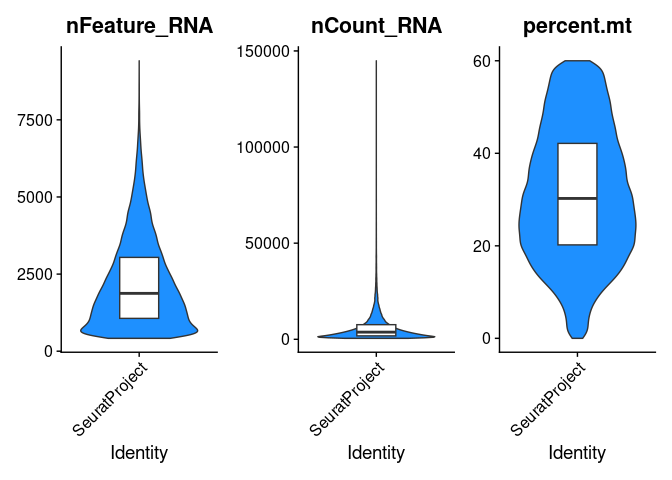

Thomas et al. 2024: Processing scRNA-seq Data
================

# Data

``` r
cd8 <- h5ad2seurat("../../data_raw/Thomas24/cd8tcells_final.h5ad")
ep <-  h5ad2seurat("../../data_raw/Thomas24/epicolonic_final.h5ad")
```

``` r
ep
```

    ## An object of class Seurat 
    ## 33075 features across 305862 samples within 1 assay 
    ## Active assay: RNA (33075 features, 0 variable features)
    ##  2 layers present: counts, data
    ##  3 dimensional reductions calculated: Xharmony_, Xpca_, Xumap_

``` r
cd8
```

    ## An object of class Seurat 
    ## 33075 features across 74840 samples within 1 assay 
    ## Active assay: RNA (33075 features, 0 variable features)
    ##  2 layers present: counts, data
    ##  3 dimensional reductions calculated: Xharmony_, Xpca_, Xumap_

# EpCAM/Enterocytes

``` r
table(ep$Disease,
      ep$Treatment)
```

    ##          
    ##            Post   Pre
    ##   CD      87788 55535
    ##   Healthy     0     0
    ##   UC      82730 62119

``` r
table(ep$Disease,
      ep$Remission_status)
```

    ##          
    ##           Non_Remission  None  Not_avail Remission
    ##   CD              34120      0         0    109203
    ##   Healthy             0  17690         0         0
    ##   UC              85613      0       926     58310

``` r
table(ep$minor)
```

    ## 
    ##  Non_ileal_BEST4_OTOP2          Non_ileal_EEC   Non_ileal_enterocyte 
    ##                  12555                   7646                 230153 
    ##       Non_ileal_goblet       Non_ileal_M_like       Non_ileal_paneth 
    ##                  15413                   2021                   1159 
    ## Non_ileal_stem_LGR5pos         Non_ileal_tuft 
    ##                  33568                   3347

``` r
ep@meta.data <- ep@meta.data%>%
  unite("resp_tp", Remission_status, Treatment, remove=F)%>%
  unite("resp_tp_infl", Remission_status, Treatment, Inflammation, remove=F)
```

``` r
table(ep$resp_tp,
      ep$Inflammation)
```

    ##                     
    ##                      Healthy Inflamed Non_Inflamed
    ##   Non_Remission_Post       0    29105        33668
    ##   Non_Remission_Pre        0    27991        28969
    ##   None _NA             17690        0            0
    ##   Not_avail_Pre            0      926            0
    ##   Remission_Post           0     1433       106312
    ##   Remission_Pre            0    32328        27440

``` r
table(ep$resp_tp_infl,
      ep$Disease)
```

    ##                                  
    ##                                      CD Healthy    UC
    ##   Non_Remission_Post_Inflamed         0       0 29105
    ##   Non_Remission_Post_Non_Inflamed 15867       0 17801
    ##   Non_Remission_Pre_Inflamed       1801       0 26190
    ##   Non_Remission_Pre_Non_Inflamed  16452       0 12517
    ##   None _NA_Healthy                    0   17690     0
    ##   Not_avail_Pre_Inflamed              0       0   926
    ##   Remission_Post_Inflamed          1433       0     0
    ##   Remission_Post_Non_Inflamed     70488       0 35824
    ##   Remission_Pre_Inflamed          19417       0 12911
    ##   Remission_Pre_Non_Inflamed      17865       0  9575

``` r
entero <- subset(
  ep,
  subset=Disease=="UC" &
    minor=="Non_ileal_enterocyte" &
    resp_tp_infl %in% c("Non_Remission_Post_Inflamed",
                        "Non_Remission_Pre_Inflamed",
                        "Remission_Post_Non_Inflamed",
                        "Remission_Pre_Inflamed")
               )

gc()
```

    ##              used    (Mb) gc trigger    (Mb)   max used    (Mb)
    ## Ncells    4180851   223.3    7287058   389.2    7287058   389.2
    ## Vcells 1840614511 14042.8 3488720360 26616.9 4357738549 33247.0

``` r
table(entero$resp_tp_infl,
      entero$Disease)
```

    ##                              
    ##                                  UC
    ##   Non_Remission_Post_Inflamed 20208
    ##   Non_Remission_Pre_Inflamed  19600
    ##   Remission_Post_Non_Inflamed 26546
    ##   Remission_Pre_Inflamed       8874

## QC

``` r
entero$percent.mt <- PercentageFeatureSet(entero, pattern="^MT-")
```

``` r
genes_to_remove <- grep(rownames(entero), pattern="^(RPL\\d|RPS\\d|MT-)")

entero <- subset(entero, features=rownames(entero)[-genes_to_remove])
```

``` r
VlnPlot_scCustom(entero,
                 features=c("nFeature_RNA", "nCount_RNA", "percent.mt"),
                 group.by="orig.ident",
                 pt.size=0)&
  geom_boxplot(width=.3, fill="white", outlier.shape=NA, coef=0)
```



``` r
entero <- subset(entero, subset=
                   nFeature_RNA>800 &
                   nCount_RNA<50000)
```

## Pseudo-Bulk

``` r
pb <- AggregateExpression(
  entero,
  group.by=c("Remission_status", "Treatment", "Patient"),
  return.seurat=T
)
```

``` r
table(pb$Remission_status,
      pb$Treatment)
```

    ##                
    ##                 Post Pre
    ##   Non-Remission   13  13
    ##   Remission        6   6

``` r
table(pb$Patient)
```

    ## 
    ##  UC1 UC10 UC11 UC12 UC13 UC14 UC15 UC16 UC17 UC18  UC2 UC20 UC22  UC3  UC4  UC5 
    ##    2    2    2    2    2    2    2    1    2    2    2    1    2    2    2    2 
    ##  UC6  UC7  UC8  UC9 
    ##    2    2    2    2

``` r
# Remove Patients without paired data
pb <- subset(pb, Patient %in% c("UC16", "UC20"), invert=T)
```

``` r
table(pb$Patient)
```

    ## 
    ##  UC1 UC10 UC11 UC12 UC13 UC14 UC15 UC17 UC18  UC2 UC22  UC3  UC4  UC5  UC6  UC7 
    ##    2    2    2    2    2    2    2    2    2    2    2    2    2    2    2    2 
    ##  UC8  UC9 
    ##    2    2

``` r
pb@meta.data <- pb@meta.data%>%
  unite("resp_tp", Remission_status, Treatment, remove=F)%>%
  mutate(resp_tp=factor(resp_tp, levels=c("Remission_Pre",
                                          "Remission_Post",
                                          "Non-Remission_Pre",
                                          "Non-Remission_Post")))
```

# gd T

``` r
gd <- subset(cd8, TRDC>0 & Disease %in% c("Healthy", "UC"))
```

``` r
gd@meta.data <- gd@meta.data%>%
  unite("tp_responder", Treatment, Remission_status, remove=F)%>%
  unite("tp_responder_inflammation", tp_responder, Inflammation,remove=F)
```

``` r
table(gd$tp_responder,
      gd$Inflammation)
```

    ##                     
    ##                      Healthy Inflamed Non_Inflamed
    ##   NA_None                376        0            0
    ##   Post_Non_Remission       0     1413          203
    ##   Post_Remission           0        0          427
    ##   Pre_Non_Remission        0      932          428
    ##   Pre_Not_avail            0      216            0
    ##   Pre_Remission            0      455          131

``` r
gd <- gd%>%
  subset(subset=tp_responder_inflammation %in% c(
    "Post_Non_Remission_Inflamed", "Post_Remission_Non_Inflamed",
    "Pre_Non_Remission_Inflamed", "Pre_Remission_Inflamed"
    
  )|Disease=="Healthy"
  )
```

``` r
gd@meta.data <- gd@meta.data%>%
  unite("res_tp", Remission_status, Treatment, remove=F)%>%
  mutate(res_tp=factor(res_tp, levels=c(
    "Non_Remission_Pre", "Non_Remission_Post",
    "Remission_Pre", "Remission_Post", "NA_None"
  )))
```

``` r
table(gd$res_tp)
```

    ## 
    ##  Non_Remission_Pre Non_Remission_Post      Remission_Pre     Remission_Post 
    ##                932               1413                455                427 
    ##            NA_None 
    ##                  0

``` r
gd@meta.data <- gd@meta.data%>%
  mutate(Remission_status=str_replace(Remission_status, "_", "-"))%>%
  unite("resp_tp", Remission_status, Treatment, remove=F)%>%
  unite("resp_tp_infl", Remission_status, Treatment, Inflammation, remove=F)
```

``` r
table(gd$resp_tp_infl,
      gd$Disease)
```

    ##                              
    ##                               Healthy   UC
    ##   Non-Remission_Post_Inflamed       0 1413
    ##   Non-Remission_Pre_Inflamed        0  932
    ##   None _NA_Healthy                376    0
    ##   Remission_Post_Non_Inflamed       0  427
    ##   Remission_Pre_Inflamed            0  455

``` r
gd <- subset(gd, subset=Disease!="Healthy")
```

``` r
gd_pb <- AggregateExpression(
  gd,
  group.by=c("Remission_status", "Treatment", "Patient"),
  return.seurat=T
)
```

``` r
table(gd_pb$Patient)
```

    ## 
    ##  UC1 UC10 UC11 UC12 UC13 UC14 UC15 UC16 UC17 UC18  UC2 UC20 UC22  UC3  UC4  UC5 
    ##    2    2    2    2    2    2    2    1    2    2    2    1    2    2    2    2 
    ##  UC6  UC7  UC8  UC9 
    ##    2    2    2    2

``` r
# Remove Patients without paired data
gd_pb <- subset(gd_pb, subset=Patient %in% c("UC16", "UC20"), invert=T)
```

``` r
table(gd_pb$Patient)
```

    ## 
    ##  UC1 UC10 UC11 UC12 UC13 UC14 UC15 UC17 UC18  UC2 UC22  UC3  UC4  UC5  UC6  UC7 
    ##    2    2    2    2    2    2    2    2    2    2    2    2    2    2    2    2 
    ##  UC8  UC9 
    ##    2    2

## gd FLASHseq for Scoring

``` r
gd_flash <- readRDS("../../data_processed/FLASHseq/gd.Rds")
```

``` r
Idents(gd_flash) <- "celltype"

cell_marker <- FindAllMarkers(gd_flash, only.pos=T, min.pct=0.05, logfc.threshold=0.5)%>%
  filter(p_val_adj<0.05)
```

``` r
gene_list <- split(cell_marker$gene, cell_marker$cluster)

for (celltype in names(gene_list)) {
  gd_pb <- AddModuleScore(gd_pb, features=list(gene_list[[celltype]]), name=celltype)
}
```

# Saving Objects

``` r
# saveRDS(pb, "../../data_processed/Thomas_24/thomas24_entero_pb.Rds")
# saveRDS(gd_pb, "../../data_processed/Thomas_24/thomas24_gd_pb.Rds")
```

# Session Info

``` r
sessionInfo()
```

    ## R version 4.4.3 (2025-02-28)
    ## Platform: x86_64-pc-linux-gnu
    ## Running under: Ubuntu 22.04.5 LTS
    ## 
    ## Matrix products: default
    ## BLAS:   /usr/lib/x86_64-linux-gnu/openblas-pthread/libblas.so.3 
    ## LAPACK: /usr/lib/x86_64-linux-gnu/openblas-pthread/libopenblasp-r0.3.20.so;  LAPACK version 3.10.0
    ## 
    ## locale:
    ##  [1] LC_CTYPE=en_US.UTF-8       LC_NUMERIC=C              
    ##  [3] LC_TIME=de_DE.UTF-8        LC_COLLATE=en_US.UTF-8    
    ##  [5] LC_MONETARY=de_DE.UTF-8    LC_MESSAGES=en_US.UTF-8   
    ##  [7] LC_PAPER=de_DE.UTF-8       LC_NAME=C                 
    ##  [9] LC_ADDRESS=C               LC_TELEPHONE=C            
    ## [11] LC_MEASUREMENT=de_DE.UTF-8 LC_IDENTIFICATION=C       
    ## 
    ## time zone: Europe/Berlin
    ## tzcode source: system (glibc)
    ## 
    ## attached base packages:
    ## [1] stats     graphics  grDevices utils     datasets  methods   base     
    ## 
    ## other attached packages:
    ##  [1] ggpubr_0.6.0       harmony_1.2.0      Rcpp_1.1.0         schard_0.0.1      
    ##  [5] SCpubr_2.0.2       scCustomize_2.1.2  lubridate_1.9.3    forcats_1.0.0     
    ##  [9] stringr_1.5.1      dplyr_1.1.4        purrr_1.0.2        readr_2.1.5       
    ## [13] tidyr_1.3.1        tibble_3.3.0       ggplot2_3.5.1      tidyverse_2.0.0   
    ## [17] Seurat_5.2.1       SeuratObject_5.0.2 sp_2.1-4          
    ## 
    ## loaded via a namespace (and not attached):
    ##   [1] RColorBrewer_1.1-3     rstudioapi_0.16.0      jsonlite_2.0.0        
    ##   [4] shape_1.4.6.1          magrittr_2.0.3         spatstat.utils_3.0-4  
    ##   [7] ggbeeswarm_0.7.2       farver_2.1.2           rmarkdown_2.27        
    ##  [10] GlobalOptions_0.1.2    vctrs_0.6.5            ROCR_1.0-11           
    ##  [13] spatstat.explore_3.2-7 paletteer_1.6.0        rstatix_0.7.2         
    ##  [16] janitor_2.2.0          htmltools_0.5.8.1      broom_1.0.6           
    ##  [19] Rhdf5lib_1.26.0        rhdf5_2.48.0           sctransform_0.4.1     
    ##  [22] parallelly_1.37.1      KernSmooth_2.23-26     htmlwidgets_1.6.4     
    ##  [25] ica_1.0-3              plyr_1.8.9             plotly_4.10.4         
    ##  [28] zoo_1.8-12             igraph_2.0.3           mime_0.13             
    ##  [31] lifecycle_1.0.4        pkgconfig_2.0.3        Matrix_1.7-3          
    ##  [34] R6_2.6.1               fastmap_1.2.0          snakecase_0.11.1      
    ##  [37] fitdistrplus_1.1-11    future_1.33.2          shiny_1.8.1.1         
    ##  [40] digest_0.6.35          colorspace_2.1-0       rematch2_2.1.2        
    ##  [43] patchwork_1.3.0        tensor_1.5             RSpectra_0.16-1       
    ##  [46] irlba_2.3.5.1          labeling_0.4.3         progressr_0.14.0      
    ##  [49] spatstat.sparse_3.0-3  timechange_0.3.0       httr_1.4.7            
    ##  [52] polyclip_1.10-6        abind_1.4-8            compiler_4.4.3        
    ##  [55] withr_3.0.0            backports_1.4.1        carData_3.0-5         
    ##  [58] fastDummies_1.7.3      highr_0.10             ggsignif_0.6.4        
    ##  [61] MASS_7.3-64            tools_4.4.3            vipor_0.4.7           
    ##  [64] lmtest_0.9-40          beeswarm_0.4.0         httpuv_1.6.15         
    ##  [67] future.apply_1.11.3    goftest_1.2-3          glue_1.8.0            
    ##  [70] rhdf5filters_1.16.0    nlme_3.1-167           promises_1.3.0        
    ##  [73] grid_4.4.3             Rtsne_0.17             cluster_2.1.8         
    ##  [76] reshape2_1.4.4         generics_0.1.3         gtable_0.3.5          
    ##  [79] spatstat.data_3.0-4    tzdb_0.4.0             data.table_1.15.4     
    ##  [82] hms_1.1.3              car_3.1-2              spatstat.geom_3.2-9   
    ##  [85] RcppAnnoy_0.0.22       ggrepel_0.9.5          RANN_2.6.1            
    ##  [88] pillar_1.11.0          limma_3.60.2           spam_2.10-0           
    ##  [91] RcppHNSW_0.6.0         ggprism_1.0.5          later_1.3.2           
    ##  [94] circlize_0.4.16        splines_4.4.3          lattice_0.22-6        
    ##  [97] survival_3.8-3         deldir_2.0-4           tidyselect_1.2.1      
    ## [100] miniUI_0.1.1.1         pbapply_1.7-2          knitr_1.46            
    ## [103] gridExtra_2.3          scattermore_1.2        xfun_0.44             
    ## [106] statmod_1.5.0          matrixStats_1.5.0      stringi_1.8.7         
    ## [109] lazyeval_0.2.2         yaml_2.3.8             evaluate_0.23         
    ## [112] codetools_0.2-20       cli_3.6.5              uwot_0.2.2            
    ## [115] xtable_1.8-4           reticulate_1.37.0      munsell_0.5.1         
    ## [118] globals_0.16.3         spatstat.random_3.2-3  png_0.1-8             
    ## [121] ggrastr_1.0.2          parallel_4.4.3         presto_1.0.0          
    ## [124] dotCall64_1.1-1        listenv_0.9.1          viridisLite_0.4.2     
    ## [127] scales_1.3.0           ggridges_0.5.6         rlang_1.1.6           
    ## [130] cowplot_1.1.3
