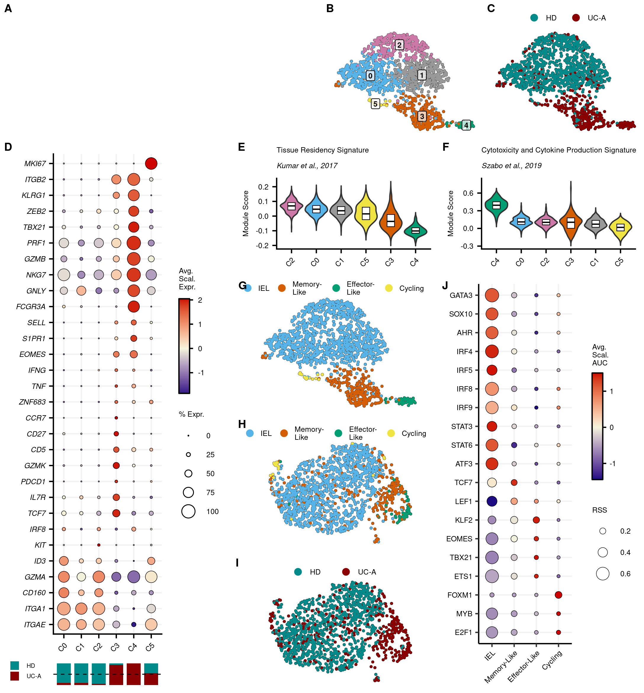
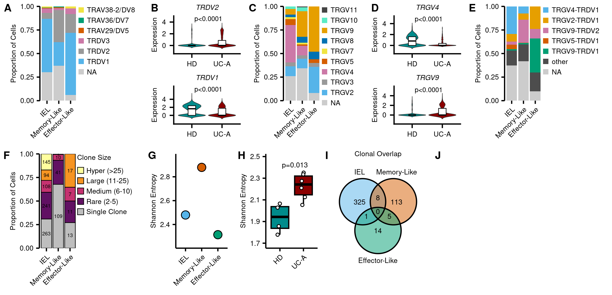
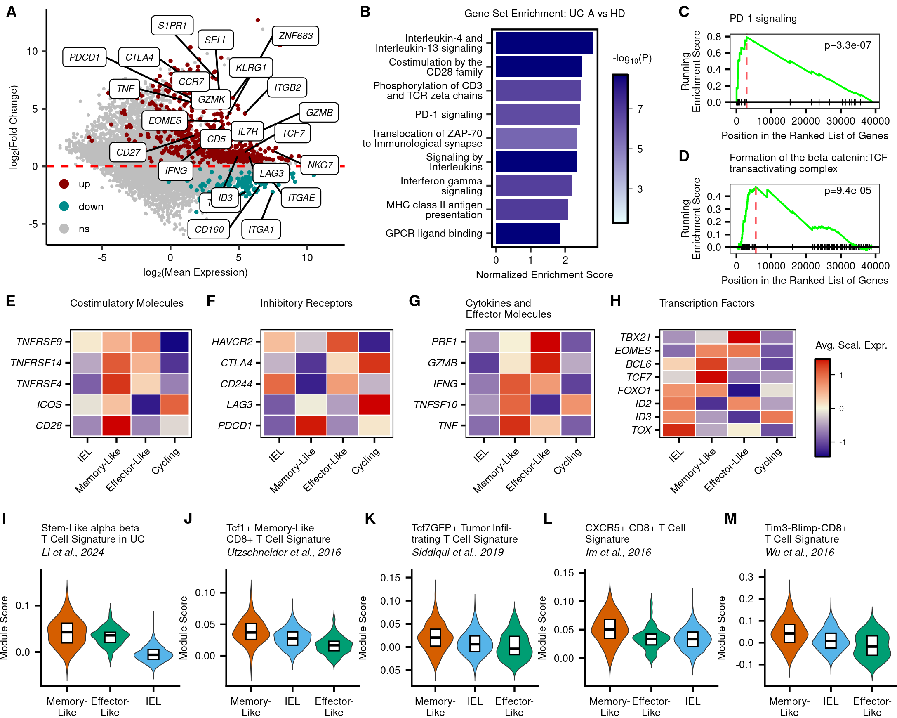
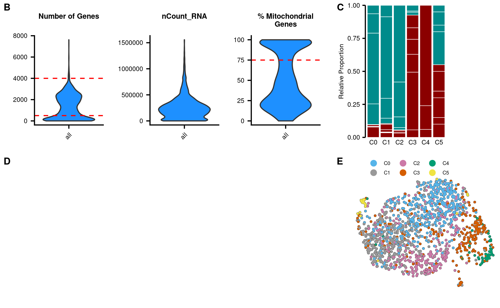
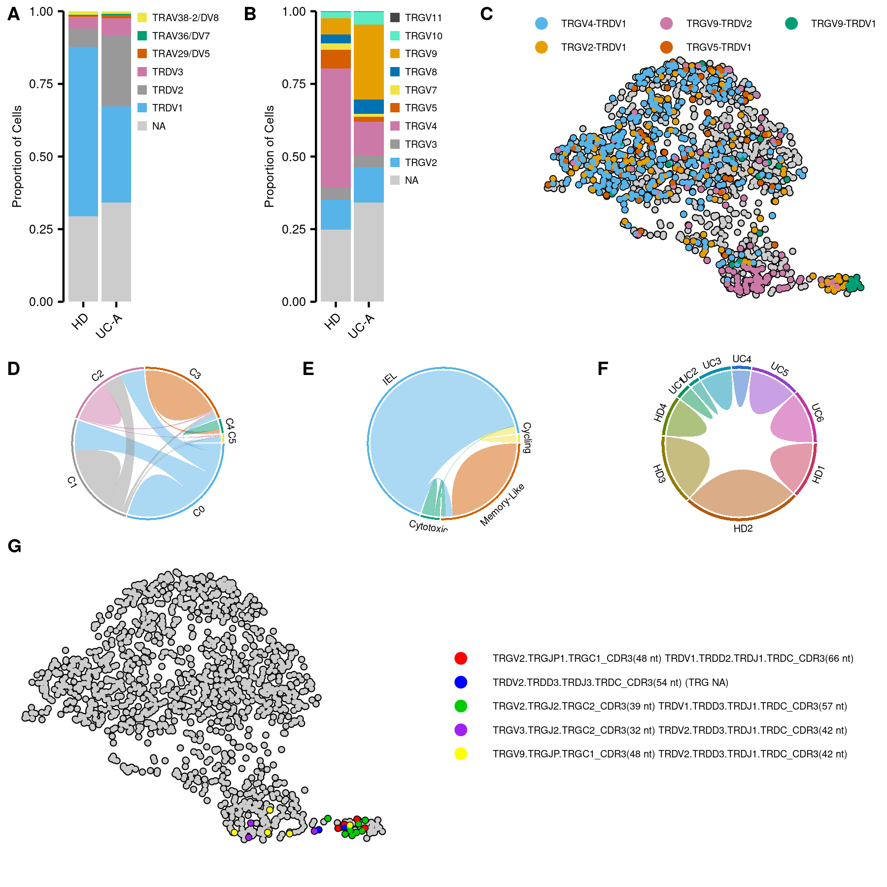
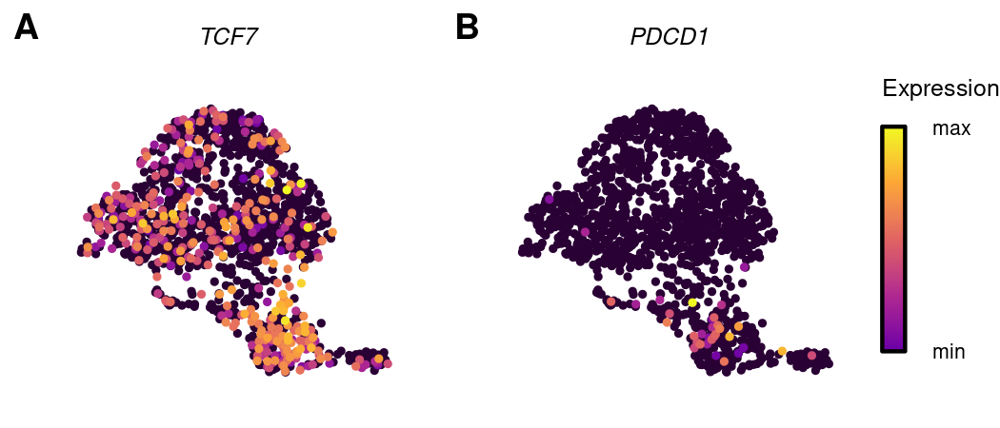

FLASH-seq: Code for Figures
================

``` r
library(Seurat)
library(SCpubr)
library(scCustomize)
library(tidyverse)
library(scRepertoire)
library(ReactomePA)
library(enrichplot)
library(circlize)
library(patchwork)
library(ggpubr)
library(rstatix)
library(SCENIC)
library(AUCell)
library(paletteer)
library(scales)
```

# Object

``` r
gd <- readRDS("../../data_processed/FLASHseq/gd.Rds")
```

# Palettes

``` r
pal_seur <- c("#56B4E9", "#999999", "#CC79A7", "#D55E00", "#009E73", "#F0E442")
pal_seur <- setNames(pal_seur, 0:5)
pal_clus <- setNames(pal_seur, paste0("C", 0:5))

pal_cell <- c("IEL"="#56B4E9", "Memory-Like"="#D55E00", "Cytotoxic"="#009E73",
              "Cycling"="#F0E442")
names_cell <- c("Cytotoxic"="Effector-Like")

pal_dis <- c("HD"="#008B8B","UC"="#8B0000")
names_dis <- c("UC"="UC-A")

pal_trdv <- setNames(c(c("#56B4E9", "#999999", "#CC79A7", "#D55E00",
                         "#009E73", "#F0E442")), levels(gd$TRDV))

pal_trgv <- setNames(c("#56B4E9", "#999999", "#CC79A7", "#D55E00", 
                       "#009E73", "#F0E442", "#0072B2", "#E69F00",
                       "#5BEBC5", "#444444"
                       ), levels(gd$TRGV))
```

# Figure 1

## BC

``` r
# b
b <- do_DimPlot(gd,
                label=T,
                group.by="seurat_clusters",
                legend.position="none",
                colors.use=pal_seur,
                pt.size=.25,
                label.size=2.12
                )+
  theme(plot.margin=margin(),
        aspect.ratio=0.7
        )

b[[1]][["layers"]][[3]][["aes_params"]][["alpha"]] <- 0.7

# c
c <- do_DimPlot(gd,
                group.by="disease",
                legend.position="left",
                pt.size=.25,
                legend.icon.size=2.12,
                legend.nrow=1,
                legend.byrow=T
                )+
  scale_color_manual(values=pal_dis ,labels=names_dis)+
  theme(legend.position=c(.5, 1.1),
        legend.background=element_blank(),
        text=element_text(size=6),
        legend.text=element_text(margin=margin(l=1), size=6),
        plot.margin=margin(),
        aspect.ratio=0.7
        )
```

## D

``` r
# 1d
Idents(gd) <- "cluster"

genes <- c("ITGAE","ITGA1","CD160","GZMA","ID3","KIT","IRF8","TCF7", "IL7R", 
           "PDCD1", "GZMK","CD5","CD27","CCR7","ZNF683","TNF","IFNG", "EOMES",
           "S1PR1","SELL","FCGR3A", "GNLY", "NKG7","GZMB", "PRF1","TBX21",
           "ZEB2","KLRG1", "ITGB2", "MKI67")

d <- DotPlot(gd,
             group.by="cluster",
             features=genes
             )+
  scale_radius(range=c(0,5))+
  scale_color_gradient2(low="navy", mid="beige", high="red3", midpoint=0)+
  guides(color=guide_colorbar(frame.colour="black",
                              frame.linewidth=.5,
                              order=1,
                              ticks.colour="black",
                              ticks.linewidth=.5,
                              title="Avg.\nScal.\nExpr.",
                              barwidth=.6
                              ),
         size=guide_legend(override.aes=list(fill="white", shape=21),
                           title="% Expr.",
                           order=2)
        )+
  geom_point(aes(size=(pct.exp+6)), shape=21, fill=NA, colour="black", stroke=.25)+
  theme(axis.title=element_blank(),
        panel.grid.major=element_line(color="gray95"),
        axis.text=element_text(size=6),
        axis.text.y=element_text(face="italic"),
        text=element_text(size=6),
        legend.ticks.length = unit(c(-1, 0), 'mm'),
        legend.text=element_text(size=6)
        )+
  coord_flip()+
  RotatedAxis()


d_1<- gd@meta.data%>%mutate(cluster=factor(cluster, levels=levels(d$data$id)))

d_1 <- ggplot(d_1, aes(x=cluster, fill=disease))+
  geom_bar(position="fill", width=.8)+
  scale_fill_manual(values=pal_dis, labels=names_dis)+
  theme_void()+
  theme(text=element_text(size=6),
        legend.title=element_blank(),
        legend.position=c(-.25, .5),
        legend.key.size=unit(3, "mm"), 
        legend.spacing.y=unit(1, "mm"),
        legend.margin=margin(t=-5.5)
        )+
  guides(fill=guide_legend(ncol=1, byrow=T))+
  geom_hline(yintercept=.5, linetype="dashed", linewidth=.35)

d <- d/d_1+plot_layout(heights=c(1, 0.05))
```

## EF

``` r
# 1e+1f
p <- VlnPlot_scCustom(gd,
                      colors_use=pal_clus,
                      pt.size=0,
                      sort=T,
                      group.by="cluster",
                      features=c("cytokine_cytotoxic_signature1", "TRM_signature1")
                      )&
  geom_boxplot(width=.3, fill="white", outlier.shape=NA, coef=0, color="black", size=.25)&
  NoLegend()&
  scale_y_continuous(expand=expansion(c(0.05, 0.05)))&
  labs(y="Module Score", x=NULL)&
  theme(plot.title=element_text(size=6, hjust=0, face="plain"),
        plot.subtitle=element_text(size=6, face="italic"),
        text=element_text(size=6),
        axis.text=element_text(size=6)
        )

for (i in seq_along(p)){
  p[[i]][["layers"]][[1]][["stat_params"]][["trim"]] <- F
}

e <- p[[2]]+ggtitle(label="Tissue Residency Signature",
               subtitle="Kumar et al., 2017")

f <- p[[1]]+ggtitle(label="Cytotoxicity and Cytokine Production Signature",
               subtitle="Szabo et al., 2019")
```

## G

``` r
g <- do_DimPlot(gd,
                group.by="celltype",
                pt.size=.25,
                legend.ncol=4,
                legend.byrow=F,
                legend.icon.size=2.12
                )+
    scale_color_manual(values=pal_cell,
                       labels=c("Memory-Like"="Memory-\nLike", "Cytotoxic"="Effector-\nLike")
                     )+
  theme(legend.position=c(.45, 1.05),
        legend.background=element_blank(),
        legend.key.height=unit(1, "mm"),
        legend.key.spacing.y=unit(1, "mm"),
        legend.key.spacing.x=unit(.5, "mm"),
        text=element_text(size=6),
        legend.text=element_text(margin=margin(), size=6),
        plot.margin=margin(),
        aspect.ratio=.7
        )

# h <- do_DimPlot(gd,
#                 group.by="celltype",
#                 pt.size=0.25,
#                 font.size=24,
#                 reduction="scenic_umap",
#                 legend.icon.size=2.12,
#                 legend.ncol=4,
#                 legend.byrow=F
#                 )+
#   scale_color_manual(values=pal_cell,
#                      labels=c("Memory-Like"="Memory-\nLike", "Cytotoxic"="Effector-\nLike")
#                      )+
#   theme(legend.position=c(.45, 1.05),
#         legend.background=element_blank(),
#         legend.key.height=unit(1, "mm"),
#         legend.key.spacing.y=unit(1, "mm"),
#         legend.key.spacing.x=unit(.5, "mm"),
#         text=element_text(size=6),
#         legend.text=element_text(margin=margin(), size=6),
#         plot.margin=margin(),
#         aspect.ratio=.7
#         )
```

## HI

``` r
# h
h <- do_DimPlot(gd,
                group.by="celltype",
                pt.size=0.25,
                font.size=24,
                reduction="scenic_umap",
                legend.icon.size=2.12,
                legend.ncol=4,
                legend.byrow=F
                )+
  scale_color_manual(values=pal_cell,
                     labels=c("Memory-Like"="Memory-\nLike", "Cytotoxic"="Effector-\nLike")
                     )+
  theme(legend.position=c(.45, 1.05),
        legend.background=element_blank(),
        legend.key.height=unit(1, "mm"),
        legend.key.spacing.y=unit(1, "mm"),
        legend.key.spacing.x=unit(.5, "mm"),
        text=element_text(size=6),
        legend.text=element_text(margin=margin(), size=6),
        plot.margin=margin(),
        aspect.ratio=.7
        )

I <- do_DimPlot(gd,
                group.by="disease",
                pt.size=0.25,
                font.size=24,
                legend.icon.size=2.12,
                reduction="scenic_umap",
                legend.ncol=2,
                legend.byrow=F
                )+
  scale_color_manual(values=pal_dis, labels=names_dis)+
  theme(legend.position=c(.45, 1.05),
        legend.background=element_blank(),
        legend.key.height=unit(1, "mm"),
        legend.key.spacing.y=unit(0, "mm"),
        text=element_text(size=6),
        legend.text=element_text(margin=margin(l=1), size=6),
        plot.margin=margin(),
        aspect.ratio=0.7
        )
```

## J

``` r
# J
rss <- importAUCfromText(
  "../../data_processed/FLASHseq/pySCENIC/auc.csv")
rss@NAMES <- gsub(rss@NAMES, pattern="\\(\\+\\)", replacement="")

rss <- calcRSS(AUC=getAUC(rss),cellAnnotation=gd@meta.data$celltype)
# rss <- sweep(rss,2,colSums(rss, na.rm=T),`/`)*100
rss <- rss%>%
  as.data.frame()%>%
  rownames_to_column("features.plot")%>%
  pivot_longer(cols=levels(gd$celltype), names_to="id", values_to="RSS")

df <- DotPlot(gd, assay="scenic", group.by="celltype",
              features=unique(rss$features.plot)
              )$data%>%
  inner_join(rss, by=c("features.plot", "id"))

regulons <- c("GATA3", "SOX10", "AHR", "IRF4", "IRF5", "IRF8", "IRF9", "STAT3",
              "STAT6", "ATF3", "TCF7", "LEF1", "KLF2", "EOMES", "TBX21", "ETS1",
              "FOXM1", "MYB", "E2F1")

j <- df%>%
  filter(features.plot %in% regulons)%>%
  mutate(features.plot=factor(features.plot, levels=rev(regulons)),
         id=factor(id, levels=levels(gd$celltype))
         )%>%
  ggplot(aes(x=id, y=features.plot, size=RSS, fill=avg.exp.scaled))+
  geom_point(color="black", shape=21, stroke=.25)+
  scale_radius(range=c(1,5))+
  theme_classic()+
  scale_fill_gradient2(low="navy", mid="beige", high="red3", midpoint=0,
                       breaks=c(-1, 0, 1)
                       )+
  scale_x_discrete(labels=names_cell)+
  guides(fill=guide_colorbar(
    frame.colour="black",
    frame.linewidth=.5,
    ticks.colour="black",
    ticks.linewidth=.5,
    order=1,
    title="Avg.\nScal.\nAUC",
    barwidth=.6
  ))+
  theme(axis.text=element_text(color="black", size=6),
        axis.title=element_blank(),
        text=element_text(size=6),
        panel.grid.major=element_line(color="gray95"),
        legend.ticks.length = unit(c(-1, 0), 'mm'),
        legend.text=element_text(size=6)
        )+
  RotatedAxis()
```

## Combined

``` r
bc <- ggarrange(NULL, NULL, b , c, nrow=1,
                labels=c("A", "", "B", "C"),
                font.label=list(size=9, family="sans"),
                align="h"
                )

ef <- ggarrange(e, f,
                labels=c("E", "F"),
                font.label=list(size=9, family="sans")
                )
ghi <- ggarrange(g, h, I, ncol=1,
                 labels=c("G", "H", "I"),
                font.label=list(size=9, family="sans")
                )
ghij <- ggarrange(ghi, j, ncol=2,
                  labels=c("", "J"),
                font.label=list(size=9, family="sans")
                  )
efghij <- ggarrange(ef, ghij, ncol=1, heights=c(1, 3))
defghij <- ggarrange(d, efghij, widths=c(1, 1.75),
                     labels=c("D", ""),
                    font.label=list(size=9, family="sans")
                     )

bcdefghij <- ggarrange(bc, defghij, ncol=1, heights=c(1, 4))

ggsave("../figures/Fig1.pdf",
       bcdefghij,
       width=7.25,
       height=7.8,
       bg="white"
       )

bcdefghij
```

<!-- -->

# Figure 3

## A-E

``` r
# a
a <- gd@meta.data%>%filter(celltype!="Cycling")%>%
ggplot(aes(x=celltype, fill=fct_rev(TRDV)))+
  geom_bar(position="fill")+
  theme_classic()+
  scale_fill_manual(values=pal_trdv, na.value="gray80")+
  scale_y_continuous(expand=expansion(c(0, 0)))+
  scale_x_discrete(labels=names_cell)+
  labs(x=NULL, y="Proportion of Cells", fill=NULL)+
  theme(axis.line.x=element_blank(),
        axis.ticks=element_line(color="black"),
        axis.text=element_text(color="black", size=6),
        text=element_text(size=6),
        legend.box.spacing=unit(0, "mm"),
        legend.margin=margin(0),
        legend.justification="top",
        legend.key.spacing.y=unit(1, "mm"),
        legend.key.size=unit(6, "pt"),
        legend.text=element_text(margin=margin(l=2), size=6),
        aspect.ratio=2.5
        )+
  RotatedAxis()

# b
b <- VlnPlot_scCustom(gd,
                      group.by="disease",
                      features=c("TRDV2", "TRDV1"),
                      num_columns=1,
                      colors_use=pal_dis,
                      add.noise=F,
                      pt.size=0
                      )&
  geom_boxplot(fill="white", color="black", width=.25, coef=0, outlier.shape=NA, size=0.25)&
  scale_y_continuous(expand=expansion(c(0.2, 0.28)), breaks=c(0, 2, 4))&
  scale_x_discrete(labels=names_dis)&
  labs(x=NULL, y="Expression")&
  theme(axis.text.x=element_text(angle=0, hjust=.5),
        plot.title=element_text(face="italic", size=6, margin=margin(b=4)),
        axis.text=element_text(size=6),
        text=element_text(size=6),
        plot.margin=margin(2, 2, 4, 2)
        )&
  stat_compare_means(bracket.size=0, method="t.test", label.x=1.27, size=2, vjust=-1,
  aes(label=ifelse(..p.. < 0.0001, "p<0.0001", paste0("p=", ..p.format..)))
                    )
b[[1]][["layers"]][[1]][["geom"]][["default_aes"]][["linewidth"]] <- .2

for (i in seq_along(b)) {
  b[[i]][["layers"]][[1]][["stat_params"]][["trim"]] <- F
}

# c
c <- gd@meta.data%>%filter(celltype!="Cycling")%>%
  ggplot(aes(x=celltype, fill=fct_rev(TRGV)))+
  geom_bar(position="fill")+
  theme_classic()+
  scale_fill_manual(values=pal_trgv, na.value="gray80")+
  scale_y_continuous(expand=expansion(c(0, 0)))+
  scale_x_discrete(labels=names_cell)+
  labs(x=NULL, y="Proportion of Cells", fill=NULL)+
  theme(axis.line.x=element_blank(), 
        axis.text=element_text(color="black", size=6),
        axis.ticks=element_line(color="black"),
        text=element_text(size=6),
        legend.justification="top",
        legend.key.spacing.y=unit(1, "mm"),
        legend.box.spacing=unit(0, "mm"),
        legend.margin=margin(0),
        legend.key.size=unit(6, "pt"),
        legend.text=element_text(margin=margin(l=2), size=6),
        aspect.ratio=2.5
        )+
  RotatedAxis() 

# d
d <- VlnPlot_scCustom(gd, group.by="disease", features=c("TRGV4", "TRGV9"),
                 num_columns=1,colors_use=pal_dis, add.noise=F, pt.size=0)&
  geom_boxplot(fill="white", color="black", width=.25, coef=0, outlier.shape=NA,size=.25)&
  scale_y_continuous(expand=expansion(c(0.2, 0.28)))&
  scale_x_discrete(labels=names_dis)&
  labs(x=NULL, y="Expression")&
  theme(axis.text.x=element_text(angle=0, hjust=.5),
        plot.title=element_text(face="italic", size=6, margin=margin(b=4)),
        axis.text=element_text(size=6),
        text=element_text(size=6),
        plot.margin=margin(2, 2, 4, 2)
        )&
  stat_compare_means(bracket.size=0, method="t.test", label.x=1.27, size=2, vjust=-1,
  aes(label=ifelse(..p.. < 0.0001, "p<0.0001", paste0("p=", ..p.format..)))
                    )
d[[1]][["layers"]][[1]][["geom"]][["default_aes"]][["linewidth"]] <- .2

for (i in seq_along(d)) {
  d[[i]][["layers"]][[1]][["stat_params"]][["trim"]] <- F
}

# e
arranged <- gd@meta.data%>%count(TRGV_TRDV)%>%arrange(desc(n))
arranged$TRGV_TRDV <- factor(arranged$TRGV_TRDV, levels=unique(arranged$TRGV_TRDV)[-1])

pal_gvdv <- setNames(c("#56B4E9", "#E69F00" ,"#CC79A7", "#D55E00", "#009E73", "gray30"),
                     c(levels(arranged$TRGV_TRDV)[1:5], "other"))
names_gvdv <- setNames(str_replace(arranged$TRGV_TRDV[2:6], "_", "-"),arranged$TRGV_TRDV[2:6])

e <- gd@meta.data%>%
  mutate(TRGV_TRDV=case_when(
    TRGV_TRDV %in% levels(arranged$TRGV_TRDV)[1:5] ~ TRGV_TRDV,
    TRGV_TRDV %in% levels(arranged$TRGV_TRDV[-1:-5]) ~ "other"
  ),
          TRGV_TRDV=factor(TRGV_TRDV, levels=c(levels(arranged$TRGV_TRDV[1:5]), "other"))        
  )%>%
  filter(celltype!="Cycling")%>%
ggplot(aes(x=celltype, fill=TRGV_TRDV))+
  geom_bar(position="fill")+
  theme_classic()+
  scale_fill_manual(values=pal_gvdv, labels=names_gvdv, na.value="gray80")+
  scale_y_continuous(expand=expansion(c(0, 0)))+
  scale_x_discrete(labels=names_cell)+
  labs(x=NULL, y="Proportion of Cells", fill=NULL)+
  theme(axis.line.x=element_blank(),
        axis.ticks=element_line(color="black"),
        axis.text=element_text(color="black", size=6),
        text=element_text(size=6),
        legend.box.spacing=unit(0, "mm"),
        legend.margin=margin(0),
        legend.justification="top",
        legend.key.spacing.y=unit(1, "mm"),
        legend.key.size=unit(6, "pt"),
        legend.text=element_text(margin=margin(l=2), size=6),
        aspect.ratio=2.5
        )+
  RotatedAxis()


abcde <- ggarrange(a, b, c, d, e,
                   widths=c(1.2, .8, 1, .8, 1.2),
                   nrow=1,
                   labels="AUTO",
                   font.label=list(size=9, family="sans"),
                   align="h"
                   )
```

## F-J

``` r
# f
names <- setNames(
  c("Hyper (>25)", "Large (11-25)", "Medium (6-10)", "Rare (2-5)", "Single Clone"),
  levels(gd$cloneSize)[-6]
)

f <- gd%>%
  subset(subset=celltype!="Cycling")%>%
  clonalOccupy(
  x.axis="celltype",
  proportion=T,
  label=T
  )+
  scale_fill_manual(values=c("#FFFE9E", "#F69422", "#C53270", "#611163", "gray"),
                    labels=names)+
  scale_y_continuous(expand=expansion(mult=c(0, 0)))+
  scale_x_discrete(labels=names_cell)+
  labs(fill="Clone Size")+
  RotatedAxis()+
    theme(axis.text=element_text(color="black", size=6),
          axis.ticks=element_line(color="black"),
          axis.line.x=element_blank(),
          text=element_text(size=6),
          legend.key.spacing.y=unit(1, "mm"),
          legend.box.spacing=unit(0, "mm"),
          legend.margin=margin(0),
          legend.title=element_text(size=6),
          legend.key.size=unit(6, "pt"),
          legend.justification="top",
          legend.text=element_text(margin=margin(l=2), size=6),
          aspect.ratio=2.5
          )
f[["layers"]][[2]][["geom"]][["default_aes"]][["size"]] <- 1.5

set.seed(1337)
g <- subset(gd, subset=celltype!="Cycling")%>%
  clonalDiversity(cloneCall="CTstrict_filled", group.by="celltype", exportTable=T,
                n.boots=1000)%>%
  
  mutate(celltype=factor(celltype, levels=levels(gd$celltype)))%>%
  ggplot(aes(x=celltype, y=shannon, color=celltype))+
  geom_point(size=3, shape=21, color="black", aes(fill=celltype))+
  scale_fill_manual(values=pal_cell)+
  scale_y_continuous(expand=expansion(mult=c(.2, .2)))+
  scale_x_discrete(labels=names_cell)+
  theme_classic()+
  RotatedAxis()+
  NoLegend()+
  labs(y="Shannon Entropy", x=NULL)+
  theme(axis.text=element_text(color="black", size=6),
        axis.ticks=element_line(color="black"),
        text=element_text(size=6)
        )

set.seed(1337)
h <- clonalDiversity(gd, cloneCall="CTstrict_filled", group.by="ID", exportTable=T,
                n.boots=1000)%>%
  mutate(disease=case_when(
    str_detect(ID, "HD") ~ "HD",
    .default="UC"
  ))%>%

  ggplot(aes(x=disease, y=shannon,fill=disease))+
  geom_boxplot(outlier.shape=NA, color="black")+
  geom_point(size=1, position=position_jitter(width=.1, height=0), shape=21, fill="white")+
  scale_fill_manual(values=pal_dis)+
  scale_x_discrete(labels=names_dis)+
  scale_y_continuous(expand=expansion(mult=c(.2, .2)))+
  theme_classic()+
  NoLegend()+
  RotatedAxis()+
  labs(y="Shannon Entropy", x=NULL)+
  theme(axis.text=element_text(color="black", size=6),
        axis.ticks=element_line(color="black"),
        text=element_text(size=6))+
  stat_compare_means(method="t.test", label.y=2.4, label.x=1.3, size=2.12,
                     aes(label=ifelse(..p.. < 0.0001, "p<0.0001", paste0("p=", ..p.format..)))
                     )

library(ggvenn)

I <- list(
  "IEL" = gd@meta.data%>%
    filter(celltype=="IEL", !is.na(CTstrict_filled))%>%
    pull(CTstrict_filled),
  "Memory-Like" = gd@meta.data%>%
    filter(celltype=="Memory-Like", !is.na(CTstrict_filled))%>%
    pull(CTstrict_filled),
  "Effector-Like" = gd@meta.data%>%
    filter(celltype=="Cytotoxic", !is.na(CTstrict_filled))%>%
    pull(CTstrict_filled)
  )%>%

ggvenn(
  fill_color=unname(pal_cell),
  show_percentage=F,
  set_name_size=2.12,
  stroke_size=.5,
  text_size=2.12
  )+
  labs(title="Clonal Overlap")+
  theme(plot.title=element_text(size=6, hjust=.5),
        plot.margin=margin(t=-20)
        )

gh <- ggarrange(g, h,
                labels=c("G", "H"),
                align="hv",
                font.label=list(size=9, family="sans")
                )

fghi <- ggarrange(f, gh, I, NULL,
                  nrow=1,
                  labels=c("F", "", "I", "J"),
                  font.label=list(size=9, family="sans"),
                  widths=c(0.8, 1, .6, 1)
                  )
```

## Combined

``` r
ggarrange(abcde, fghi,
          ncol=1,
          heights=c(1, 1))
```

<!-- -->

``` r
ggsave("../figures/Fig3.pdf",
       width=7.25,
       height=3.5,
       bg="white")
```

# Figure 4

## A-D

``` r
# a
Idents(gd) <- "disease"

UC_markers <- FindMarkers(gd, ident.1="UC")%>%
  rownames_to_column("gene")

geneLogSums <- log2(Matrix::rowMeans(GetAssayData(gd, "RNA", "counts")))
geneLogSums <- as.data.frame(geneLogSums)%>%
  rownames_to_column("gene")

UC_markers <- inner_join(UC_markers, geneLogSums, by="gene")%>%
  mutate(signif=case_when(
           p_val_adj<0.05 & avg_log2FC>0 ~ "up",
           p_val_adj<0.05 & avg_log2FC<0 ~ "down",
           .default="ns"
         ),
         signif=factor(signif, levels=c("ns", "down", "up"))
         )

genes_up <- c("TCF7", "IL7R","GZMK","CD5","CD27","CCR7","ZNF683","TNF",
              "IFNG","EOMES","S1PR1","SELL","NKG7","GZMB","TBX21","KLRG1", "ITGB2", 
              "PDCD1", "CTLA4", "LAG3")

genes_down <- c("ITGAE","ITGA1","CD160","ID3")

a <- ggplot()+
  geom_point(UC_markers%>%filter(signif=="ns"),
             mapping=aes(x=geneLogSums, y=avg_log2FC, color=signif),
             size=.25)+
  geom_point(UC_markers%>%filter(signif!="ns"),
             mapping=aes(x=geneLogSums, y=avg_log2FC, color=signif),
             size=.5)+
  theme_classic()+
  geom_hline(yintercept=0, linetype="dashed", color="red", size=.5)+
  labs(x=expression("log"[2]*"(Mean Expression)"),
       y=expression("log"[2]*"(Fold Change)"),
       color=element_blank())+
  scale_color_manual(values=c("gray", "#008B8B", "#8B0000"))+
  guides(color=guide_legend(override.aes=list(size=2), reverse=T))+
  theme(axis.text=element_text(color="black",size=6),
        text=element_text(size=6),
        legend.position=c(0.1, 0.19),
        legend.background=element_blank(),
        legend.key.spacing.y=unit(-1.5, "mm"),
        legend.text=element_text(margin=margin(l=0), size=6)
        )+
  
  ggrepel::geom_label_repel(data=UC_markers%>%filter(gene %in% genes_up), 
                           aes(label=gene, x=geneLogSums, y=avg_log2FC),
                           min.segment.length=0,
                           nudge_y=0,
                           nudge_x=0,
                           size=1.9,
                           max.overlaps=30,
                           fontface="italic"
                           )+
  ggrepel::geom_label_repel(data=UC_markers%>%filter(gene %in% genes_down), 
                           aes(label=gene, x=geneLogSums, y=avg_log2FC),
                           min.segment.length=0,
                           nudge_y=-1.5,
                           nudge_x=0,
                           size=1.9,
                           fontface="italic")

rm(genes_down, genes_up, UC_markers, geneLogSums)

# b
gsea <- readRDS("../../data_processed/FLASHseq/GSEA_res.Rds")

b <- gsea@result%>%filter(ID %in% c("R-HSA-389948","R-HSA-202427","R-HSA-388841",
    "R-HSA-202430","R-HSA-6785807","R-HSA-449147","R-HSA-2132295",
    "R-HSA-877300", "R-HSA-500792"))%>%

ggplot(aes(x=NES, y=reorder(Description, NES), fill=-log10(p.adjust)))+
  geom_bar(stat="identity")+
  theme_bw()+
  scale_fill_gradientn(limits=c(1.3, 8.7), colors=c("#E8FFFF", "#00007A"))+
  scale_y_discrete(labels=label_wrap(25))+
  guides(fill=guide_colorbar(frame.colour="black",
                             frame.linewidth=.5,
                             ticks.colour="black",
                             ticks.linewidth=.25,
                             barwidth=.6)
         )+
  labs(x="Normalized Enrichment Score",
       y=NULL,
       fill=expression("-log"[10]*"(P)"),
       title="Gene Set Enrichment: UC-A vs HD"
       )+
  
  theme(panel.grid=element_blank(),
        panel.border=element_rect(color="black", size=1),
        axis.text=element_text(color="black", size=6),
        axis.text.y=element_text(lineheight = 0.8),
        text=element_text(size=6),
        plot.title=element_text(hjust=.5, size=6),
        legend.box.spacing=unit(1, "mm"),
        legend.ticks.length = unit(c(-1, 0), 'mm'),
        legend.text=element_text(size=6)
        )

# c
c <- gseaplot(gsea,
         geneSetID="R-HSA-389948",
         by="runningScore",
         title="\nPD-1 signaling"
         )&
  annotate(geom="text",
           x=32000,
           y=.7,
           label=paste0("p=",gsea@result%>%filter(ID=="R-HSA-389948")%>%pull(p.adjust)%>%signif(2)),
           size=2.12
           )&
  theme_bw()&
  labs(y="Running\nEnrichment Score")&
  theme(plot.title=element_text(size=6),
        text=element_text(size=6),
        axis.ticks=element_line(color="black"),
        axis.text=element_text(color="black", size=6),
        panel.grid=element_blank(),
        plot.margin=margin(2, 10, 2, 5)
        )

c[["layers"]][[1]][["geom"]][["default_aes"]][["linewidth"]] <- .25
c[["layers"]][[2]][["aes_params"]][["size"]] <- .5

# d
d <- gseaplot(gsea,
         geneSetID="R-HSA-201722",
         by="runningScore",
         title=gsea@result%>%filter(ID=="R-HSA-201722")%>%pull(Description)%>%str_wrap(width=45)
         )&
  annotate(geom="text",
           x=32000,
           y=.45,
           label=paste0("p=",gsea@result%>%filter(ID=="R-HSA-201722")%>%pull(p.adjust)%>%signif(2)),
           size=2.12
           )&
  theme_bw()&
  labs(y="Running\nEnrichment Score")&
  theme(plot.title=element_text(size=6),
        text=element_text(size=6),
        axis.ticks=element_line(color="black"),
        axis.text=element_text(color="black", size=6),
        panel.grid=element_blank(),
        plot.margin=margin(5, 10, 2, 5)
        )

d[["layers"]][[1]][["geom"]][["default_aes"]][["linewidth"]] <- .25
d[["layers"]][[2]][["aes_params"]][["size"]] <- .5


# Combined
ab <- ggarrange(a, b,
                labels=c("A", "B"),
                font.label=list(size=9, face="bold", family="sans"),
                widths=c(1, 0.9))

cd <- ggarrange(c, d,
                nrow=2, ncol=1,
                labels=c("C", "D"),
                font.label=list(size=9, family="sans")
                )

abcd <- ggarrange(ab, cd,
                  nrow=1, ncol=2,
                  widths=c(3, 1)
                  )
```

## E-H

``` r
cost <- c("CD28", "ICOS", "TNFRSF4", "TNFRSF14", "TNFRSF9")
inh <- c("PDCD1", "LAG3", "CD244", "CTLA4", "HAVCR2")
cyt <- c("TNF", "TNFSF10", "IFNG", "GZMB", "PRF1")
tf <- c("TOX", "ID3", "ID2", "FOXO1", "TCF7", "BCL6", "EOMES", "TBX21")

heat <- DotPlot(gd, group.by="celltype", features=c(cost, inh, cyt, tf))$data

e <- heat%>%filter(features.plot %in% cost)%>%
  ggplot(aes(x=id, y=features.plot,fill=avg.exp.scaled))+
  geom_tile(color="white", size=.25)+
  theme_minimal()+
  scale_fill_gradient2(low="navy", mid="beige", high="red3", midpoint=0, breaks=c(-1, 0, 1))+
  scale_x_discrete(labels=names_cell)+
  guides(fill=guide_colorbar(frame.colour="black",
                             frame.linewidth=.5,
                             ticks.colour="black",
                             ticks.linewidth=.25,
                             barwidth=.6,
                             barheight=unit(2, "cm")
                             )
         )+
  labs(fill="Avg. Scal. Expr.", title="Costimulatory Molecules")+
  theme(panel.grid.major=element_blank(), 
        panel.border=element_rect(color="black", fill=NA, size=.5),
        axis.title=element_blank(),
        axis.text=element_text(color="black", size=6),
        axis.text.y=element_text(face="italic"),
        axis.ticks=element_line(),
        text=element_text(size=6),
        plot.title=element_text(size=6),
        legend.ticks.length = unit(c(-1, 0), 'mm')
        )+
  RotatedAxis()


f <- heat%>%filter(features.plot %in% inh)%>%
  ggplot(aes(x=id, features.plot,fill=avg.exp.scaled))+
  geom_tile(color="white", size=.25)+
  theme_minimal()+
  scale_fill_gradient2(low="navy", mid="beige", high="red3", midpoint=0)+
  scale_x_discrete(labels=names_cell)+
  labs(title="Inhibitory Receptors")+
 theme(panel.grid.major=element_blank(), 
        panel.border=element_rect(color="black", fill=NA, size=.5),
        axis.title=element_blank(),
        axis.text=element_text(color="black", size=6),
        axis.text.y=element_text(face="italic"),
        axis.ticks=element_line(),
        text=element_text(size=6),
        legend.justification="top",
        plot.title=element_text(size=6)
        )+
  RotatedAxis()

g <- heat%>%filter(features.plot %in% cyt)%>%
  ggplot(aes(x=id, y=features.plot,fill=avg.exp.scaled))+
  geom_tile(color="white", size=.25)+
  theme_minimal()+
  scale_fill_gradient2(low="navy", mid="beige", high="red3", midpoint=0)+
  scale_x_discrete(labels=names_cell)+
  guides(fill=guide_colorbar(frame.colour="black",
                             frame.linewidth=.5,
                             ticks.colour="black",
                             ticks.linewidth=.25,
                             barwidth=unit(4, "mm"),
                             barheight=unit(2, "cm")
                             )
         )+
  labs(fill="Avg.\nScal.\nExpr.", title="Cytokines and\nEffector Molecules")+
  theme(panel.grid.major=element_blank(), 
        panel.border=element_rect(color="black", fill=NA, size=.5),
        axis.title=element_blank(),
        axis.text=element_text(color="black", size=6),
        axis.text.y=element_text(face="italic"),
        axis.ticks=element_line(),
        text=element_text(size=6),
        legend.justification="top",
        plot.title=element_text(size=6)
        )+
  RotatedAxis()


h <- heat%>%filter(features.plot %in% tf)%>%
  ggplot(aes(x=id, features.plot,fill=avg.exp.scaled))+
  geom_tile(color="white", size=.25)+
  theme_minimal()+
  scale_fill_gradient2(low="navy", mid="beige", high="red3", midpoint=0)+
  scale_x_discrete(labels=names_cell)+
  labs(title="Transcription Factors")+
 theme(panel.grid.major=element_blank(), 
        panel.border=element_rect(color="black", fill=NA, size=.5),
        axis.title=element_blank(),
        axis.text=element_text(color="black", size=6),
        axis.text.y=element_text(face="italic"),
        axis.ticks=element_line(),
        text=element_text(size=6),
        legend.justification="top",
        plot.title=element_text(size=6)
        )+
  RotatedAxis()

efgh <- ggarrange(e, f, g, h,
                nrow=1, ncol=4,
                common.legend=T,
                legend="right",
                labels=c("E", "F", "G", "H"),
                font.label=list(size=9, family="sans"),
                align="h"
                )
```

## I-M

``` r
# i-m

scores <- grep(colnames(gd@meta.data), pattern="stem1$", value=T)

p <- subset(gd, subset=celltype!="Cycling")%>%
  VlnPlot_scCustom(features=scores, group.by="celltype",
                 pt.size=0, colors_use=pal_cell, sort=T,
                 add.noise=F, num_columns=2)&
  scale_y_continuous(expand=expansion(mult=c(.05, .1)))&
  scale_x_discrete(labels=c("Memory-Like"="Memory-\nLike", "Cytotoxic"="Effector-\nLike"))&
  labs(y="Module Score", x=NULL)&
  theme(
        axis.text.x=element_text(angle=0, hjust=0.5),
        plot.margin=margin(t=10),
        plot.subtitle=element_text(face="italic", size=6),
        plot.title=element_text(hjust=0, size=6, face="plain", margin=margin(b=2)),
        text=element_text(size=6),
        axis.text=element_text(size=6)
        )&
  geom_boxplot(width=.25, fill="white", outlier.shape=NA, coef=0, color="black", size=.35)

for (i in seq_along(p)) {
  p[[i]][["layers"]][[1]][["stat_params"]][["trim"]] <- FALSE
}

k <- p[[1]] + labs(title="Tcf7GFP+ Tumor Infil-\ntrating T Cell Signature",
                        subtitle="Siddiqui et al., 2019")

l <- p[[2]] + labs(title="CXCR5+ CD8+ T Cell\nSignature",
                        subtitle="Im et al., 2016")

m <- p[[3]] + labs(title="Tim3-Blimp-CD8+\nT Cell Signature",
                        subtitle="Wu et al., 2016")

j <- p[[4]] + labs(title="Tcf1+ Memory-Like\nCD8+ T Cell Signature",
                        subtitle="Utzschneider et al., 2016")

i <- p[[5]] + labs(title="Stem-Like alpha beta\nT Cell Signature in UC",
                        subtitle="Li et al., 2024")

ijklm <- ggarrange(i, j, k, l, m,
                  nrow=1, ncol=5,
                  labels=c("I", "J", "K", "L", "M"),
                  font.label=list(size=9, family="sans")
                  )
```

## Combined

``` r
ggarrange(abcd, efgh, ijklm,
          ncol=1, nrow=3,
          heights=c(2.4, 1.8, 1.75))
```

<!-- -->

``` r
ggsave("../figures/Fig4.pdf",
       width=7.25,
       height=5.8,
       bg="white"
       )
```

# Supplements

## Fig S1

``` r
b <- readRDS("../../data_processed/FLASHseq/qc_plots.Rds")
b <- b&
  theme(text=element_text(size=6, face="plain"),
        axis.text=element_text(size=6)
        )

c <- gd@meta.data%>%
  ggplot(aes(x=cluster, fill=ID))+
  geom_bar(position="fill", color="white",size=.2)+
  scale_fill_manual(values=c(rep("#008B8B", 4), rep("#8B0000", 6)))+
  theme_classic()+
  scale_y_continuous(expand=expansion(c(0, 0)), name="Relative Proportion")+
  theme(axis.title.x=element_blank(),
        text=element_text(size=6),
        legend.position="none",
        axis.line.x=element_blank(),
        axis.ticks.x=element_blank(),
        axis.text=element_text(color="black", size=6),
        axis.ticks=element_line(color="black"),
        axis.text.x=element_text(vjust=3),
        plot.margin=margin(5, 50, 5, 5)
        )
e <- do_DimPlot(gd,
                group.by="cluster",
                pt.size=0.25,
                font.size=24,
                reduction="scenic_umap",
                colors.use=pal_clus,
                legend.icon.size=2.12,
                legend.ncol=4,
                legend.byrow=F
                )+
  theme(legend.position=c(.45, 1.05),
        legend.background=element_blank(),
        legend.key.height=unit(1, "mm"),
        legend.key.spacing.y=unit(1, "mm"),
        legend.key.spacing.x=unit(1, "mm"),
        text=element_text(size=6),
        legend.text=element_text(margin=margin(l=1)),
        plot.margin=margin(b=10, l=10)
        )

bcde <- ggarrange(b, c, NULL, e,
                  ncol=2, nrow=2,
                  widths=c(2, 1),
                  labels=c("B", "C", "D", "E"),
                  font.label=list(size=9, family="sans")
                  )

ggsave("../figures/FigS1.pdf",
       bcde,
       width=6.5,
       height=4,
       bg="white"
       )

bcde
```

<!-- -->

## Fig S3

``` r
a <- gd@meta.data%>%
ggplot(aes(x=disease, fill=fct_rev(TRDV)))+
  geom_bar(position="fill")+
  theme_classic()+
  scale_fill_manual(values=pal_trdv, na.value="gray80")+
  scale_x_discrete(labels=names_dis)+
  scale_y_continuous(expand=expansion(c(0, 0)))+
  labs(x=NULL, y="Proportion of Cells", fill=NULL)+
  theme(axis.line.x=element_blank(),
        axis.ticks=element_line(color="black"),
        axis.text=element_text(color="black", size=6),
        text=element_text(size=6),
        legend.box.spacing=unit(0, "mm"),
        legend.margin=margin(0),
        legend.justification="top",
        legend.key.spacing.y=unit(1, "mm"),
        legend.key.size=unit(6, "pt"),
        legend.text=element_text(margin=margin(l=2)),
        aspect.ratio=(4)
        )+
  RotatedAxis()

b <- gd@meta.data%>%
ggplot(aes(x=disease, fill=fct_rev(TRGV)))+
  geom_bar(position="fill")+
  theme_classic()+
  scale_fill_manual(values=pal_trgv, na.value="gray80")+
  scale_x_discrete(labels=names_dis)+
  scale_y_continuous(expand=expansion(c(0, 0)))+
  labs(x=NULL, y="Proportion of Cells", fill=NULL)+
  theme(axis.line.x=element_blank(),
        axis.ticks=element_line(color="black"),
        axis.text=element_text(color="black", size=6),
        text=element_text(size=6),
        legend.box.spacing=unit(0, "mm"),
        legend.margin=margin(0),
        legend.justification="top",
        legend.key.spacing.y=unit(1, "mm"),
        legend.key.size=unit(6, "pt"),
        legend.text=element_text(margin=margin(l=2)),
        aspect.ratio=4
        )+
  RotatedAxis()

c <- do_DimPlot(gd,
                group.by="TRGV_TRDV",
                pt.size=.5,
                legend.icon.size=2.12,
                legend.ncol=3,
                legend.position="bottom",
                idents.keep=arranged$TRGV_TRDV[2:6],
                na.value="gray80"
                )+
  scale_color_manual(values=pal_gvdv, labels=names_gvdv)+
  theme(legend.position=c(.5, 1.05),
        legend.background=element_blank(),
        legend.key.spacing.y=unit(-2, "mm"),
        text=element_text(size=6),
        legend.text=element_text(margin=margin(l=1)),
        plot.margin=margin(l=20, b=20, t=10),
        aspect.ratio=0.75
        )

c[[1]]$data$TRGV_TRDV <- factor(c[[1]]$data$TRGV_TRDV, levels=arranged$TRGV_TRDV[2:6])

library(ggplotify)

chord.df <- getCirclize(gd, "CTstrict_filled", group.by="cluster",proportion=F)%>%
              arrange(from)

d <- as.ggplot(function() {
  par(cex = 0.5, mar = c(0, 0, 0, 0))
  chordDiagram(chord.df,
               annotationTrack=c("name", "grid"),
               self.link=1,
               grid.col=pal_clus)})+
  theme(aspect.ratio=1)

chord.df <- getCirclize(gd, "CTstrict_filled", group.by="celltype")

e <- as.ggplot(function() {
  par(cex = 0.5, mar = c(0, 0, 0, 0))
  chordDiagram(chord.df,
               annotationTrack=c("name", "grid"),
               self.link=1,
               grid.col=pal_cell)})+
  theme(aspect.ratio=1)

chord.df <- getCirclize(gd, "CTstrict_filled", group.by="ID",proportion=F)%>%
              arrange(from)

f <- as.ggplot(function() {
  par(cex = 0.5, mar = c(0, 0, 0, 0))
  chordDiagram(chord.df,
               annotationTrack=c("grid", "name"),
               self.link=1,
               grid.col=SCpubr:::generate_color_scale(sort(unique(gd$ID)))
               )})+
  theme(aspect.ratio=1)

abc <- ggarrange(a, b, c,
                ncol=3, nrow=1,
                widths=c(1, 1, 1.75),
                labels=c("A", "B", "C"),
                font.label=list(size=9, famil="sans")
                )

def <- ggarrange(d, e, f,
                ncol=3, nrow=1,
                labels=c("D", "E", "F"),
                font.label=list(size=9, famil="sans")
                )

af <- ggarrange(abc, def,
                ncol=1, nrow=2,
                heights=c(2,1)
                )

shared_clones <- intersect(
  gd$CTstrict_filled[gd$seurat_clusters=="3"],
  gd$CTstrict_filled[gd$seurat_clusters=="4"]
)[-1]

shared_clones
```

    ## [1] "TRDV1.TRDD2.TRDJ1.TRDC;TGTGCTCTTGGGGACCTTCCTACACAACAGCCTGGGGAAACCCCCGGGACCGATAAACTCATCTTT_TRGV2.TRGJP1.TRGC1;TGTGCCACCTGGGACGGGGGGAGAACCACTGGTTGGTTCAAGATATTT"
    ## [2] "TRDV2.TRDD3.TRDJ3.TRDC;TGTGCCTGTGACACCCGGGATCCAAGCTCCTGGGACACCCGACAGATGTTTTTC_NA"                                                                             
    ## [3] "TRDV1.TRDD3.TRDJ1.TRDC;TGTGCTCTTGGGGAACTAGTTCCCCACCCATTACCGTACACCGATAAACTCATCTTT_TRGV2.TRGJ2.TRGC2;TGTGCCACCTGGGACGAGCATTATTATAAGAAACTCTTT"                   
    ## [4] "TRDV2.TRDD3.TRDJ1.TRDC;TGTGCCTGTGACACCATGGGGGATACCGATAAACTCATCTTT_TRGV3.TRGJ2.TRGC2;TGTGCCACCTGGGACCGAATAAGAAACTCTTT"                                         
    ## [5] "TRDV2.TRDD3.TRDJ1.TRDC;TGTGCCTGTGACACCATGGGGGATACCGATAAACTCATCTTT_TRGV9.TRGJP.TRGC1;TGTGCCTTGTGGGAGGTGCAGGGATTGGGCAAAAAAATCAAGGTATTT"

``` r
process_clone <- function(clone) {
  # Split the string into gamma and delta chains
  parts <- unlist(strsplit(clone, "_"))

  # Handle case where one of the chains is missing (NA)
  if (length(parts) == 1) {
    # Only one chain exists (either gamma or delta is NA)
    gamma_chain <- "NA"
    delta_chain <- parts[1]
  } else {
    # Two chains exist, gamma and delta
    gamma_chain <- parts[2]
    delta_chain <- parts[1]
  }

  # Split the chains into their respective segments
  gamma_segments <- strsplit(gamma_chain, ";")[[1]]
  delta_segments <- strsplit(delta_chain, ";")[[1]]

  # Extract CDR3 region and calculate its length
  gamma_cdr3 <- if (length(gamma_segments) > 1) gamma_segments[2] else ""
  delta_cdr3 <- if (length(delta_segments) > 1) delta_segments[2] else ""

  gamma_cdr3_length <- nchar(gamma_cdr3)
  delta_cdr3_length <- nchar(delta_cdr3)

  # Check if any chain is missing, handle accordingly
  if (gamma_chain == "NA") {
    gamma_label <- ""
    delta_label <- paste(delta_segments[1], "_CDR3(", delta_cdr3_length, " nt)", sep="")
    result <- paste(delta_label, "(TRG NA)", sep=" ")
  } else if (delta_chain == "NA") {
    delta_label <- ""
    gamma_label <- paste(gamma_segments[1], "_CDR3(", gamma_cdr3_length, " nt)", sep="")
    result <- paste(gamma_label, "(TRD NA)", sep=" ")
  } else {
    # Both chains exist
    gamma_label <- paste(gamma_segments[1], "_CDR3(", gamma_cdr3_length, " nt)", sep="")
    delta_label <- paste(delta_segments[1], "_CDR3(", delta_cdr3_length, " nt)", sep="")
    result <- paste(gamma_label, delta_label, sep=" ")
  }


  return(result)
}


clones_named <- sapply(shared_clones, process_clone)

names(clones_named) <- shared_clones

colors <- setNames(c("red", "blue", "green3", "purple", "yellow"), shared_clones)

gd <- SetIdent(gd, value="CTstrict_filled")

g <- do_DimPlot(gd,
           idents.keep=shared_clones,
           pt.size=.5,
           na.value="gray80",
           legend.ncol=1,
           legend.icon.size=2.12,
           legend.position="right"
           )+
  scale_color_manual(values=colors, labels=clones_named)+
  theme(legend.key.spacing.y=unit(-2, "mm"),
        aspect.ratio=.75,
        text=element_text(size=6)
        )

rm(shared_clones, clones_named, colors, process_clone, clones, i)

ggarrange(af, g,
          ncol=1, nrow=2,
          heights=c(1.5, 1),
          labels=c("", "G"),
          font.label=list(size=9, family="sans")
          )
```

<!-- -->

``` r
ggsave("../figures/FigS3.pdf",
       width=6,
       height=6,
       bg="white"
       )
```

## Fig S4

``` r
ab <- FeaturePlot_scCustom(gd,
                     features=c("TCF7", "PDCD1"),
                     order=T,
                     pt.size=0.25
                     )&
  NoAxes()&
  scale_color_gradientn(colors=c("#2A0134","#6900A8FF", "#B02991FF", "#E16462FF", "#FCA636FF", "#F0F921FF"),
                        values=c(0, rescale(1:5, c(0.00001,1))),
                        breaks = function(limits) limits,
                        labels=c("min", "max")
                        )&
  guides(color=guide_colorbar(frame.colour="black",
                             frame.linewidth=.5,
                             ticks.colour="black",
                             ticks.linewidth=.5,
                             barwidth=.4,
                             barheight=unit(2, "cm"),
                             title="Expression"
                             )
         )&
  theme(text=element_text(size=6),
        plot.title=element_text(size=6, face="italic"),
        legend.ticks.length = unit(c(0, 0), 'mm')
        )

ggarrange(ab[[1]], ab[[2]],
          labels=c("A", "B"),
          font.label=list(size=9, family="sans"),
          common.legend=T,
          legend="right"
          )
```

<!-- -->

``` r
ggsave("../figures/FigS4.pdf",
       width=3,
       height=1.5,
       bg="white")
```

# Session Info

``` r
sessionInfo()
```

    ## R version 4.4.3 (2025-02-28)
    ## Platform: x86_64-pc-linux-gnu
    ## Running under: Ubuntu 22.04.5 LTS
    ## 
    ## Matrix products: default
    ## BLAS:   /usr/lib/x86_64-linux-gnu/openblas-pthread/libblas.so.3 
    ## LAPACK: /usr/lib/x86_64-linux-gnu/openblas-pthread/libopenblasp-r0.3.20.so;  LAPACK version 3.10.0
    ## 
    ## locale:
    ##  [1] LC_CTYPE=en_US.UTF-8       LC_NUMERIC=C              
    ##  [3] LC_TIME=de_DE.UTF-8        LC_COLLATE=en_US.UTF-8    
    ##  [5] LC_MONETARY=de_DE.UTF-8    LC_MESSAGES=en_US.UTF-8   
    ##  [7] LC_PAPER=de_DE.UTF-8       LC_NAME=C                 
    ##  [9] LC_ADDRESS=C               LC_TELEPHONE=C            
    ## [11] LC_MEASUREMENT=de_DE.UTF-8 LC_IDENTIFICATION=C       
    ## 
    ## time zone: Europe/Berlin
    ## tzcode source: system (glibc)
    ## 
    ## attached base packages:
    ## [1] stats     graphics  grDevices utils     datasets  methods   base     
    ## 
    ## other attached packages:
    ##  [1] ggplotify_0.1.2     ggvenn_0.1.16       BiocParallel_1.38.0
    ##  [4] scales_1.3.0        paletteer_1.6.0     AUCell_1.26.0      
    ##  [7] SCENIC_1.3.1        rstatix_0.7.2       ggpubr_0.6.0       
    ## [10] patchwork_1.3.0     circlize_0.4.16     enrichplot_1.24.0  
    ## [13] ReactomePA_1.48.0   scRepertoire_2.2.1  lubridate_1.9.3    
    ## [16] forcats_1.0.0       stringr_1.5.1       dplyr_1.1.4        
    ## [19] purrr_1.0.2         readr_2.1.5         tidyr_1.3.1        
    ## [22] tibble_3.3.0        ggplot2_3.5.1       tidyverse_2.0.0    
    ## [25] scCustomize_2.1.2   SCpubr_2.0.2        Seurat_5.2.1       
    ## [28] SeuratObject_5.0.2  sp_2.1-4           
    ## 
    ## loaded via a namespace (and not attached):
    ##   [1] IRanges_2.38.0              R.methodsS3_1.8.2          
    ##   [3] GSEABase_1.66.0             goftest_1.2-3              
    ##   [5] Biostrings_2.72.0           vctrs_0.6.5                
    ##   [7] spatstat.random_3.2-3       digest_0.6.35              
    ##   [9] png_0.1-8                   shape_1.4.6.1              
    ##  [11] ggrepel_0.9.5               deldir_2.0-4               
    ##  [13] parallelly_1.37.1           MASS_7.3-64                
    ##  [15] reshape2_1.4.4              httpuv_1.6.15              
    ##  [17] BiocGenerics_0.50.0         qvalue_2.36.0              
    ##  [19] withr_3.0.0                 ggrastr_1.0.2              
    ##  [21] xfun_0.44                   ggfun_0.1.4                
    ##  [23] survival_3.8-3              memoise_2.0.1              
    ##  [25] ggbeeswarm_0.7.2            janitor_2.2.0              
    ##  [27] MatrixModels_0.5-3          gson_0.1.0                 
    ##  [29] systemfonts_1.1.0           ragg_1.4.0                 
    ##  [31] tidytree_0.4.6              zoo_1.8-12                 
    ##  [33] GlobalOptions_0.1.2         pbapply_1.7-2              
    ##  [35] R.oo_1.26.0                 rematch2_2.1.2             
    ##  [37] KEGGREST_1.44.0             promises_1.3.0             
    ##  [39] evmix_2.12                  httr_1.4.7                 
    ##  [41] hash_2.2.6.3                globals_0.16.3             
    ##  [43] fitdistrplus_1.1-11         rstudioapi_0.16.0          
    ##  [45] UCSC.utils_1.0.0            miniUI_0.1.1.1             
    ##  [47] generics_0.1.3              DOSE_3.30.1                
    ##  [49] reactome.db_1.88.0          ggalluvial_0.12.5          
    ##  [51] S4Vectors_0.42.0            zlibbioc_1.50.0            
    ##  [53] ggraph_2.2.1                polyclip_1.10-6            
    ##  [55] GenomeInfoDbData_1.2.12     SparseArray_1.4.5          
    ##  [57] xtable_1.8-4                evaluate_0.23              
    ##  [59] S4Arrays_1.4.1              hms_1.1.3                  
    ##  [61] GenomicRanges_1.56.0        irlba_2.3.5.1              
    ##  [63] colorspace_2.1-0            ROCR_1.0-11                
    ##  [65] reticulate_1.37.0           spatstat.data_3.0-4        
    ##  [67] magrittr_2.0.3              lmtest_0.9-40              
    ##  [69] snakecase_0.11.1            later_1.3.2                
    ##  [71] viridis_0.6.5               ggtree_3.12.0              
    ##  [73] lattice_0.22-6              spatstat.geom_3.2-9        
    ##  [75] future.apply_1.11.3         SparseM_1.81               
    ##  [77] scattermore_1.2             XML_3.99-0.16.1            
    ##  [79] shadowtext_0.1.3            cowplot_1.1.3              
    ##  [81] matrixStats_1.5.0           RcppAnnoy_0.0.22           
    ##  [83] pillar_1.11.0               nlme_3.1-167               
    ##  [85] compiler_4.4.3              RSpectra_0.16-1            
    ##  [87] stringi_1.8.7               tensor_1.5                 
    ##  [89] SummarizedExperiment_1.34.0 plyr_1.8.9                 
    ##  [91] crayon_1.5.3                abind_1.4-8                
    ##  [93] ggdendro_0.2.0              gridGraphics_0.5-1         
    ##  [95] graphlayouts_1.1.1          bit_4.0.5                  
    ##  [97] fastmatch_1.1-4             codetools_0.2-20           
    ##  [99] textshaping_0.3.7           plotly_4.10.4              
    ## [101] mime_0.13                   splines_4.4.3              
    ## [103] Rcpp_1.1.0                  fastDummies_1.7.3          
    ## [105] quantreg_5.97               sparseMatrixStats_1.16.0   
    ## [107] HDO.db_0.99.1               knitr_1.46                 
    ## [109] blob_1.2.4                  fs_1.6.4                   
    ## [111] listenv_0.9.1               evd_2.3-7                  
    ## [113] DelayedMatrixStats_1.26.0   gsl_2.1-8                  
    ## [115] ggsignif_0.6.4              Matrix_1.7-3               
    ## [117] statmod_1.5.0               tzdb_0.4.0                 
    ## [119] tweenr_2.0.3                pkgconfig_2.0.3            
    ## [121] tools_4.4.3                 cachem_1.1.0               
    ## [123] RSQLite_2.3.6               viridisLite_0.4.2          
    ## [125] DBI_1.2.2                   graphite_1.50.0            
    ## [127] fastmap_1.2.0               rmarkdown_2.27             
    ## [129] grid_4.4.3                  ica_1.0-3                  
    ## [131] broom_1.0.6                 ggprism_1.0.5              
    ## [133] dotCall64_1.1-1             graph_1.82.0               
    ## [135] carData_3.0-5               RANN_2.6.1                 
    ## [137] farver_2.1.2                tidygraph_1.3.1            
    ## [139] scatterpie_0.2.2            yaml_2.3.8                 
    ## [141] VGAM_1.1-11                 MatrixGenerics_1.16.0      
    ## [143] cli_3.6.5                   stats4_4.4.3               
    ## [145] lifecycle_1.0.4             uwot_0.2.2                 
    ## [147] Biobase_2.64.0              presto_1.0.0               
    ## [149] backports_1.4.1             annotate_1.82.0            
    ## [151] timechange_0.3.0            gtable_0.3.5               
    ## [153] rjson_0.2.21                ggridges_0.5.6             
    ## [155] progressr_0.14.0            limma_3.60.2               
    ## [157] cubature_2.1.0              parallel_4.4.3             
    ## [159] ape_5.8                     jsonlite_2.0.0             
    ## [161] RcppHNSW_0.6.0              bit64_4.0.5                
    ## [163] assertthat_0.2.1            Rtsne_0.17                 
    ## [165] yulab.utils_0.2.1           spatstat.utils_3.0-4       
    ## [167] highr_0.10                  GOSemSim_2.30.0            
    ## [169] R.utils_2.12.3              truncdist_1.0-2            
    ## [171] lazyeval_0.2.2              shiny_1.8.1.1              
    ## [173] htmltools_0.5.8.1           GO.db_3.19.1               
    ## [175] iNEXT_3.0.1                 sctransform_0.4.1          
    ## [177] rappdirs_0.3.3              glue_1.8.0                 
    ## [179] spam_2.10-0                 XVector_0.44.0             
    ## [181] treeio_1.28.0               gridExtra_2.3              
    ## [183] igraph_2.0.3                R6_2.6.1                   
    ## [185] SingleCellExperiment_1.26.0 labeling_0.4.3             
    ## [187] cluster_2.1.8               stringdist_0.9.12          
    ## [189] aplot_0.2.2                 GenomeInfoDb_1.40.0        
    ## [191] DelayedArray_0.30.1         tidyselect_1.2.1           
    ## [193] vipor_0.4.7                 ggforce_0.4.2              
    ## [195] car_3.1-2                   AnnotationDbi_1.66.0       
    ## [197] future_1.33.2               munsell_0.5.1              
    ## [199] KernSmooth_2.23-26          data.table_1.15.4          
    ## [201] htmlwidgets_1.6.4           fgsea_1.30.0               
    ## [203] RColorBrewer_1.1-3          rlang_1.1.6                
    ## [205] spatstat.sparse_3.0-3       spatstat.explore_3.2-7     
    ## [207] beeswarm_0.4.0
