Integrated Datasets (Li 2021, Smillie 2019): Code for Figures
================

``` r
library(Seurat)
library(SCpubr)
library(scCustomize)
library(tidyverse)
library(ggpubr)
library(patchwork)
library(enrichplot)
```

# Data

``` r
entero <- readRDS("../../data_processed/Li21_Smillie19_Integrated/enterocytes.Rds")
gd <- readRDS("../../data_processed/Li21_Smillie19_Integrated/gdTcells.Rds")
```

# Palettes/Parameters

``` r
pal_dis <- c("HD"="#008B8B","UC"="#8B0000")
pal_SeuClu <- c("0"="#4682B4","1"= "#B44946","2"= "#238212","3"= "#CDAD00", 
            "4"=  "#6846B4","5"= "gray60")
pal_clu <- c("C0"="#4682B4","C1"= "#B44946","C2"= "#238212","C3"= "#CDAD00", 
            "C4"=  "#6846B4","C5"= "gray60")
```

# Enterocytes Pseudobulk

``` r
entero_pb <- AggregateExpression(entero, group.by = c("disease", "ID"),
                                 return.seurat=T)
```

    ## Centering and scaling data matrix

# gd T Cells

``` r
do_DimPlot(gd, group.by="seurat_clusters", colors.use=pal_SeuClu, label=T,
           legend.position="none")
```

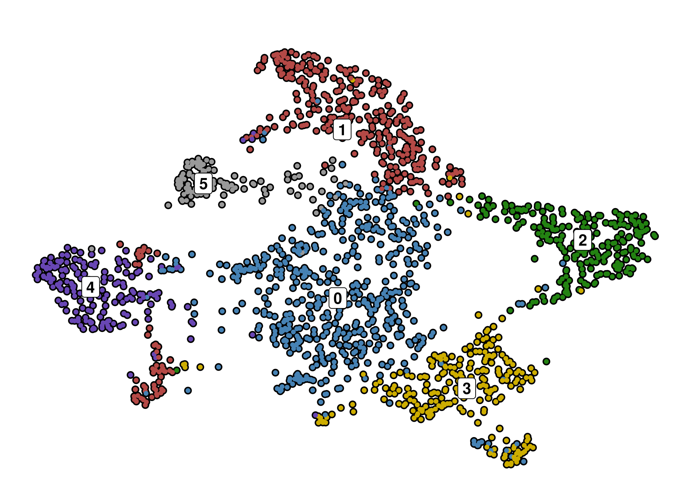<!-- -->

``` r
ggsave("../figures/LiSm_gd_UMAP_byCluster.pdf", width=3, height=3.5)
ggsave("../figures/LiSm_gd_UMAP_byCluster.png", dpi=600, width=3, height=3.5)
```

``` r
do_DimPlot(gd, group.by="disease")+
  scale_color_manual(values=pal_dis, labels=c("UC"="UC (A)"))+
  theme(legend.position=c(.8, .9))
```

    ## Scale for colour is already present.
    ## Adding another scale for colour, which will replace the existing scale.

    ## Warning: A numeric `legend.position` argument in `theme()` was deprecated in ggplot2
    ## 3.5.0.
    ## ℹ Please use the `legend.position.inside` argument of `theme()` instead.
    ## This warning is displayed once every 8 hours.
    ## Call `lifecycle::last_lifecycle_warnings()` to see where this warning was
    ## generated.

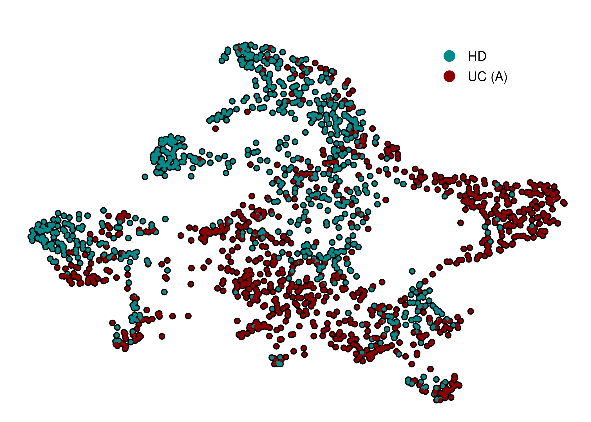<!-- -->

``` r
ggsave("../figures/LiSm_gd_UMAP_byDisease.pdf", width=3, height=3.5)
ggsave("../figures/LiSm_gd_UMAP_byDisease.png", dpi=600, width=3, height=3.5)
```

``` r
gd <- SetIdent(gd, value="cluster")
gd$cluster <- factor(gd$cluster, levels=c("C0", "C3", "C2", "C1", "C4", "C5"))

genes <- c( "ITGAE","ITGA1","CD160","GZMA","ID3","KIT","IRF8","GZMK","CD5",
            "CD27","ZNF683","FCGR3A", "GNLY", "NKG7","GZMB","PRF1","TBX21",
            "ZEB2",  "KLRG1", "ITGB2")

p <- DotPlot(gd, group.by="cluster", features=genes, scale=T)+
  scale_color_gradient2(low="navy", mid="beige", high="darkred", midpoint=0)+
  guides(color=guide_colorbar(frame.colour="black", frame.linewidth=.5, order=1,
                           ticks.colour="black", ticks.linewidth=.5,
                           title="Avg.\nScal.\nExpr."),
        size=guide_legend(override.aes=list(fill="white", shape=21),
                             title="% Expr.", order=2)
       )+
  geom_point(aes(size=pct.exp+6), shape=21,fill=NA, colour="black", stroke=0.25)+
  theme(axis.title=element_blank(),
        axis.ticks.length.x=unit(1.5, "mm"), legend.justification="top",
        panel.grid.major=element_line(color="gray95"))+
  coord_flip()+RotatedAxis()
```

    ## Scale for colour is already present.
    ## Adding another scale for colour, which will replace the existing scale.

``` r
p_1 <- gd@meta.data%>%mutate(cluster=factor(cluster, levels=levels(p$data$id)))%>%
ggplot(aes(x=cluster, fill=disease))+
  geom_bar(position="fill")+
  scale_fill_manual(values=pal_dis, labels=c("UC"="UC (A)"))+
  theme_void()+
  theme(text=element_text(size=18),,
        legend.title=element_blank(),
        legend.justification=c("left", "top"),
        legend.key.size=unit(4, "mm"),
        legend.spacing.y=unit(0.5, "mm"),
        plot.background=element_blank())+
  guides(fill=guide_legend(ncol=1, byrow=T))+
  geom_hline(yintercept=.5, linetype="dashed", linewidth=.75)

p/p_1+plot_layout(heights = c(1, 0.1))
```

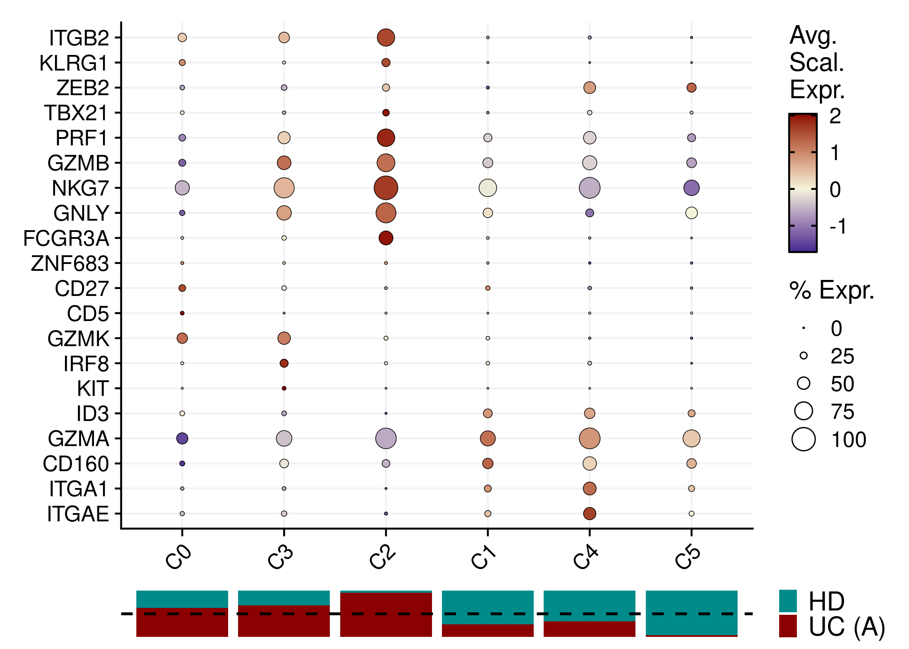<!-- -->

``` r
ggsave("../figures/LiSm_gd_DotPlot_1.pdf", width=3.5, height=5)
ggsave("../figures/LiSm_gd_DotPlot_1.png", dpi=600, width=3.5, height=5)
```

``` r
genes <- c("SELL", "S1PR1", "EOMES", "IFNG", "TNF", "CCR7", "PDCD1", "IL7R", "TCF7")

p <- DotPlot(gd, group.by="cluster", features=genes, scale=T)+
  scale_color_gradient2(low="navy", mid="beige", high="darkred", midpoint=0)+
  guides(color=guide_colorbar(frame.colour="black", frame.linewidth=.5, order=1,
                           ticks.colour="black", ticks.linewidth=.5,
                           title="Avg.\nScal.\nExpr."),
        size=guide_legend(override.aes=list(fill="white", shape=21),
                             title="% Expr.", order=2)
       )+
  geom_point(aes(size=pct.exp+4.25), shape=21,fill=NA, colour="black", stroke=0.25)+
  theme(axis.title=element_blank(),
        axis.ticks.length.x=unit(1.5, "mm"), legend.justification="top",
        panel.grid.major=element_line(color="gray95"))+
  coord_flip()+RotatedAxis()
```

    ## Scale for colour is already present.
    ## Adding another scale for colour, which will replace the existing scale.

``` r
p_1 <- gd@meta.data%>%mutate(cluster=factor(cluster, levels=levels(p$data$id)))%>%
ggplot(aes(x=cluster, fill=disease))+
  geom_bar(position="fill")+
  scale_fill_manual(values=pal_dis, labels=c("UC"="UC (A)"))+
  theme_void()+
  theme(text=element_text(size=14),,
        legend.title=element_blank(),
        legend.position=c(-.35, .6),
        legend.key.size=unit(4, "mm"),
        legend.spacing.y=unit(0.5, "mm"),
        plot.background=element_blank())+
  guides(fill=guide_legend(ncol=1, byrow=T))+
  geom_hline(yintercept=.5, linetype="dashed", linewidth=.75)

p/p_1+plot_layout(heights = c(1, 0.1))
```

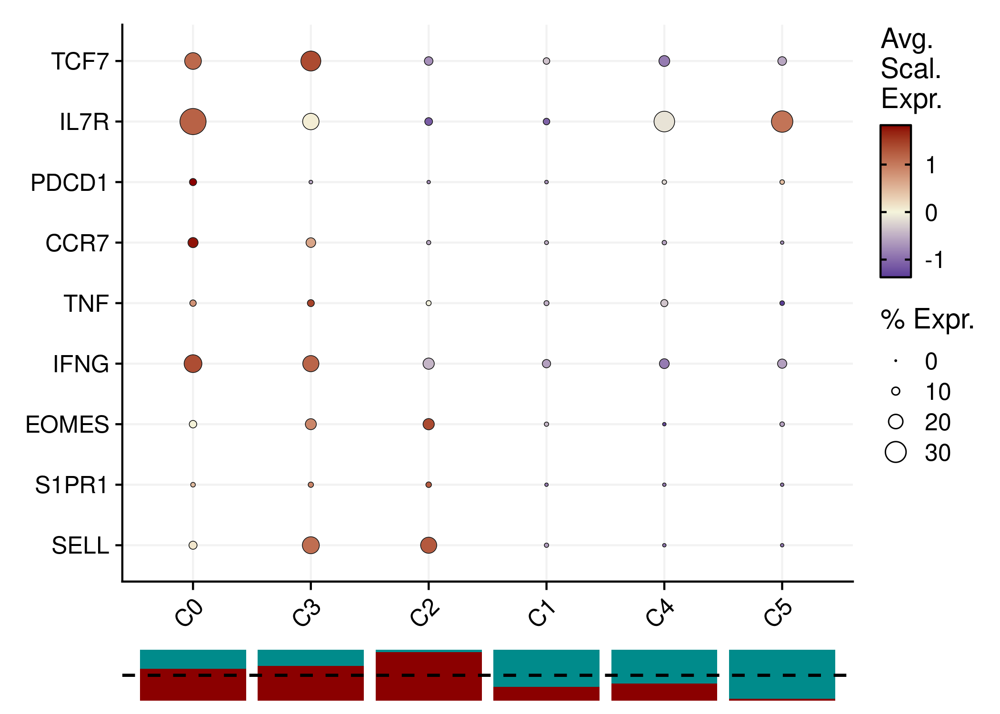<!-- -->

``` r
ggsave("../figures/LiSm_gd_DotPlot_2.pdf", width=3.25, height=3.5)
ggsave("../figures/LiSm_gd_DotPlot_2.png", dpi=600, width=3.25, height=3.5)

gd$cluster <- as.character(gd$cluster)
rm(p, p_1, genes)
```

``` r
p <- VlnPlot_scCustom(gd, sort=T, colors_use=pal_clu, group.by="cluster",
                      pt.size=0, num_columns=1, add.noise=F,
                      features=c("Vg4Vd1_1", "Vg9Vd2_1", "TRM1","cyto1"))&
  scale_y_continuous(expand=expansion(c(0.05, 0.05)))&
  geom_boxplot(width=.3, fill="white", outlier.shape=NA, coef=0, color="black")&
  labs(x=NULL)
```

    ## Scale for y is already present.
    ## Adding another scale for y, which will replace the existing scale.
    ## Scale for y is already present.
    ## Adding another scale for y, which will replace the existing scale.
    ## Scale for y is already present.
    ## Adding another scale for y, which will replace the existing scale.
    ## Scale for y is already present.
    ## Adding another scale for y, which will replace the existing scale.

``` r
p[[1]] <- p[[1]]+ggtitle("TRGV4-TRDV1 Signature")
p[[3]] <- p[[3]]+ggtitle("Tissue Residency\nSignature")
p[[2]] <- p[[2]]+ggtitle("TRGV9-TRDV2 Signature")
p[[4]] <- p[[4]]+ggtitle("Cytotoxicity and Cytokine\nProduction Signature")

for (i in seq_along(p)){
  p[[i]][["layers"]][[1]][["stat_params"]][["trim"]] <- FALSE
}
p
```

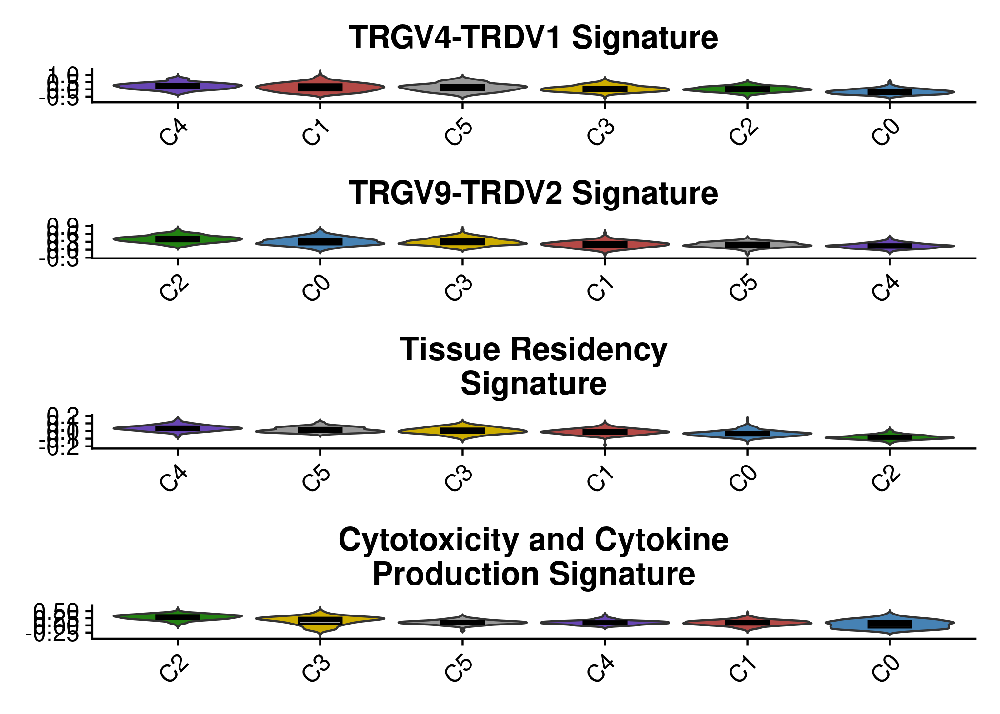<!-- -->

``` r
ggsave("../figures/LiSm_gdT_VlnPlots.pdf", width=3.25, height=10)
ggsave("../figures/LiSm_gdT_VlnPlots.png", dpi=600, width=3.25, height=10)
rm(p, i)
```

``` r
scores <- grep(colnames(gd@meta.data), patter="stem1$|effector1$", value=T)

p <- VlnPlot_scCustom(gd, features=scores, group.by = "cluster",
                 pt.size = 0, colors_use = pal_clu, sort=T,
                 add.noise=F, num_columns = 2)&
  theme(axis.title = element_blank(),
        axis.title.y = element_text(angle = 0, vjust = 0.5))&
  scale_y_continuous(expand = expansion(mult = c(0.05, 0.05)))&
  geom_boxplot(width=.4, fill="white", outlier.shape=NA, coef=0)
```

    ## Scale for y is already present.
    ## Adding another scale for y, which will replace the existing scale.
    ## Scale for y is already present.
    ## Adding another scale for y, which will replace the existing scale.
    ## Scale for y is already present.
    ## Adding another scale for y, which will replace the existing scale.
    ## Scale for y is already present.
    ## Adding another scale for y, which will replace the existing scale.
    ## Scale for y is already present.
    ## Adding another scale for y, which will replace the existing scale.
    ## Scale for y is already present.
    ## Adding another scale for y, which will replace the existing scale.
    ## Scale for y is already present.
    ## Adding another scale for y, which will replace the existing scale.
    ## Scale for y is already present.
    ## Adding another scale for y, which will replace the existing scale.
    ## Scale for y is already present.
    ## Adding another scale for y, which will replace the existing scale.

``` r
p[[1]] <- p[[1]]+ggtitle("Stem-Like\nSignature")
p[[2]] <- p[[2]]+ggtitle("Effector\nSignature")

for (i in 3:length(p)) {
  p[[i]] <- p[[i]] + ggtitle(NULL)
}


p[[1]] <- p[[1]] + ylab(bquote(atop("Siddiqui"~italic("et al."), "2019")))
p[[3]] <- p[[3]] + ylab(bquote(atop(plain("Im")~italic("et al."), "2016")))
p[[5]] <- p[[5]] + ylab(bquote(atop(plain("Wu")~italic("et al."), "2016")))
p[[7]] <- p[[7]] + ylab(bquote(atop(plain("Utzschneider"), italic("et al.")~"2016")))
p[[9]] <- p[[9]] + ylab(bquote(atop(plain("Li")~italic("et al."), "2024")))


for (i in seq_along(p)) {
  p[[i]][["layers"]][[1]][["stat_params"]][["trim"]] <- FALSE
}

p
```

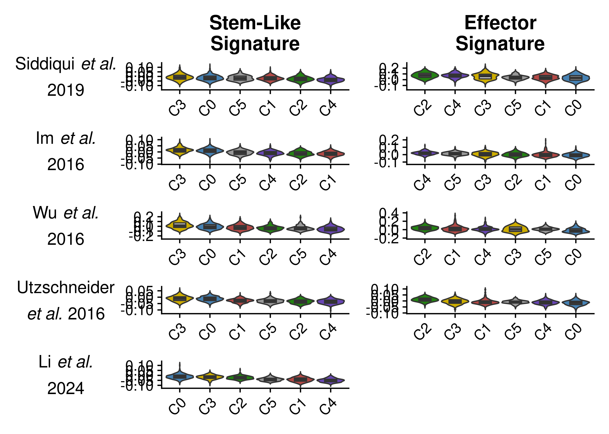<!-- -->

``` r
ggsave("../figures/LiSm_gdT_Stem_Effector_Signatures.pdf", width=6, height=9)
ggsave("../figures/LiSm_gdT_Stem_Effector_Signatures.png", dpi=600, width=6, height=9)

rm(i, scores)
```

``` r
do_DimPlot(gd, group.by="cohort")+
  theme(legend.position=c(.75, 1), legend.background=element_blank())
```

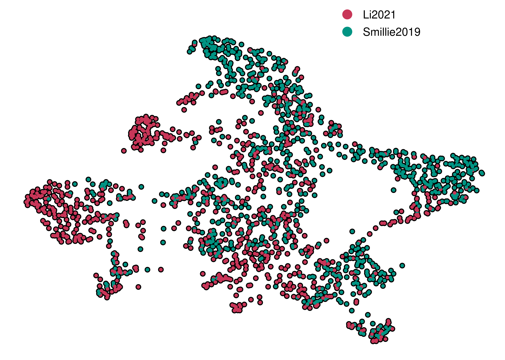<!-- -->

``` r
ggsave("../figures/LiSm_gd_UMAP_byCohort.pdf", width=3, height=3.5)
ggsave("../figures/LiSm_gd_UMAP_byCohort.png", dpi=600, width=3, height=3.5)
```

``` r
gd@meta.data%>%
  ggplot(aes(x=cluster, fill=diseaseID))+
  geom_bar(position="fill", color="white",size=.2)+
  scale_fill_manual(values=c(rep("#008B8B", 16), rep("#8B0000", 21)))+
  theme_classic()+
  scale_y_continuous(expand=expansion(c(0, 0)), name="Relative Proportion")+
  theme(axis.title.x=element_blank(), legend.position="none",
        axis.line.x=element_blank(), axis.ticks.x=element_blank(),
        axis.text=element_text(color="black"), axis.ticks.length=unit(2, "mm"),
        axis.ticks=element_line(color="black"), axis.text.x=element_text(vjust=3),
        )
```

    ## Warning: Using `size` aesthetic for lines was deprecated in ggplot2 3.4.0.
    ## ℹ Please use `linewidth` instead.
    ## This warning is displayed once every 8 hours.
    ## Call `lifecycle::last_lifecycle_warnings()` to see where this warning was
    ## generated.

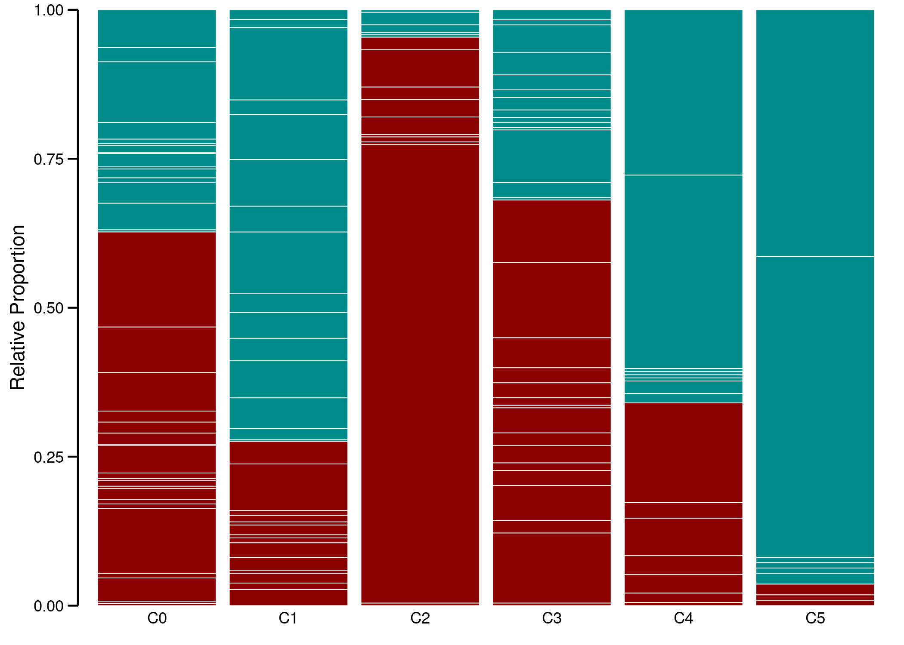<!-- -->

``` r
ggsave("../figures/LiSm_gd_BarPlot_ClusterByDonor.pdf", width=2.5, height=3)
ggsave("../figures/LiSm_gd_BarPlot_ClusterByDonor.png", width=2.5, height=3, dpi=600)
```

# Enterocytes

``` r
do_DimPlot(entero, group.by="disease", pt.size=.25)+
  scale_color_manual(values=pal_dis, labels=c("UC"="UC (A)"))+
  theme(legend.position=c(.8, .95))
```

    ## Scale for colour is already present.
    ## Adding another scale for colour, which will replace the existing scale.

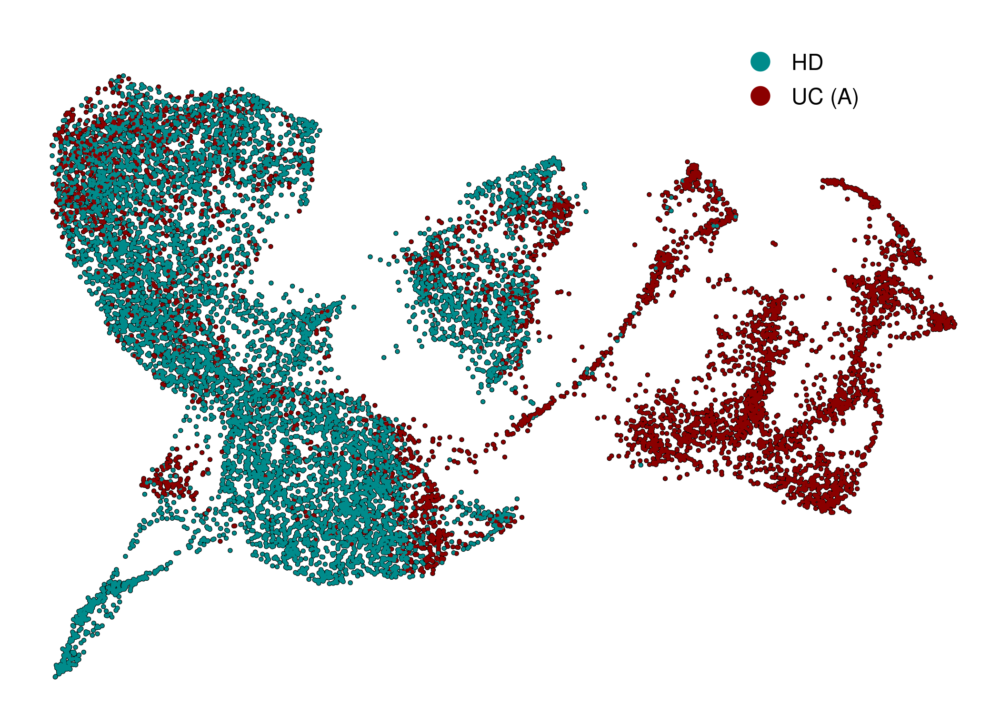<!-- -->

``` r
ggsave("../figures/LiSm_entero_UMAP_byDisease.pdf", width=3, height=3)
ggsave("../figures/LiSm_entero_UMAP_byDisease.png", dpi=600, width=3, height=3)
```

## Diff. Genes

``` r
Idents(entero) <- "disease"

UC_markers <- FindMarkers(entero, ident.1="UC")%>%rownames_to_column("gene")

geneLogSums <- log2(Matrix::rowMeans(GetAssayData(entero, "RNA", "counts")))
geneLogSums <- as.data.frame(geneLogSums)%>%rownames_to_column("gene")

UC_markers <- inner_join(UC_markers, geneLogSums, by="gene")%>%
  mutate(signif=case_when(
           p_val_adj < 0.05 & avg_log2FC > 0 ~ "up",
           p_val_adj < 0.05 & avg_log2FC < 0 ~ "down",
           .default = "ns"
         ),
         signif=factor(signif, levels = c("ns", "down", "up"))
         )
```

``` r
genes_up <- c("BTN2A1", "BTN3A1", "BTN3A3", "SLC37A3", "ICAM1", "IRF1",
              "IRF8", "JAK1", "JAK2", "STAT1", "STAT2", "PRKAA1", "PRKAA2")
genes_down <- c("BTNL3", "BTNL8", "HNF4A", "CDX2", "ABCA1")

ggplot()+
  geom_point(UC_markers%>%filter(signif == "ns"),
             mapping=aes(x=geneLogSums, y=avg_log2FC, color=signif), size=.5)+
    geom_point(UC_markers%>%filter(signif != "ns"),
             mapping=aes(x=geneLogSums, y=avg_log2FC, color=signif), size=.1)+
  theme_classic()+
  geom_hline(yintercept=0, linetype="dashed", color="red", size=1)+
  labs(x=expression("log"[2]*"(Mean Expression)"),
       y=expression("log"[2]*"(Fold Change)"),
       color=element_blank())+
  scale_color_manual(values = c("gray", "#008B8B", "#8B0000"))+
  guides(color = guide_legend(override.aes=list(size = 2), reverse=T))+
  theme(axis.text = element_text(color="black"), text=element_text(size=16),
        legend.position = c(0.85, 0.85))+
  
  ggrepel::geom_label_repel(data=UC_markers%>%filter(gene %in% genes_up), 
                           aes(label = gene, x=geneLogSums, y=avg_log2FC),
                           min.segment.length=0, nudge_y=1.5, nudge_x=0,
                           size = 3, max.overlaps=15)+
  ggrepel::geom_label_repel(data=UC_markers%>%filter(gene %in% genes_down), 
                           aes(label = gene, x=geneLogSums, y=avg_log2FC),
                           min.segment.length=0, nudge_y=-1, nudge_x=1.5,
                           size=3)
```

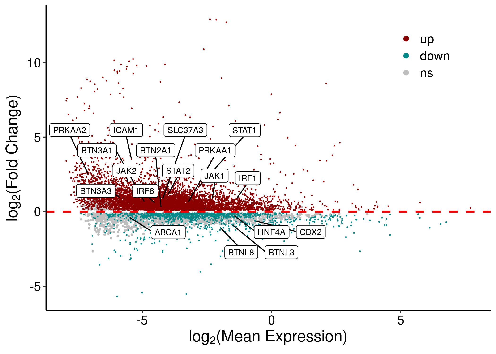<!-- -->

``` r
ggsave("../figures/LiSm_entero_MA_Plot.pdf", width=5, height=4)
ggsave("../figures/LiSm_entero_MA_Plot.png", dpi=600, width=5, height=4)

rm(UC_markers, geneLogSums, genes_down, genes_up)
```

``` r
p <- VlnPlot_scCustom(entero_pb, group.by = "disease", pt.size=0,
            colors_use=pal_dis, num_columns=3, adjust=1, add.noise=F,
            features=c("BTNL3", "HNF4A", "BTN3A1", "BTNL8", "CDX2", "BTN3A3"))&
  scale_y_continuous(expand = expansion(mult = c(0.05, 0.15)))&
  scale_x_discrete(labels=c("UC"="UC (A)"))&
  geom_boxplot(fill="white",width=.5, outlier.shape=NA, coef=0, color="black")&
  geom_jitter(width=.05, height=0, size=1.5, fill="white", shape=21)&
  theme(axis.title=element_blank(),plot.background=element_blank(),
        plot.title=element_text(face="plain"))
```

    ## Scale for y is already present.
    ## Adding another scale for y, which will replace the existing scale.
    ## Scale for y is already present.
    ## Adding another scale for y, which will replace the existing scale.
    ## Scale for y is already present.
    ## Adding another scale for y, which will replace the existing scale.
    ## Scale for y is already present.
    ## Adding another scale for y, which will replace the existing scale.
    ## Scale for y is already present.
    ## Adding another scale for y, which will replace the existing scale.
    ## Scale for y is already present.
    ## Adding another scale for y, which will replace the existing scale.

``` r
for (i in seq_along(p)){
  p[[i]][["layers"]][[1]][["stat_params"]][["trim"]] <- FALSE
}

test <-   function(pos=NULL){
  stat_compare_means(bracket.size=0, method = "t.test", label.y=pos,
  aes(label = ifelse(..p.. < 0.0001, "p<0.0001", paste0("p=", ..p.format..)))
                    )
                        }
p[[1]]<-p[[1]]+test(1.6)
p[[2]]<-p[[2]]+test(1.7)
p[[3]]<-p[[3]]+test(0.4)
p[[4]]<-p[[4]]+test(1.72)
p[[5]]<-p[[5]]+test(2)
p[[6]]<-p[[6]]+test(0.6)

p
```

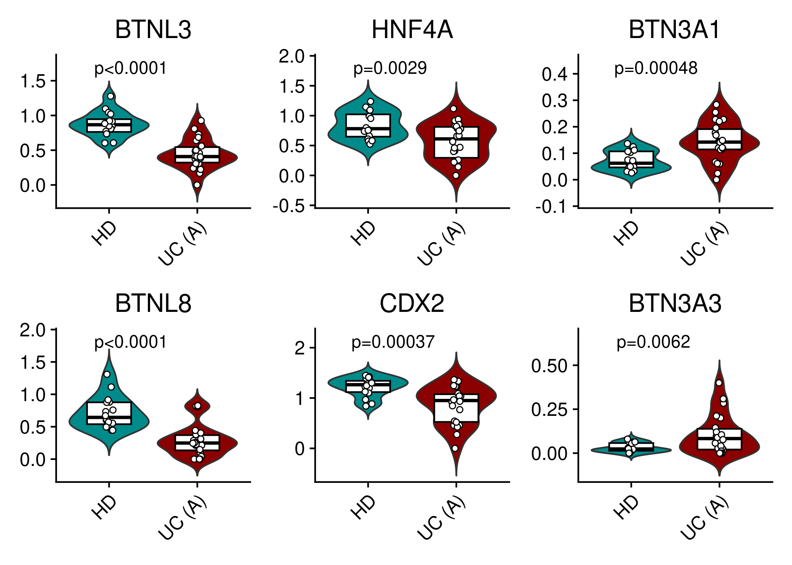<!-- -->

``` r
ggsave("../figures/LiSm_Entero_VlnPlots.pdf", width=6, height=5)
ggsave("../figures/LiSm_Entero_VlnPlots.png", dpi=600, width=6, height=5, bg="white")

rm(i, p, test)
```

``` r
genes <- c("SLC37A3", "ICAM1")

p <- VlnPlot_scCustom(entero_pb, group.by = "disease", pt.size=0,
            colors_use=pal_dis, num_columns=2, adjust=1, add.noise=F,
            features=genes)&
  scale_y_continuous(expand = expansion(mult = c(0.05, 0.15)))&
  scale_x_discrete(labels=c("UC"="UC (A)"))&
  geom_boxplot(fill="white",width=.5, outlier.shape=NA, coef=0, color="black")&
  geom_jitter(width=.05, height=0, size=1.5, fill="white", shape=21)&
  theme(axis.title=element_blank(),plot.background=element_blank(),
        plot.title=element_text(face="plain"))
```

    ## Scale for y is already present.
    ## Adding another scale for y, which will replace the existing scale.
    ## Scale for y is already present.
    ## Adding another scale for y, which will replace the existing scale.

``` r
for (i in seq_along(p)){
  p[[i]][["layers"]][[1]][["stat_params"]][["trim"]] <- FALSE
}

test <-   function(y.pos=NULL, x.pos=NULL){
  stat_compare_means(bracket.size=0, method = "t.test", label.y=y.pos, label.x=x.pos,
  aes(label = ifelse(..p.. < 0.0001, "p<0.0001", paste0("p=", ..p.format..)))
                    )
                        }
p[[1]]<-p[[1]]+test(x.pos=0.8)
p[[2]]<-p[[2]]+test(x.pos=0.8)

p
```

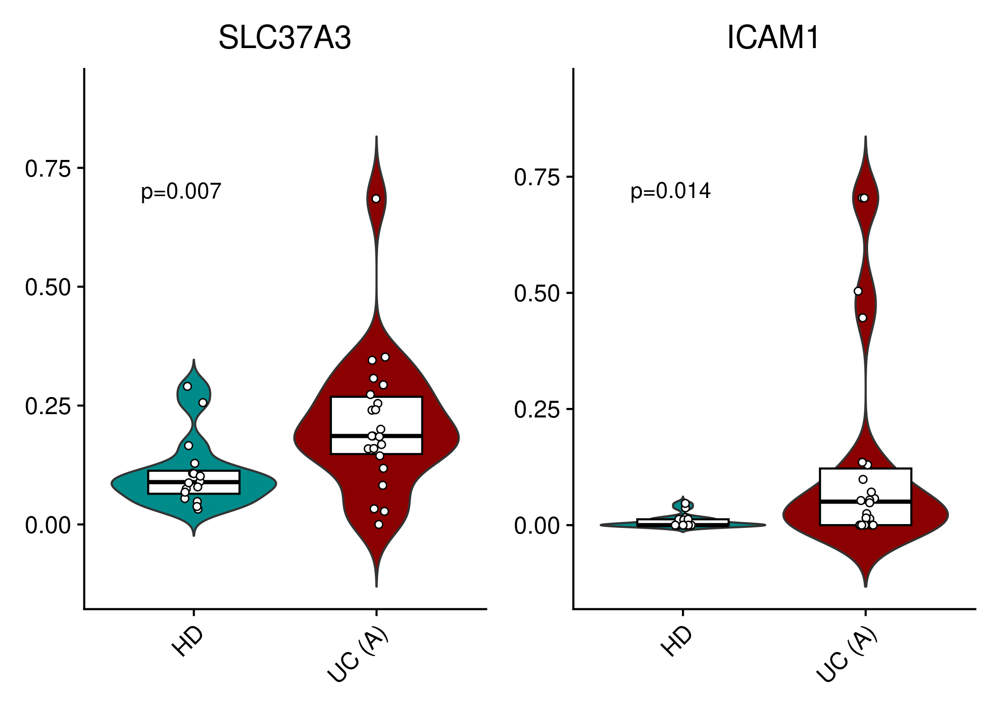<!-- -->

``` r
ggsave("../figures/LiSm_Entero_VlnPlots_2.pdf", width=4, height=2.5)
ggsave("../figures/LiSm_Entero_VlnPlots_2.png", dpi=600, width=4, height=2.5, bg="white")

rm(p, i, test, genes)
```

## GSEA

``` r
gsea <- readRDS("../../data_processed/Li21_Smillie19_Integrated/GSEA.Rds")

# TCA
gseaplot(gsea, geneSetID="R-HSA-71403", by="runningScore",
         title=gsea@result%>%filter(ID=="R-HSA-71403")%>%pull(Description))+
  annotate(geom="text", x=8500, y=.15, label=paste0("p = ",
    gsea@result%>%filter(ID=="R-HSA-71403")%>%pull(p.adjust)%>%signif(2)),
    size=5)+
  scale_x_continuous(expand=expansion(mult=c(0.05, .1)))+
  theme(plot.title=element_text(face="bold"))
```

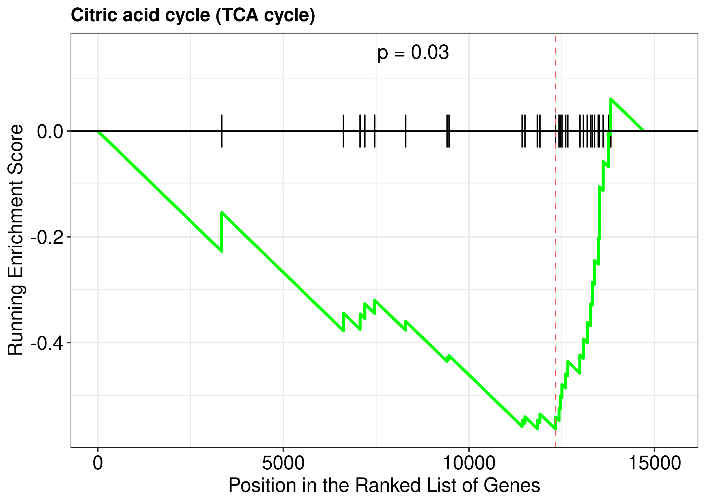<!-- -->

``` r
ggsave("../figures/LiSm_entero_GSEA_TCA.pdf", width=6, height=4)
ggsave("../figures/LiSm_entero_GSEA_TCA.png", dpi=600,  width=6, height=4)

# Mito Fatty
gseaplot(gsea, geneSetID="R-HSA-77289", by="runningScore",
         title=gsea@result%>%filter(ID=="R-HSA-77289")%>%pull(Description))+
  annotate(geom="text", x=8500, y=.15, label=paste0("p = ",
    gsea@result%>%filter(ID=="R-HSA-77289")%>%pull(p.adjust)%>%signif(2)),
    size=5)+
  scale_x_continuous(expand=expansion(mult=c(0.05, .1)))+
  theme(plot.title=element_text(face="bold"))
```

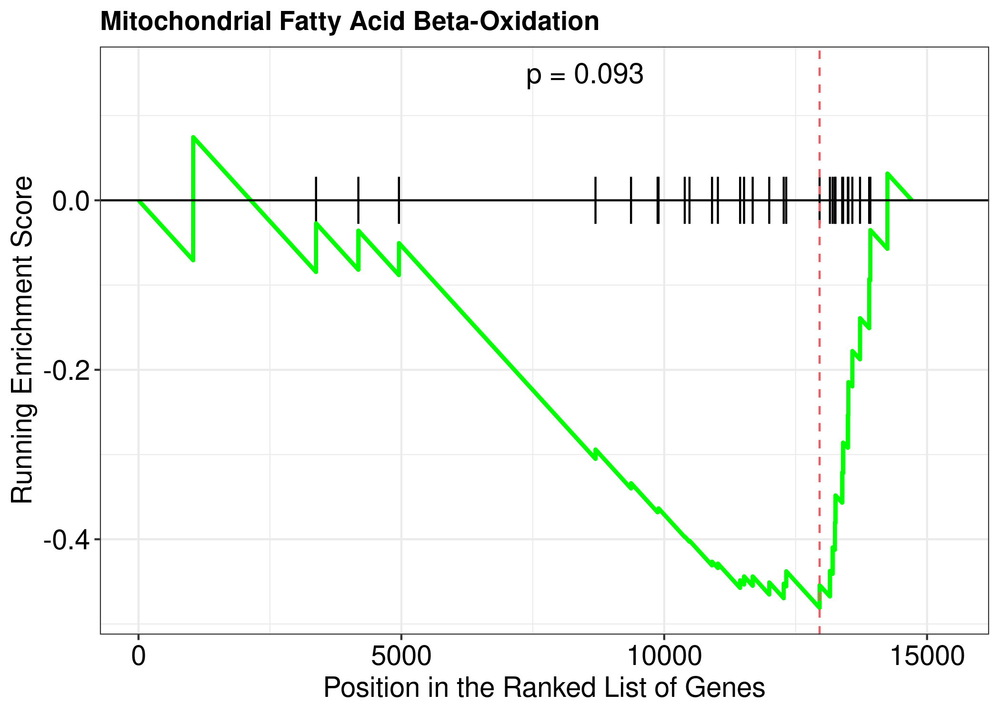<!-- -->

``` r
ggsave("../figures/LiSm_entero_GSEA_BetaOx.pdf", width=6, height=4)
ggsave("../figures/LiSm_entero_GSEA_BetaOx.png", dpi=600,  width=6, height=4)

rm(gsea)
```

``` r
FeaturePlot_scCustom(entero, features=c("BTNL3", "BTNL8", "BTN2A1", "BTN3A1", "BTN3A3"), 
                     na_color="#2A0134", pt.size=.1,
                     colors_use=c("#6900A8FF", "#B02991FF", "#E16462FF","#FCA636FF", "#F0F921FF"))&
  NoLegend()&NoAxes()
```

    ## 
    ## NOTE: FeaturePlot_scCustom uses a specified `na_cutoff` when plotting to
    ## color cells with no expression as background color separate from color scale.
    ## Please ensure `na_cutoff` value is appropriate for feature being plotted.
    ## Default setting is appropriate for use when plotting from 'RNA' assay.
    ## When `na_cutoff` not appropriate (e.g., module scores) set to NULL to
    ## plot all cells in gradient color palette.
    ## 
    ## -----This message will be shown once per session.-----

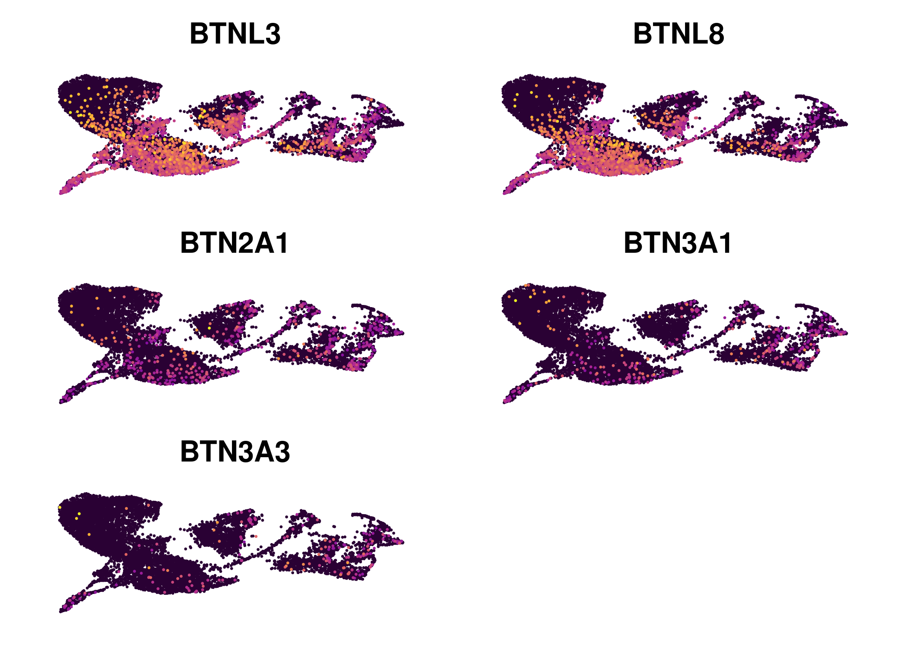<!-- -->

``` r
ggsave("../figures/LiSm_entero_FeaturePlot_BTNs.pdf", width=5, height=6.5)
ggsave("../figures/LiSm_entero_FeaturePlot_BTNs.png", width=5, height=6.5, dpi=600)
```

``` r
do_DimPlot(entero, group.by="cohort", pt.size=.25)+
  theme(legend.position=c(.75, .98), legend.background=element_blank())
```

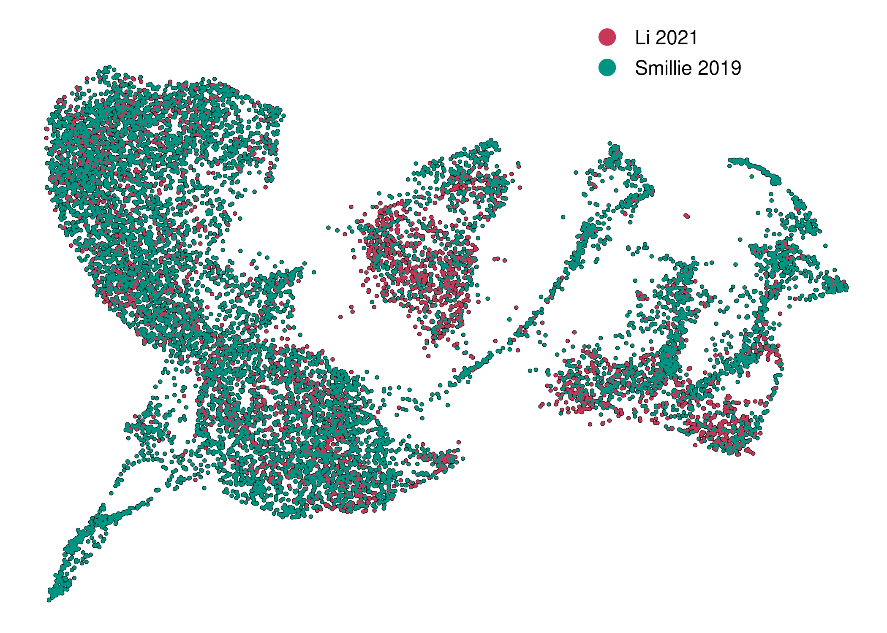<!-- -->

``` r
ggsave("../figures/LiSm_entero_UMAP_byCohort.png", dpi=600, width=3, height=3.5)
ggsave("../figures/LiSm_entero_UMAP_byCohort.pdf", width=3, height=3.5)
```

``` r
entero@meta.data%>%
  unite("disease_cohort", disease, cohort, sep="_")%>%
  ggplot(aes(x=disease_cohort, fill=diseaseID))+
  geom_bar(position="fill", color="white",size=.2)+
  scale_fill_manual(values=c(rep("#008B8B", 16), rep("#8B0000", 22)))+
  theme_classic()+
  scale_y_continuous(expand=expansion(c(0, 0)), name="Relative Proportion")+
  theme(axis.title.x=element_blank(), legend.position="none",
        axis.line.x=element_blank(), 
        axis.text=element_text(color="black"), axis.ticks.length=unit(2, "mm"),
        axis.ticks=element_line(color="black"),
        )+
  RotatedAxis()
```

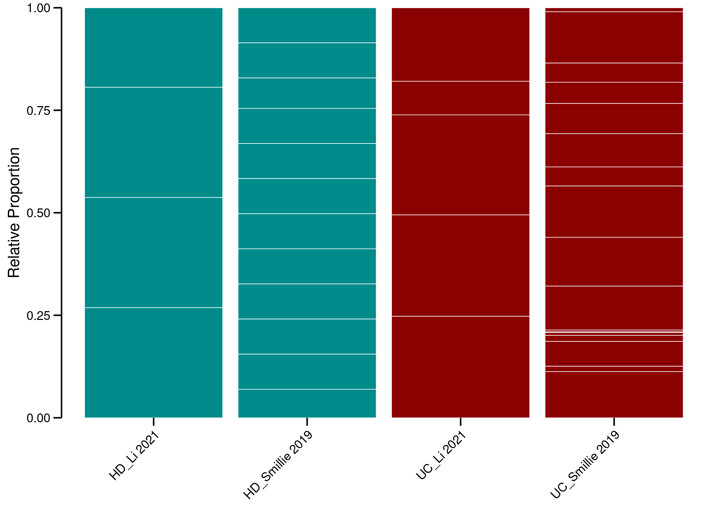<!-- -->

``` r
ggsave("../figures/LiSm_entero_BarPlot_DiseaseCohortByDonor.pdf", width=2, height=3)
ggsave("../figures/LiSm_entero_BarPlot_DiseaseCohortByDonor.png", width=2, height=3, dpi=600)
```

``` r
sessionInfo()
```

    ## R version 4.4.0 (2024-04-24)
    ## Platform: x86_64-pc-linux-gnu
    ## Running under: Ubuntu 22.04.4 LTS
    ## 
    ## Matrix products: default
    ## BLAS:   /usr/lib/x86_64-linux-gnu/blas/libblas.so.3.10.0 
    ## LAPACK: /usr/lib/x86_64-linux-gnu/lapack/liblapack.so.3.10.0
    ## 
    ## locale:
    ##  [1] LC_CTYPE=en_US.UTF-8       LC_NUMERIC=C              
    ##  [3] LC_TIME=de_DE.UTF-8        LC_COLLATE=en_US.UTF-8    
    ##  [5] LC_MONETARY=de_DE.UTF-8    LC_MESSAGES=en_US.UTF-8   
    ##  [7] LC_PAPER=de_DE.UTF-8       LC_NAME=C                 
    ##  [9] LC_ADDRESS=C               LC_TELEPHONE=C            
    ## [11] LC_MEASUREMENT=de_DE.UTF-8 LC_IDENTIFICATION=C       
    ## 
    ## time zone: Europe/Berlin
    ## tzcode source: system (glibc)
    ## 
    ## attached base packages:
    ## [1] stats     graphics  grDevices utils     datasets  methods   base     
    ## 
    ## other attached packages:
    ##  [1] enrichplot_1.24.0  patchwork_1.2.0    ggpubr_0.6.0       lubridate_1.9.3   
    ##  [5] forcats_1.0.0      stringr_1.5.1      dplyr_1.1.4        purrr_1.0.2       
    ##  [9] readr_2.1.5        tidyr_1.3.1        tibble_3.2.1       ggplot2_3.5.1     
    ## [13] tidyverse_2.0.0    scCustomize_2.1.2  SCpubr_2.0.2       Seurat_5.1.0      
    ## [17] SeuratObject_5.0.2 sp_2.1-4          
    ## 
    ## loaded via a namespace (and not attached):
    ##   [1] fs_1.6.4                matrixStats_1.3.0       spatstat.sparse_3.0-3  
    ##   [4] HDO.db_0.99.1           httr_1.4.7              RColorBrewer_1.1-3     
    ##   [7] tools_4.4.0             sctransform_0.4.1       backports_1.4.1        
    ##  [10] utf8_1.2.4              R6_2.5.1                lazyeval_0.2.2         
    ##  [13] uwot_0.2.2              withr_3.0.0             gridExtra_2.3          
    ##  [16] progressr_0.14.0        cli_3.6.2               Biobase_2.64.0         
    ##  [19] spatstat.explore_3.2-7  fastDummies_1.7.3       scatterpie_0.2.2       
    ##  [22] labeling_0.4.3          spatstat.data_3.0-4     ggridges_0.5.6         
    ##  [25] pbapply_1.7-2           yulab.utils_0.1.4       DOSE_3.30.1            
    ##  [28] parallelly_1.37.1       limma_3.60.2            rstudioapi_0.16.0      
    ##  [31] RSQLite_2.3.6           generics_0.1.3          gridGraphics_0.5-1     
    ##  [34] shape_1.4.6.1           ica_1.0-3               spatstat.random_3.2-3  
    ##  [37] car_3.1-2               GO.db_3.19.1            Matrix_1.6-5           
    ##  [40] ggbeeswarm_0.7.2        fansi_1.0.6             S4Vectors_0.42.0       
    ##  [43] abind_1.4-5             lifecycle_1.0.4         yaml_2.3.8             
    ##  [46] snakecase_0.11.1        carData_3.0-5           qvalue_2.36.0          
    ##  [49] Rtsne_0.17              paletteer_1.6.0         grid_4.4.0             
    ##  [52] blob_1.2.4              promises_1.3.0          crayon_1.5.2           
    ##  [55] miniUI_0.1.1.1          lattice_0.22-5          cowplot_1.1.3          
    ##  [58] KEGGREST_1.44.0         pillar_1.9.0            knitr_1.46             
    ##  [61] fgsea_1.30.0            future.apply_1.11.2     codetools_0.2-19       
    ##  [64] fastmatch_1.1-4         leiden_0.4.3.1          glue_1.7.0             
    ##  [67] ggfun_0.1.4             data.table_1.15.4       vctrs_0.6.5            
    ##  [70] png_0.1-8               treeio_1.28.0           spam_2.10-0            
    ##  [73] gtable_0.3.5            assertthat_0.2.1        rematch2_2.1.2         
    ##  [76] cachem_1.1.0            xfun_0.44               mime_0.12              
    ##  [79] tidygraph_1.3.1         survival_3.7-0          statmod_1.5.0          
    ##  [82] fitdistrplus_1.1-11     ROCR_1.0-11             nlme_3.1-165           
    ##  [85] ggtree_3.12.0           bit64_4.0.5             RcppAnnoy_0.0.22       
    ##  [88] GenomeInfoDb_1.40.0     irlba_2.3.5.1           vipor_0.4.7            
    ##  [91] KernSmooth_2.23-24      colorspace_2.1-0        BiocGenerics_0.50.0    
    ##  [94] DBI_1.2.2               ggrastr_1.0.2           tidyselect_1.2.1       
    ##  [97] bit_4.0.5               compiler_4.4.0          plotly_4.10.4          
    ## [100] shadowtext_0.1.3        scales_1.3.0            lmtest_0.9-40          
    ## [103] digest_0.6.35           goftest_1.2-3           presto_1.0.0           
    ## [106] spatstat.utils_3.0-4    rmarkdown_2.27          XVector_0.44.0         
    ## [109] htmltools_0.5.8.1       pkgconfig_2.0.3         highr_0.10             
    ## [112] fastmap_1.2.0           rlang_1.1.3             GlobalOptions_0.1.2    
    ## [115] htmlwidgets_1.6.4       UCSC.utils_1.0.0        shiny_1.8.1.1          
    ## [118] farver_2.1.2            zoo_1.8-12              jsonlite_1.8.8         
    ## [121] BiocParallel_1.38.0     GOSemSim_2.30.0         magrittr_2.0.3         
    ## [124] GenomeInfoDbData_1.2.12 ggplotify_0.1.2         dotCall64_1.1-1        
    ## [127] munsell_0.5.1           Rcpp_1.0.12             ape_5.8                
    ## [130] viridis_0.6.5           reticulate_1.37.0       stringi_1.8.4          
    ## [133] ggraph_2.2.1            zlibbioc_1.50.0         MASS_7.3-60            
    ## [136] plyr_1.8.9              parallel_4.4.0          listenv_0.9.1          
    ## [139] ggrepel_0.9.5           deldir_2.0-4            Biostrings_2.72.0      
    ## [142] graphlayouts_1.1.1      splines_4.4.0           tensor_1.5             
    ## [145] hms_1.1.3               circlize_0.4.16         igraph_2.0.3           
    ## [148] spatstat.geom_3.2-9     ggsignif_0.6.4          RcppHNSW_0.6.0         
    ## [151] reshape2_1.4.4          stats4_4.4.0            evaluate_0.23          
    ## [154] ggprism_1.0.5           tzdb_0.4.0              tweenr_2.0.3           
    ## [157] httpuv_1.6.15           RANN_2.6.1              polyclip_1.10-6        
    ## [160] future_1.33.2           scattermore_1.2         ggforce_0.4.2          
    ## [163] janitor_2.2.0           broom_1.0.6             xtable_1.8-4           
    ## [166] RSpectra_0.16-1         tidytree_0.4.6          rstatix_0.7.2          
    ## [169] later_1.3.2             viridisLite_0.4.2       aplot_0.2.2            
    ## [172] memoise_2.0.1           beeswarm_0.4.0          AnnotationDbi_1.66.0   
    ## [175] IRanges_2.38.0          cluster_2.1.6           timechange_0.3.0       
    ## [178] globals_0.16.3
