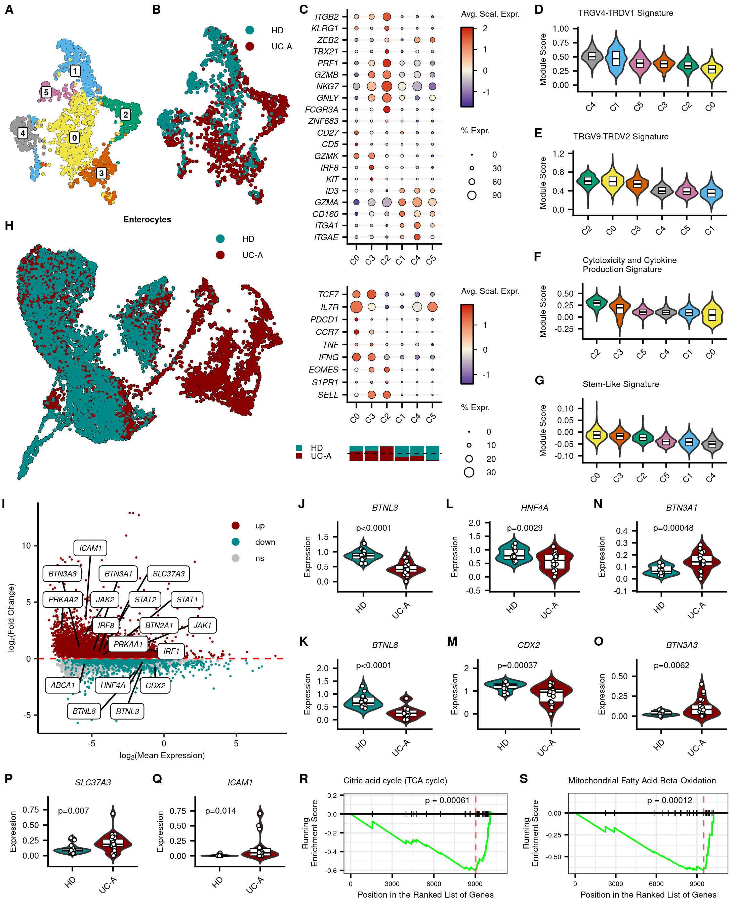
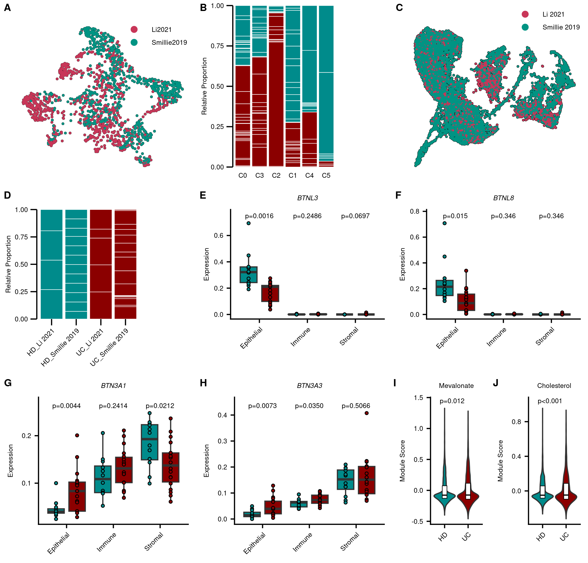

Integrated Datasets (Li 2021, Smillie 2019): Code for Figures
================

``` r
library(Seurat)
library(SCpubr)
library(scCustomize)
library(tidyverse)
library(ggpubr)
library(patchwork)
library(enrichplot)
```

# Data

``` r
entero <- readRDS("../../data_processed/Li21_Smillie19_Integrated/enterocytes.Rds")
gd <- readRDS("../../data_processed/Li21_Smillie19_Integrated/gdTcells.Rds")
```

# Palettes/Parameters

``` r
pal_dis <- c("HD"="#008B8B","UC"="#8B0000")
pal_SeuClu <- c("0"="#F0E442","1"="#56B4E9","2"="#009E73","3"="#D55E00", 
            "4"=  "#999999","5"= "#CC79A7")
pal_clu <- c("C0"="#F0E442","C1"="#56B4E9","C2"="#009E73","C3"="#D55E00", 
            "C4"=  "#999999","C5"= "#CC79A7")
names_dis <- c("UC"="UC-A")
```

# Enterocytes Pseudobulk

``` r
entero_pb <- AggregateExpression(entero, group.by = c("disease", "ID"),
                                 return.seurat=T)
```

# Fig 5

\##ABH

``` r
# a
 a <- do_DimPlot(gd,
                 group.by="seurat_clusters",
                 colors.use=pal_SeuClu,
                 label=T,
                 legend.position="none",
                 label.size=2.12,
                 pt.size=.25
                 )

b <- do_DimPlot(gd,
                group.by="disease",
                pt.size=.25,
                legend.icon.size=2.12
                )+
  scale_color_manual(values=pal_dis, labels=c("UC"="UC-A"))+
  theme(legend.position=c(.8, .9),
        legend.background=element_blank(),
        legend.key.spacing.y=unit(-2, "mm"),
        legend.text=element_text(size=6),
        text=element_text(size=6)
        )

ab <- ggarrange(a, b,
                labels=c("A", "B"),
                font.label=list(size=9, face="bold", family="sans")
                )

# h
h <- do_DimPlot(entero,
                group.by="disease",
                pt.size=.1,
                border.size=4.5,
                legend.icon.size=2.12
                )+
  scale_color_manual(values=pal_dis, labels=c("UC"="UC-A"))+
  labs(title="Enterocytes")+
  theme(legend.position=c(.8, .95),
        legend.background=element_blank(),
        legend.key.spacing.y=unit(-2, "mm"),
        text=element_text(size=6),
        legend.text=element_text(size=6),
        plot.title=element_text(hjust=.5, size=6)
        )

abh <- ggarrange(ab, h,
                 ncol=1, nrow=2, font.label=list(size=9, face="bold", family="sans"),
                 labels=c("", "H"),
                 heights=c(7, 9)
                 )
```

## C

``` r
gd <- SetIdent(gd, value="cluster")
gd$cluster <- factor(gd$cluster, levels=c("C0", "C3", "C2", "C1", "C4", "C5"))

genes <- c( "ITGAE","ITGA1","CD160","GZMA","ID3","KIT","IRF8","GZMK","CD5",
            "CD27","ZNF683","FCGR3A", "GNLY", "NKG7","GZMB","PRF1","TBX21",
            "ZEB2",  "KLRG1", "ITGB2")

c1 <- DotPlot(gd,
              group.by="cluster",
              features=genes,
              dot.scale=3.25
              )+
  scale_color_gradient2(low="navy", mid="beige", high="red3", midpoint=0)+
  guides(color=guide_colorbar(frame.colour="black",
                              frame.linewidth=.5,
                              ticks.colour="black",
                              ticks.linewidth=.25,
                              barwidth=.6,
                              barheight=unit(2, "cm"),
                              order=1,
                              title="Avg. Scal. Expr."
                              ),
        size=guide_legend(override.aes=list(fill="white", shape=21),
                          title="% Expr.",
                          order=2
                          )
       )+
  geom_point(aes(size=pct.exp+20),
             shape=21,
             fill=NA,
             colour="black",
             stroke=0.25
             )+
  theme(axis.title=element_blank(),
        axis.ticks.length.x=unit(1.5, "mm"),
        legend.justification="top",
        legend.key.spacing.y=unit(-2, "mm"),
        panel.grid.major=element_line(color="gray95"),
        text=element_text(size=6),
        axis.text=element_text(size=6),
        axis.text.y=element_text(face="italic"),
        legend.ticks.length=unit(c(-1, 0), "mm"),
        legend.text=element_text(size=6)
        )+
  coord_flip()+
  RotatedAxis()

# C2
genes <- c("SELL", "S1PR1", "EOMES", "IFNG", "TNF", "CCR7", "PDCD1", "IL7R", "TCF7")

c2_1 <- DotPlot(gd,
              group.by="cluster",
              features=genes,
              dot.scale=3.75
              )+
  scale_color_gradient2(low="navy", mid="beige", high="red3", midpoint=0)+
  guides(color=guide_colorbar(frame.colour="black",
                              frame.linewidth=.5,
                              ticks.colour="black",
                              ticks.linewidth=.25,
                              barheight=unit(2, "cm"),
                              barwidth=.6,
                              title="Avg. Scal. Expr.",
                              order=1
                              ),
        size=guide_legend(override.aes=list(fill="white", shape=21),
                          title="% Expr.",
                          order=2
                          )
       )+
  geom_point(aes(size=pct.exp+4),
             shape=21,
             fill=NA,
             colour="black",
             stroke=0.25)+
  theme(axis.title=element_blank(),
        axis.ticks.length.x=unit(1.5, "mm"),
        legend.justification=c("top"),
        legend.key.spacing.y=unit(-2, "mm"),
        legend.key.width=unit(4, "mm"),
        panel.grid.major=element_line(color="gray95"),
        text=element_text(size=6),
        axis.text=element_text(size=6),,
        axis.text.y=element_text(face="italic"),
        legend.ticks.length=unit(c(-1, 0), "mm"),
        legend.text=element_text(size=6)
        )+
  coord_flip()+
  RotatedAxis()


c2_2 <- gd@meta.data%>%mutate(cluster=factor(cluster, levels=levels(c2_1$data$id)))%>%
  ggplot(aes(x=cluster, fill=disease))+
  geom_bar(position="fill")+
  scale_fill_manual(values=pal_dis, labels=c("UC"="UC-A"))+
  theme_void()+
  theme(text=element_text(size=6),,
        legend.title=element_blank(),
        legend.position=c(-.35, .6),
        legend.key.size=unit(2, "mm"),
        legend.spacing.y=unit(0.5, "mm"),
        legend.text=element_text(size=6),
        plot.background=element_blank()
        )+
  guides(fill=guide_legend(ncol=1, byrow=T))+
  geom_hline(yintercept=.5, linetype="dashed", linewidth=.35)

c <- ggarrange(c1, c2_1, c2_2,
               ncol=1, nrow=3, heights=c(3.5, 2, .75),
               font.label=list(size=9, family="sans", face="bold"),
               labels=c("C", "", ""),
               align="hv"
               )
```

## D-G

``` r
defg <- VlnPlot_scCustom(gd,
                         sort=T,
                         colors_use=pal_clu,
                         group.by="cluster",
                         pt.size=0,
                         num_columns=1,
                         add.noise=F,
                         features=c("Vg4Vd1_1", "Vg9Vd2_1", "cyto1", "li_stem1")
                         )&
  scale_y_continuous(expand=expansion(c(0.05, 0.05)))&
  geom_boxplot(width=.3, fill="white", outlier.shape=NA, coef=0, color="black", size=.25)&
  theme(plot.subtitle=element_text(face="italic", size=6),
        plot.title=element_text(hjust=0, size=6, face="plain"),
        text=element_text(size=6),
        axis.text=element_text(size=6)
        )&
  labs(x=NULL, y="Module Score")
  
defg[[1]] <- defg[[1]]+ggtitle("TRGV4-TRDV1 Signature")
defg[[2]] <- defg[[2]]+ggtitle("TRGV9-TRDV2 Signature")
defg[[3]] <- defg[[3]]+ggtitle("Cytotoxicity and Cytokine\nProduction Signature")
defg[[4]] <- defg[[4]]+labs(title="Stem-Like Signature")


for (i in seq_along(defg)){
  defg[[i]][["layers"]][[1]][["stat_params"]][["trim"]] <- FALSE
}

defg <- ggarrange(defg[[1]], defg[[2]], defg[[3]], defg[[4]],
                  ncol=1, nrow=4, font.label=list(size=9, face="bold", family="sans"),
                  labels=c("D", "E", "F", "G")
                  )
```

## A-H

``` r
abcdefgh <- ggarrange(abh, c, defg,
                      ncol=3, nrow=1, widths=c(4, 3.2, 2.8)
                      )
```

## I

``` r
Idents(entero) <- "disease"

UC_markers <- FindMarkers(entero, ident.1="UC")%>%rownames_to_column("gene")

geneLogSums <- log2(Matrix::rowMeans(GetAssayData(entero, "RNA", "counts")))
geneLogSums <- as.data.frame(geneLogSums)%>%rownames_to_column("gene")

UC_markers <- inner_join(UC_markers, geneLogSums, by="gene")%>%
  mutate(signif=case_when(
           p_val_adj < 0.05 & avg_log2FC > 0 ~ "up",
           p_val_adj < 0.05 & avg_log2FC < 0 ~ "down",
           .default = "ns"
         ),
         signif=factor(signif, levels = c("ns", "down", "up"))
         )

genes_up <- c("BTN2A1", "BTN3A1", "BTN3A3", "SLC37A3", "ICAM1", "IRF1",
              "IRF8", "JAK1", "JAK2", "STAT1", "STAT2", "PRKAA1", "PRKAA2")
genes_down <- c("BTNL3", "BTNL8", "HNF4A", "CDX2", "ABCA1")

I <- ggplot()+
  geom_point(UC_markers%>%filter(signif == "ns"),
             mapping=aes(x=geneLogSums, y=avg_log2FC, color=signif),
             size=.5
             )+
  geom_point(UC_markers%>%filter(signif != "ns"),
             mapping=aes(x=geneLogSums, y=avg_log2FC, color=signif),
             size=.1
             )+
  theme_classic()+
  geom_hline(yintercept=0, linetype="dashed", color="red", size=.5)+
  labs(x=expression("log"[2]*"(Mean Expression)"),
       y=expression("log"[2]*"(Fold Change)"),
       color=element_blank())+
  scale_color_manual(values = c("gray", "#008B8B", "#8B0000"))+
  guides(color=guide_legend(override.aes=list(size = 2), reverse=T))+
  theme(axis.text=element_text(color="black", size=6),
        text=element_text(size=6),
        legend.position = c(0.85, 0.85),
        legend.key.spacing.y=unit(-2, "mm"),
        legend.text=element_text(size=6)
        )+
  
  ggrepel::geom_label_repel(data=UC_markers%>%filter(gene %in% genes_up), 
                           aes(label = gene, x=geneLogSums, y=avg_log2FC, fontface="italic"),
                           min.segment.length=0, nudge_y=1.5, nudge_x=1,
                           size=1.9, max.overlaps=20)+
  ggrepel::geom_label_repel(data=UC_markers%>%filter(gene %in% genes_down), 
                           aes(label = gene, x=geneLogSums, y=avg_log2FC, fontface="italic"),
                           min.segment.length=0, nudge_y=-2, nudge_x=-1.5,
                           size=1.9)
```

## J-O

``` r
jklmo <- VlnPlot_scCustom(entero_pb,
                          group.by="disease",
                          pt.size=0,
                          colors_use=pal_dis,
                          num_columns=3,
                          adjust=1,
                          add.noise=F,
                          features=c("BTNL3", "HNF4A", "BTN3A1", "BTNL8", "CDX2", "BTN3A3")
                          )&
  scale_y_continuous(expand=expansion(mult=c(0.05, 0.15)))&
  scale_x_discrete(labels=c("UC"="UC-A"))&
  geom_boxplot(fill="white", width=.5, outlier.shape=NA, coef=0, color="black", size=.25)&
  geom_jitter(width=.05, height=0, size=1, fill="white", shape=21)&
  labs(y="Expression")&
  theme(axis.title.x=element_blank(),
        plot.background=element_blank(),
        plot.title=element_text(face="italic", size=6),
        text=element_text(size=6),
        axis.text=element_text(size=6)
        )

for (i in seq_along(jklmo)){
  jklmo[[i]][["layers"]][[1]][["stat_params"]][["trim"]] <- FALSE
}

test <-   function(pos=NULL){
  stat_compare_means(bracket.size=0, method = "t.test", label.y=pos, size=2.12,
  aes(label = ifelse(..p.. < 0.0001, "p<0.0001", paste0("p=", ..p.format..)))
                    )
                        }
jklmo[[1]]<-jklmo[[1]]+test(1.7)
jklmo[[2]]<-jklmo[[2]]+test(1.7)
jklmo[[3]]<-jklmo[[3]]+test(0.4)
jklmo[[4]]<-jklmo[[4]]+test(2)
jklmo[[5]]<-jklmo[[5]]+test(2)
jklmo[[6]]<-jklmo[[6]]+test(0.6)

jklmo <- ggarrange(jklmo[[1]], jklmo[[2]], jklmo[[3]], jklmo[[4]], jklmo[[5]], jklmo[[6]],
                   ncol=3, nrow=2, font.label=list(size=9, family="sans", face="bold"),
                   labels=c("J", "L", "N", "K", "M", "O")
                   )
```

## I-O

``` r
ijklmo <- ggarrange(I, jklmo,
                    ncol=2, nrow=1, font.label=list(size=9, face="bold", family="sans"),
                    labels=c("I", ""),
                    widths=c(2, 3)
                    )
```

## PQ

``` r
genes <- c("SLC37A3", "ICAM1")

pq <- VlnPlot_scCustom(entero_pb,
                       group.by="disease",
                       pt.size=0,
                       colors_use=pal_dis,
                       num_columns=2,
                       adjust=1,
                       add.noise=F,
                       features=genes
                       )&
  scale_y_continuous(expand = expansion(mult = c(0.05, 0.15)))&
  scale_x_discrete(labels=c("UC"="UC-A"))&
  geom_boxplot(fill="white",width=.5, outlier.shape=NA, coef=0, color="black", size=.25)&
  geom_jitter(width=.05, height=0, size=1, fill="white", shape=21)&
  labs(y="Expression")&
  theme(axis.title.x=element_blank(),
        plot.background=element_blank(),
        plot.title=element_text(face="italic", size=6),
        text=element_text(size=6),
        axis.text=element_text(size=6)
        )

for (i in seq_along(pq)){
  pq[[i]][["layers"]][[1]][["stat_params"]][["trim"]] <- FALSE
}

test <-   function(y.pos=NULL, x.pos=NULL){
  stat_compare_means(bracket.size=0, method = "t.test", label.y=y.pos, label.x=x.pos, size=2.12,
  aes(label = ifelse(..p.. < 0.0001, "p<0.0001", paste0("p=", ..p.format..)))
                    )
                        }
pq[[1]]<-pq[[1]]+test(x.pos=0.8)
pq[[2]]<-pq[[2]]+test(x.pos=0.8)

pq <- ggarrange(pq[[1]], pq[[2]],
                font.label=list(size=9, family="sans", face="bold"),
                labels=c("P", "Q")
                )
```

## RS

``` r
gsea <- readRDS("../../data_processed/Li21_Smillie19_Integrated/GSEA.Rds")

# TCA
r <- gseaplot(gsea,
              geneSetID="R-HSA-71403",
              by="runningScore",
              title=gsea@result%>%filter(ID=="R-HSA-71403")%>%pull(Description)
         )+
  annotate(geom="text",
           x=7000,
           y=.15,
           label=paste0("p = ", gsea@result%>%filter(ID=="R-HSA-71403")%>%pull(p.adjust)%>%signif(2)),
           size=2.12
           )+
  theme_bw()+
  scale_x_continuous(expand=expansion(mult=c(0.05, .1)))+
  scale_y_continuous(expand=expansion(mult=c(0.05, .1)))+
  labs(y="Running\nEnrichment Score")+
  theme(plot.title=element_text(size=6),
        text=element_text(size=6),
        axis.ticks=element_line(color="black"),
        axis.text=element_text(color="black")
        )

r[["layers"]][[1]][["geom"]][["default_aes"]][["linewidth"]] <- .25
r[["layers"]][[2]][["aes_params"]][["size"]] <- .5

s <- gseaplot(gsea,
              geneSetID="R-HSA-77289",
              by="runningScore",
              title=gsea@result%>%filter(ID=="R-HSA-77289")%>%pull(Description)
         )+
  annotate(geom="text",
           x=7000,
           y=.15,
           label=paste0("p = ", gsea@result%>%filter(ID=="R-HSA-77289")%>%pull(p.adjust)%>%signif(2)),
           size=2.12
           )+
  theme_bw()+
  scale_x_continuous(expand=expansion(mult=c(0.05, .1)))+
  scale_y_continuous(expand=expansion(mult=c(0.05, .1)))+
  labs(y="Running\nEnrichment Score")+
  theme(plot.title=element_text(size=6),
        text=element_text(size=6),
        axis.ticks=element_line(color="black"),
        axis.text=element_text(color="black")
        )

s[["layers"]][[1]][["geom"]][["default_aes"]][["linewidth"]] <- .25
s[["layers"]][[2]][["aes_params"]][["size"]] <- .5

rs <- ggarrange(r, s,
                font.label=list(size=9, face="bold", family="sans"),
                labels=c("R", "S")
                )
```

## P-S

``` r
pqrs <- ggarrange(pq, rs,
                  widths=c(2, 3)
                  )
```

## Combined

``` r
ggarrange(abcdefgh, ijklmo, pqrs,
          ncol=1, nrow=3, heights=c(9, 5, 2.5)
          )
```

<!-- -->

``` r
ggsave("../figures/Fig6.pdf",
       width=7.3,
       height=9
       )
```

# Fig S6

``` r
pb <- readRDS("../../data_processed/Smillie19/PB.Rds")

a <- do_DimPlot(gd,
                group.by="cohort",
                pt.size=.25,
                legend.icon.size=2.12
                )+
  theme(legend.position=c(.8, .9),
        legend.background=element_blank(),
        legend.key.spacing.y=unit(-2, "mm"),
        legend.text=element_text(size=6),
        text=element_text(size=6),
        plot.margin=margin(5, 5, 10, 10)
        )

b <-gd@meta.data%>%
  ggplot(aes(x=cluster, fill=diseaseID))+
  geom_bar(position="fill", color="white",size=.2)+
  scale_fill_manual(values=c(rep("#008B8B", 16), rep("#8B0000", 21)))+
  theme_classic()+
  scale_y_continuous(expand=expansion(c(0, 0)), name="Relative Proportion")+
  theme(axis.title.x=element_blank(),
        text=element_text(size=6),
        legend.position="none",
        axis.line.x=element_blank(),
        axis.ticks.x=element_blank(),
        axis.text=element_text(color="black", size=6),
        axis.ticks.length=unit(2, "mm"),
        axis.ticks=element_line(color="black"),
        axis.text.x=element_text(vjust=3),
        plot.margin=margin(5, 50, 5, 5)
        )

c <- do_DimPlot(entero,
                group.by="cohort",
                pt.size=.1,
                border.size=4.5,
                legend.icon.size=2.12
                )+
  theme(legend.position=c(.8, 1),
        legend.background=element_blank(),
        legend.key.spacing.y=unit(-2, "mm"),
        legend.text=element_text(size=6),
        text=element_text(size=6),
        plot.margin=margin(5, 5, 10, 10)
        )

d <- entero@meta.data%>%
  unite("disease_cohort", disease, cohort, sep="_")%>%
  ggplot(aes(x=disease_cohort, fill=diseaseID))+
  geom_bar(position="fill", color="white",size=.2)+
  scale_fill_manual(values=c(rep("#008B8B", 16), rep("#8B0000", 22)))+
  theme_classic()+
  scale_y_continuous(expand=expansion(c(0, 0)), name="Relative Proportion")+
  theme(axis.title.x=element_blank(),
        text=element_text(size=6),
        legend.position="none",
        axis.line.x=element_blank(), 
        axis.text=element_text(color="black", size=6),
        axis.ticks.length=unit(2, "mm"),
        axis.ticks=element_line(color="black"),
        plot.margin=margin(5, 50, 5, 5)
        )+
  RotatedAxis()

p <- VlnPlot_scCustom(
  pb,
  group.by="compartment",
  add.noise=F,
  split.by="Health",
  features=c("BTNL3", "BTNL8", "BTN3A1", "BTN3A3"),
  pt.size=0
  )&
  geom_boxplot(
    width=.7,
    position=position_dodge(width=0.9),
    outlier.shape=NA)&
  geom_point(
    position=position_dodge(width=0.9),
    shape=21,
    size=1,
    show.legend=F
    )&
  scale_fill_manual(values= c("Healthy"="#008B8B","Inflamed"="#8B0000"),
                    c("Healthy"="HD", "Inflamed"="UC-A"))&
  scale_y_continuous(expand=expansion(mult=c(.05, .15)))&
  labs(y="Expression")&
  theme(
    axis.title.x=element_blank(),
    text=element_text(size=6),
    axis.text=element_text(size=6),
    plot.title=element_text(size=6, face="italic")
  )&
  stat_compare_means(
    bracket.size=1,
    size=2.12,
    method="t.test",
    # label.x=1.27,
    aes(label=ifelse(
      ..p.. < 0.001,
      "p<0.001",
      paste0("p=", ..p.format..))),
    vjust=-1
    )

for(i in seq_along(p)){
  p[[i]][["layers"]][[1]] <- NULL
}

q <- VlnPlot_scCustom(entero,
                 group.by="disease",
                 features=c("meva1", "chol1"),
                 add.noise=F,
                 pt.size=0,
                 colors_use=pal_dis
                 )&
  geom_boxplot(fill="white", color="black", coef=0, outliers=F, size=.25, width=.2)&
  scale_y_continuous(expand=expansion(mult=c(0.05, 0.1)))&
  labs(y="Module Score", x=NULL)&
  theme(
    text=element_text(size=6),
    plot.title=element_text(size=6, face="plain"),
    axis.text=element_text(size=6))&
    stat_compare_means(
      bracket.size=0,
      method="t.test",
      size=2.12,
      vjust=-1,
      aes(label=ifelse(..p.. < 0.001,"p<0.001", paste0("p=", ..p.format..)))
      )

q[[1]] <- q[[1]]+ggtitle("Mevalonate")
q[[2]] <- q[[2]]+ggtitle("Cholesterol")

abc <- ggarrange(a, b, c,
                 ncol=3, nrow=1,
                 labels=c("A", "B", "C"),
                 font.label=list(size=9, family="sans")
                 )

def <- ggarrange(d, p[[1]], p[[2]],
                 ncol=3, nrow=1,
                 labels=c("D", "E", "F"),
                 font.label=list(size=9, family="sans"),
                 align="h"
                 )

gj <- ggarrange(p[[3]], p[[4]], q[[1]], q[[2]],
                ncol=4, nrow=1,
                widths=c(1, 1, .5, .5),
                labels=c("G", "H", "I", "J"),
                font.label=list(size=9, family="sans"),
                align="hv"
                )


ggarrange(abc, def, gj,
          ncol=1, nrow=3
          )
```

<!-- -->

``` r
ggsave("../figures/FigS6.pdf",
       width=7.3,
       height=7,
       bg="white"
       )
```

# Session Info

``` r
sessionInfo()
```

    ## R version 4.4.3 (2025-02-28)
    ## Platform: x86_64-pc-linux-gnu
    ## Running under: Ubuntu 22.04.5 LTS
    ## 
    ## Matrix products: default
    ## BLAS:   /usr/lib/x86_64-linux-gnu/openblas-pthread/libblas.so.3 
    ## LAPACK: /usr/lib/x86_64-linux-gnu/openblas-pthread/libopenblasp-r0.3.20.so;  LAPACK version 3.10.0
    ## 
    ## locale:
    ##  [1] LC_CTYPE=en_US.UTF-8       LC_NUMERIC=C              
    ##  [3] LC_TIME=de_DE.UTF-8        LC_COLLATE=en_US.UTF-8    
    ##  [5] LC_MONETARY=de_DE.UTF-8    LC_MESSAGES=en_US.UTF-8   
    ##  [7] LC_PAPER=de_DE.UTF-8       LC_NAME=C                 
    ##  [9] LC_ADDRESS=C               LC_TELEPHONE=C            
    ## [11] LC_MEASUREMENT=de_DE.UTF-8 LC_IDENTIFICATION=C       
    ## 
    ## time zone: Europe/Berlin
    ## tzcode source: system (glibc)
    ## 
    ## attached base packages:
    ## [1] stats     graphics  grDevices utils     datasets  methods   base     
    ## 
    ## other attached packages:
    ##  [1] enrichplot_1.24.0  patchwork_1.3.0    ggpubr_0.6.0       lubridate_1.9.3   
    ##  [5] forcats_1.0.0      stringr_1.5.1      dplyr_1.1.4        purrr_1.0.2       
    ##  [9] readr_2.1.5        tidyr_1.3.1        tibble_3.3.0       ggplot2_3.5.1     
    ## [13] tidyverse_2.0.0    scCustomize_2.1.2  SCpubr_2.0.2       Seurat_5.2.1      
    ## [17] SeuratObject_5.0.2 sp_2.1-4          
    ## 
    ## loaded via a namespace (and not attached):
    ##   [1] fs_1.6.4                matrixStats_1.5.0       spatstat.sparse_3.0-3  
    ##   [4] HDO.db_0.99.1           httr_1.4.7              RColorBrewer_1.1-3     
    ##   [7] tools_4.4.3             sctransform_0.4.1       backports_1.4.1        
    ##  [10] R6_2.6.1                lazyeval_0.2.2          uwot_0.2.2             
    ##  [13] withr_3.0.0             gridExtra_2.3           progressr_0.14.0       
    ##  [16] textshaping_0.3.7       cli_3.6.5               Biobase_2.64.0         
    ##  [19] spatstat.explore_3.2-7  fastDummies_1.7.3       scatterpie_0.2.2       
    ##  [22] labeling_0.4.3          spatstat.data_3.0-4     ggridges_0.5.6         
    ##  [25] pbapply_1.7-2           systemfonts_1.1.0       yulab.utils_0.2.1      
    ##  [28] DOSE_3.30.1             parallelly_1.37.1       limma_3.60.2           
    ##  [31] rstudioapi_0.16.0       RSQLite_2.3.6           generics_0.1.3         
    ##  [34] gridGraphics_0.5-1      shape_1.4.6.1           ica_1.0-3              
    ##  [37] spatstat.random_3.2-3   car_3.1-2               GO.db_3.19.1           
    ##  [40] Matrix_1.7-3            ggbeeswarm_0.7.2        S4Vectors_0.42.0       
    ##  [43] abind_1.4-8             lifecycle_1.0.4         yaml_2.3.8             
    ##  [46] snakecase_0.11.1        carData_3.0-5           qvalue_2.36.0          
    ##  [49] Rtsne_0.17              paletteer_1.6.0         grid_4.4.3             
    ##  [52] blob_1.2.4              promises_1.3.0          crayon_1.5.3           
    ##  [55] miniUI_0.1.1.1          lattice_0.22-6          cowplot_1.1.3          
    ##  [58] KEGGREST_1.44.0         pillar_1.11.0           knitr_1.46             
    ##  [61] fgsea_1.30.0            future.apply_1.11.3     codetools_0.2-20       
    ##  [64] fastmatch_1.1-4         glue_1.8.0              ggfun_0.1.4            
    ##  [67] data.table_1.15.4       vctrs_0.6.5             png_0.1-8              
    ##  [70] treeio_1.28.0           spam_2.10-0             gtable_0.3.5           
    ##  [73] assertthat_0.2.1        rematch2_2.1.2          cachem_1.1.0           
    ##  [76] xfun_0.44               mime_0.13               tidygraph_1.3.1        
    ##  [79] survival_3.8-3          statmod_1.5.0           fitdistrplus_1.1-11    
    ##  [82] ROCR_1.0-11             nlme_3.1-167            ggtree_3.12.0          
    ##  [85] bit64_4.0.5             RcppAnnoy_0.0.22        GenomeInfoDb_1.40.0    
    ##  [88] irlba_2.3.5.1           vipor_0.4.7             KernSmooth_2.23-26     
    ##  [91] colorspace_2.1-0        BiocGenerics_0.50.0     DBI_1.2.2              
    ##  [94] ggrastr_1.0.2           tidyselect_1.2.1        bit_4.0.5              
    ##  [97] compiler_4.4.3          plotly_4.10.4           shadowtext_0.1.3       
    ## [100] scales_1.3.0            lmtest_0.9-40           rappdirs_0.3.3         
    ## [103] digest_0.6.35           goftest_1.2-3           spatstat.utils_3.0-4   
    ## [106] presto_1.0.0            rmarkdown_2.27          XVector_0.44.0         
    ## [109] htmltools_0.5.8.1       pkgconfig_2.0.3         highr_0.10             
    ## [112] fastmap_1.2.0           rlang_1.1.6             GlobalOptions_0.1.2    
    ## [115] htmlwidgets_1.6.4       UCSC.utils_1.0.0        shiny_1.8.1.1          
    ## [118] farver_2.1.2            zoo_1.8-12              jsonlite_2.0.0         
    ## [121] BiocParallel_1.38.0     GOSemSim_2.30.0         magrittr_2.0.3         
    ## [124] GenomeInfoDbData_1.2.12 ggplotify_0.1.2         dotCall64_1.1-1        
    ## [127] munsell_0.5.1           Rcpp_1.1.0              ape_5.8                
    ## [130] viridis_0.6.5           reticulate_1.37.0       stringi_1.8.7          
    ## [133] ggraph_2.2.1            zlibbioc_1.50.0         MASS_7.3-64            
    ## [136] plyr_1.8.9              parallel_4.4.3          listenv_0.9.1          
    ## [139] ggrepel_0.9.5           deldir_2.0-4            Biostrings_2.72.0      
    ## [142] graphlayouts_1.1.1      splines_4.4.3           tensor_1.5             
    ## [145] hms_1.1.3               circlize_0.4.16         igraph_2.0.3           
    ## [148] spatstat.geom_3.2-9     ggsignif_0.6.4          RcppHNSW_0.6.0         
    ## [151] reshape2_1.4.4          stats4_4.4.3            evaluate_0.23          
    ## [154] ggprism_1.0.5           tzdb_0.4.0              tweenr_2.0.3           
    ## [157] httpuv_1.6.15           RANN_2.6.1              polyclip_1.10-6        
    ## [160] future_1.33.2           scattermore_1.2         ggforce_0.4.2          
    ## [163] janitor_2.2.0           broom_1.0.6             xtable_1.8-4           
    ## [166] RSpectra_0.16-1         tidytree_0.4.6          rstatix_0.7.2          
    ## [169] later_1.3.2             ragg_1.4.0              viridisLite_0.4.2      
    ## [172] aplot_0.2.2             memoise_2.0.1           beeswarm_0.4.0         
    ## [175] AnnotationDbi_1.66.0    IRanges_2.38.0          cluster_2.1.8          
    ## [178] timechange_0.3.0        globals_0.16.3
