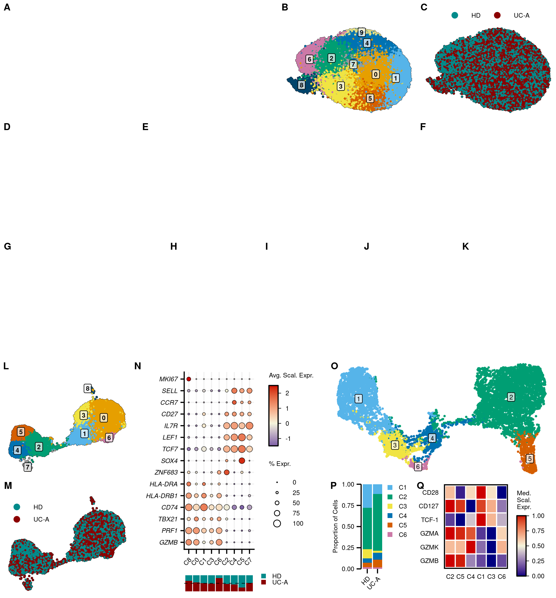
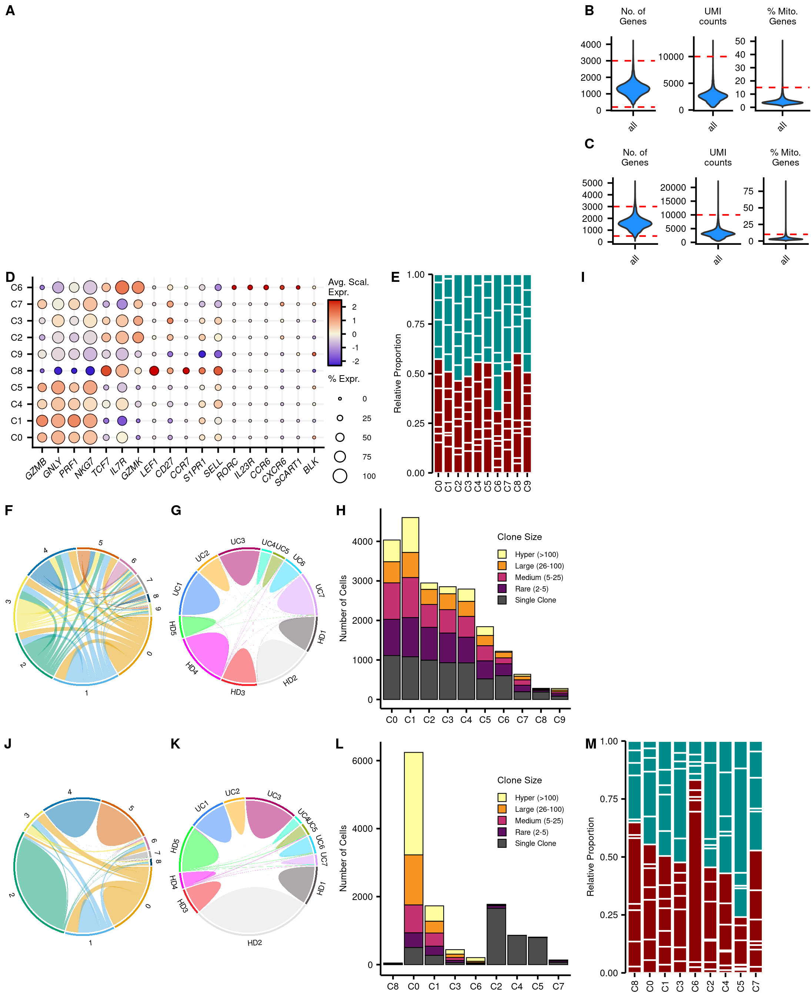

PBMC scRNA-seq + FACS: Code for Figures
================

``` r
library(Seurat)
library(SCpubr)
library(scCustomize)
library(tidyverse)
library(scRepertoire)
library(circlize)
library(patchwork)
library(CATALYST)
library(ggpubr)
library(ggplotify)
```

# Data

``` r
vd1 <- readRDS("../../data_processed/10X/Vd1.Rds")
vd2 <- readRDS("../../data_processed/10X/Vd2.Rds")
vd1_fcs <- readRDS("../../data_processed/FACS/vd1.Rds")
```

# Parameters

``` r
pal_clu <- c("#E69F00", "#56B4E9", "#009E73", "#F0E442", "#0072B2", "#D55E00",
             "#CC79A7", "#999999", "#00446B", "#E3DD84"
            )
pal_SeurClu <- setNames(pal_clu, paste0(0:9))
pal_clu <- setNames(pal_clu, paste0("C",0:9))

pal_dis <- c("HD"="#008B8B","UC"="#8B0000")
names_dis <- c("UC"="UC-A")

pal_trgv <-c("#56B4E9", "#999999", "#CC79A7", "#D55E00", "#009E73", "#F0E442",
             "#0072B2", "#E69F00", "#5BEBC5", "#444444"
             )
pal_trgv <- setNames(pal_trgv, levels(vd1$TRGV))
```

# Figure 8

## A-C

``` r
b <- do_DimPlot(vd2,
                label=T,
                label.size=2.12,
                group.by="seurat_clusters",
                legend.position="none",
                colors.use=pal_SeurClu,
                pt.size=0.1,
                border.size=4
                )

b[[1]][["layers"]][[3]][["geom"]][["default_aes"]][["alpha"]] <- .7


c <- do_DimPlot(vd2,
           group.by="disease",
           colors.use=pal_dis,
           pt.size=0.1,
           border.size=4,
           legend.icon.size=2.12,
           legend.nrow=1
           )+
  scale_color_manual(values=pal_dis, labels=names_dis)+
  theme(legend.position=c(.5, 1.1),
        text=element_text(size=6),
        legend.background=element_blank(),
        legend.text=element_text(size=6)
        )

abc <- ggarrange(NULL, b, c,
                 ncol=3, nrow=1, widths=c(2, 1, 1),
                 font.label=list(size=9, face="bold", family="sans"),
                 labels=c("A", "B", "C"),
                 align="h"
                 )
```

## A-K

``` r
def <- ggarrange(NULL, NULL, NULL,
                 ncol=3, nrow=1, widths=c(1, 2, 1),
                 font.label=list(size=9, face="bold", family="sans"),
                 labels=c("D", "E", "F")
                 )

ghijk <- ggarrange(NULL, NULL, NULL, NULL, NULL,
                   ncol=5, nrow=1, widths=c(3, 1.75, 1.75, 1.75, 1.75),
                   font.label=list(size=9, face="bold", family="sans"),
                   labels=c("G", "H", "I", "J", "K")
                   )

a_k <- ggarrange(abc, def, ghijk,
                 ncol=1, nrow=3
                 )
```

## LM

``` r
l <- do_DimPlot(vd1,
                label=T,
                group.by="seurat_clusters",
                legend.position="none",
                colors.use=pal_SeurClu,
                pt.size=0.1,
                label.size=2.12,
                border.size=4
                )

l[[1]][["layers"]][[3]][["data"]] <- l[[1]][["layers"]][[3]][["data"]]%>%
  mutate(umap_1=case_when(seurat_clusters=="8" ~ 1.5, .default=umap_1))
l[[1]][["layers"]][[3]][["geom"]][["default_aes"]][["alpha"]] <- .7


m <- do_DimPlot(vd1,
                group.by="disease",
                colors.use=pal_dis,
                pt.size=0.1,
                legend.icon.size=2.12,
                border.size=4
                )+
  scale_color_manual(values=pal_dis, labels=names_dis)+
  theme(legend.position=c(.2, .8),
        legend.key.spacing.y=unit(-2, "mm"),
        text=element_text(size=6),
        legend.text=element_text(size=6)
        )

lm <- ggarrange(l, m,
                ncol=1, nrow=2,
                labels=c("L", "M"),
                font.label=list(size=9, face="bold", family="sans")
                )
```

## N

``` r
vd1$cluster <- factor(vd1$cluster, levels=c(
  "C8","C0","C1","C3","C6","C2","C4","C5", "C7"
  ))

genes <- c("GZMB", "PRF1", "TBX21", "CD74", "HLA-DRB1", "HLA-DRA", "ZNF683", "SOX4",
           "TCF7", "LEF1", "IL7R", "CD27", "CCR7", "SELL", "MKI67")

n <- DotPlot(vd1,
             group.by="cluster",
             features=genes,
             dot.scale=3
             )+
  scale_color_gradient2(low="navy", mid="beige", high="red3", midpoint=0)+
  guides(color=guide_colorbar(frame.colour="black",
                              frame.linewidth=.5,
                              ticks.colour="black",
                              ticks.linewidth=.25,
                              barwidth=.6,
                              barheight=unit(2, "cm"),
                              order=1,
                              title="Avg. Scal. Expr."),
         size=guide_legend(override.aes=list(fill="white", shape=21),
                           title="% Expr.",
                           order=2)
        )+
  geom_point(aes(size=pct.exp+12), shape=21, fill=NA, colour="black", stroke=.25)+
  theme(axis.title=element_blank(),
        axis.ticks.length.x=unit(1.5, "mm"),
        panel.grid.major=element_line(color="gray95"),
        legend.justification="top",
        text=element_text(size=6),
        axis.text=element_text(size=6),
        axis.text.y=element_text(face="italic"),
        legend.key.spacing.y=unit(-2, "mm"),
        legend.ticks.length=unit(c(-1, 0), "mm"),
        legend.text=element_text(size=6)
        )+
  coord_flip()+
  RotatedAxis()


n_1 <- vd1@meta.data%>%mutate(cluster=factor(cluster, levels=levels(n$data$id)))

n_1 <- ggplot(n_1, aes(x=cluster, fill=disease))+
  geom_bar(position="fill")+
  scale_fill_manual(values=pal_dis, labels=names_dis)+
  theme_void()+
  theme(text=element_text(size=6),
        legend.title=element_blank(),
        legend.position=c(1.3, .5),
        legend.key.size=unit(2, "mm"), 
        legend.spacing.y=unit(0.5, "mm"),
        legend.margin=margin(t=-8),
        legend.text=element_text(size=6)
        )+
  guides(fill=guide_legend(ncol=1, byrow=T))+
  geom_hline(yintercept=.5, linetype="dashed", linewidth=.25)

n <- n/n_1+plot_layout(heights = c(1, 0.1))
```

## O

``` r
o <- plotDR(vd1_fcs,
            color_by="meta6")+
  scale_color_manual(values=pal_SeurClu)+
  theme_void()+
  geom_point(size=.25)+
  guides(color=guide_legend(nrow=3, title=NULL, override.aes=list(size=2.5)))+
  NoLegend()
  
labels <- o$data%>%
  group_by(meta6) %>%
  summarize(
    x=median(x, na.rm=TRUE),
    y=median(y, na.rm=TRUE)
  )

o <- o+
  geom_label(data=labels, aes(x=x, y=y, label=meta6),
             color="black",
             fill = alpha("white", 0.7),
             size=2.12
             )
```

## PQ

``` r
clusters <- vd1_fcs@metadata[["cluster_codes"]]%>%
  mutate(cluster_id=som100)

vd1_meta <- as.data.frame(vd1_fcs@colData@listData)%>%
  left_join(clusters, by="cluster_id")

p <- ggplot(vd1_meta, aes(x=disease, fill=meta6))+
  geom_bar(position="fill")+
  scale_fill_manual(values=pal_SeurClu, labels=paste0("C", 1:6))+
  scale_x_discrete(labels=c("UC"="UC-A"))+
  scale_y_continuous(expand=expansion(c(0, 0)))+
  theme_classic()+
  labs(x=NULL, y="Proportion of Cells", fill=NULL)+
  theme(axis.line.x=element_blank(),
        axis.text.x=element_text(hjust=1, vjust=1, angle=45),
        axis.ticks=element_line(color="black"),
        axis.ticks.length=unit(1.5, "mm"),
        axis.text=element_text(color="black", size=6),
        text=element_text(size=6),
        legend.margin=margin(l=0),
        legend.justification="top",
        legend.key.size=unit(2.12, "mm"),
        legend.key.spacing.y=unit(1, "mm"),
        legend.box.spacing=unit(1, "mm"),
        legend.text=element_text(size=6)
        )

df <- plotExprHeatmap(vd1_fcs, scale="last", by="cluster_id", k="meta6")@matrix%>%
  as.data.frame()%>%
  rownames_to_column("cluster")%>%
  pivot_longer(cols=rownames(vd1_fcs))%>%
  mutate(cluster=factor(cluster, levels=c("2","5","4","1","3","6")),
         name=factor(name, levels=c("GZMB", "GZMK", "GZMA", "TCF-1", "CD127", "CD28"))
         )

q <- df%>%
  ggplot(aes(x=cluster, y=name, fill=value))+
  geom_tile(color="white", size=.5)+
  theme_minimal()+
  scale_fill_gradient2(low="navy", mid="beige", high="red3", midpoint=.5)+
  scale_x_discrete(labels=paste0(paste0("C", levels(df$cluster))))+
  guides(fill=guide_colorbar(frame.colour="black",
                              frame.linewidth=.5,
                              ticks.colour="black",
                              ticks.linewidth=.25,
                              barwidth=.6,
                              barheight=unit(2, "cm"),
                              order=1,
                             ))+
  labs(fill="Med.\nScal.\nExpr.")+
  theme(panel.grid.major=element_blank(), 
        panel.border=element_rect(color="black", fill=NA, size=1),
        axis.title=element_blank(),
        axis.text=element_text(color="black", size=6),
        text=element_text(size=6),
        legend.justification="top",
        legend.ticks.length=unit(c(-1, 0), "mm"),
        legend.box.spacing=unit(1, "mm"),
        legend.text=element_text(size=6)
        )

pq <- ggarrange(p, q,
          widths=c(1.2, 2),
          font.label=list(size=9, family="sans", face="bold"),
          labels=c("P", "Q"),
          align="h"
          )
```

## OPQ

``` r
opq <- ggarrange(o, pq,
                 ncol=1, nrow=2,
                 font.label=list(size=9, family="sans", face="bold"),
                 labels=c("O", "")
                 )
```

## L-Q

``` r
l_q <- ggarrange(lm , n, opq,
                ncol=3, nrow=1,
                font.label=list(size=9, family="sans", face="bold"),
                labels=c("", "N", ""),
                widths=c(4, 6, 7)
                )
```

## Combined

``` r
ggarrange(a_k, l_q,
          ncol=1, nrow=2,
          heights=c(1.5, 1)
          )
```

<!-- -->

``` r
ggsave("../figures/Fig8.pdf",
       width=7.25,
       height=7.8
       )
```

# Fig S8

``` r
vd2@meta.data <- vd2@meta.data%>%
  mutate(diseaseID=case_when(
  diseaseID=="HD_R1_1" ~ "HD1",
  diseaseID=="HD_R1_2" ~ "HD2",
  diseaseID=="HD_R1_3" ~ "HD3",
  diseaseID=="HD_R2_1" ~ "HD4",
  diseaseID=="HD_R2_2" ~ "HD5",
  diseaseID=="UC_R1_4" ~ "UC1",
  diseaseID=="UC_R1_5" ~ "UC2",
  diseaseID=="UC_R1_6" ~ "UC3",
  diseaseID=="UC_R2_3" ~ "UC4",
  diseaseID=="UC_R2_4" ~ "UC5",
  diseaseID=="UC_R2_5" ~ "UC6",
  diseaseID=="UC_R2_6" ~ "UC7"
  ))

vd1@meta.data <- vd1@meta.data%>%
  mutate(diseaseID=case_when(
  diseaseID=="HD_R1_1" ~ "HD1",
  diseaseID=="HD_R1_2" ~ "HD2",
  diseaseID=="HD_R1_3" ~ "HD3",
  diseaseID=="HD_R2_1" ~ "HD4",
  diseaseID=="HD_R2_2" ~ "HD5",
  diseaseID=="UC_R1_4" ~ "UC1",
  diseaseID=="UC_R1_5" ~ "UC2",
  diseaseID=="UC_R1_6" ~ "UC3",
  diseaseID=="UC_R2_3" ~ "UC4",
  diseaseID=="UC_R2_4" ~ "UC5",
  diseaseID=="UC_R2_5" ~ "UC6",
  diseaseID=="UC_R2_6" ~ "UC7"
  ))
```

``` r
b <- readRDS("../../data_processed/10X/Vd2_QC_plots.Rds")&
  theme(text=element_text(size=6),
        axis.text=element_text(size=6),
        plot.title=element_text(size=6, face="plain")
        )
b <- ggarrange(b[[1]], b[[2]], b[[3]],
               ncol=3, nrow=1
               )

c <- readRDS("../../data_processed/10X/Vd1_QC_plots.Rds")&
  theme(text=element_text(size=6),
        axis.text=element_text(size=6),
        plot.title=element_text(size=6, face="plain")
        )

bc <- ggarrange(b, c,
                ncol=1, nrow=2,
                labels=c("B", "C"),
                font.label=list(size=9, family="sans")
                )

abc <- ggarrange(NULL, bc,
                 ncol=2, nrow=1,
                 widths=c(2.5, 1),
                 labels=c("A", ""),
                 font.label=list(size=9, family="sans")
                 )

vd2$cluster <- factor(vd2$cluster,
                      levels=c("C0","C1","C4","C5","C8","C9","C2","C3","C7","C6"))

genes <- c("GZMB", "GNLY", "PRF1", "NKG7", "TCF7", "IL7R", "GZMK", "LEF1", 
           "CD27", "CCR7", "S1PR1", "SELL", "RORC", "IL23R", "CCR6", "CXCR6", 
           "SCART1", "BLK"
           )

d <- DotPlot(vd2, group.by="cluster", features=genes)+
  scale_color_gradient2(low="blue3", mid="beige", high="red3", midpoint=0)+
  scale_radius(range=c(0.5, 4))+
  guides(color=guide_colorbar(frame.colour="black",
                              frame.linewidth=.5,
                              order=1,
                              ticks.colour="black",
                              ticks.linewidth=.5,
                              title="Avg. Scal.\nExpr.",
                              barwidth=.6,
                              barheight=unit(1.5, "cm")
                              ),
         size=guide_legend(override.aes=list(fill="white", shape=21),
                           title="% Expr.",
                           order=2)
        )+
  geom_point(aes(size=(pct.exp+6)), shape=21, fill=NA, colour="black", stroke=.25)+
  theme(axis.title=element_blank(),
        panel.grid.major=element_line(color="gray95"),
        axis.text=element_text(size=6),
        axis.text.x=element_text(face="italic"),
        text=element_text(size=6),
        legend.ticks.length = unit(c(-1, 0), 'mm'),
        legend.key.spacing.y=unit(-1, "mm"),
        legend.box.spacing=unit(1, "mm"),
        legend.title=element_text(margin=margin(b=2.5)),
        legend.spacing.y=unit(2, "mm"),
        legend.justification="top"
        )+
  RotatedAxis()

vd2$cluster <- as.character(vd2$cluster)

e <- ggplot(vd2@meta.data, aes(x=cluster, fill=diseaseID))+
  geom_bar(position="fill", color="white", size=.5)+
  scale_fill_manual(values=c(rep("#008B8B", 5),
                    rep("#8B0000", 7)))+
  theme_classic()+
  scale_y_continuous(expand=expansion(c(0, 0)), name="Relative Proportion")+
  theme(axis.title.x=element_blank(),
        legend.title=element_blank(),
        axis.line.x=element_blank(),
        axis.text=element_text(color="black", size=6),
        axis.ticks=element_line(color="black"),
        axis.text.x=element_text(angle=90, vjust=.5),
        legend.position="none",
        text=element_text(size=6),
        plot.margin=margin(5, 30, 5, 5)
        )

de <- ggarrange(d, e,
                ncol=2, nrow=1,
                labels=c("D", "E"),
                font.label=list(size=9, family="sans"),
                widths=c(2, 1)
                )

chord.df <- getCirclize(vd2, "strict", group.by="seurat_clusters",proportion=F)%>%
              arrange(from)

f <- as.ggplot(function() {
  par(cex=.5)
  chordDiagram(chord.df,
               annotationTrack = c("name", "grid"),
               self.link=1,
               grid.col=pal_SeurClu
               )})+
  theme(aspect.ratio=1)

chord.df <- getCirclize(vd2, "strict", group.by="diseaseID",proportion=F)%>%
              arrange(from)

g <- as.ggplot(function() {
  par(cex=.5)
  chordDiagram(chord.df,
               annotationTrack = c("name", "grid"),
               self.link=1,
               grid.col=setNames(scCustomize_Palette(length(unique(chord.df$from))), unique(chord.df$from))
               )})+
  theme(aspect.ratio=1)

h <- clonalOccupy(vd2, x.axis="cluster", label=F)&
  scale_fill_manual(values=c(
      "#fffe9e","#f79522", "#c43271", "#611062", "gray30"),
                    labels=c("Hyper (>100)", "Large (26-100)",
                    "Medium (5-25)", "Rare (2-5)","Single Clone"),
                    name="Clone Size")&
  labs(y="Number of Cells", x=NULL)&
  theme(axis.text=element_text(color="black", size=6),
        axis.ticks=element_line(color="black"),
        legend.position=c(.8, .7),
        legend.key.size=unit(2.12, "mm"),
        text=element_text(size=6),
        legend.key.spacing.y=unit(.5, "mm")
        )

fgh <- ggarrange(f, g, h,
                 ncol=3, nrow=1,
                 widths=c(1, 1, 1.5),
                 labels=c("F", "G", "H"),
                 font.label=list(size=9, family="sans")
                 )

d_h <- ggarrange(de, fgh,
                 ncol=1, nrow=2)

d_i <- ggarrange(d_h, NULL,
                 ncol=2, nrow=1,
                 widths=c(2.5, 1),
                 labels=c("", "I"),
                 font.label=list(size=9, family="sans")
                 )

chord.df <- getCirclize(vd1, "strict", group.by="seurat_clusters",proportion=F)%>%
              arrange(from)

j <- as.ggplot(function() {
  par(cex=.5)
  chordDiagram(chord.df,
               annotationTrack = c("name", "grid"),
               self.link=1,
               grid.col=pal_SeurClu
               )})+
  theme(aspect.ratio=1)

chord.df <- getCirclize(vd1, "strict", group.by="diseaseID",proportion=F)%>%
              arrange(from)

k <- as.ggplot(function() {
  par(cex=.5)
  chordDiagram(chord.df,
               annotationTrack = c("name", "grid"),
               self.link=1,
               grid.col=setNames(scCustomize_Palette(length(unique(chord.df$from))), unique(chord.df$from))
               )})+
  theme(aspect.ratio=1)

l <- clonalOccupy(vd1, x.axis="cluster", label=F)&
  scale_fill_manual(values=c(
      "#fffe9e","#f79522", "#c43271", "#611062", "gray30"),
                    labels=c("Hyper (>100)", "Large (26-100)",
                    "Medium (5-25)", "Rare (2-5)","Single Clone"),
                    name="Clone Size")&
  labs(y="Number of Cells", x=NULL)&
  theme(axis.text=element_text(color="black", size=6),
        axis.ticks=element_line(color="black"),
        legend.position=c(.8, .7),
        legend.key.size=unit(2.12, "mm"),
        text=element_text(size=6),
        legend.key.spacing.y=unit(.5, "mm")
        )

m <- ggplot(vd1@meta.data, aes(x=cluster, fill=diseaseID))+
  geom_bar(position="fill", color="white", size=.5)+
  scale_fill_manual(values=c(rep("#008B8B", 5),
                    rep("#8B0000", 7)))+
  theme_classic()+
  scale_y_continuous(expand=expansion(c(0, 0)), name="Relative Proportion")+
  theme(axis.title.x=element_blank(),
        legend.title=element_blank(),
        axis.line.x=element_blank(),
        axis.text=element_text(color="black", size=6),
        axis.ticks=element_line(color="black"),
        axis.text.x=element_text(angle=90, vjust=.5),
        legend.position="none",
        text=element_text(size=6),
        plot.margin=margin(5, 30, 5, 5)
        )

j_m <- ggarrange(j, k, l, m,
                 ncol=4, nrow=1,
                 widths=c(2.5, 2.5, 3.75, 3.5),
                 labels=c("J", "K", "L", "M"),
                 font.label=list(size=9, family="sans")
                 )

ggarrange(abc, d_i, j_m,
          ncol=1, nrow=3,
          heights=c(1, 1.75, 1, 1)
          )
```

<!-- -->

``` r
ggsave("../figures/FigS8.pdf",
       width=7.3, height=9,
       bg="white"
       )
```

# Session Info

``` r
sessionInfo()
```

    ## R version 4.4.3 (2025-02-28)
    ## Platform: x86_64-pc-linux-gnu
    ## Running under: Ubuntu 22.04.5 LTS
    ## 
    ## Matrix products: default
    ## BLAS:   /usr/lib/x86_64-linux-gnu/openblas-pthread/libblas.so.3 
    ## LAPACK: /usr/lib/x86_64-linux-gnu/openblas-pthread/libopenblasp-r0.3.20.so;  LAPACK version 3.10.0
    ## 
    ## locale:
    ##  [1] LC_CTYPE=en_US.UTF-8       LC_NUMERIC=C              
    ##  [3] LC_TIME=de_DE.UTF-8        LC_COLLATE=en_US.UTF-8    
    ##  [5] LC_MONETARY=de_DE.UTF-8    LC_MESSAGES=en_US.UTF-8   
    ##  [7] LC_PAPER=de_DE.UTF-8       LC_NAME=C                 
    ##  [9] LC_ADDRESS=C               LC_TELEPHONE=C            
    ## [11] LC_MEASUREMENT=de_DE.UTF-8 LC_IDENTIFICATION=C       
    ## 
    ## time zone: Europe/Berlin
    ## tzcode source: system (glibc)
    ## 
    ## attached base packages:
    ## [1] stats4    stats     graphics  grDevices utils     datasets  methods  
    ## [8] base     
    ## 
    ## other attached packages:
    ##  [1] ggplotify_0.1.2             ggpubr_0.6.0               
    ##  [3] CATALYST_1.28.0             SingleCellExperiment_1.26.0
    ##  [5] SummarizedExperiment_1.34.0 Biobase_2.64.0             
    ##  [7] GenomicRanges_1.56.0        GenomeInfoDb_1.40.0        
    ##  [9] IRanges_2.38.0              S4Vectors_0.42.0           
    ## [11] BiocGenerics_0.50.0         MatrixGenerics_1.16.0      
    ## [13] matrixStats_1.5.0           patchwork_1.3.0            
    ## [15] circlize_0.4.16             scRepertoire_2.2.1         
    ## [17] lubridate_1.9.3             forcats_1.0.0              
    ## [19] stringr_1.5.1               dplyr_1.1.4                
    ## [21] purrr_1.0.2                 readr_2.1.5                
    ## [23] tidyr_1.3.1                 tibble_3.3.0               
    ## [25] ggplot2_3.5.1               tidyverse_2.0.0            
    ## [27] scCustomize_2.1.2           SCpubr_2.0.2               
    ## [29] Seurat_5.2.1                SeuratObject_5.0.2         
    ## [31] sp_2.1-4                   
    ## 
    ## loaded via a namespace (and not attached):
    ##   [1] fs_1.6.4                    spatstat.sparse_3.0-3      
    ##   [3] httr_1.4.7                  RColorBrewer_1.1-3         
    ##   [5] doParallel_1.0.17           backports_1.4.1            
    ##   [7] tools_4.4.3                 sctransform_0.4.1          
    ##   [9] R6_2.6.1                    lazyeval_0.2.2             
    ##  [11] uwot_0.2.2                  GetoptLong_1.0.5           
    ##  [13] withr_3.0.0                 gridExtra_2.3              
    ##  [15] progressr_0.14.0            textshaping_0.3.7          
    ##  [17] quantreg_5.97               cli_3.6.5                  
    ##  [19] Cairo_1.6-2                 spatstat.explore_3.2-7     
    ##  [21] fastDummies_1.7.3           iNEXT_3.0.1                
    ##  [23] sandwich_3.1-0              prismatic_1.1.2            
    ##  [25] labeling_0.4.3              nnls_1.5                   
    ##  [27] mvtnorm_1.2-5               spatstat.data_3.0-4        
    ##  [29] ggridges_0.5.6              pbapply_1.7-2              
    ##  [31] systemfonts_1.1.0           yulab.utils_0.2.1          
    ##  [33] colorRamps_2.3.4            stringdist_0.9.12          
    ##  [35] scater_1.32.0               parallelly_1.37.1          
    ##  [37] plotrix_3.8-4               flowCore_2.16.0            
    ##  [39] VGAM_1.1-11                 rstudioapi_0.16.0          
    ##  [41] gridGraphics_0.5-1          generics_0.1.3             
    ##  [43] shape_1.4.6.1               gtools_3.9.5               
    ##  [45] ica_1.0-3                   spatstat.random_3.2-3      
    ##  [47] car_3.1-2                   Matrix_1.7-3               
    ##  [49] RProtoBufLib_2.16.0         ggbeeswarm_0.7.2           
    ##  [51] abind_1.4-8                 lifecycle_1.0.4            
    ##  [53] multcomp_1.4-25             yaml_2.3.8                 
    ##  [55] carData_3.0-5               snakecase_0.11.1           
    ##  [57] SparseArray_1.4.5           Rtsne_0.17                 
    ##  [59] paletteer_1.6.0             grid_4.4.3                 
    ##  [61] promises_1.3.0              crayon_1.5.3               
    ##  [63] miniUI_0.1.1.1              lattice_0.22-6             
    ##  [65] beachmat_2.20.0             cowplot_1.1.3              
    ##  [67] pillar_1.11.0               knitr_1.46                 
    ##  [69] ComplexHeatmap_2.20.0       rjson_0.2.21               
    ##  [71] future.apply_1.11.3         codetools_0.2-20           
    ##  [73] glue_1.8.0                  data.table_1.15.4          
    ##  [75] vctrs_0.6.5                 png_0.1-8                  
    ##  [77] spam_2.10-0                 gtable_0.3.5               
    ##  [79] assertthat_0.2.1            rematch2_2.1.2             
    ##  [81] cachem_1.1.0                xfun_0.44                  
    ##  [83] S4Arrays_1.4.1              mime_0.13                  
    ##  [85] tidygraph_1.3.1             ConsensusClusterPlus_1.68.0
    ##  [87] survival_3.8-3              iterators_1.0.14           
    ##  [89] cytolib_2.16.0              TH.data_1.1-2              
    ##  [91] fitdistrplus_1.1-11         ROCR_1.0-11                
    ##  [93] nlme_3.1-167                RcppAnnoy_0.0.22           
    ##  [95] evd_2.3-7                   irlba_2.3.5.1              
    ##  [97] vipor_0.4.7                 KernSmooth_2.23-26         
    ##  [99] colorspace_2.1-0            ggrastr_1.0.2              
    ## [101] tidyselect_1.2.1            compiler_4.4.3             
    ## [103] BiocNeighbors_1.22.0        SparseM_1.81               
    ## [105] ggdendro_0.2.0              DelayedArray_0.30.1        
    ## [107] plotly_4.10.4               scales_1.3.0               
    ## [109] lmtest_0.9-40               rappdirs_0.3.3             
    ## [111] digest_0.6.35               goftest_1.2-3              
    ## [113] spatstat.utils_3.0-4        rmarkdown_2.27             
    ## [115] XVector_0.44.0              htmltools_0.5.8.1          
    ## [117] pkgconfig_2.0.3             sparseMatrixStats_1.16.0   
    ## [119] highr_0.10                  fastmap_1.2.0              
    ## [121] rlang_1.1.6                 GlobalOptions_0.1.2        
    ## [123] htmlwidgets_1.6.4           UCSC.utils_1.0.0           
    ## [125] DelayedMatrixStats_1.26.0   shiny_1.8.1.1              
    ## [127] farver_2.1.2                zoo_1.8-12                 
    ## [129] jsonlite_2.0.0              BiocParallel_1.38.0        
    ## [131] BiocSingular_1.20.0         magrittr_2.0.3             
    ## [133] scuttle_1.14.0              GenomeInfoDbData_1.2.12    
    ## [135] dotCall64_1.1-1             munsell_0.5.1              
    ## [137] Rcpp_1.1.0                  evmix_2.12                 
    ## [139] ggnewscale_0.4.10           viridis_0.6.5              
    ## [141] reticulate_1.37.0           truncdist_1.0-2            
    ## [143] stringi_1.8.7               ggalluvial_0.12.5          
    ## [145] ggraph_2.2.1                zlibbioc_1.50.0            
    ## [147] MASS_7.3-64                 plyr_1.8.9                 
    ## [149] parallel_4.4.3              listenv_0.9.1              
    ## [151] ggrepel_0.9.5               deldir_2.0-4               
    ## [153] graphlayouts_1.1.1          splines_4.4.3              
    ## [155] hash_2.2.6.3                tensor_1.5                 
    ## [157] hms_1.1.3                   igraph_2.0.3               
    ## [159] spatstat.geom_3.2-9         cubature_2.1.0             
    ## [161] ggsignif_0.6.4              RcppHNSW_0.6.0             
    ## [163] ScaledMatrix_1.12.0         reshape2_1.4.4             
    ## [165] XML_3.99-0.16.1             drc_3.0-1                  
    ## [167] evaluate_0.23               ggprism_1.0.5              
    ## [169] tzdb_0.4.0                  foreach_1.5.2              
    ## [171] tweenr_2.0.3                httpuv_1.6.15              
    ## [173] MatrixModels_0.5-3          RANN_2.6.1                 
    ## [175] polyclip_1.10-6             future_1.33.2              
    ## [177] clue_0.3-65                 scattermore_1.2            
    ## [179] ggforce_0.4.2               rsvd_1.0.5                 
    ## [181] janitor_2.2.0               broom_1.0.6                
    ## [183] xtable_1.8-4                RSpectra_0.16-1            
    ## [185] rstatix_0.7.2               later_1.3.2                
    ## [187] ragg_1.4.0                  viridisLite_0.4.2          
    ## [189] gsl_2.1-8                   memoise_2.0.1              
    ## [191] FlowSOM_2.12.0              beeswarm_0.4.0             
    ## [193] cluster_2.1.8               timechange_0.3.0           
    ## [195] globals_0.16.3
