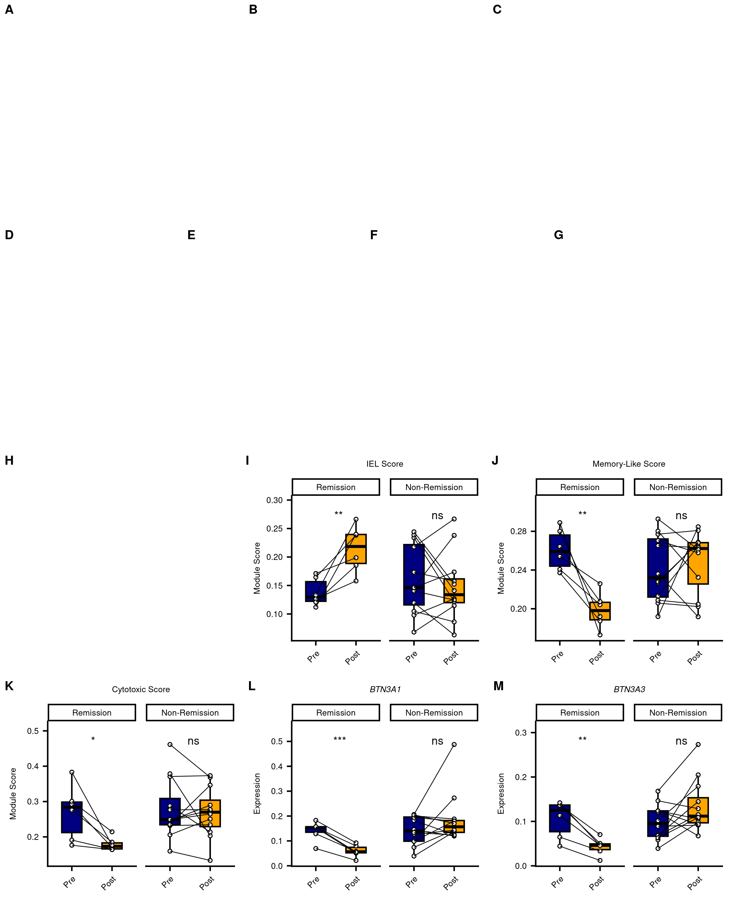

Thomas et al. 2024: Code for Figures
================

``` r
library(Seurat)
library(tidyverse)
library(scCustomize)
library(ggpubr)
library(patchwork)
```

# Data

``` r
entero <- readRDS("../../data_processed/Thomas_24/thomas24_entero_pb.Rds")
gd <- readRDS("../../data_processed/Thomas_24/thomas24_gd_pb.Rds")
```

# Figure 7

``` r
# Blank Canvas
abc <- ggarrange(NULL, NULL, NULL,
                 ncol=3, nrow=1,
                 labels=c("A", "B", "C"),
                 font.label=list(size=9, face="bold", family="sans")
                 )

defg <- ggarrange(NULL, NULL, NULL, NULL,
                  ncol=4, nrow=1,
                  labels=c("D", "E", "F", "G"),
                  font.label=list(size=9, face="bold", family="sans")
                 )

abcdefg <- ggarrange(abc, defg,
                     ncol=1, nrow=2
                     )
```

``` r
scores <- c(
  "IEL1",
  "Memory-Like1",
  "Cytotoxic1"
  )

gd_plots <- VlnPlot_scCustom(
  gd,
  features=scores,
  group.by="Treatment",
  pt.size=0,
  add.noise=F
  )&
  geom_boxplot(width=.5, outlier.shape=NA, color="black")&
  geom_point(shape=21, fill="white", size=1)&
  labs(x=NULL, y="Module Score")&
  theme(text=element_text(size=6),
        axis.text=element_text(size=6),
        plot.title=element_text(face="plain", size=6)
        )
  
for (i in seq_along(gd_plots)){
  gd_plots[[i]][["data"]] <- gd_plots[[i]][["data"]]%>%
    rownames_to_column("id")%>%
    separate(id, into=c("rem", "tp", "patient"), sep="_")%>%
    mutate(rem=factor(rem, levels=c("Remission", "Non-Remission")),
           ident=factor(ident, levels=c("Pre", "Post"))
           )
  
  gd_plots[[i]][["layers"]][[1]] <- NULL
}

gd_plots[[1]] <- gd_plots[[1]]+ggtitle("IEL Score")
gd_plots[[2]] <- gd_plots[[2]]+ggtitle("Memory-Like Score")
gd_plots[[3]] <- gd_plots[[3]]+ggtitle("Cytotoxic Score")

gd_plots <- gd_plots&
  geom_line(aes(group=patient), size=.25)&
  facet_wrap(~rem, scales="free_x")&
  scale_y_continuous(expand=expansion(mult=c(0.05, 0.2)))&
  theme(strip.background=element_rect(fill="white", color="black", size=1),
        strip.text=element_text(size=6)
        )&
  stat_compare_means(
    method="t.test",
    paired=T,
    aes(label=ifelse(
      ..p.. < 0.001,
      "p<0.001",
      paste0("p=", ..p.format..))),
    label.x=1.25,
    vjust=-1,
    size=2.12
  )
```

``` r
genes <- c(
  "BTNL3",
  "BTNL8",
  "CDX2",
  "HNF4A",
  "BTN2A1",
  "BTN3A1",
  "BTN3A3"
  )

entero_plots <- VlnPlot_scCustom(
  entero,
  features=genes,
  group.by="Treatment",
  pt.size=0,
  add.noise=F
  )&
  geom_boxplot(width=.5, outlier.shape=NA, color="black")&
  geom_point(shape=21, fill="white", size=1)&
  labs(x=NULL, y="Expression")&
  theme(text=element_text(size=6),
        axis.text=element_text(size=6),
        plot.title=element_text(face="italic", size=6)
        )
  
for (i in seq_along(entero_plots)){
  entero_plots[[i]][["data"]] <- entero_plots[[i]][["data"]]%>%
    rownames_to_column("id")%>%
    separate(id, into=c("rem", "tp", "patient"), sep="_")%>%
    mutate(rem=factor(rem, levels=c("Remission", "Non-Remission")),
           ident=factor(ident, levels=c("Pre", "Post"))
           )
  
  entero_plots[[i]][["layers"]][[1]] <- NULL
  }

entero_plots <- entero_plots&
  geom_line(aes(group=patient), size=.25)&
  facet_wrap(~rem, scales="free_x")&
  scale_y_continuous(expand=expansion(mult=c(0.05, 0.2)))&
  theme(strip.background=element_rect(fill="white", color="black", size=1),
        strip.text=element_text(size=6)
        )&
  stat_compare_means(
    method="t.test",
    paired=T,
    aes(label=ifelse(
      ..p.. < 0.001,
      "p<0.001",
      paste0("p=", ..p.format..))),
    label.x=1.25,
    vjust=-1,
    size=2.12
  )
```

``` r
hijklm <- ggarrange(NULL, gd_plots[[1]], gd_plots[[2]], gd_plots[[3]], entero_plots[[6]], entero_plots[[7]],
                    labels=c("H", "I", "J", "K", "L", "M"),
                    font.label=list(size=9, face="bold", family="sans")
                    )
```

``` r
ggarrange(abcdefg, hijklm,
          ncol=1, nrow=2
          )
```

<!-- -->

``` r
ggsave("../figures/Fig7.pdf",
       width=7.3,
       height=9
       )
```

# Session Info

``` r
sessionInfo()
```

    ## R version 4.4.3 (2025-02-28)
    ## Platform: x86_64-pc-linux-gnu
    ## Running under: Ubuntu 22.04.5 LTS
    ## 
    ## Matrix products: default
    ## BLAS:   /usr/lib/x86_64-linux-gnu/openblas-pthread/libblas.so.3 
    ## LAPACK: /usr/lib/x86_64-linux-gnu/openblas-pthread/libopenblasp-r0.3.20.so;  LAPACK version 3.10.0
    ## 
    ## locale:
    ##  [1] LC_CTYPE=en_US.UTF-8       LC_NUMERIC=C              
    ##  [3] LC_TIME=de_DE.UTF-8        LC_COLLATE=en_US.UTF-8    
    ##  [5] LC_MONETARY=de_DE.UTF-8    LC_MESSAGES=en_US.UTF-8   
    ##  [7] LC_PAPER=de_DE.UTF-8       LC_NAME=C                 
    ##  [9] LC_ADDRESS=C               LC_TELEPHONE=C            
    ## [11] LC_MEASUREMENT=de_DE.UTF-8 LC_IDENTIFICATION=C       
    ## 
    ## time zone: Europe/Berlin
    ## tzcode source: system (glibc)
    ## 
    ## attached base packages:
    ## [1] stats     graphics  grDevices utils     datasets  methods   base     
    ## 
    ## other attached packages:
    ##  [1] patchwork_1.3.0    ggpubr_0.6.0       scCustomize_2.1.2  lubridate_1.9.3   
    ##  [5] forcats_1.0.0      stringr_1.5.1      dplyr_1.1.4        purrr_1.0.2       
    ##  [9] readr_2.1.5        tidyr_1.3.1        tibble_3.3.0       ggplot2_3.5.1     
    ## [13] tidyverse_2.0.0    Seurat_5.2.1       SeuratObject_5.0.2 sp_2.1-4          
    ## 
    ## loaded via a namespace (and not attached):
    ##   [1] RColorBrewer_1.1-3     rstudioapi_0.16.0      jsonlite_2.0.0        
    ##   [4] shape_1.4.6.1          magrittr_2.0.3         spatstat.utils_3.0-4  
    ##   [7] ggbeeswarm_0.7.2       farver_2.1.2           rmarkdown_2.27        
    ##  [10] ragg_1.4.0             GlobalOptions_0.1.2    vctrs_0.6.5           
    ##  [13] ROCR_1.0-11            spatstat.explore_3.2-7 paletteer_1.6.0       
    ##  [16] rstatix_0.7.2          janitor_2.2.0          htmltools_0.5.8.1     
    ##  [19] broom_1.0.6            sctransform_0.4.1      parallelly_1.37.1     
    ##  [22] KernSmooth_2.23-26     htmlwidgets_1.6.4      ica_1.0-3             
    ##  [25] plyr_1.8.9             plotly_4.10.4          zoo_1.8-12            
    ##  [28] igraph_2.0.3           mime_0.13              lifecycle_1.0.4       
    ##  [31] pkgconfig_2.0.3        Matrix_1.7-3           R6_2.6.1              
    ##  [34] fastmap_1.2.0          snakecase_0.11.1       fitdistrplus_1.1-11   
    ##  [37] future_1.33.2          shiny_1.8.1.1          digest_0.6.35         
    ##  [40] colorspace_2.1-0       rematch2_2.1.2         tensor_1.5            
    ##  [43] RSpectra_0.16-1        irlba_2.3.5.1          textshaping_0.3.7     
    ##  [46] labeling_0.4.3         progressr_0.14.0       spatstat.sparse_3.0-3 
    ##  [49] timechange_0.3.0       httr_1.4.7             polyclip_1.10-6       
    ##  [52] abind_1.4-8            compiler_4.4.3         withr_3.0.0           
    ##  [55] backports_1.4.1        carData_3.0-5          fastDummies_1.7.3     
    ##  [58] highr_0.10             ggsignif_0.6.4         MASS_7.3-64           
    ##  [61] tools_4.4.3            vipor_0.4.7            lmtest_0.9-40         
    ##  [64] beeswarm_0.4.0         httpuv_1.6.15          future.apply_1.11.3   
    ##  [67] goftest_1.2-3          glue_1.8.0             nlme_3.1-167          
    ##  [70] promises_1.3.0         grid_4.4.3             Rtsne_0.17            
    ##  [73] cluster_2.1.8          reshape2_1.4.4         generics_0.1.3        
    ##  [76] gtable_0.3.5           spatstat.data_3.0-4    tzdb_0.4.0            
    ##  [79] data.table_1.15.4      hms_1.1.3              car_3.1-2             
    ##  [82] spatstat.geom_3.2-9    RcppAnnoy_0.0.22       ggrepel_0.9.5         
    ##  [85] RANN_2.6.1             pillar_1.11.0          spam_2.10-0           
    ##  [88] RcppHNSW_0.6.0         ggprism_1.0.5          later_1.3.2           
    ##  [91] circlize_0.4.16        splines_4.4.3          lattice_0.22-6        
    ##  [94] survival_3.8-3         deldir_2.0-4           tidyselect_1.2.1      
    ##  [97] miniUI_0.1.1.1         pbapply_1.7-2          knitr_1.46            
    ## [100] gridExtra_2.3          scattermore_1.2        xfun_0.44             
    ## [103] matrixStats_1.5.0      stringi_1.8.7          lazyeval_0.2.2        
    ## [106] yaml_2.3.8             evaluate_0.23          codetools_0.2-20      
    ## [109] cli_3.6.5              uwot_0.2.2             systemfonts_1.1.0     
    ## [112] xtable_1.8-4           reticulate_1.37.0      munsell_0.5.1         
    ## [115] Rcpp_1.1.0             globals_0.16.3         spatstat.random_3.2-3 
    ## [118] png_0.1-8              ggrastr_1.0.2          parallel_4.4.3        
    ## [121] dotCall64_1.1-1        listenv_0.9.1          viridisLite_0.4.2     
    ## [124] scales_1.3.0           ggridges_0.5.6         rlang_1.1.6           
    ## [127] cowplot_1.1.3
